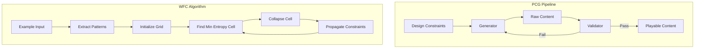

# Procedural Content Generation with Machine Learning

## Overview

Procedural Content Generation (PCG) uses algorithms to create game content automatically — levels, terrain, textures, items, quests, music, and even narratives. PCG has been a part of game development since Rogue (1980) generated random dungeon layouts, giving rise to the entire "roguelike" genre. Today, games like Minecraft, No Man's Sky, and Hades use sophisticated PCG systems to create vast, replayable worlds.

Traditional PCG relies on handcrafted algorithms: Perlin noise for terrain, cellular automata for caves, L-systems for vegetation, and grammar-based systems for quests. These methods are powerful but limited by their explicit rules. Machine learning-based PCG (ML-PCG) offers a paradigm shift: instead of encoding rules, we train models on examples of good content and let them generate new variations.

Wave Function Collapse (WFC), while not strictly ML, represents a constraint-based approach that bridges traditional PCG and learning. It analyzes an example image or tileset and generates new content that preserves local patterns. On the ML side, GANs can generate textures and levels, variational autoencoders can create smooth interpolations between content types, and reinforcement learning can optimize level designs for playability. This lesson covers both traditional and ML-based approaches to PCG.

## Key Concepts

- **Wave Function Collapse (WFC)**: An algorithm inspired by quantum mechanics that generates outputs consistent with local pattern constraints learned from examples. Each cell starts in a superposition of all possible states and "collapses" to a single state based on adjacency rules.

- **Perlin/Simplex Noise**: Gradient noise functions that generate natural-looking randomness. Used extensively for terrain heightmaps, cloud textures, and cave systems. Multiple octaves create fractal detail.

- **Cellular Automata**: Grid-based systems where each cell's state depends on its neighbors. Simple rules produce complex emergent patterns — cave generation is a classic application.

- **Search-Based PCG**: Using search algorithms (evolutionary, MCTS) to find content that optimizes design objectives like playability, difficulty, or aesthetic quality.

- **Mixed-Initiative Design**: Combining AI generation with human curation. The AI proposes content, the designer selects and refines. Tools like Tanagra and Sentient Sketchbook exemplify this approach.

- **Quality Metrics for PCG**: How to evaluate generated content — playability (can it be completed?), difficulty (is it appropriate?), diversity (is each generation unique?), and aesthetic quality.

## Technical Details

### Perlin Noise for Terrain

Perlin noise generates coherent random values by interpolating between random gradients on a grid. Fractal terrain uses multiple octaves:

$$\text{terrain}(x, y) = \sum_{i=0}^{n} \frac{1}{2^i} \cdot \text{noise}(2^i \cdot x, 2^i \cdot y)$$

Each octave doubles the frequency and halves the amplitude, adding progressively finer detail.

### Cellular Automata Cave Generation

The standard cave generation algorithm:
1. Initialize each cell randomly (e.g., 45% wall, 55% floor)
2. Apply rule: a cell becomes a wall if it has $\geq 5$ wall neighbors (including itself)
3. Repeat for 4–5 iterations
4. Flood-fill to ensure connectivity

### Wave Function Collapse

WFC operates on a grid where each cell can be one of several tile types. The algorithm:
1. Extract adjacency constraints from an example
2. Initialize all cells with all possible states
3. Select the cell with minimum entropy (fewest possibilities)
4. Collapse it to a single state (weighted random)
5. Propagate constraints to neighbors
6. Repeat until all cells are collapsed (or contradiction)

## Code Examples

```python
import numpy as np

def generate_cave(width: int = 50, height: int = 30,
                  fill_prob: float = 0.45, iterations: int = 5) -> np.ndarray:
    """Generate a cave using cellular automata."""
    # Initialize random grid
    grid = (np.random.random((height, width)) < fill_prob).astype(int)

    # Set borders as walls
    grid[0, :] = grid[-1, :] = grid[:, 0] = grid[:, -1] = 1

    for _ in range(iterations):
        new_grid = grid.copy()
        for y in range(1, height - 1):
            for x in range(1, width - 1):
                # Count wall neighbors (including self)
                neighbors = grid[y-1:y+2, x-1:x+2].sum()
                new_grid[y, x] = 1 if neighbors >= 5 else 0
        grid = new_grid

    return grid

def display_cave(grid: np.ndarray):
    symbols = {0: '.', 1: '#'}
    for row in grid:
        print(''.join(symbols[c] for c in row))

cave = generate_cave(60, 25)
display_cave(cave)

# Compute stats
total = cave.size
walls = cave.sum()
print(f"\nCave: {cave.shape[1]}x{cave.shape[0]}, "
      f"walls={walls/total:.1%}, open={1-walls/total:.1%}")
```

```python
def perlin_noise_2d(width: int, height: int, scale: float = 10.0,
                    octaves: int = 4) -> np.ndarray:
    """Generate 2D fractal noise for terrain heightmaps."""
    def lerp(a, b, t):
        return a + t * (b - a)

    def fade(t):
        return t * t * t * (t * (t * 6 - 15) + 10)

    def gradient_noise(ix, iy, x, y, perm):
        # Simple gradient based on permutation table
        h = perm[(perm[ix % 256] + iy) % 256] % 4
        gradients = [(1,1), (-1,1), (1,-1), (-1,-1)]
        gx, gy = gradients[h]
        return gx * (x - ix) + gy * (y - iy)

    result = np.zeros((height, width))
    perm = np.random.permutation(256)

    for octave in range(octaves):
        freq = 2 ** octave
        amp = 0.5 ** octave

        for y in range(height):
            for x in range(width):
                sx = x / scale * freq
                sy = y / scale * freq
                x0, y0 = int(sx), int(sy)
                x1, y1 = x0 + 1, y0 + 1
                fx, fy = fade(sx - x0), fade(sy - y0)

                n00 = gradient_noise(x0, y0, sx, sy, perm)
                n10 = gradient_noise(x1, y0, sx, sy, perm)
                n01 = gradient_noise(x0, y1, sx, sy, perm)
                n11 = gradient_noise(x1, y1, sx, sy, perm)

                nx0 = lerp(n00, n10, fx)
                nx1 = lerp(n01, n11, fx)
                result[y, x] += amp * lerp(nx0, nx1, fy)

    # Normalize to [0, 1]
    result = (result - result.min()) / (result.max() - result.min())
    return result

# Generate terrain heightmap
terrain = perlin_noise_2d(60, 30, scale=8.0, octaves=4)

# Display as ASCII terrain
def display_terrain(heightmap: np.ndarray):
    chars = ' .:-=+*#%@'
    for row in heightmap:
        line = ''.join(chars[min(int(v * len(chars)), len(chars)-1)] for v in row)
        print(line)

display_terrain(terrain)
```

## Diagrams



## Exercises

1. **Cave Connectivity**: Extend the cellular automata cave generator to ensure all open areas are connected. Implement flood-fill to find connected components, then add tunnels between disconnected regions.

2. **Multi-Biome Terrain**: Use the Perlin noise generator to create a terrain with multiple biomes. Define thresholds: water ($< 0.3$), sand ($0.3$–$0.4$), grass ($0.4$–$0.7$), forest ($0.7$–$0.85$), mountain ($> 0.85$). Add a second noise layer for temperature to create varied biomes.

3. **Simple WFC**: Implement a 1D version of Wave Function Collapse. Given a sample string like "AABBAABB", extract bigram adjacency rules and generate new strings that preserve local patterns. Then extend to 2D with a 3-color tileset.

## Further Reading

- Shaker, N., Togelius, J., Nelson, M.J. — *Procedural Content Generation in Games* (Springer, 2016)
- Gumin, M. — [Wave Function Collapse on GitHub](https://github.com/mxgmn/WaveFunctionCollapse)
- Perlin, K. — "Improving Noise" (SIGGRAPH, 2002)
