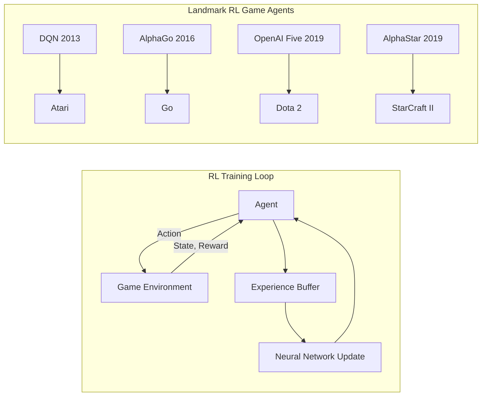

# Reinforcement Learning for Game AI

## Overview

Reinforcement learning (RL) has produced some of the most spectacular AI achievements in games. DeepMind's DQN learned to play Atari games from raw pixels (2013), AlphaGo defeated the world Go champion (2016), OpenAI Five beat professional Dota 2 teams (2019), and AlphaStar reached Grandmaster level in StarCraft II (2019). These milestones demonstrated that RL agents can master complex games that were once thought to require human-like intuition.

In RL, an agent learns by interacting with an environment: it observes states, takes actions, receives rewards, and updates its policy to maximize cumulative reward. Games are ideal RL environments because they provide clear reward signals (score, win/loss), fast simulation (millions of games per day), and controllable complexity.

However, applying RL to games is far from trivial. Reward shaping is critical — sparse rewards (win/loss at game end) make learning extremely slow, while poorly designed dense rewards can lead to reward hacking. Sample efficiency remains a major challenge: AlphaStar required 200 years of game time to train. Exploration is another hurdle, especially in games with vast state spaces. This lesson covers the key RL algorithms used in game AI, practical training techniques, and the lessons learned from landmark projects.

## Key Concepts

- **Deep Q-Networks (DQN)**: Combines Q-learning with deep neural networks to handle high-dimensional state spaces. Uses experience replay and target networks for stable training. Breakthrough: Atari game playing from raw pixels.

- **Policy Gradient Methods**: Directly optimize the policy $\pi_\theta(a|s)$ using gradient ascent on expected reward. REINFORCE, A2C, and PPO are common variants. Better suited for continuous action spaces.

- **Reward Shaping**: Designing intermediate reward signals to guide learning. Good shaping accelerates training without changing the optimal policy. Bad shaping leads to unintended behaviors.

- **Self-Play**: Training agents by playing against copies of themselves. Creates a natural curriculum as both sides improve. Used in AlphaGo, AlphaZero, and OpenAI Five.

- **Curriculum Learning**: Starting with simpler tasks and progressively increasing difficulty. Analogous to how humans learn — master the basics before advanced skills.

- **Imitation Learning**: Bootstrap RL training by first learning from human demonstrations. Reduces the initial exploration problem. Used in AlphaStar's initial training phase.

## Technical Details

### DQN Architecture

DQN approximates the optimal action-value function $Q^*(s, a)$ with a neural network $Q(s, a; \theta)$. The loss function minimizes the temporal difference error:

$$L(\theta) = \mathbb{E}\left[\left(r + \gamma \max_{a'} Q(s', a'; \theta^-) - Q(s, a; \theta)\right)^2\right]$$

where $\theta^-$ are the parameters of a target network updated periodically.

Key innovations:
- **Experience Replay**: Store transitions $(s, a, r, s')$ in a buffer and sample mini-batches for training, breaking temporal correlations
- **Target Network**: Use a slowly-updated copy of the Q-network for computing targets, improving stability

### Proximal Policy Optimization (PPO)

PPO is the workhorse of modern game RL. It optimizes a clipped surrogate objective:

$$L^{CLIP}(\theta) = \mathbb{E}\left[\min\left(r_t(\theta) \hat{A}_t, \text{clip}(r_t(\theta), 1-\epsilon, 1+\epsilon) \hat{A}_t\right)\right]$$

where $r_t(\theta) = \frac{\pi_\theta(a_t|s_t)}{\pi_{\theta_{old}}(a_t|s_t)}$ is the probability ratio and $\hat{A}_t$ is the advantage estimate. The clipping prevents destructively large policy updates.

### Reward Shaping Principles

Good reward shaping follows the potential-based shaping theorem (Ng et al., 1999):

$$F(s, s') = \gamma \Phi(s') - \Phi(s)$$

where $\Phi$ is a potential function. This form guarantees that the optimal policy is preserved while providing denser learning signal.

## Code Examples

```python
import numpy as np
from collections import deque
import random

class DQNAgent:
    """Simplified DQN agent for discrete action games."""

    def __init__(self, state_size: int, action_size: int,
                 lr: float = 0.001, gamma: float = 0.99,
                 epsilon: float = 1.0, epsilon_min: float = 0.01,
                 epsilon_decay: float = 0.995):
        self.state_size = state_size
        self.action_size = action_size
        self.gamma = gamma
        self.epsilon = epsilon
        self.epsilon_min = epsilon_min
        self.epsilon_decay = epsilon_decay
        self.lr = lr
        self.memory = deque(maxlen=10000)

        # Simple linear Q-network (weights)
        self.weights = np.random.randn(state_size, action_size) * 0.01
        self.bias = np.zeros(action_size)
        # Target network
        self.target_weights = self.weights.copy()
        self.target_bias = self.bias.copy()

    def q_values(self, state: np.ndarray, use_target: bool = False) -> np.ndarray:
        w = self.target_weights if use_target else self.weights
        b = self.target_bias if use_target else self.bias
        return state @ w + b

    def act(self, state: np.ndarray) -> int:
        if np.random.random() < self.epsilon:
            return np.random.randint(self.action_size)
        return int(np.argmax(self.q_values(state)))

    def remember(self, state, action, reward, next_state, done):
        self.memory.append((state, action, reward, next_state, done))

    def replay(self, batch_size: int = 32):
        if len(self.memory) < batch_size:
            return

        batch = random.sample(self.memory, batch_size)
        for state, action, reward, next_state, done in batch:
            target = reward
            if not done:
                target += self.gamma * np.max(
                    self.q_values(next_state, use_target=True))

            q_vals = self.q_values(state)
            error = target - q_vals[action]

            # Gradient update for linear Q-network
            self.weights[:, action] += self.lr * error * state
            self.bias[action] += self.lr * error

        # Decay epsilon
        self.epsilon = max(self.epsilon_min,
                          self.epsilon * self.epsilon_decay)

    def update_target(self):
        self.target_weights = self.weights.copy()
        self.target_bias = self.bias.copy()

# Simple grid game environment
class GridGame:
    def __init__(self, size=5):
        self.size = size
        self.reset()

    def reset(self):
        self.pos = np.array([0, 0])
        self.goal = np.array([self.size-1, self.size-1])
        return self._get_state()

    def _get_state(self):
        state = np.zeros(self.size * self.size)
        state[self.pos[0] * self.size + self.pos[1]] = 1
        return state

    def step(self, action):
        moves = [(-1,0),(1,0),(0,-1),(0,1)]  # up, down, left, right
        dr, dc = moves[action]
        self.pos = np.clip(self.pos + [dr, dc], 0, self.size - 1)

        done = np.array_equal(self.pos, self.goal)
        reward = 1.0 if done else -0.01
        return self._get_state(), reward, done

# Train the agent
env = GridGame(size=5)
agent = DQNAgent(state_size=25, action_size=4)

rewards_history = []
for episode in range(500):
    state = env.reset()
    total_reward = 0

    for step in range(50):
        action = agent.act(state)
        next_state, reward, done = env.step(action)
        agent.remember(state, action, reward, next_state, done)
        state = next_state
        total_reward += reward
        if done:
            break

    agent.replay(batch_size=32)
    if episode % 10 == 0:
        agent.update_target()

    rewards_history.append(total_reward)
    if episode % 100 == 0:
        avg = np.mean(rewards_history[-100:])
        print(f"Episode {episode}: avg_reward={avg:.3f} epsilon={agent.epsilon:.3f}")
```

## Diagrams



## Exercises

1. **Reward Shaping Experiment**: Modify the GridGame to use different reward functions: (a) sparse reward (1 at goal only), (b) distance-based shaping ($-\text{distance}/\text{max\_distance}$ per step), (c) potential-based shaping. Compare learning curves over 500 episodes.

2. **Epsilon Schedule Design**: Implement three epsilon-decay strategies: linear decay, exponential decay, and cosine annealing. Train the DQN agent with each and compare performance. Which converges fastest?

3. **Self-Play Tic-Tac-Toe**: Implement a Q-learning agent that learns Tic-Tac-Toe through self-play. Start with random play and train for 10,000 games. Test the final agent against random and optimal opponents.

## Further Reading

- Mnih, V. et al. — "Human-level control through deep reinforcement learning" (Nature, 2015)
- Silver, D. et al. — "Mastering the game of Go with deep neural networks and tree search" (Nature, 2016)
- Schulman, J. et al. — "Proximal Policy Optimization Algorithms" (2017)
- Vinyals, O. et al. — "Grandmaster level in StarCraft II using multi-agent reinforcement learning" (Nature, 2019)
