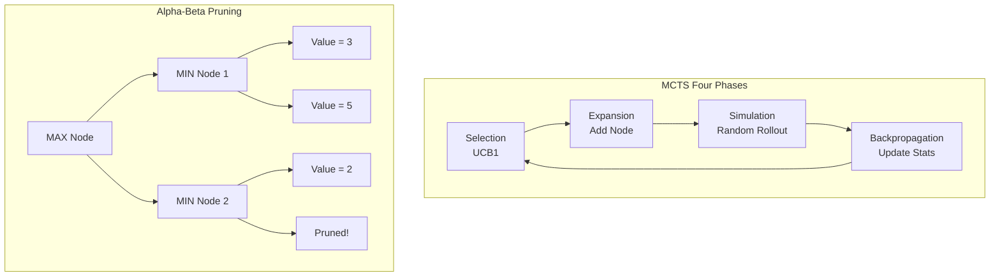

# Tree Search Algorithms: Minimax and MCTS in Strategy Games

## Overview

Tree search algorithms are the backbone of AI for strategy games, board games, and any domain where agents must reason about sequences of decisions and counter-decisions. From the earliest chess programs to AlphaGo's historic victory, tree search has been the core technique for game-playing AI.

The fundamental insight is that a game can be modeled as a tree: each node is a game state, each edge is a move, and the leaves are terminal states with known outcomes. The challenge is that game trees are astronomically large — chess has roughly $10^{47}$ possible positions, Go has $10^{170}$ — making exhaustive search impossible. The art of game tree search lies in exploring the tree efficiently.

Minimax with alpha-beta pruning dominated two-player perfect-information games for decades, powering programs like Deep Blue. Monte Carlo Tree Search (MCTS) revolutionized the field by using random simulations to estimate the value of positions without requiring an evaluation function, enabling breakthroughs in Go where traditional evaluation was intractable. AlphaZero combined MCTS with deep neural networks, learning to play chess, Go, and Shogi at superhuman levels from self-play alone — without any human knowledge beyond the rules.

## Key Concepts

- **Minimax**: A recursive algorithm for two-player zero-sum games. The maximizing player chooses the move with the highest value; the minimizing player chooses the lowest. Assumes both players play optimally.

- **Alpha-Beta Pruning**: An optimization of minimax that eliminates branches that cannot affect the final decision. In the best case, it reduces the effective branching factor from $b$ to $\sqrt{b}$, doubling the search depth.

- **Monte Carlo Tree Search (MCTS)**: Builds a search tree incrementally using four phases: Selection (navigate tree), Expansion (add a node), Simulation (random playout), Backpropagation (update statistics). No evaluation function needed.

- **UCB1 (Upper Confidence Bound)**: The selection formula in MCTS that balances exploitation (high win rate) and exploration (rarely visited):

$$\text{UCB1}(i) = \bar{X}_i + C \sqrt{\frac{\ln N}{n_i}}$$

- **Transposition Tables**: Hash tables that cache previously evaluated positions, avoiding redundant computation when the same position is reached via different move orders.

- **Iterative Deepening**: Search to increasing depths, returning the best move found so far when time runs out. Combines the optimality of depth-first with the time-management of breadth-first.

## Technical Details

### Minimax with Alpha-Beta

The minimax value of a node is:

$$V(s) = \begin{cases} \text{utility}(s) & \text{if terminal} \\ \max_{a} V(\text{result}(s, a)) & \text{if MAX's turn} \\ \min_{a} V(\text{result}(s, a)) & \text{if MIN's turn} \end{cases}$$

Alpha-beta maintains two bounds:
- $\alpha$: best value MAX can guarantee (starts at $-\infty$)
- $\beta$: best value MIN can guarantee (starts at $+\infty$)

A branch is pruned when $\alpha \geq \beta$ — no further exploration can change the outcome.

### MCTS Phases

1. **Selection**: Starting from the root, use UCB1 to select children until reaching a leaf or unexpanded node
2. **Expansion**: Add one or more children of the selected node
3. **Simulation**: Play a random game from the new node to completion (rollout)
4. **Backpropagation**: Update visit counts and win tallies along the path back to root

After many iterations, the root child with the most visits (not highest win rate) is selected as the best move — visit count is more robust than win rate.

### AlphaZero's Neural MCTS

AlphaZero replaces the random rollout with a neural network $f_\theta(s) = (p, v)$ that outputs:
- $p$: a policy vector (move probabilities) for guiding search
- $v$: a value estimate replacing the rollout

The selection formula becomes:

$$a^* = \arg\max_a \left[ Q(s, a) + C \cdot p_a \cdot \frac{\sqrt{N(s)}}{1 + N(s, a)} \right]$$

## Code Examples

```python
import math
import random
from typing import Optional

class TicTacToe:
    """Tic-Tac-Toe game for demonstrating tree search."""

    def __init__(self):
        self.board = [' '] * 9
        self.current_player = 'X'

    def clone(self) -> 'TicTacToe':
        new = TicTacToe()
        new.board = self.board[:]
        new.current_player = self.current_player
        return new

    def get_moves(self) -> list[int]:
        return [i for i, v in enumerate(self.board) if v == ' ']

    def make_move(self, pos: int):
        self.board[pos] = self.current_player
        self.current_player = 'O' if self.current_player == 'X' else 'X'

    def check_winner(self) -> Optional[str]:
        lines = [(0,1,2),(3,4,5),(6,7,8),(0,3,6),(1,4,7),(2,5,8),(0,4,8),(2,4,6)]
        for a, b, c in lines:
            if self.board[a] == self.board[b] == self.board[c] != ' ':
                return self.board[a]
        if ' ' not in self.board:
            return 'draw'
        return None

    def display(self):
        for i in range(0, 9, 3):
            print(f" {self.board[i]} | {self.board[i+1]} | {self.board[i+2]} ")
            if i < 6:
                print("-----------")

def minimax_alpha_beta(game: TicTacToe, depth: int, alpha: float,
                       beta: float, maximizing: bool) -> tuple[float, int]:
    """Minimax with alpha-beta pruning. Returns (score, best_move)."""
    winner = game.check_winner()
    if winner == 'X':
        return 1.0, -1
    elif winner == 'O':
        return -1.0, -1
    elif winner == 'draw':
        return 0.0, -1

    moves = game.get_moves()
    best_move = moves[0]

    if maximizing:
        max_eval = -math.inf
        for move in moves:
            child = game.clone()
            child.make_move(move)
            eval_score, _ = minimax_alpha_beta(child, depth+1, alpha, beta, False)
            if eval_score > max_eval:
                max_eval = eval_score
                best_move = move
            alpha = max(alpha, eval_score)
            if beta <= alpha:
                break  # Prune
        return max_eval, best_move
    else:
        min_eval = math.inf
        for move in moves:
            child = game.clone()
            child.make_move(move)
            eval_score, _ = minimax_alpha_beta(child, depth+1, alpha, beta, True)
            if eval_score < min_eval:
                min_eval = eval_score
                best_move = move
            beta = min(beta, eval_score)
            if beta <= alpha:
                break  # Prune
        return min_eval, best_move

# Demo: optimal play
game = TicTacToe()
print("Minimax AI plays optimal Tic-Tac-Toe:\n")
while game.check_winner() is None:
    maximizing = (game.current_player == 'X')
    score, move = minimax_alpha_beta(game, 0, -math.inf, math.inf, maximizing)
    print(f"{game.current_player} plays position {move} (eval={score:+.1f})")
    game.make_move(move)

game.display()
print(f"\nResult: {game.check_winner()}")
```

```python
class MCTSNode:
    """Node in the MCTS search tree."""

    def __init__(self, game: TicTacToe, parent=None, move=None):
        self.game = game
        self.parent = parent
        self.move = move
        self.children: list[MCTSNode] = []
        self.wins = 0.0
        self.visits = 0
        self.untried_moves = game.get_moves()

    def ucb1(self, c: float = 1.414) -> float:
        if self.visits == 0:
            return float('inf')
        return (self.wins / self.visits
                + c * math.sqrt(math.log(self.parent.visits) / self.visits))

    def best_child(self) -> 'MCTSNode':
        return max(self.children, key=lambda n: n.ucb1())

    def expand(self) -> 'MCTSNode':
        move = self.untried_moves.pop()
        child_game = self.game.clone()
        child_game.make_move(move)
        child = MCTSNode(child_game, parent=self, move=move)
        self.children.append(child)
        return child

    def rollout(self) -> float:
        game = self.game.clone()
        while game.check_winner() is None:
            game.make_move(random.choice(game.get_moves()))
        winner = game.check_winner()
        if winner == 'draw':
            return 0.5
        return 1.0 if winner == self.game.current_player else 0.0

    def backpropagate(self, result: float):
        self.visits += 1
        self.wins += result
        if self.parent:
            self.parent.backpropagate(1 - result)

def mcts_search(game: TicTacToe, iterations: int = 1000) -> int:
    root = MCTSNode(game)

    for _ in range(iterations):
        node = root

        # Selection
        while not node.untried_moves and node.children:
            node = node.best_child()

        # Expansion
        if node.untried_moves:
            node = node.expand()

        # Simulation
        result = node.rollout()

        # Backpropagation
        node.backpropagate(result)

    # Return most-visited child's move
    best = max(root.children, key=lambda n: n.visits)
    return best.move

# MCTS plays Tic-Tac-Toe
game = TicTacToe()
print("\nMCTS AI (1000 iterations per move):\n")
while game.check_winner() is None:
    move = mcts_search(game, iterations=1000)
    print(f"{game.current_player} plays position {move}")
    game.make_move(move)

game.display()
print(f"Result: {game.check_winner()}")
```

## Diagrams



## Exercises

1. **Pruning Statistics**: Modify the minimax implementation to count total nodes evaluated with and without alpha-beta pruning. How many nodes does pruning save in Tic-Tac-Toe from an empty board?

2. **MCTS Tuning**: Experiment with the UCB1 exploration constant $C$ in the MCTS implementation. Try values of 0.5, 1.0, 1.414, and 2.0. Run 100 games of MCTS vs. minimax for each value. Which $C$ gives the best win rate?

3. **Connect Four**: Adapt the minimax or MCTS implementation to play Connect Four (6x7 grid, 4-in-a-row wins). For minimax, you will need a heuristic evaluation function since the game tree is too large for complete search. For MCTS, test how many iterations are needed for reasonable play.

## Further Reading

- Knuth, D. & Moore, R. — "An Analysis of Alpha-Beta Pruning" (Artificial Intelligence, 1975)
- Kocsis, L. & Szepesvari, C. — "Bandit Based Monte-Carlo Planning" (ECML, 2006)
- Silver, D. et al. — "A general reinforcement learning algorithm that masters chess, shogi, and Go through self-play" (Science, 2018)
