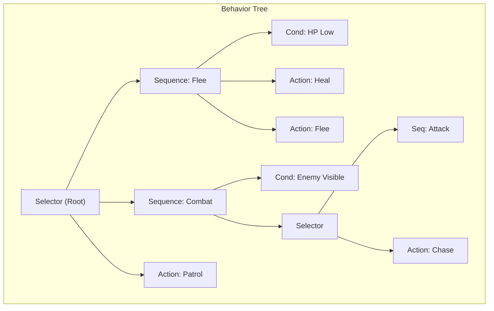

# NPC Behavior Systems: Behavior Trees and Goal-Oriented Action Planning

## Overview

Creating believable non-player characters (NPCs) is one of the greatest challenges in game AI. Players quickly notice when NPCs behave predictably, stupidly, or inconsistently. The goal is to create characters that appear to have goals, react to the world, make decisions, and surprise the player — all while running within a strict frame-time budget shared with rendering, physics, and audio.

Behavior Trees (BTs) and Goal-Oriented Action Planning (GOAP) are the two dominant architectures for complex NPC behavior in modern games. Behavior Trees, popularized by Halo 2 (2004), organize behaviors hierarchically using composites (sequences, selectors) and leaf nodes (conditions, actions). They are intuitive for designers, visually debuggable, and modular. GOAP, pioneered by F.E.A.R. (2005), takes a different approach: the NPC specifies goals and available actions with preconditions and effects, and an AI planner finds a sequence of actions to achieve the goal at runtime.

Both systems improve on FSMs by managing complexity more gracefully. BTs avoid the state-explosion problem through hierarchical decomposition. GOAP avoids it by generating plans dynamically rather than encoding transitions explicitly. Many modern games use hybrid approaches, combining behavior trees for high-level structure with utility scoring for action selection and planning for complex sequences.

## Key Concepts

- **Behavior Tree (BT)**: A directed acyclic graph that controls NPC decision-making. Internal nodes are composites (Sequence, Selector, Parallel) and decorators (Inverter, Repeater). Leaf nodes are conditions (checks) and actions (behaviors).

- **Sequence Node**: Executes children left-to-right. Succeeds only if ALL children succeed. Fails on the first failure (logical AND).

- **Selector (Fallback) Node**: Executes children left-to-right. Succeeds on the FIRST success. Fails only if ALL children fail (logical OR).

- **Goal-Oriented Action Planning (GOAP)**: NPCs have goals (desired world states) and actions (with preconditions and effects). An A*-like planner searches backward from the goal to find a valid action sequence.

- **Hierarchical Task Networks (HTN)**: A planning approach that decomposes high-level tasks into subtasks recursively. More structured than GOAP, used in games like Killzone.

- **Blackboard System**: A shared memory space where BT nodes and GOAP actions read and write data. Enables communication between behavior components without tight coupling.

## Technical Details

### Behavior Tree Execution

A BT ticks from the root every frame (or at a reduced frequency). Each node returns one of three statuses:
- **SUCCESS**: The task completed successfully
- **FAILURE**: The task failed
- **RUNNING**: The task is still in progress (will be ticked again next frame)

### GOAP Planning

GOAP represents the world as a set of boolean or numeric properties. Each action has:
- **Preconditions**: World state requirements that must be true
- **Effects**: Changes to world state when the action executes
- **Cost**: Used for finding optimal plans

The planner searches backward from the goal state, finding actions whose effects satisfy unsatisfied conditions, until all preconditions are met by the current world state.

### BT vs. GOAP Trade-offs

| Aspect | Behavior Trees | GOAP |
|---|---|---|
| Design | Hand-authored structure | Emergent plans |
| Debugging | Visual, deterministic | Plan traces needed |
| Flexibility | Modular but fixed structure | Dynamic, context-sensitive |
| Performance | Fast (tree traversal) | Planning cost per decision |
| Emergent behavior | Limited | High |

## Code Examples

```python
from enum import Enum, auto
from abc import ABC, abstractmethod
from typing import Optional

class Status(Enum):
    SUCCESS = auto()
    FAILURE = auto()
    RUNNING = auto()

class BTNode(ABC):
    @abstractmethod
    def tick(self, blackboard: dict) -> Status:
        pass

class Sequence(BTNode):
    """Runs children in order. Fails on first failure (AND)."""
    def __init__(self, children: list[BTNode]):
        self.children = children

    def tick(self, bb: dict) -> Status:
        for child in self.children:
            status = child.tick(bb)
            if status != Status.SUCCESS:
                return status
        return Status.SUCCESS

class Selector(BTNode):
    """Tries children in order. Succeeds on first success (OR)."""
    def __init__(self, children: list[BTNode]):
        self.children = children

    def tick(self, bb: dict) -> Status:
        for child in self.children:
            status = child.tick(bb)
            if status != Status.FAILURE:
                return status
        return Status.FAILURE

class Condition(BTNode):
    def __init__(self, name: str, check: callable):
        self.name = name
        self.check = check

    def tick(self, bb: dict) -> Status:
        return Status.SUCCESS if self.check(bb) else Status.FAILURE

class Action(BTNode):
    def __init__(self, name: str, execute: callable):
        self.name = name
        self.execute = execute

    def tick(self, bb: dict) -> Status:
        return self.execute(bb)

# Build a guard NPC behavior tree
def is_enemy_visible(bb):
    return bb.get("enemy_distance", 100) < 15

def is_health_low(bb):
    return bb.get("health", 100) < 25

def is_enemy_close(bb):
    return bb.get("enemy_distance", 100) < 3

def attack(bb):
    print("  ACTION: Attacking enemy!")
    return Status.SUCCESS

def chase(bb):
    print(f"  ACTION: Chasing enemy (dist={bb.get('enemy_distance', '?')})")
    return Status.SUCCESS

def flee(bb):
    print("  ACTION: Fleeing to safety!")
    return Status.SUCCESS

def patrol(bb):
    print("  ACTION: Patrolling...")
    return Status.SUCCESS

def heal(bb):
    print("  ACTION: Using health potion!")
    bb["health"] = min(100, bb.get("health", 50) + 30)
    return Status.SUCCESS

# Tree structure:
# Selector (root)
#   Sequence (flee when low hp)
#     Condition: health low
#     Action: heal
#     Action: flee
#   Sequence (combat)
#     Condition: enemy visible
#     Selector
#       Sequence (melee)
#         Condition: enemy close
#         Action: attack
#       Action: chase
#   Action: patrol

guard_bt = Selector([
    Sequence([
        Condition("health_low", is_health_low),
        Action("heal", heal),
        Action("flee", flee),
    ]),
    Sequence([
        Condition("enemy_visible", is_enemy_visible),
        Selector([
            Sequence([
                Condition("enemy_close", is_enemy_close),
                Action("attack", attack),
            ]),
            Action("chase", chase),
        ]),
    ]),
    Action("patrol", patrol),
])

# Test scenarios
scenarios = [
    {"enemy_distance": 50, "health": 80},
    {"enemy_distance": 10, "health": 80},
    {"enemy_distance": 2, "health": 80},
    {"enemy_distance": 5, "health": 15},
]

for bb in scenarios:
    print(f"\nState: dist={bb['enemy_distance']}, hp={bb['health']}")
    guard_bt.tick(bb)
```

```python
class GOAPAction:
    def __init__(self, name: str, cost: float,
                 preconditions: dict, effects: dict):
        self.name = name
        self.cost = cost
        self.preconditions = preconditions
        self.effects = effects

    def __repr__(self):
        return self.name

class GOAPPlanner:
    """Simple backward-chaining GOAP planner."""

    def plan(self, actions: list[GOAPAction],
             world_state: dict, goal: dict) -> list[GOAPAction]:
        """Find cheapest action sequence to achieve goal from world_state."""
        # BFS/A* backward from goal
        from heapq import heappush, heappop

        start = frozenset(goal.items())
        queue = [(0, 0, start, [])]  # (cost, tie-break, unsatisfied, plan)
        visited = set()
        counter = 0

        while queue:
            cost, _, unsatisfied_frozen, plan = heappop(queue)

            unsatisfied = dict(unsatisfied_frozen)

            # Check if all conditions satisfied by world state
            if all(world_state.get(k) == v for k, v in unsatisfied.items()):
                return list(reversed(plan))

            state_key = unsatisfied_frozen
            if state_key in visited:
                continue
            visited.add(state_key)

            for action in actions:
                # Does this action contribute to any unsatisfied condition?
                relevant = any(
                    action.effects.get(k) == v
                    for k, v in unsatisfied.items()
                )
                if not relevant:
                    continue

                # Apply action effects (remove satisfied conditions)
                new_unsatisfied = dict(unsatisfied)
                for k, v in action.effects.items():
                    if new_unsatisfied.get(k) == v:
                        del new_unsatisfied[k]

                # Add action preconditions as new requirements
                for k, v in action.preconditions.items():
                    new_unsatisfied[k] = v

                counter += 1
                new_frozen = frozenset(new_unsatisfied.items())
                heappush(queue, (cost + action.cost, counter,
                                new_frozen, plan + [action]))

        return []  # No plan found

# Define NPC actions
actions = [
    GOAPAction("scout",      1, {"has_weapon": True},
               {"enemy_found": True}),
    GOAPAction("get_weapon",  2, {"at_armory": True},
               {"has_weapon": True}),
    GOAPAction("go_armory",   1, {},
               {"at_armory": True}),
    GOAPAction("attack",      3, {"enemy_found": True, "has_weapon": True},
               {"enemy_dead": True}),
    GOAPAction("loot",        1, {"enemy_dead": True},
               {"has_loot": True}),
]

world = {"at_armory": False, "has_weapon": False,
         "enemy_found": False, "enemy_dead": False, "has_loot": False}

goal = {"has_loot": True}

planner = GOAPPlanner()
plan = planner.plan(actions, world, goal)
print(f"Goal: {goal}")
print(f"Plan: {' -> '.join(a.name for a in plan)}")
print(f"Total cost: {sum(a.cost for a in plan)}")
```

## Diagrams



## Exercises

1. **Decorator Nodes**: Implement `Inverter` (flips SUCCESS/FAILURE), `Repeater` (runs child N times), and `UntilFail` (runs child until it returns FAILURE) decorator nodes. Add them to the behavior tree and test.

2. **GOAP Expansion**: Add more actions to the GOAP system: "stealth_kill" (cheaper than attack but requires "is_hidden"), "hide" (sets "is_hidden"), "call_backup" (adds "has_allies" which reduces attack cost). Verify the planner finds different plans based on initial state.

3. **Hybrid System**: Combine BT and GOAP — use a behavior tree for high-level decision-making (when to fight vs. flee vs. explore) but use the GOAP planner to generate detailed action sequences for the "fight" sub-behavior. Implement and test with at least three different combat scenarios.

## Further Reading

- Isla, D. — "Handling Complexity in the Halo 2 AI" (GDC 2005)
- Orkin, J. — "Three States and a Plan: The A.I. of F.E.A.R." (GDC 2006)
- Colledanchise, M. & Ogren, P. — *Behavior Trees in Robotics and AI* (CRC Press, 2018)
