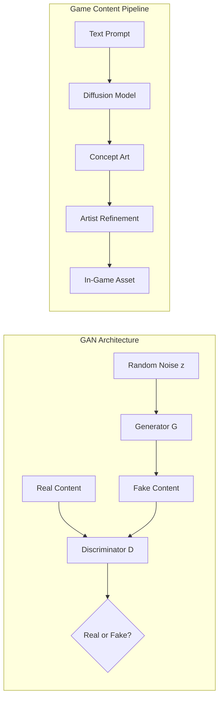

# Generative Models for Game Design: GANs, Diffusion, and Transformers

## Overview

Generative AI is transforming every aspect of game content creation. What once required teams of artists, writers, and level designers working for months can now be augmented — or in some cases bootstrapped — by generative models. GANs generate textures and sprites, diffusion models create concept art and 3D assets, large language models write dialogue and quests, and specialized architectures generate entire playable levels.

The game industry is particularly well-suited for generative AI because games need enormous volumes of content — thousands of textures, hundreds of characters, dozens of levels, hundreds of thousands of lines of dialogue — and players constantly demand novelty. Procedural generation (Lesson 5) addressed quantity; generative models address both quantity and quality, producing content that approaches human-created quality.

The key generative model families for game development are GANs (Generative Adversarial Networks), which learn to generate data by pitting a generator against a discriminator; diffusion models, which learn to denoise random noise into structured content; variational autoencoders (VAEs), which learn smooth latent spaces for content interpolation; and transformer-based models (LLMs), which generate sequential content like dialogue, narratives, and code.

However, generative models introduce new challenges: controlling output quality, ensuring game-mechanical validity (a generated level must be playable), maintaining stylistic consistency across a game, and the ethical/legal questions around training data and artist displacement.

## Key Concepts

- **GANs for Game Content**: A generator $G$ creates content from random noise $z$, while a discriminator $D$ tries to distinguish generated content from real examples. Training reaches equilibrium when $D$ cannot tell the difference.

- **Diffusion Models**: Learn to reverse a noise-adding process. Starting from pure noise, the model iteratively denoises to produce high-quality images. Stable Diffusion and DALL-E are prominent examples used for concept art and texture generation.

- **Latent Space Interpolation**: VAEs and GANs learn compressed representations where nearby points produce similar content. Interpolating in latent space creates smooth transitions — useful for generating variations of a weapon, character, or level.

- **Controllable Generation**: Conditioning generative models on desired attributes (style, difficulty, theme) to produce content that meets design specifications. Conditional GANs, classifier-free guidance, and prompt engineering are key techniques.

- **Level Generation with ML**: Training models on human-designed levels to generate new ones. Requires encoding levels as tensors (tile grids, graphs) and often adding playability constraints.

- **LLMs for Narrative and Dialogue**: Using large language models to generate quest descriptions, NPC dialogue, lore, item descriptions, and branching narratives. Fine-tuning on game-specific writing styles improves quality.

## Technical Details

### GAN Training Objective

The minimax objective for GANs:

$$\min_G \max_D \mathbb{E}_{x \sim p_{data}}[\log D(x)] + \mathbb{E}_{z \sim p_z}[\log(1 - D(G(z)))]$$

In practice, the generator maximizes $\mathbb{E}[\log D(G(z))]$ instead of minimizing $\log(1 - D(G(z)))$ for more stable gradients.

### Diffusion Forward and Reverse Process

**Forward process** (adding noise):
$$q(x_t | x_{t-1}) = \mathcal{N}(x_t; \sqrt{1-\beta_t} x_{t-1}, \beta_t I)$$

**Reverse process** (denoising, learned):
$$p_\theta(x_{t-1} | x_t) = \mathcal{N}(x_{t-1}; \mu_\theta(x_t, t), \sigma_t^2 I)$$

The model learns to predict the noise $\epsilon_\theta(x_t, t)$ added at each step, trained with:
$$L = \mathbb{E}_{t, x_0, \epsilon}\left[\|\epsilon - \epsilon_\theta(x_t, t)\|^2\right]$$

### Level Representation for ML

Game levels can be represented as:
- **Tile grids**: 2D integer arrays (each value = a tile type)
- **Graphs**: Nodes = rooms, edges = connections (for metroidvania/dungeon layouts)
- **Sequences**: Linearized tile rows (for training sequential models like LSTMs or Transformers)

## Code Examples

```python
import numpy as np

class SimpleLevelGAN:
    """A minimal GAN for generating 2D game level layouts.
    Uses numpy-only for clarity (production would use PyTorch/TF)."""

    def __init__(self, level_size: int = 8, latent_dim: int = 16):
        self.level_size = level_size
        self.output_dim = level_size * level_size
        self.latent_dim = latent_dim

        # Generator: latent -> level (single linear layer + sigmoid)
        self.g_weights = np.random.randn(latent_dim, self.output_dim) * 0.1
        self.g_bias = np.zeros(self.output_dim)

        # Discriminator: level -> real/fake (single linear layer + sigmoid)
        self.d_weights = np.random.randn(self.output_dim, 1) * 0.1
        self.d_bias = np.zeros(1)

    def sigmoid(self, x):
        return 1 / (1 + np.exp(-np.clip(x, -500, 500)))

    def generate(self, z: np.ndarray) -> np.ndarray:
        output = self.sigmoid(z @ self.g_weights + self.g_bias)
        return output.reshape(-1, self.level_size, self.level_size)

    def discriminate(self, levels: np.ndarray) -> np.ndarray:
        flat = levels.reshape(levels.shape[0], -1)
        return self.sigmoid(flat @ self.d_weights + self.d_bias)

    def train_step(self, real_levels: np.ndarray, lr: float = 0.01):
        batch_size = real_levels.shape[0]

        # Generate fake levels
        z = np.random.randn(batch_size, self.latent_dim)
        fake_levels = self.generate(z)

        # Discriminator predictions
        real_pred = self.discriminate(real_levels)
        fake_pred = self.discriminate(fake_levels)

        # Simple gradient updates (SGD)
        # D wants: real -> 1, fake -> 0
        d_error_real = (1 - real_pred).mean()
        d_error_fake = fake_pred.mean()

        real_flat = real_levels.reshape(batch_size, -1)
        self.d_weights += lr * (real_flat.T @ (1 - real_pred)) / batch_size
        self.d_weights -= lr * (fake_levels.reshape(batch_size, -1).T @ fake_pred) / batch_size

        # G wants: fake -> 1 (fool discriminator)
        self.g_weights += lr * 0.1 * np.random.randn(*self.g_weights.shape)

        return d_error_real.item(), d_error_fake.item()

def create_training_levels(n: int, size: int = 8) -> np.ndarray:
    """Create sample platformer levels (floor + platforms)."""
    levels = np.zeros((n, size, size))
    for i in range(n):
        levels[i, -1, :] = 1  # Floor
        # Random platforms
        for _ in range(3):
            row = np.random.randint(2, size - 2)
            col = np.random.randint(0, size - 3)
            width = np.random.randint(2, 4)
            levels[i, row, col:min(col+width, size)] = 1
    return levels

# Training demo
gan = SimpleLevelGAN(level_size=8, latent_dim=16)
training_data = create_training_levels(100, size=8)

for epoch in range(50):
    d_real, d_fake = gan.train_step(training_data)
    if epoch % 10 == 0:
        print(f"Epoch {epoch}: D(real)={1-d_real:.3f} D(fake)={d_fake:.3f}")

# Generate a level
z = np.random.randn(1, 16)
level = gan.generate(z)[0]
binary_level = (level > 0.5).astype(int)

symbols = {0: ' ', 1: '#'}
print("\nGenerated Level:")
for row in binary_level:
    print('|' + ''.join(symbols[c] for c in row) + '|')
```

```python
def markov_chain_dialogue(corpus: list[str], order: int = 2,
                          length: int = 50) -> str:
    """Generate NPC dialogue using a Markov chain."""
    # Build transition table
    transitions: dict[tuple, list[str]] = {}
    for text in corpus:
        words = text.split()
        for i in range(len(words) - order):
            key = tuple(words[i:i+order])
            next_word = words[i+order]
            transitions.setdefault(key, []).append(next_word)

    # Generate text
    import random
    start_key = random.choice(list(transitions.keys()))
    result = list(start_key)

    for _ in range(length):
        key = tuple(result[-order:])
        if key not in transitions:
            break
        result.append(random.choice(transitions[key]))

    return ' '.join(result)

# Sample fantasy NPC dialogue corpus
corpus = [
    "The ancient dragon sleeps beneath the mountain waiting for the hero to arrive",
    "Brave adventurer you must seek the crystal sword hidden in the dark forest",
    "The ancient temple holds many secrets that only the worthy may discover",
    "Beware the dark forest for many brave warriors have entered and never returned",
    "The crystal sword was forged by the ancient elves to defeat the shadow king",
    "Only the worthy hero may wield the crystal sword against the ancient dragon",
    "The shadow king rises from the dark realm to threaten our peaceful kingdom",
    "Seek the ancient temple beyond the dark forest to find the crystal key",
]

for i in range(3):
    dialogue = markov_chain_dialogue(corpus, order=2, length=15)
    print(f"NPC says: \"{dialogue}\"")
```

## Diagrams



## Exercises

1. **Level Variation with VAE Concepts**: Create a simple level encoder that compresses an 8x8 level grid into a 4-dimensional vector (average height, platform density, symmetry score, gap frequency). Generate new levels by sampling vectors near a "good" level's encoding.

2. **Controllable Dialogue Generation**: Extend the Markov chain dialogue generator to support "moods" — angry, friendly, mysterious. Maintain separate corpora for each mood and select the appropriate chain based on NPC state.

3. **Texture Blending**: Implement a simple texture interpolation system. Represent two 16x16 textures as numpy arrays and create smooth blends between them using linear interpolation. This simulates how a VAE's latent space allows smooth content variation.

## Further Reading

- Summerville, A. et al. — "Procedural Content Generation via Machine Learning (PCGML)" (IEEE ToG, 2018)
- Goodfellow, I. et al. — "Generative Adversarial Networks" (NeurIPS, 2014)
- Ho, J. et al. — "Denoising Diffusion Probabilistic Models" (NeurIPS, 2020)
- Togelius, J. et al. — "Search-Based Procedural Content Generation" (IEEE, 2011)
