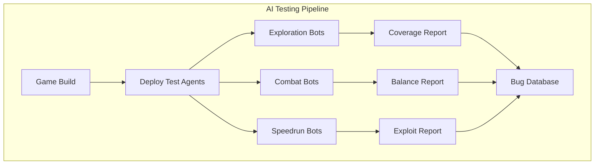

# AI for Game Testing, Balancing, and Automated Playtesting

## Overview

Game testing is one of the most time-consuming and expensive aspects of game development. A AAA title may have hundreds of hours of content, thousands of item combinations, millions of possible player paths, and countless edge cases. Human QA testers simply cannot cover the full space. AI-driven testing and balancing is transforming this process, enabling studios to find bugs faster, balance gameplay more precisely, and ensure quality at a scale impossible with manual testing alone.

Automated playtesting uses AI agents — from simple scripted bots to sophisticated RL agents — to play through games systematically, identifying bugs, exploits, soft-locks, unreachable areas, and balance issues. Ubisoft's "Commit Assistant" predicts which code changes might introduce bugs. EA uses AI agents to playtest games thousands of times faster than human testers. Unity's automated testing framework uses ML agents to explore game environments and report anomalies.

Game balancing is equally critical. An overpowered weapon, an unbeatable boss, or a dominant strategy can ruin the player experience. Traditional balancing relies on designer intuition and player feedback post-launch. AI-based balancing uses simulation: train agents with different strategies, analyze win rates, identify dominant strategies, and adjust parameters until equilibrium is reached. This approach can evaluate thousands of balance configurations before a single human plays the game.

## Key Concepts

- **Automated Exploration Testing**: AI agents systematically explore game environments to find unreachable areas, stuck states, collision bugs, and missing triggers. Coverage metrics track what percentage of the game space has been tested.

- **Regression Testing with AI**: Training agents on the current game build, then running them on new builds to detect behavioral changes. If an agent that previously completed a level now fails, a regression likely occurred.

- **Game Balance Analysis**: Using simulation to evaluate the relative strength of game elements (characters, weapons, strategies). Win rate matrices, Nash equilibria, and Elo ratings quantify balance.

- **Exploit Detection**: AI agents trained to maximize reward often discover unintended exploits — sequence breaks, infinite resource loops, or physics glitches — that human testers miss.

- **Difficulty Calibration**: Using agents of varying skill levels to estimate how hard each game section is. If even weak agents can beat a boss easily, it needs to be harder; if strong agents struggle, it may be too punishing.

- **Heatmap Analytics**: Aggregating spatial data from thousands of playthroughs to visualize where players die, get stuck, or spend the most time. Identifies design problems at a glance.

## Technical Details

### Coverage Metrics for Game Testing

Game test coverage can be measured across multiple dimensions:

| Coverage Type | Metric | Target |
|---|---|---|
| Spatial | % of navigable area visited | > 95% |
| State | % of game states reached | > 80% |
| Interaction | % of interactable objects tested | > 90% |
| Path | % of critical paths completed | 100% |
| Combinatorial | % of item/ability combos tested | > 50% |

### Nash Equilibrium for Balance

In a two-player game with strategies $S_1, S_2$ and payoff matrix $A$, a mixed strategy Nash equilibrium is a probability distribution $p$ over $S_1$ and $q$ over $S_2$ such that:

$$p^* = \arg\max_p \min_q p^T A q$$

A balanced game has a Nash equilibrium where multiple strategies are viable (no single dominant strategy).

### Automated Bug Classification

AI can classify discovered bugs by severity:
- **Critical**: Crashes, soft-locks, data corruption
- **Major**: Progression blockers, significant visual glitches
- **Minor**: Cosmetic issues, non-blocking irregularities
- **Balance**: Overpowered/underpowered elements

## Code Examples

```python
import numpy as np
from collections import defaultdict

class GameBalanceSimulator:
    """Simulate matches to analyze game balance."""

    def __init__(self, characters: dict[str, dict]):
        self.characters = characters
        self.match_history: list[dict] = []

    def simulate_match(self, char_a: str, char_b: str) -> str:
        """Simulate a match between two characters. Returns winner."""
        stats_a = self.characters[char_a]
        stats_b = self.characters[char_b]

        hp_a, hp_b = stats_a["hp"], stats_b["hp"]
        turn = 0

        while hp_a > 0 and hp_b > 0:
            # A attacks B
            damage = max(0, stats_a["attack"] - stats_b["defense"]
                        + np.random.normal(0, 2))
            hp_b -= damage

            if hp_b <= 0:
                break

            # B attacks A
            damage = max(0, stats_b["attack"] - stats_a["defense"]
                        + np.random.normal(0, 2))
            hp_a -= damage
            turn += 1

        winner = char_a if hp_a > 0 else char_b
        self.match_history.append({
            "char_a": char_a, "char_b": char_b,
            "winner": winner, "turns": turn
        })
        return winner

    def run_tournament(self, matches_per_pair: int = 1000):
        """Run a round-robin tournament."""
        chars = list(self.characters.keys())
        for i, a in enumerate(chars):
            for b in chars[i+1:]:
                for _ in range(matches_per_pair):
                    self.simulate_match(a, b)

    def get_win_rates(self) -> dict[str, dict]:
        """Compute win rate matrix."""
        chars = list(self.characters.keys())
        wins = defaultdict(lambda: defaultdict(int))
        total = defaultdict(lambda: defaultdict(int))

        for match in self.match_history:
            a, b, w = match["char_a"], match["char_b"], match["winner"]
            total[a][b] += 1
            total[b][a] += 1
            wins[w][a if w == a else b] += 0
            wins[a][b] += (1 if w == a else 0)
            wins[b][a] += (1 if w == b else 0)

        rates = {}
        for c in chars:
            rates[c] = {
                "overall": sum(1 for m in self.match_history
                              if m["winner"] == c) / max(1, sum(
                    1 for m in self.match_history
                    if c in (m["char_a"], m["char_b"]))),
            }
        return rates

    def balance_report(self):
        """Print balance analysis."""
        rates = self.get_win_rates()
        print("=== Balance Report ===")
        for char, data in sorted(rates.items(),
                                  key=lambda x: x[1]["overall"],
                                  reverse=True):
            wr = data["overall"]
            status = ("OVERPOWERED" if wr > 0.55
                     else "UNDERPOWERED" if wr < 0.45
                     else "BALANCED")
            bar = "#" * int(wr * 40)
            print(f"  {char:12s} WR={wr:.1%} [{bar:40s}] {status}")

# Define characters with stats
characters = {
    "Warrior":  {"hp": 120, "attack": 15, "defense": 10},
    "Mage":     {"hp": 80,  "attack": 22, "defense": 5},
    "Rogue":    {"hp": 90,  "attack": 18, "defense": 7},
    "Tank":     {"hp": 150, "attack": 10, "defense": 14},
    "Archer":   {"hp": 85,  "attack": 20, "defense": 6},
}

sim = GameBalanceSimulator(characters)
sim.run_tournament(matches_per_pair=500)
sim.balance_report()
```

```python
class AutomatedExplorationTester:
    """AI agent that explores a game grid to find bugs and coverage gaps."""

    def __init__(self, game_map: np.ndarray):
        self.game_map = game_map  # 0=floor, 1=wall, 2=hazard, 3=goal
        self.rows, self.cols = game_map.shape
        self.visited = np.zeros_like(game_map, dtype=bool)
        self.bugs_found: list[dict] = []

    def explore(self, start: tuple, max_steps: int = 5000) -> dict:
        """Random walk exploration with bug detection."""
        pos = list(start)
        self.visited[pos[0], pos[1]] = True
        steps = 0
        stuck_counter = 0
        last_pos = pos[:]

        directions = [(-1,0),(1,0),(0,-1),(0,1)]

        for step in range(max_steps):
            # Try random direction
            np.random.shuffle(directions)
            moved = False

            for dr, dc in directions:
                nr, nc = pos[0]+dr, pos[1]+dc
                if 0 <= nr < self.rows and 0 <= nc < self.cols:
                    if self.game_map[nr, nc] != 1:  # Not a wall
                        pos = [nr, nc]
                        self.visited[nr, nc] = True
                        moved = True

                        # Bug detection
                        if self.game_map[nr, nc] == 2:  # Hazard
                            self.bugs_found.append({
                                "type": "hazard_reached",
                                "position": (nr, nc),
                                "step": step
                            })
                        break

            if not moved:
                stuck_counter += 1
                if stuck_counter > 10:
                    self.bugs_found.append({
                        "type": "stuck_state",
                        "position": tuple(pos),
                        "step": step
                    })
                    break
            else:
                stuck_counter = 0

            steps = step

        # Coverage analysis
        walkable = (self.game_map != 1)
        coverage = self.visited[walkable].sum() / walkable.sum()

        return {
            "steps": steps,
            "coverage": coverage,
            "bugs_found": len(self.bugs_found),
            "unreached_areas": walkable.sum() - self.visited[walkable].sum()
        }

# Create a test map
test_map = np.zeros((12, 12), dtype=int)
test_map[0, :] = test_map[-1, :] = test_map[:, 0] = test_map[:, -1] = 1
test_map[3, 2:8] = 1   # Wall
test_map[6, 4:10] = 1  # Wall
test_map[9, 1:7] = 1   # Wall
test_map[2, 5] = 2     # Hazard
test_map[10, 10] = 3   # Goal

tester = AutomatedExplorationTester(test_map)
results = tester.explore((1, 1), max_steps=3000)
print(f"Exploration Results:")
print(f"  Steps taken: {results['steps']}")
print(f"  Coverage: {results['coverage']:.1%}")
print(f"  Bugs found: {results['bugs_found']}")
print(f"  Unreached cells: {results['unreached_areas']}")
```

## Diagrams



## Exercises

1. **Balance Tuning**: Using the `GameBalanceSimulator`, adjust the character stats until all characters have win rates between 45% and 55%. Document the changes you made and explain your reasoning.

2. **Smarter Explorer**: Replace the random walk in `AutomatedExplorationTester` with a frontier-based exploration strategy. The agent should prioritize visiting unexplored cells adjacent to explored cells. Compare coverage rates against random exploration.

3. **Regression Detector**: Create a system that runs an AI agent on two versions of a game map and detects behavioral differences. If the agent completes a path in version 1 but fails in version 2, flag it as a regression. Test with a map where you introduce a blocking wall.

## Further Reading

- Ariyurek, S., Betin-Can, A., Surer, E. — "Automated Video Game Testing Using Synthetic and Humanlike Agents" (IEEE ToG, 2021)
- Pfau, J. et al. — "Dungeons & Replicants: Automated Playtesting with RL Agents" (2020)
- Zook, A. et al. — "Automated Playtesting with Procedural Personas through MCTS" (IEEE CoG, 2019)
