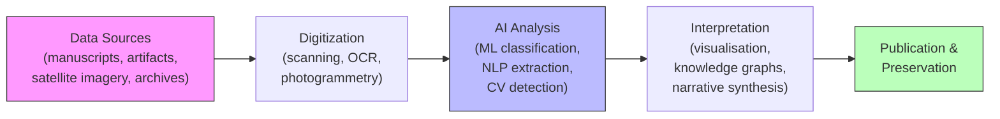
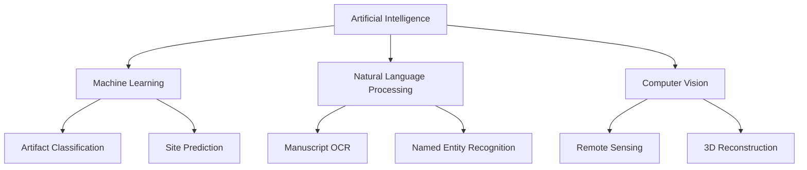

# Overview

Artificial intelligence is reshaping how we study the past. From deciphering ancient scripts to mapping buried cities with satellite imagery, AI methods -- machine learning, natural language processing, and computer vision -- now augment the historian's toolkit in ways that were unimaginable a generation ago.

This lesson introduces the scope of AI in history and archaeology, traces the evolution of computational approaches to the past, surveys the core AI methods in use today, and raises the ethical questions that practitioners must navigate.

## Key Concepts

### Scope of AI in History and Archaeology

AI touches nearly every phase of historical and archaeological research:

- **Discovery**: Remote sensing, satellite imagery analysis, and anomaly detection to locate sites.
- **Documentation**: Automated digitization of manuscripts, inscriptions, and artifacts.
- **Analysis**: Classification of pottery sherds, dating of artifacts, network analysis of trade routes.
- **Interpretation**: Topic modeling of historical corpora, sentiment analysis of period texts, simulation of past societies.

### A Brief History of Computational Archaeology

Quantitative methods entered archaeology in the 1960s with statistical seriation and spatial analysis. The 1990s saw the rise of GIS (Geographic Information Systems) for site mapping. By the 2010s, deep learning opened doors to image-based artifact classification and large-scale text mining of historical archives.

### Core AI Methods

| Method | Typical Application |
|--------|-------------------|
| **Machine Learning (ML)** | Artifact classification, dating regression, site prediction |
| **Natural Language Processing (NLP)** | OCR of manuscripts, named entity recognition, language modeling for extinct languages |
| **Computer Vision (CV)** | Pottery typology, remote sensing, 3D reconstruction of ruins |

### Ethical Considerations

Working with cultural heritage data demands care:

- **Colonial legacies**: Many datasets were collected under exploitative conditions.
- **Indigenous data sovereignty**: Communities may have rights over data about their heritage.
- **Bias in training data**: Models trained on Western-centric corpora may misrepresent other traditions.
- **Reproducibility**: Archaeological contexts are destroyed during excavation, so transparent, reproducible AI pipelines are essential.

## Code Examples

A minimal Python pipeline that loads a CSV of archaeological site records and trains a simple classifier to predict site type from geographic and environmental features:

```python
import pandas as pd
from sklearn.model_selection import train_test_split
from sklearn.ensemble import RandomForestClassifier
from sklearn.metrics import classification_report

# Load archaeological site records
# Columns: latitude, longitude, elevation, soil_type_code, annual_rainfall, site_type
df = pd.read_csv("archaeological_sites.csv")

features = ["latitude", "longitude", "elevation", "soil_type_code", "annual_rainfall"]
X = df[features]
y = df["site_type"]  # e.g., "settlement", "burial", "ritual"

X_train, X_test, y_train, y_test = train_test_split(
    X, y, test_size=0.2, random_state=42, stratify=y
)

clf = RandomForestClassifier(n_estimators=100, random_state=42)
clf.fit(X_train, y_train)

y_pred = clf.predict(X_test)
print(classification_report(y_test, y_pred))
```

## Math / Formulas

A common baseline metric for classification tasks is **accuracy**:

$$\text{Accuracy} = \frac{\text{Number of correct predictions}}{\text{Total predictions}}$$

When classes are imbalanced (e.g., far more settlement sites than ritual sites), the **F1 score** for each class $c$ gives a more nuanced picture:

$$F_1^{(c)} = 2 \cdot \frac{\text{Precision}^{(c)} \cdot \text{Recall}^{(c)}}{\text{Precision}^{(c)} + \text{Recall}^{(c)}}$$

where $\text{Precision}^{(c)} = \frac{TP_c}{TP_c + FP_c}$ and $\text{Recall}^{(c)} = \frac{TP_c}{TP_c + FN_c}$.

## Diagrams

**AI for History and Archaeology Pipeline**



**Core AI Disciplines Used in Historical Research**



## Exercises

1. **Conceptual**: List three types of historical or archaeological data that could benefit from computer vision. For each, describe what the input image would look like and what the model would predict.
2. **Practical**: Using the code example above as a starting point, add a confusion matrix visualization with `sklearn.metrics.ConfusionMatrixDisplay`. Which site types are most often confused?
3. **Ethics**: A museum wants to train a model on pottery images from a colonially acquired collection. Draft three questions the team should answer before proceeding.

## Further Reading

- Barcelo, J. A., & Bogdanovic, I. (Eds.). *Mathematics and Archaeology*. CRC Press.
- Bickler, S. H. (2021). "Machine Learning Arrives in Archaeology." *Advances in Archaeological Practice*, 9(2), 186--191.
- Gattiglia, G. (2015). "Think Big About Data: Archaeology and Big Data." *Archivio per l'Antropologia*, 145, 113--129.
- The Computational Archaeology Laboratory resources at UCL: [https://www.ucl.ac.uk/archaeology](https://www.ucl.ac.uk/archaeology)
