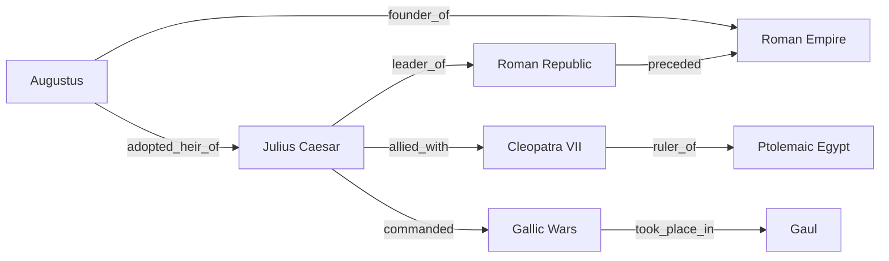
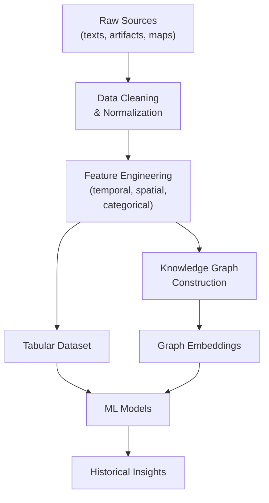

# Overview

Before any AI model can reason about the past, historical information must be translated into structured representations that algorithms can process. This lesson explores how historians and data scientists encode time periods, events, geographic locations, and relationships between entities. We also address the persistent challenge of working with sparse, incomplete, and contradictory historical records.

## Key Concepts

### Time Periods as Features

Historical time can be represented in several ways for ML models:

- **Absolute dates**: A single year or date (e.g., 1066 CE) encoded as a numeric feature.
- **Date ranges**: Many events have uncertain dates. A range $[t_{\min}, t_{\max}]$ can be encoded as midpoint and span: $t_{\text{mid}} = \frac{t_{\min} + t_{\max}}{2}$, $\Delta t = t_{\max} - t_{\min}$.
- **Period labels**: Categorical features like "Bronze Age" or "Medieval" mapped to ordinal or one-hot encodings.
- **Cyclical encoding**: For seasonal patterns, encode month $m$ as $\sin\!\bigl(\frac{2\pi m}{12}\bigr)$ and $\cos\!\bigl(\frac{2\pi m}{12}\bigr)$.

### Event Graphs and Knowledge Graphs

A **knowledge graph** $G = (V, E)$ models historical entities as nodes $v \in V$ and relationships as directed edges $e \in E$. Each edge is a triple $(h, r, t)$ -- head entity, relation, tail entity -- for example:

$$(\text{Julius Caesar},\; \texttt{assassinated\_in},\; \text{Rome})$$

Knowledge graph embeddings learn vector representations $\mathbf{h}, \mathbf{r}, \mathbf{t} \in \mathbb{R}^d$ such that valid triples score higher under a scoring function. The TransE model, for instance, minimizes:

$$f(h, r, t) = \|\mathbf{h} + \mathbf{r} - \mathbf{t}\|_2$$

### GIS and Temporal Data

Geographic Information Systems store spatial data (coordinates, polygons) alongside attributes. Adding a temporal dimension creates **spatio-temporal** datasets ideal for tracking trade routes, migration patterns, and the spread of technologies across regions and centuries.

### Challenges with Sparse and Incomplete Data

- **Missing dates**: Many artifacts and events lack precise dating.
- **Contradictory sources**: Different chronicles may disagree on the same event.
- **Survival bias**: Materials that survived (stone, metal) are overrepresented relative to organic materials.
- **Uneven digitization**: European archives are far more digitized than those of other regions.

## Code Examples

Building a simple historical knowledge graph with NetworkX and querying it:

```python
import networkx as nx
import matplotlib.pyplot as plt

# Create a directed knowledge graph
G = nx.DiGraph()

# Add historical triples: (head, tail, relation)
triples = [
    ("Julius Caesar", "Roman Republic", "leader_of"),
    ("Julius Caesar", "Cleopatra VII", "allied_with"),
    ("Julius Caesar", "Gallic Wars", "commanded"),
    ("Cleopatra VII", "Ptolemaic Egypt", "ruler_of"),
    ("Augustus", "Roman Empire", "founder_of"),
    ("Augustus", "Julius Caesar", "adopted_heir_of"),
    ("Gallic Wars", "Gaul", "took_place_in"),
    ("Roman Republic", "Roman Empire", "preceded"),
]

for head, tail, relation in triples:
    G.add_edge(head, tail, relation=relation)

# Query: find all entities related to Julius Caesar
caesar_edges = G.edges("Julius Caesar", data=True)
print("Julius Caesar's relationships:")
for src, dst, data in caesar_edges:
    print(f"  {src} --[{data['relation']}]--> {dst}")

# Find shortest path between two entities
path = nx.shortest_path(G, "Augustus", "Gaul")
print(f"\nPath from Augustus to Gaul: {' -> '.join(path)}")

# Visualize the graph
pos = nx.spring_layout(G, seed=42)
plt.figure(figsize=(10, 7))
nx.draw_networkx_nodes(G, pos, node_size=2000, node_color="lightblue")
nx.draw_networkx_labels(G, pos, font_size=8)
nx.draw_networkx_edges(G, pos, arrows=True)
edge_labels = nx.get_edge_attributes(G, "relation")
nx.draw_networkx_edge_labels(G, pos, edge_labels, font_size=7)
plt.title("Historical Knowledge Graph")
plt.axis("off")
plt.tight_layout()
plt.savefig("historical_kg.png", dpi=150)
plt.show()
```

## Math / Formulas

### Date Range Encoding

Given an uncertain date range $[t_{\min}, t_{\max}]$, we compute a Gaussian-inspired feature representation:

$$\mu = \frac{t_{\min} + t_{\max}}{2}, \quad \sigma = \frac{t_{\max} - t_{\min}}{4}$$

The probability that the true date $t^*$ falls within the range is then modeled as:

$$P(t^*) \propto \exp\!\left(-\frac{(t^* - \mu)^2}{2\sigma^2}\right)$$

### Graph Centrality

To find the most "important" entity in a historical knowledge graph, we can compute **PageRank**. For a node $i$ with in-neighbors $\mathcal{N}_i$:

$$\text{PR}(i) = \frac{1 - d}{N} + d \sum_{j \in \mathcal{N}_i} \frac{\text{PR}(j)}{|\text{out}(j)|}$$

where $d \approx 0.85$ is the damping factor and $N$ is the total number of nodes.

## Diagrams

**Knowledge Graph Structure**



**Historical Data Pipeline**



## Exercises

1. **Conceptual**: Explain why one-hot encoding of time periods (e.g., "Bronze Age", "Iron Age") loses information that an ordinal encoding preserves. When might one-hot still be preferable?
2. **Practical**: Extend the code example by computing the PageRank of each node using `nx.pagerank(G)`. Which historical entity scores highest? Does this match your intuition?
3. **Research**: Find a publicly available historical dataset (e.g., from the Seshat Global History Databank). Describe its schema and identify which columns could serve as node attributes in a knowledge graph.

## Further Reading

- Hitzler, P., et al. (2021). "A Review of the Semantic Web Field." *Communications of the ACM*, 64(2), 76--83.
- Bordes, A., et al. (2013). "Translating Embeddings for Modeling Multi-relational Data." *NeurIPS 2013*.
- Seshat: Global History Databank -- [http://seshatdatabank.info/](http://seshatdatabank.info/)
- Brughmans, T., & Peeples, M. A. (2023). *Network Science in Archaeology*. Cambridge University Press.
