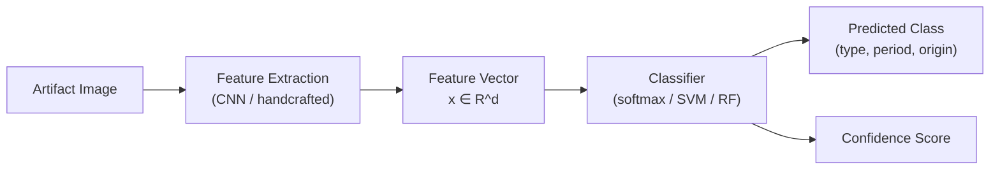
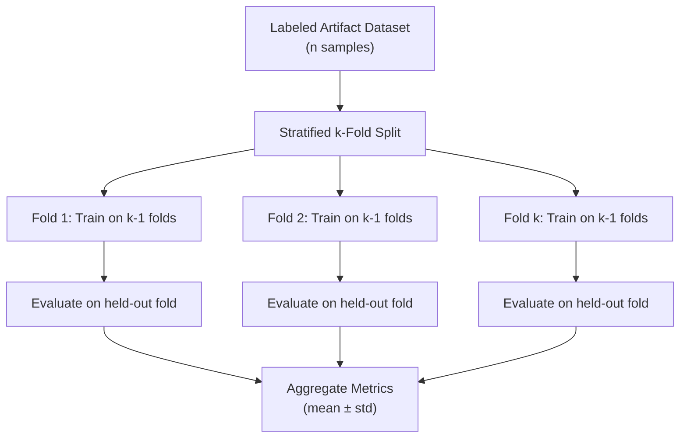

## Overview

Dating and classifying artifacts are two of the most fundamental tasks in archaeology. Traditionally, these tasks rely on expert knowledge, typological comparison, and laboratory techniques such as radiocarbon dating. Machine learning can augment these workflows by fitting calibration curves, extracting visual features from artifact images, and learning classification boundaries even when labeled data is scarce. This lesson covers the key ML approaches to artifact dating and classification, along with the practical challenges of working with limited archaeological datasets.

## Key Concepts

### Radiocarbon Dating and Regression Models

Radiocarbon dating measures the ratio of $^{14}\text{C}$ to $^{12}\text{C}$ in organic material. The conventional radiocarbon age $t_{\text{RC}}$ is related to the true calendar age $t_{\text{cal}}$ through a **calibration curve** that accounts for historical fluctuations in atmospheric $^{14}\text{C}$.

The raw decay equation gives:

$$t_{\text{RC}} = -\tau \ln\!\left(\frac{A}{A_0}\right)$$

where $\tau = \frac{T_{1/2}}{\ln 2} \approx 8033$ years is the mean lifetime of $^{14}\text{C}$, $A$ is the measured activity, and $A_0$ is the modern reference activity. However, because atmospheric $^{14}\text{C}$ has not been constant, a calibration curve (e.g., IntCal20) maps $t_{\text{RC}}$ to $t_{\text{cal}}$ in a non-linear fashion. Regression models can learn this mapping from known-age samples.

### Stylistic Analysis with Computer Vision

Archaeologists have long classified pottery, coins, and textiles by their visual style. Convolutional neural networks (CNNs) can automate this process:

1. **Feature extraction**: A pretrained CNN (e.g., ResNet) extracts a feature vector $\mathbf{x} \in \mathbb{R}^d$ from an artifact image.
2. **Classification head**: A fully connected layer maps $\mathbf{x}$ to class probabilities via softmax: $P(y = c \mid \mathbf{x}) = \frac{e^{\mathbf{w}_c^\top \mathbf{x}}}{\sum_{k} e^{\mathbf{w}_k^\top \mathbf{x}}}$.
3. **Fine-tuning**: The network is fine-tuned on a small labeled set of artifact images.

### Feature Extraction from Artifact Images

Beyond CNNs, traditional computer vision features remain useful when data is very limited:

- **Shape descriptors**: Hu moments, Fourier descriptors of contour outlines.
- **Texture features**: Gray-Level Co-occurrence Matrix (GLCM) statistics -- contrast, correlation, energy.
- **Color histograms**: Distribution of hue/saturation values, useful for pigment analysis.

### Cross-Validation with Limited Labeled Data

Archaeological datasets are often small (tens to hundreds of labeled examples). Standard $k$-fold cross-validation may produce unstable estimates. Strategies include:

- **Stratified $k$-fold**: Ensures each fold preserves the class distribution.
- **Leave-one-out cross-validation (LOOCV)**: Uses $n - 1$ samples for training and 1 for testing, repeated $n$ times.
- **Data augmentation**: Rotation, flipping, and color jittering of artifact images to expand the training set.

## Code Examples

Fitting a radiocarbon calibration curve using Gaussian Process Regression:

```python
import numpy as np
import matplotlib.pyplot as plt
from sklearn.gaussian_process import GaussianProcessRegressor
from sklearn.gaussian_process.kernels import RBF, WhiteKernel

# Simulated IntCal-like calibration data
# Known calendar ages (years BP) and their radiocarbon ages
np.random.seed(42)
cal_ages = np.linspace(0, 10000, 50).reshape(-1, 1)
# True calibration curve (simplified nonlinear relationship)
true_rc_ages = cal_ages.ravel() * 0.95 + 200 * np.sin(cal_ages.ravel() / 1500)
# Add measurement noise
rc_ages_observed = true_rc_ages + np.random.normal(0, 80, size=len(true_rc_ages))

# Fit a Gaussian Process to learn the calibration curve
kernel = RBF(length_scale=1000) + WhiteKernel(noise_level=80**2)
gp = GaussianProcessRegressor(kernel=kernel, n_restarts_optimizer=5)
gp.fit(cal_ages, rc_ages_observed)

# Predict on a dense grid
cal_grid = np.linspace(0, 10000, 500).reshape(-1, 1)
rc_pred, rc_std = gp.predict(cal_grid, return_std=True)

# Plot the calibration curve with uncertainty
plt.figure(figsize=(10, 6))
plt.scatter(cal_ages, rc_ages_observed, c="red", s=20, label="Known-age samples")
plt.plot(cal_grid, rc_pred, "b-", label="GP calibration curve")
plt.fill_between(
    cal_grid.ravel(),
    rc_pred - 2 * rc_std,
    rc_pred + 2 * rc_std,
    alpha=0.2,
    color="blue",
    label="95% confidence interval",
)
plt.xlabel("Calendar Age (years BP)")
plt.ylabel("Radiocarbon Age (years BP)")
plt.title("Radiocarbon Calibration Curve via Gaussian Process Regression")
plt.legend()
plt.grid(True, alpha=0.3)
plt.tight_layout()
plt.savefig("calibration_curve.png", dpi=150)
plt.show()

# Use the model to calibrate a new radiocarbon measurement
new_rc_age = 4500  # measured radiocarbon age
# Find the calendar age range where the GP prediction matches
rc_at_grid = gp.predict(cal_grid)
closest_idx = np.argmin(np.abs(rc_at_grid - new_rc_age))
estimated_cal_age = cal_grid[closest_idx, 0]
print(f"Radiocarbon age {new_rc_age} BP => Estimated calendar age: {estimated_cal_age:.0f} BP")
```

## Math / Formulas

### Radiocarbon Decay

The fundamental decay equation relates measured activity $A$ to elapsed time:

$$A = A_0 \, e^{-t / \tau}$$

Solving for conventional radiocarbon age:

$$t_{\text{RC}} = -\tau \ln\!\left(\frac{A}{A_0}\right), \quad \tau = \frac{T_{1/2}}{\ln 2} \approx 8033 \text{ years}$$

### Gaussian Process Prediction

Given training data $(\mathbf{X}, \mathbf{y})$ and a test point $\mathbf{x}_*$, the GP predictive distribution is:

$$\mu_* = \mathbf{k}_*^\top (\mathbf{K} + \sigma_n^2 \mathbf{I})^{-1} \mathbf{y}$$

$$\sigma_*^2 = k(\mathbf{x}_*, \mathbf{x}_*) - \mathbf{k}_*^\top (\mathbf{K} + \sigma_n^2 \mathbf{I})^{-1} \mathbf{k}_*$$

where $\mathbf{K}$ is the kernel matrix, $\mathbf{k}_*$ is the vector of kernel evaluations between $\mathbf{x}_*$ and each training point, and $\sigma_n^2$ is the noise variance.

### Softmax Classification

For an artifact feature vector $\mathbf{x}$ and $C$ artifact classes:

$$P(y = c \mid \mathbf{x}) = \frac{\exp(\mathbf{w}_c^\top \mathbf{x} + b_c)}{\sum_{k=1}^{C} \exp(\mathbf{w}_k^\top \mathbf{x} + b_k)}$$

## Diagrams

**Artifact Classification Pipeline**



**Cross-Validation Strategy for Small Datasets**



## Exercises

1. **Conceptual**: Why is a simple linear regression insufficient for mapping radiocarbon ages to calendar ages? What property of the calibration curve makes non-linear models necessary?
2. **Practical**: Modify the code example to add a second measurement at $t_{\text{RC}} = 7200$ BP. Does the GP uncertainty band narrow or widen at that point? Explain why.
3. **Challenge**: Download a small image dataset of ancient coins (e.g., from the American Numismatic Society). Use a pretrained ResNet to extract features, then train a $k$-nearest-neighbors classifier to distinguish Roman from Greek coins. Report your LOOCV accuracy.

## Further Reading

- Reimer, P. J., et al. (2020). "The IntCal20 Northern Hemisphere Radiocarbon Age Calibration Curve (0--55 cal kBP)." *Radiocarbon*, 62(4), 725--757.
- Pawlowicz, L. M., & Downum, C. E. (2021). "Applications of Deep Learning to Decorated Ceramic Typology and Classification." *Journal of Archaeological Method and Theory*, 28, 1--18.
- Rasmussen, C. E., & Williams, C. K. I. (2006). *Gaussian Processes for Machine Learning*. MIT Press. Available free at [http://gaussianprocess.org/gpml/](http://gaussianprocess.org/gpml/)
