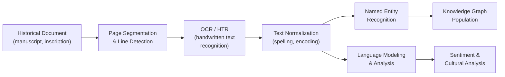
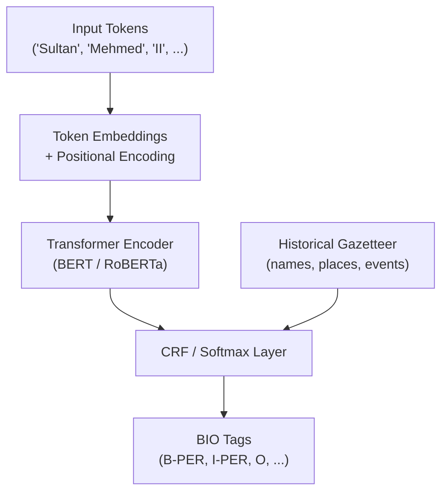

## Overview

Historical documents are among the richest primary sources available to researchers, yet much of this material remains locked in formats that resist easy computational analysis: handwritten manuscripts, faded inscriptions, texts in archaic or extinct languages. Natural language processing provides a suite of tools to digitize, parse, and extract meaning from these sources at scale. This lesson covers OCR for degraded documents, named entity recognition for historical texts, language modeling for old and extinct languages, and sentiment analysis as a window into past cultures.

## Key Concepts

### OCR for Old Manuscripts

Optical Character Recognition for historical documents faces challenges that modern OCR handles easily on printed text:

- **Handwriting variation**: Each scribe had a unique hand; letterforms vary even within a single document.
- **Degradation**: Fading ink, water damage, holes, and foxing introduce noise.
- **Non-standard layouts**: Marginalia, interlinear glosses, and multi-column formats complicate page segmentation.

Modern approaches use **sequence-to-sequence** models. A CNN or Vision Transformer encodes an image of a text line into a feature sequence, and a recurrent or transformer decoder emits character predictions. The Connectionist Temporal Classification (CTC) loss allows training without character-level alignment:

$$\mathcal{L}_{\text{CTC}} = -\ln P(\mathbf{y} \mid \mathbf{x}) = -\ln \sum_{\pi \in \mathcal{B}^{-1}(\mathbf{y})} \prod_{t=1}^{T} P(\pi_t \mid \mathbf{x})$$

where $\mathbf{y}$ is the target text, $\pi$ ranges over all CTC paths that collapse to $\mathbf{y}$, and $\mathcal{B}^{-1}$ is the inverse of the CTC collapsing function.

### Named Entity Recognition for Historical Texts

NER identifies and classifies mentions of persons, places, events, and organizations. Historical NER is harder than modern NER because:

- **Spelling variation**: "Shakespere", "Shakspeare", "Shakespeare" may all appear.
- **Ambiguity**: "Alexandria" could refer to cities in Egypt, Virginia, or Scotland.
- **Domain shift**: Models trained on modern news corpora perform poorly on 16th-century prose.

Fine-tuning transformer models (e.g., BERT) on small annotated historical corpora, combined with gazetteers of historical names and places, significantly improves performance.

### Language Modeling for Extinct and Old Languages

Language models estimate $P(w_t \mid w_1, \ldots, w_{t-1})$ -- the probability of the next word given context. For extinct languages with small corpora, techniques include:

- **Transfer learning**: Pretrain on a related living language, then fine-tune on the target corpus.
- **Character-level models**: Work at the character level to handle morphologically rich languages with large vocabularies.
- **Data augmentation**: Generate synthetic training data through rule-based morphological transformations.

### Sentiment and Cultural Signals

Sentiment analysis applied to historical texts can reveal shifts in public opinion, emotional responses to events, and evolving cultural attitudes. However, word meanings drift over time -- "awful" once meant "awe-inspiring" -- so models must account for **semantic change**.

## Code Examples

Using spaCy to perform named entity recognition on a historical text passage and visualizing the results:

```python
import spacy
from spacy import displacy
from collections import Counter

# Load a pretrained English NER model
nlp = spacy.load("en_core_web_sm")

# A passage about the fall of Constantinople (1453)
historical_text = """
In the spring of 1453, Sultan Mehmed II assembled a vast Ottoman army
outside the walls of Constantinople. The Byzantine Emperor Constantine XI
Palaiologos rallied his defenders, numbering barely seven thousand, against
an Ottoman force estimated at eighty thousand. The Genoese commander
Giovanni Giustiniani led a contingent of experienced soldiers who reinforced
the weakened Theodosian Walls. On May 29, after a siege lasting fifty-three
days, the Ottomans breached the walls near the Gate of St. Romanus.
Constantine XI fell in the final assault. Mehmed II entered the city and
declared it the new capital of the Ottoman Empire, renaming it Istanbul.
"""

doc = nlp(historical_text)

# Extract and categorize named entities
print("Named Entities Found:")
print("-" * 50)
for ent in doc.ents:
    print(f"  {ent.text:<35} {ent.label_:<10} ({spacy.explain(ent.label_)})")

# Count entity types
entity_counts = Counter(ent.label_ for ent in doc.ents)
print(f"\nEntity type distribution: {dict(entity_counts)}")

# Filter for persons and locations
persons = [ent.text for ent in doc.ents if ent.label_ == "PERSON"]
locations = [ent.text for ent in doc.ents if ent.label_ in ("GPE", "LOC")]
print(f"\nPersons: {persons}")
print(f"Locations: {locations}")

# Render NER visualization (saves as HTML)
html = displacy.render(doc, style="ent", page=True)
with open("historical_ner.html", "w") as f:
    f.write(html)
print("\nNER visualization saved to historical_ner.html")
```

Extending with a custom entity ruler for historical terms that the base model may miss:

```python
from spacy.pipeline import EntityRuler

# Add custom patterns for historical entities the model might miss
ruler = nlp.add_pipe("entity_ruler", before="ner")
patterns = [
    {"label": "PERSON", "pattern": "Constantine XI Palaiologos"},
    {"label": "PERSON", "pattern": "Giovanni Giustiniani"},
    {"label": "FAC", "pattern": "Theodosian Walls"},
    {"label": "FAC", "pattern": "Gate of St. Romanus"},
    {"label": "NORP", "pattern": "Byzantine"},
    {"label": "NORP", "pattern": "Genoese"},
]
ruler.add_patterns(patterns)

# Re-process with custom rules
doc2 = nlp(historical_text)
print("\nEntities with custom rules:")
for ent in doc2.ents:
    print(f"  {ent.text:<35} {ent.label_}")
```

## Math / Formulas

### Character-Level Language Model

A character-level RNN models the probability of a text sequence $c_1, c_2, \ldots, c_T$:

$$P(c_1, \ldots, c_T) = \prod_{t=1}^{T} P(c_t \mid c_1, \ldots, c_{t-1})$$

The model quality is measured by **perplexity**:

$$\text{PPL} = \exp\!\left(-\frac{1}{T} \sum_{t=1}^{T} \ln P(c_t \mid c_{<t})\right)$$

Lower perplexity indicates a model that better predicts the character sequences in the corpus.

### Levenshtein Distance for Spelling Normalization

To match variant spellings of historical names, the **edit distance** between strings $a$ and $b$ is:

$$d(i, j) = \begin{cases}
i & \text{if } j = 0 \\
j & \text{if } i = 0 \\
d(i-1, j-1) & \text{if } a_i = b_j \\
1 + \min\bigl(d(i-1,j),\; d(i,j-1),\; d(i-1,j-1)\bigr) & \text{otherwise}
\end{cases}$$

This recursive definition underpins fuzzy matching of historical entity names across documents with inconsistent orthography.

## Diagrams

**Historical Document NLP Pipeline**



**NER Model Architecture for Historical Text**



## Exercises

1. **Conceptual**: Why does a model trained on modern English news articles struggle with named entity recognition on 17th-century English texts? List at least three specific reasons.
2. **Practical**: Run the code example on the provided text. Which entities does the base spaCy model miss? Add custom patterns to the `EntityRuler` to capture them. Compare the entity counts before and after.
3. **Research**: Choose a short passage (100--200 words) from a pre-1800 English text available on Project Gutenberg. Run it through the NER pipeline. Document which entities are correctly identified, which are missed, and which are incorrectly tagged. Propose a strategy to improve recall.
4. **Challenge**: The word "awful" meant "awe-inspiring" in the 18th century but "terrible" today. Find two other English words whose sentiment polarity has reversed over time. Explain how this phenomenon could bias a sentiment analysis model applied to historical texts.

## Further Reading

- Todorov, K., & Colavizza, G. (2020). "Transfer Learning for Historical Named Entity Recognition." *Proceedings of the 1st Workshop on Language Technologies for Historical and Ancient Languages (LT4HALA)*.
- Kahle, P., et al. (2017). "Transkribus -- A Service Platform for Transcription, Recognition and Retrieval of Historical Documents." *IAPR International Conference on Document Analysis and Recognition*.
- Hamilton, W. L., et al. (2016). "Diachronic Word Embeddings Reveal Statistical Laws of Semantic Change." *Proceedings of ACL 2016*.
- Krallinger, M., & Valencia, A. (2005). "Text-mining and Information-retrieval Services for Molecular Biology." *Genome Biology*, 6, 224. (For NER methodology transferable to humanities.)
- Transkribus platform: [https://readcoop.eu/transkribus/](https://readcoop.eu/transkribus/)
