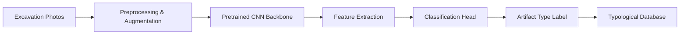
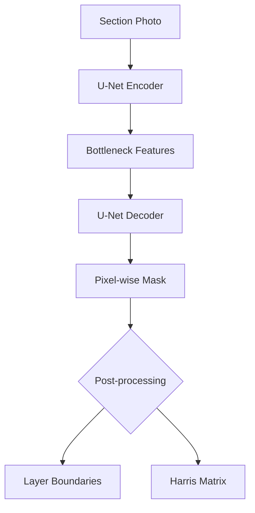

## Overview

Computer vision has transformed how archaeologists document, classify, and analyze material culture. Rather than relying solely on expert visual assessment, machine learning models can process thousands of excavation photographs, automatically detect artifacts in situ, segment stratigraphic layers, reconstruct 3D models from 2D images, and classify objects by style and period. This lesson covers the core CV techniques used in archaeological artifact analysis and provides hands-on code for building a CNN-based artifact classifier.

## Key Concepts

- **Object Detection in Excavation Photos**: Models like YOLO and Faster R-CNN can be trained to locate artifacts (pottery sherds, lithics, bone fragments) within complex excavation photographs, dramatically accelerating field documentation.
- **Semantic Segmentation of Site Stratigraphy**: U-Net and DeepLab architectures segment excavation profiles into distinct soil layers. Each pixel is assigned a stratigraphic label, enabling automated Harris matrix generation and reducing subjective interpretation.
- **3D Reconstruction via Photogrammetry + ML**: Structure-from-Motion (SfM) pipelines combined with neural radiance fields (NeRF) or multi-view stereo networks create detailed 3D meshes from overlapping photographs. These digital twins preserve spatial relationships that physical handling can destroy.
- **Automated Style Classification**: Convolutional neural networks learn decorative motifs, vessel shapes, and surface treatments to assign typological categories. Transfer learning from ImageNet provides strong feature extractors even with small archaeological datasets.
- **Data Augmentation for Small Collections**: Archaeological datasets are inherently limited. Rotation, scaling, color jitter, and synthetic generation (via GANs) expand training sets while preserving archaeologically meaningful variation.

## Code Examples

Below is a CNN-based artifact classifier using PyTorch. The model distinguishes pottery types from photograph crops.

```python
import torch
import torch.nn as nn
import torchvision.transforms as transforms
from torchvision import models
from torch.utils.data import DataLoader, Dataset
from PIL import Image
import os

class ArtifactDataset(Dataset):
    """Dataset of cropped artifact images with typological labels."""
    def __init__(self, root_dir, transform=None):
        self.samples = []
        self.transform = transform
        for label_idx, label_name in enumerate(sorted(os.listdir(root_dir))):
            label_dir = os.path.join(root_dir, label_name)
            if os.path.isdir(label_dir):
                for fname in os.listdir(label_dir):
                    if fname.lower().endswith(('.jpg', '.png')):
                        self.samples.append((os.path.join(label_dir, fname), label_idx))

    def __len__(self):
        return len(self.samples)

    def __getitem__(self, idx):
        path, label = self.samples[idx]
        image = Image.open(path).convert('RGB')
        if self.transform:
            image = self.transform(image)
        return image, label

# Data augmentation pipeline
train_transform = transforms.Compose([
    transforms.Resize((224, 224)),
    transforms.RandomHorizontalFlip(),
    transforms.RandomRotation(30),
    transforms.ColorJitter(brightness=0.2, contrast=0.2),
    transforms.ToTensor(),
    transforms.Normalize([0.485, 0.456, 0.406],
                         [0.229, 0.224, 0.225])
])

# Build classifier with transfer learning
def build_artifact_classifier(num_classes, pretrained=True):
    model = models.resnet18(pretrained=pretrained)
    # Freeze early layers, fine-tune later ones
    for param in list(model.parameters())[:-20]:
        param.requires_grad = False
    model.fc = nn.Sequential(
        nn.Dropout(0.3),
        nn.Linear(model.fc.in_features, 128),
        nn.ReLU(),
        nn.Linear(128, num_classes)
    )
    return model

# Training loop
def train_model(model, dataloader, epochs=15, lr=1e-4):
    criterion = nn.CrossEntropyLoss()
    optimizer = torch.optim.Adam(
        filter(lambda p: p.requires_grad, model.parameters()), lr=lr
    )
    for epoch in range(epochs):
        running_loss = 0.0
        correct = 0
        total = 0
        for images, labels in dataloader:
            optimizer.zero_grad()
            outputs = model(images)
            loss = criterion(outputs, labels)
            loss.backward()
            optimizer.step()
            running_loss += loss.item()
            _, predicted = outputs.max(1)
            correct += predicted.eq(labels).sum().item()
            total += labels.size(0)
        acc = 100.0 * correct / total
        print(f"Epoch {epoch+1}/{epochs} - Loss: {running_loss:.4f} - Acc: {acc:.1f}%")

# Example usage
# dataset = ArtifactDataset("data/artifacts/", transform=train_transform)
# loader = DataLoader(dataset, batch_size=16, shuffle=True)
# model = build_artifact_classifier(num_classes=5)
# train_model(model, loader)
```

## Math/Formulas

The cross-entropy loss used to train the classifier is:

$$\mathcal{L} = -\sum_{i=1}^{N} \sum_{c=1}^{C} y_{i,c} \log(\hat{y}_{i,c})$$

where $N$ is the number of samples, $C$ is the number of artifact classes, $y_{i,c}$ is the true label (one-hot), and $\hat{y}_{i,c}$ is the predicted probability.

For intersection-over-union (IoU) in stratigraphic segmentation:

$$\text{IoU} = \frac{|A \cap B|}{|A \cup B|} = \frac{TP}{TP + FP + FN}$$

In photogrammetric 3D reconstruction, the reprojection error measures alignment quality:

$$e = \sum_{i} \left\| \mathbf{x}_i - \pi(K [R | \mathbf{t}] \mathbf{X}_i) \right\|^2$$

where $\mathbf{x}_i$ is the observed 2D point, $\mathbf{X}_i$ is the 3D point, $K$ is the camera intrinsic matrix, and $\pi$ denotes perspective projection.

## Diagrams

**Artifact Classification Pipeline**



**Stratigraphic Segmentation Workflow**



## Exercises

1. **Starter**: Download a small pottery image dataset and train the ResNet-18 classifier above. Report your accuracy after 15 epochs. What happens if you unfreeze all layers?
2. **Intermediate**: Modify the code to use a U-Net for semantic segmentation of a stratigraphic profile image. Use at least three layer classes (topsoil, fill, natural).
3. **Advanced**: Implement a photogrammetry-assisted pipeline: use OpenCV feature matching (SIFT/ORB) to align multiple artifact views, then feed the correspondences into a 3D point cloud reconstruction. Visualize the result with Open3D.
4. **Research**: Compare the classification accuracy of ResNet-18, EfficientNet-B0, and a Vision Transformer (ViT-Small) on the same artifact dataset. Which architecture performs best with fewer than 500 training images?

## Further Reading

- Pawlowicz, L. & Downum, C. (2021). "Applications of deep learning to decorated ceramic typology." *Journal of Archaeological Method and Theory*, 28, 1007-1044.
- Caspari, G. & Crespo, P. (2019). "Convolutional neural networks for archaeological site detection." *Journal of Archaeological Science*, 104, 59-68.
- Anichini, F. et al. (2020). "Artificial intelligence and archaeology: Classifying ceramics with deep learning." *PLOS ONE*.
- OpenCV documentation on feature matching and SfM: https://docs.opencv.org/
