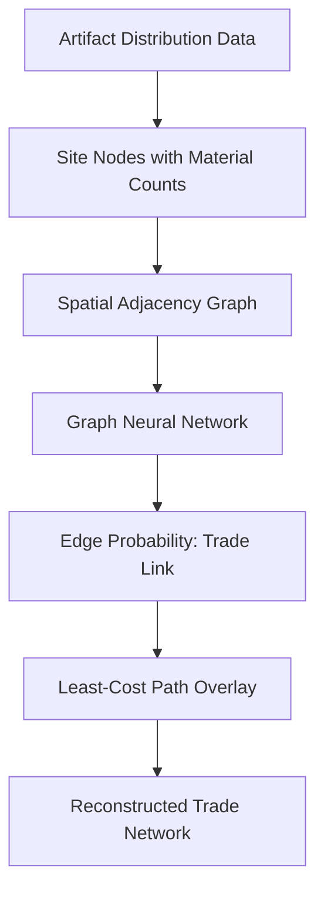

## Overview

Archaeology is inherently spatial. Where artifacts are found matters as much as what they are. Geographic Information Systems (GIS) have long been a staple of archaeological fieldwork, but the integration of machine learning takes spatial analysis from descriptive mapping to predictive modeling. This lesson explores how gradient boosting, graph neural networks, and deep learning on remote sensing data enable archaeologists to predict undiscovered site locations, reconstruct ancient trade networks, and detect buried structures from orbit.

## Key Concepts

- **Site Location Prediction**: Predictive models use environmental covariates (elevation, slope, distance to water, soil type, land cover) to estimate the probability of archaeological site presence across a landscape. Gradient boosting (XGBoost, LightGBM) handles tabular geospatial features effectively, while Graph Neural Networks (GNNs) can model spatial dependencies between known sites.
- **Terrain Analysis for Settlement Selection**: Ancient peoples chose settlement locations based on defensibility, resource access, and connectivity. Digital Elevation Models (DEMs) provide slope, aspect, viewshed, and cost-surface data that ML models consume as predictive features.
- **Trade Route Reconstruction**: The distribution of traded materials (obsidian, ceramics, metals) across sites reveals exchange networks. Least-cost path analysis combined with network models identifies probable routes, and GNNs learn relational patterns in artifact distribution graphs.
- **Remote Sensing and Site Detection**: Satellite imagery (multispectral, SAR, LiDAR) reveals crop marks, soil anomalies, and micro-topographic features invisible at ground level. CNNs trained on labeled satellite tiles automate the detection of archaeological features across vast regions.
- **Spatial Autocorrelation**: Archaeological data is spatially correlated (Tobler's First Law). Models must account for this via spatial cross-validation, spatial lag features, or explicit spatial encodings to avoid inflated accuracy from spatial leakage.

## Code Examples

Below is a site location prediction model using XGBoost with geospatial features.

```python
import numpy as np
import pandas as pd
from xgboost import XGBClassifier
from sklearn.model_selection import GroupKFold
from sklearn.metrics import roc_auc_score, classification_report
import geopandas as gpd
from shapely.geometry import Point

# Load site data with environmental covariates
def prepare_spatial_data(sites_path, background_path):
    """
    sites_path: CSV with columns [lon, lat, elevation, slope,
                dist_water, soil_type, aspect, land_cover]
    background_path: CSV of random non-site locations with same features
    """
    sites = pd.read_csv(sites_path)
    sites['label'] = 1
    background = pd.read_csv(background_path)
    background['label'] = 0
    data = pd.concat([sites, background], ignore_index=True)
    return data

# Spatial cross-validation to avoid leakage
def spatial_cv_split(data, n_splits=5, grid_size=0.5):
    """Assign spatial blocks to avoid train/test spatial overlap."""
    data['block_x'] = (data['lon'] // grid_size).astype(int)
    data['block_y'] = (data['lat'] // grid_size).astype(int)
    data['block_id'] = data['block_x'] * 10000 + data['block_y']
    return data

def train_site_predictor(data):
    features = ['elevation', 'slope', 'dist_water',
                'soil_type', 'aspect', 'land_cover']
    X = data[features].values
    y = data['label'].values
    groups = data['block_id'].values

    model = XGBClassifier(
        n_estimators=200,
        max_depth=6,
        learning_rate=0.05,
        subsample=0.8,
        colsample_bytree=0.8,
        use_label_encoder=False,
        eval_metric='logloss'
    )

    # Spatial grouped cross-validation
    gkf = GroupKFold(n_splits=5)
    auc_scores = []
    for train_idx, test_idx in gkf.split(X, y, groups):
        model.fit(X[train_idx], y[train_idx])
        y_pred = model.predict_proba(X[test_idx])[:, 1]
        auc = roc_auc_score(y[test_idx], y_pred)
        auc_scores.append(auc)
        print(f"Fold AUC: {auc:.4f}")

    print(f"Mean AUC: {np.mean(auc_scores):.4f} +/- {np.std(auc_scores):.4f}")

    # Train final model on all data
    model.fit(X, y)
    # Feature importance
    importance = dict(zip(features, model.feature_importances_))
    print("Feature importance:", sorted(importance.items(),
                                        key=lambda x: -x[1]))
    return model

def predict_landscape(model, dem_features_path):
    """Generate probability surface across landscape grid."""
    grid = pd.read_csv(dem_features_path)
    features = ['elevation', 'slope', 'dist_water',
                'soil_type', 'aspect', 'land_cover']
    grid['site_probability'] = model.predict_proba(
        grid[features].values
    )[:, 1]
    return grid[['lon', 'lat', 'site_probability']]

# Example usage
# data = prepare_spatial_data("known_sites.csv", "background_points.csv")
# data = spatial_cv_split(data)
# model = train_site_predictor(data)
# prob_surface = predict_landscape(model, "landscape_grid.csv")
```

## Math/Formulas

The site prediction probability from gradient boosting is an ensemble of weak learners:

$$\hat{y}_i = \sigma\left(\sum_{k=1}^{K} f_k(\mathbf{x}_i)\right)$$

where $f_k$ is the $k$-th decision tree, $\sigma$ is the sigmoid function, and $\mathbf{x}_i$ is the feature vector for location $i$.

Least-cost path analysis computes the optimal route between two points on a cost surface:

$$C(A \to B) = \min_{\gamma} \int_{\gamma} c(\mathbf{r}) \, ds$$

where $c(\mathbf{r})$ is the traversal cost at position $\mathbf{r}$ (derived from slope, terrain roughness, and land cover), and the integral runs along the path $\gamma$.

Moran's I measures spatial autocorrelation in the data:

$$I = \frac{N}{\sum_{i}\sum_{j} w_{ij}} \cdot \frac{\sum_{i}\sum_{j} w_{ij}(x_i - \bar{x})(x_j - \bar{x})}{\sum_{i}(x_i - \bar{x})^2}$$

where $w_{ij}$ is the spatial weight between locations $i$ and $j$, and $N$ is the total number of observations.

## Diagrams

**Site Prediction Pipeline**


**Trade Route Reconstruction with GNN**



## Exercises

1. **Starter**: Using a DEM raster and a set of known site coordinates, extract elevation, slope, and distance-to-water features for each site. Compare the distributions against random background points.
2. **Intermediate**: Implement the XGBoost site predictor above using real or synthetic data. Generate a probability heatmap and identify the top 10 highest-probability unsurveyed grid cells.
3. **Advanced**: Build a GNN (using PyTorch Geometric) where nodes represent known archaeological sites and edges connect sites within 50 km. Use node features (artifact types, site size) to predict whether a pair of sites shared a trade connection.
4. **Research**: Compare standard random cross-validation against spatial block cross-validation on the same dataset. Quantify the optimistic bias introduced by ignoring spatial autocorrelation.

## Further Reading

- Yaworsky, P. et al. (2020). "A comparison of machine learning algorithms for archaeological predictive modeling." *Journal of Computer Applications in Archaeology*, 3(1), 60-75.
- Orengo, H. & Garcia-Molsosa, A. (2019). "A brave new world for archaeological survey: Automated machine learning-based potsherd detection using high-resolution drone imagery." *Journal of Archaeological Science*, 112.
- Parcak, S. (2009). *Satellite Remote Sensing for Archaeology*. Routledge.
- Tobler, W. (1970). "A computer movie simulating urban growth in the Detroit region." *Economic Geography*, 46, 234-240.
