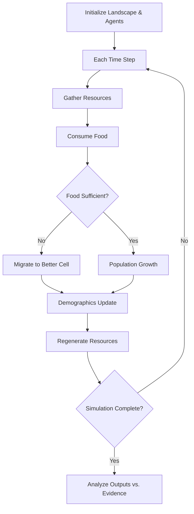
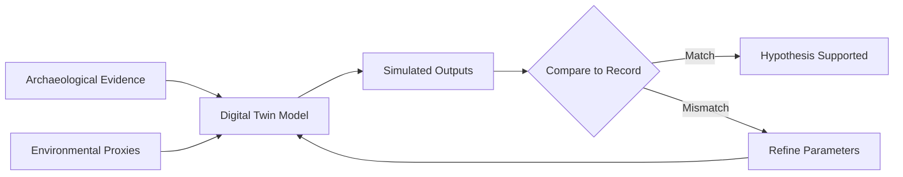

# Overview

Historical and archaeological evidence is fragmentary. We rarely observe past societies directly -- we infer their dynamics from scattered remains. Computational simulations bridge this gap by creating virtual laboratories where hypotheses about past human behavior can be tested against the material record. Agent-based models (ABMs) simulate individual decision-makers interacting within environments, producing emergent social phenomena like settlement hierarchies, migration waves, and resource depletion. Digital twins reconstruct ancient cities and landscapes in detailed 3D, integrating archaeological data with environmental models. This lesson covers the principles of historical simulation, demonstrates a settlement dynamics ABM, and discusses validation strategies.

## Key Concepts

- **Agent-Based Modeling (ABM)**: Autonomous agents follow simple behavioral rules (forage, migrate, reproduce, trade) within a spatial environment. Complex macro-level patterns -- urban growth, state collapse, demographic transitions -- emerge from micro-level interactions without being explicitly programmed.
- **Digital Twin Reconstructions**: Detailed virtual replicas of ancient cities and landscapes integrate excavation data, architectural evidence, environmental proxies, and GIS layers. These digital twins allow researchers to test "what if" scenarios: What if the river shifted? What if population doubled?
- **Validation Against Evidence**: Simulations are only useful when their outputs can be compared to empirical data. Key validation metrics include settlement size distributions, artifact density patterns, demographic growth curves, and spatial organization matching the archaeological record.
- **Emergence from Simple Rules**: A hallmark of ABMs is that complex, realistic patterns arise from agents following straightforward decision rules. Hierarchical settlement systems can emerge purely from local resource competition and movement costs.
- **Parameter Sensitivity Analysis**: Systematic variation of model parameters reveals which factors most strongly influence outcomes, guiding archaeological interpretation toward the variables that matter most.

## Code Examples

A simple agent-based model of settlement dynamics where households choose locations based on resource availability and social proximity.

```python
import numpy as np
import matplotlib.pyplot as plt
from dataclasses import dataclass, field
from typing import List

@dataclass
class Household:
    x: float
    y: float
    population: int = 5
    stored_food: float = 50.0

    def fitness(self):
        return self.stored_food * self.population

class SettlementABM:
    """Agent-based model of settlement formation and abandonment."""

    def __init__(self, grid_size=50, n_households=100,
                 resource_regen=0.1, consumption_rate=2.0):
        self.grid_size = grid_size
        self.resource_regen = resource_regen
        self.consumption_rate = consumption_rate

        # Resource landscape (higher near rivers/fertile zones)
        self.resources = self._init_resources()
        self.max_resources = self.resources.copy()

        # Initialize households at random locations
        self.households: List[Household] = []
        for _ in range(n_households):
            x = np.random.randint(0, grid_size)
            y = np.random.randint(0, grid_size)
            self.households.append(Household(x=x, y=y))

        self.history = []

    def _init_resources(self):
        """Create a resource landscape with fertile river valley."""
        grid = np.random.uniform(5, 15, (self.grid_size, self.grid_size))
        # River valley along center with high fertility
        center = self.grid_size // 2
        for i in range(self.grid_size):
            for j in range(self.grid_size):
                dist_to_river = abs(j - center)
                grid[i, j] += max(0, 20 - dist_to_river * 2)
        return grid

    def _gather(self, hh: Household):
        """Household gathers resources from local cell."""
        x, y = int(hh.x), int(hh.y)
        available = self.resources[x, y]
        gathered = min(available, self.consumption_rate * hh.population)
        self.resources[x, y] -= gathered
        hh.stored_food += gathered

    def _consume(self, hh: Household):
        """Household consumes food to sustain population."""
        needed = self.consumption_rate * hh.population
        hh.stored_food -= needed

    def _migrate(self, hh: Household):
        """If resources are scarce, move toward better areas."""
        if hh.stored_food < self.consumption_rate * hh.population * 2:
            best_x, best_y = int(hh.x), int(hh.y)
            best_res = 0
            for dx in range(-3, 4):
                for dy in range(-3, 4):
                    nx = int(hh.x + dx) % self.grid_size
                    ny = int(hh.y + dy) % self.grid_size
                    if self.resources[nx, ny] > best_res:
                        best_res = self.resources[nx, ny]
                        best_x, best_y = nx, ny
            hh.x, hh.y = best_x, best_y

    def _demographics(self, hh: Household):
        """Population growth or decline based on food stores."""
        if hh.stored_food > 100 and hh.population < 20:
            hh.population += 1  # Growth
        elif hh.stored_food < 0:
            hh.population -= 1  # Starvation
            hh.stored_food = 0

    def _regenerate_resources(self):
        """Resources regrow toward carrying capacity."""
        self.resources += self.resource_regen * (
            self.max_resources - self.resources
        )
        self.resources = np.clip(self.resources, 0, self.max_resources)

    def step(self):
        """Execute one time step of the simulation."""
        for hh in self.households:
            self._gather(hh)
            self._consume(hh)
            self._migrate(hh)
            self._demographics(hh)

        # Remove extinct households
        self.households = [h for h in self.households if h.population > 0]
        self._regenerate_resources()

        # Record state
        self.history.append({
            'n_households': len(self.households),
            'total_pop': sum(h.population for h in self.households),
            'mean_food': np.mean([h.stored_food for h in self.households])
                         if self.households else 0
        })

    def run(self, steps=200):
        for t in range(steps):
            self.step()
            if t % 50 == 0:
                print(f"Step {t}: {len(self.households)} households, "
                      f"pop={self.history[-1]['total_pop']}")

    def plot_settlement_map(self):
        fig, ax = plt.subplots(1, 1, figsize=(8, 8))
        ax.imshow(self.resources, cmap='YlGn', origin='lower')
        if self.households:
            xs = [h.x for h in self.households]
            ys = [h.y for h in self.households]
            sizes = [h.population * 5 for h in self.households]
            ax.scatter(ys, xs, s=sizes, c='red', alpha=0.6)
        ax.set_title("Settlement Distribution on Resource Landscape")
        plt.show()

# Run simulation
# abm = SettlementABM(grid_size=50, n_households=100)
# abm.run(steps=200)
# abm.plot_settlement_map()
```

## Math/Formulas

Resource regeneration follows logistic regrowth:

$$R_{t+1} = R_t + r \cdot R_t \left(1 - \frac{R_t}{K}\right)$$

where $R_t$ is the current resource level, $r$ is the regeneration rate, and $K$ is the carrying capacity.

The probability of household migration is modeled as:

$$P(\text{migrate}) = \sigma\left(\beta_0 + \beta_1 \cdot \frac{F_{\text{needed}} - F_{\text{stored}}}{F_{\text{needed}}}\right)$$

where $\sigma$ is the sigmoid function, $F_{\text{stored}}$ is stored food, and $F_{\text{needed}}$ is the consumption requirement.

Settlement rank-size distributions in both simulated and real data often follow Zipf's law:

$$P_r = \frac{P_1}{r^q}$$

where $P_r$ is the population of the $r$-th ranked settlement, $P_1$ is the largest settlement's population, and $q \approx 1$ for primate distributions.

## Diagrams

**Agent-Based Model Architecture**



**Digital Twin Validation Workflow**



## Exercises

1. **Starter**: Run the settlement ABM with default parameters for 200 steps. Plot the total population over time. Does it stabilize, oscillate, or crash?
2. **Intermediate**: Add a "trade" mechanism where neighboring households can exchange food. Does trade stabilize population or accelerate resource depletion?
3. **Advanced**: Implement parameter sensitivity analysis by varying `resource_regen` from 0.01 to 0.5 and `consumption_rate` from 1.0 to 4.0. Create a heatmap of final population for each parameter combination.
4. **Research**: Compare the rank-size distribution of your simulated settlements to a known archaeological dataset (e.g., Roman Britain or Mesopotamian city sizes). Does the ABM produce realistic settlement hierarchies?

## Further Reading

- Wurzer, G., Kowarik, K., & Reschreiter, H. (eds.) (2015). *Agent-based Modeling and Simulation in Archaeology*. Springer.
- Kohler, T. & van der Leeuw, S. (eds.) (2007). *The Model-Based Archaeology of Socionatural Systems*. SAR Press.
- Wilensky, U. & Rand, W. (2015). *An Introduction to Agent-Based Modeling*. MIT Press.
- Depaermentier, M. et al. (2021). "Digital twins for cultural heritage." *Digital Applications in Archaeology and Cultural Heritage*, 21.
