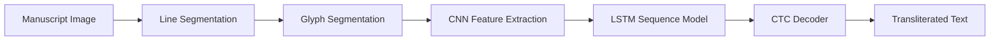
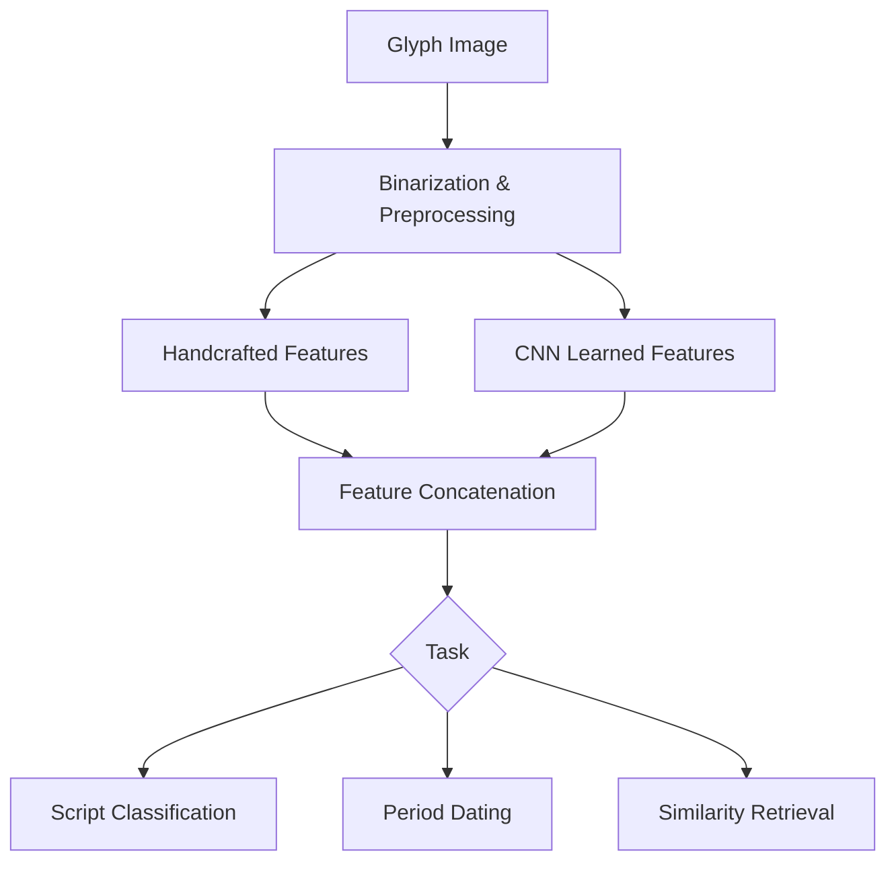

## Overview

Paleography -- the study of historical handwriting and scripts -- is one of the most specialized skills in the humanities. Reading a cuneiform tablet, deciphering a medieval manuscript, or identifying the hand of a particular scribe requires years of training. Machine learning now augments this expertise by automating script recognition, classifying writing styles across periods, extracting features for dating, and even enabling translation of low-resource historical languages. This lesson explores how convolutional and recurrent neural networks handle ancient writing systems, how generative models synthesize historical handwriting, and how modern NLP pipelines adapt to languages with minimal training data.

## Key Concepts

- **Ancient Script Recognition**: Unlike modern OCR, recognizing scripts like cuneiform, Mayan glyphs, Linear B, or medieval Latin requires models trained on highly variable, damaged, and domain-specific character sets. CNN-based architectures extract local stroke patterns while attention mechanisms capture context between adjacent signs.
- **Handwriting Synthesis for Period Reconstruction**: Generative adversarial networks (GANs) and variational autoencoders (VAEs) can learn the style distribution of a scribal tradition and generate new text in that style. This aids in reconstructing damaged portions of manuscripts and in training data augmentation.
- **Automated Translation for Low-Resource Languages**: Historical languages like Akkadian, Sumerian, or Old Church Slavonic have limited parallel corpora. Transfer learning from related modern languages, combined with techniques like back-translation and multilingual embeddings, enables workable translation systems despite scarce data.
- **Script Classification and Dating**: The evolution of letter forms over time provides a chronological signal. ML models trained on dated manuscripts learn to predict the approximate period of undated texts from stroke morphology, letter spacing, and abbreviation patterns.
- **Feature Extraction from Glyphs**: Handcrafted features (stroke width, curvature histograms, aspect ratios) combined with learned CNN features create robust representations for both classification and retrieval tasks across fragmentary texts.

## Code Examples

A script feature extraction and classification system using a CNN on glyph images.

```python
import torch
import torch.nn as nn
import torch.nn.functional as F
from torchvision import transforms
from torch.utils.data import DataLoader, Dataset
from PIL import Image
import numpy as np
import os

class GlyphDataset(Dataset):
    """Dataset of individual glyph images organized by script class."""
    def __init__(self, root_dir, transform=None):
        self.samples = []
        self.classes = sorted(os.listdir(root_dir))
        self.class_to_idx = {c: i for i, c in enumerate(self.classes)}
        self.transform = transform
        for cls in self.classes:
            cls_dir = os.path.join(root_dir, cls)
            if not os.path.isdir(cls_dir):
                continue
            for fname in os.listdir(cls_dir):
                if fname.lower().endswith(('.png', '.jpg', '.tif')):
                    self.samples.append(
                        (os.path.join(cls_dir, fname), self.class_to_idx[cls])
                    )

    def __len__(self):
        return len(self.samples)

    def __getitem__(self, idx):
        path, label = self.samples[idx]
        img = Image.open(path).convert('L')  # Grayscale
        if self.transform:
            img = self.transform(img)
        return img, label

class ScriptFeatureNet(nn.Module):
    """CNN for glyph feature extraction and script classification."""
    def __init__(self, num_classes=10):
        super().__init__()
        # Feature extraction layers
        self.features = nn.Sequential(
            nn.Conv2d(1, 32, 3, padding=1),
            nn.BatchNorm2d(32),
            nn.ReLU(),
            nn.MaxPool2d(2),
            nn.Conv2d(32, 64, 3, padding=1),
            nn.BatchNorm2d(64),
            nn.ReLU(),
            nn.MaxPool2d(2),
            nn.Conv2d(64, 128, 3, padding=1),
            nn.BatchNorm2d(128),
            nn.ReLU(),
            nn.AdaptiveAvgPool2d((4, 4))
        )
        # Classification head
        self.classifier = nn.Sequential(
            nn.Linear(128 * 4 * 4, 256),
            nn.ReLU(),
            nn.Dropout(0.4),
            nn.Linear(256, num_classes)
        )

    def extract_features(self, x):
        """Return the feature vector before classification."""
        x = self.features(x)
        return x.view(x.size(0), -1)

    def forward(self, x):
        feat = self.extract_features(x)
        return self.classifier(feat)

def compute_stroke_features(binary_image: np.ndarray) -> dict:
    """
    Extract handcrafted paleographic features from a binarized
    glyph image (numpy array, 0=background, 255=ink).
    """
    ink_pixels = np.where(binary_image > 127)
    if len(ink_pixels[0]) == 0:
        return {'stroke_width': 0, 'aspect_ratio': 0,
                'ink_density': 0, 'centroid': (0, 0)}

    rows, cols = ink_pixels
    height = rows.max() - rows.min() + 1
    width = cols.max() - cols.min() + 1
    aspect_ratio = width / max(height, 1)

    # Ink density: fraction of bounding box filled
    bbox_area = height * width
    ink_density = len(rows) / max(bbox_area, 1)

    # Approximate stroke width via distance transform
    from scipy.ndimage import distance_transform_edt
    dt = distance_transform_edt(binary_image > 127)
    stroke_width = dt[binary_image > 127].mean() * 2

    centroid = (rows.mean(), cols.mean())

    return {
        'stroke_width': float(stroke_width),
        'aspect_ratio': float(aspect_ratio),
        'ink_density': float(ink_density),
        'centroid': centroid,
        'height': int(height),
        'width': int(width)
    }

# Training pipeline
def train_script_classifier(data_dir, num_classes, epochs=20):
    transform = transforms.Compose([
        transforms.Resize((64, 64)),
        transforms.RandomAffine(degrees=10, translate=(0.1, 0.1)),
        transforms.ToTensor(),
    ])

    dataset = GlyphDataset(data_dir, transform=transform)
    loader = DataLoader(dataset, batch_size=32, shuffle=True)

    model = ScriptFeatureNet(num_classes=num_classes)
    optimizer = torch.optim.Adam(model.parameters(), lr=1e-3)
    criterion = nn.CrossEntropyLoss()

    for epoch in range(epochs):
        total_loss = 0
        correct = 0
        total = 0
        for images, labels in loader:
            optimizer.zero_grad()
            outputs = model(images)
            loss = criterion(outputs, labels)
            loss.backward()
            optimizer.step()
            total_loss += loss.item()
            _, predicted = outputs.max(1)
            correct += predicted.eq(labels).sum().item()
            total += labels.size(0)
        print(f"Epoch {epoch+1}/{epochs} - "
              f"Loss: {total_loss:.4f} - Acc: {100*correct/total:.1f}%")
    return model

# Example usage
# model = train_script_classifier("data/glyphs/", num_classes=6, epochs=20)
```

## Math/Formulas

For script dating, the model predicts a temporal probability distribution over time periods. Using ordinal regression with cumulative link:

$$P(Y \leq k | \mathbf{x}) = \sigma(\theta_k - \mathbf{w}^\top \mathbf{x})$$

where $\theta_k$ are ordered thresholds for period $k$, $\mathbf{w}$ is the learned weight vector, and $\mathbf{x}$ is the feature vector extracted from the glyph.

The CTC (Connectionist Temporal Classification) loss used in sequence recognition of text lines is:

$$\mathcal{L}_{\text{CTC}} = -\ln \sum_{\pi \in \mathcal{B}^{-1}(\mathbf{y})} \prod_{t=1}^{T} p(\pi_t | \mathbf{x})$$

where $\mathcal{B}^{-1}(\mathbf{y})$ is the set of all valid alignments that collapse to target sequence $\mathbf{y}$, and $T$ is the sequence length.

Cosine similarity for glyph retrieval measures how close two feature vectors are:

$$\text{sim}(\mathbf{a}, \mathbf{b}) = \frac{\mathbf{a} \cdot \mathbf{b}}{\|\mathbf{a}\| \, \|\mathbf{b}\|}$$

This enables "find similar glyphs" queries across large corpora of digitized tablets or manuscripts.

## Diagrams

**Script Recognition Pipeline**



**Script Dating and Classification System**



## Exercises

1. **Starter**: Download a sample of the Habbakuk Dead Sea Scroll dataset (or MNIST as a stand-in). Train the ScriptFeatureNet on character images and report test accuracy. Visualize the learned feature embeddings with t-SNE.
2. **Intermediate**: Implement the `compute_stroke_features` function on a set of glyph images and train a Random Forest classifier using only handcrafted features. Compare accuracy against the CNN approach.
3. **Advanced**: Build an end-to-end text line recognition system using a CNN encoder followed by a bidirectional LSTM with CTC loss. Test on a medieval manuscript dataset (e.g., IAM Historical Document Database).
4. **Research**: Investigate transfer learning for low-resource script recognition. Pre-train a model on a large modern handwriting dataset (e.g., IAM), then fine-tune on a small collection of cuneiform sign images. How does pre-training affect accuracy with only 50 examples per class?

## Further Reading

- Bogacz, B. & Mara, H. (2022). "Digital paleography of cuneiform: Advances and challenges." *Annual Review of Linguistics*, 8, 349-370.
- Assael, Y. et al. (2022). "Restoring and attributing ancient texts using deep neural networks." *Nature*, 603, 280-283.
- Kestemont, M. et al. (2022). "Artificial paleography: Computational approaches to identifying script types in medieval manuscripts." *Speculum*, 97(1), 86-127.
- Fetaya, E. et al. (2020). "Restoration of fragmentary Babylonian texts using recurrent neural networks." *PNAS*, 117(37), 22743-22751.
