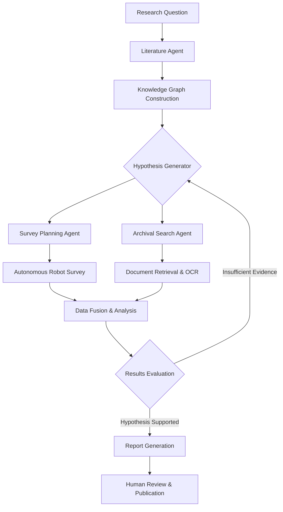
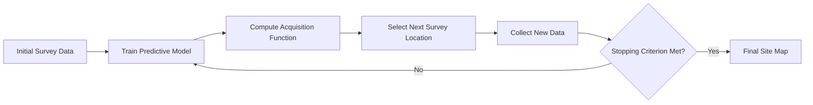

## Overview

Archaeology and historical research have traditionally relied on painstaking manual labor: survey teams walking transects, scholars spending months in archives, and researchers manually synthesizing hundreds of papers. A new paradigm is emerging where AI systems operate as autonomous research agents -- planning surveys, generating hypotheses, synthesizing literature, and even proposing excavation strategies with minimal human oversight.

This lesson examines the frontier of **autonomous archaeology** and **AI-native research** -- approaches where AI is not merely a tool applied after the fact, but an integral participant in the research pipeline from start to finish. We cover autonomous survey robots equipped with onboard ML, systems that generate and test historical hypotheses, literature synthesis engines, and agentic workflows that chain multiple AI capabilities together for archival research.

## Key Concepts

- **Autonomous Survey Robots**: Ground and aerial robots equipped with LiDAR, GPR, and multispectral sensors that use reinforcement learning to adaptively plan survey paths, prioritizing areas with high archaeological potential.
- **ML-Driven Hypothesis Generation**: Systems that analyze existing datasets (artifact distributions, environmental proxies, textual sources) to propose novel hypotheses about settlement patterns, trade routes, or cultural practices.
- **Literature Synthesis**: NLP pipelines that ingest thousands of archaeological reports and journal articles, extracting entities, relationships, and claims to build structured knowledge graphs.
- **Agentic Workflows**: Multi-step AI systems where a language model acts as an orchestrator -- calling tools, querying databases, running analyses, and iterating on results in a loop until a research question is addressed.
- **Active Learning for Fieldwork**: Strategies where an AI model identifies which new samples or excavation units would most reduce uncertainty, guiding field decisions in real time.

## Code Examples

The following pipeline demonstrates automated literature analysis: ingesting a corpus of archaeological abstracts, extracting key entities and relationships, and clustering the results to identify research themes.

```python
import numpy as np
from sklearn.feature_extraction.text import TfidfVectorizer
from sklearn.cluster import KMeans
from sklearn.decomposition import LatentDirichletAllocation
from collections import defaultdict
import re

# --- Step 1: Simulated corpus of archaeological abstracts ---
abstracts = [
    "LiDAR survey revealed previously unknown Maya settlement structures in Belize.",
    "Radiocarbon dating of carbonized seeds indicates Early Bronze Age occupation.",
    "Ground-penetrating radar identified subsurface anomalies consistent with Roman villa foundations.",
    "Isotope analysis of skeletal remains suggests long-distance migration patterns.",
    "Machine learning classification of ceramic sherds achieved 94% accuracy on typology.",
    "Remote sensing with multispectral imagery detected ancient irrigation channels in Peru.",
    "Network analysis of obsidian trade routes reveals hub-and-spoke distribution model.",
    "Sediment core pollen analysis indicates anthropogenic landscape modification circa 3000 BCE.",
    "Deep learning applied to cuneiform tablet fragments enabled automated sign recognition.",
    "Agent-based modeling of population dynamics reproduces observed settlement hierarchies.",
]

# --- Step 2: TF-IDF vectorization ---
vectorizer = TfidfVectorizer(stop_words="english", max_features=200)
tfidf_matrix = vectorizer.fit_transform(abstracts)

# --- Step 3: Topic modeling with LDA ---
n_topics = 3
lda = LatentDirichletAllocation(n_components=n_topics, random_state=42)
topic_distributions = lda.fit_transform(tfidf_matrix)

feature_names = vectorizer.get_feature_names_out()
for topic_idx, topic in enumerate(lda.components_):
    top_words = [feature_names[i] for i in topic.argsort()[:-6:-1]]
    print(f"Topic {topic_idx}: {', '.join(top_words)}")

# --- Step 4: Cluster abstracts by theme ---
kmeans = KMeans(n_clusters=3, random_state=42, n_init=10)
clusters = kmeans.fit_predict(tfidf_matrix)

for cluster_id in range(3):
    print(f"\n--- Cluster {cluster_id} ---")
    for i, label in enumerate(clusters):
        if label == cluster_id:
            print(f"  [{i}] {abstracts[i][:80]}...")

# --- Step 5: Simple entity extraction (regex-based) ---
date_pattern = r"\b\d{4}\s*(?:BCE|CE|BC|AD)\b"
location_pattern = r"\b(?:Belize|Peru|Rome|Roman|Maya|Egypt)\b"

entity_index = defaultdict(list)
for i, text in enumerate(abstracts):
    dates = re.findall(date_pattern, text)
    locations = re.findall(location_pattern, text, re.IGNORECASE)
    for d in dates:
        entity_index[("DATE", d)].append(i)
    for loc in locations:
        entity_index[("LOCATION", loc)].append(i)

print("\n--- Extracted Entities ---")
for (etype, value), doc_ids in entity_index.items():
    print(f"  {etype}: {value} -> docs {doc_ids}")
```

## Math / Formulas

**Active learning** in archaeological survey uses an acquisition function to decide where to sample next. A common choice is the **Expected Information Gain**:

$$\alpha(\mathbf{x}) = H[y \mid \mathcal{D}] - \mathbb{E}_{y \sim p(y|\mathbf{x}, \mathcal{D})} \left[ H[y \mid \mathcal{D} \cup \{(\mathbf{x}, y)\}] \right]$$

where $H[y \mid \mathcal{D}]$ is the entropy of the prediction given current data $\mathcal{D}$, and the expectation is taken over possible outcomes $y$ at candidate location $\mathbf{x}$.

For topic modeling, LDA assumes each document $d$ has a topic distribution $\theta_d \sim \text{Dir}(\alpha)$ and each topic $k$ has a word distribution $\phi_k \sim \text{Dir}(\beta)$. The probability of word $w$ in document $d$ is:

$$p(w \mid d) = \sum_{k=1}^{K} \theta_{d,k} \cdot \phi_{k,w}$$

The **TF-IDF** weight for term $t$ in document $d$ within corpus $D$ is:

$$\text{tf-idf}(t, d, D) = \text{tf}(t, d) \cdot \log \frac{|D|}{|\{d' \in D : t \in d'\}|}$$

## Diagrams

**Agentic Archaeology Research Workflow**



**Active Learning Loop for Field Survey**



## Exercises

1. **Literature Clustering**: Extend the code example to use a real dataset of abstracts (e.g., from the Journal of Archaeological Science via an API). Add named entity recognition using spaCy to extract site names, dates, and artifact types. Build a knowledge graph from the extracted entities.

2. **Active Learning Simulation**: Simulate a 2D archaeological landscape with buried features. Implement an active learning loop where a Gaussian Process model selects the next GPR survey point using Expected Information Gain. Compare the number of samples needed vs. random sampling to achieve 90% detection of features.

3. **Agentic Workflow Design**: Design (on paper or in pseudocode) an agentic workflow that takes a research question like "What were the trade connections between Mesopotamia and the Indus Valley?" and chains together: literature search, database queries, network analysis, and report generation. Identify where human-in-the-loop checkpoints should be placed.

4. **Autonomous Survey Path Planning**: Implement a simple reinforcement learning agent (Q-learning) that navigates a grid representing a survey area. The agent receives higher rewards for discovering artifact concentrations and must learn an efficient survey path.

## Further Reading

- Orengo, H. A., et al. (2020). "Automated detection of archaeological mounds using machine learning." *Journal of Archaeological Science*.
- Parcak, S. (2017). *Archaeology from Space: How the Future Shapes Our Past*. Henry Holt and Company.
- Chase, A. S. Z., et al. (2023). "LiDAR-based autonomous survey planning for archaeological landscapes." *Remote Sensing of Environment*.
- Wang, L., & Singh, A. (2022). "Active learning for geophysical survey optimization." *Computers & Geosciences*.
- Settles, B. (2012). *Active Learning*. Morgan & Claypool Synthesis Lectures on AI and ML.
