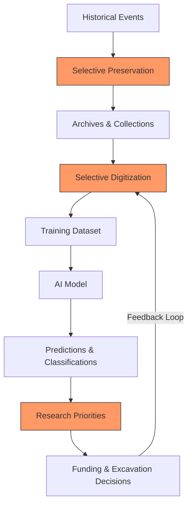
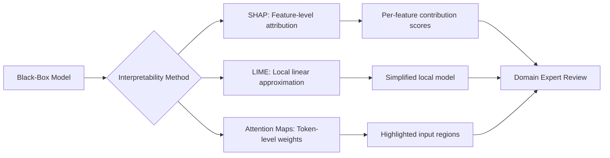

## Overview

As AI systems become increasingly embedded in historical and archaeological research, fundamental questions of **ethics**, **bias**, and **interpretability** demand serious attention. Unlike domains where ground truth is well-defined, historical interpretation is inherently contested -- shaped by perspective, power, and incomplete evidence. When an AI system classifies an artifact, dates a text, or synthesizes a historical narrative, it encodes assumptions from its training data that may reflect centuries of colonial scholarship, gender bias, or geographic imbalance.

This lesson explores how algorithmic bias manifests in historical AI, why Eurocentric training corpora distort results, how to think about AI as an interpretive tool rather than an oracle, and practical methods -- especially SHAP (SHapley Additive exPlanations) -- for making historical classifiers transparent and accountable to domain experts.

## Key Concepts

- **Algorithmic Bias in Historical Interpretation**: AI models trained on digitized archives inherit the biases of what was preserved, what was digitized, and how it was catalogued. Archives from colonial powers are vastly over-represented, while oral traditions and Indigenous knowledge systems are largely absent.
- **Eurocentric Training Data**: NLP models trained primarily on European-language corpora and Western historical frameworks may misclassify, ignore, or distort non-Western historical phenomena. A classifier trained on Roman pottery typologies will fail on ceramics from sub-Saharan Africa.
- **AI as Tool vs. Authority**: A critical distinction: AI should augment human historians, not replace their judgment. When an AI system produces a classification with 95% confidence, that number reflects statistical fit to training data, not historical truth.
- **Interpretable Models for Historiography**: Methods like SHAP, LIME, and attention visualization allow researchers to understand *why* a model made a particular classification, enabling domain experts to assess whether the reasoning aligns with historical knowledge.
- **Feedback Loops and Confirmation Bias**: If AI recommendations guide which sites get excavated or which archives get digitized, existing biases are reinforced -- well-studied regions get more data, becoming even more dominant in future models.

## Code Examples

The following example trains a simple historical document classifier and uses SHAP to explain its predictions, revealing which features drive the classification.

```python
import numpy as np
import pandas as pd
from sklearn.ensemble import GradientBoostingClassifier
from sklearn.model_selection import train_test_split
from sklearn.feature_extraction.text import TfidfVectorizer
import shap

# --- Step 1: Simulated historical document dataset ---
documents = [
    ("Treaty between France and Ottoman Empire regarding trade routes", "diplomatic"),
    ("Excavation report from Pompeii describing domestic pottery finds", "archaeological"),
    ("Royal decree establishing taxation of grain in medieval England", "administrative"),
    ("Field notes on burial mound excavation in Scandinavia", "archaeological"),
    ("Correspondence between colonial governors in British India", "diplomatic"),
    ("Census records from Ming Dynasty provincial administration", "administrative"),
    ("Survey of Aztec temple complex with artifact inventory", "archaeological"),
    ("Peace agreement following the Thirty Years War", "diplomatic"),
    ("Land registry documents from Ottoman Palestine", "administrative"),
    ("Stratigraphic analysis of Bronze Age settlement layers", "archaeological"),
    ("Trade agreement between Venetian Republic and Mamluk Sultanate", "diplomatic"),
    ("Tax collection records from Tokugawa-era Japan", "administrative"),
]

texts, labels = zip(*documents)

# --- Step 2: Feature extraction ---
vectorizer = TfidfVectorizer(stop_words="english", max_features=50)
X = vectorizer.fit_transform(texts)
feature_names = vectorizer.get_feature_names_out()

label_map = {"archaeological": 0, "diplomatic": 1, "administrative": 2}
y = np.array([label_map[l] for l in labels])

# --- Step 3: Train classifier ---
clf = GradientBoostingClassifier(n_estimators=50, random_state=42)
clf.fit(X.toarray(), y)

# --- Step 4: SHAP explanation ---
explainer = shap.TreeExplainer(clf)
shap_values = explainer.shap_values(X.toarray())

# Show top features driving predictions for each class
class_names = ["archaeological", "diplomatic", "administrative"]
for class_idx, class_name in enumerate(class_names):
    mean_abs_shap = np.abs(shap_values[class_idx]).mean(axis=0)
    top_indices = mean_abs_shap.argsort()[-5:][::-1]
    top_features = [(feature_names[i], mean_abs_shap[i]) for i in top_indices]
    print(f"\n{class_name.upper()} - Top predictive features:")
    for feat, importance in top_features:
        print(f"  {feat}: {importance:.4f}")

# --- Step 5: Detect potential geographic bias ---
western_terms = {"france", "england", "pompeii", "venetian", "scandinavia"}
non_western_terms = {"ottoman", "india", "ming", "aztec", "mamluk", "tokugawa"}

western_count = sum(
    1 for t in texts
    if any(w in t.lower() for w in western_terms)
)
non_western_count = sum(
    1 for t in texts
    if any(w in t.lower() for w in non_western_terms)
)
total = len(texts)
print(f"\nDataset composition: {western_count}/{total} Western-focused, "
      f"{non_western_count}/{total} non-Western-focused")
print("WARNING: Imbalanced geographic representation detected."
      if abs(western_count - non_western_count) > 2
      else "Geographic balance is acceptable.")
```

## Math / Formulas

**SHAP values** are grounded in cooperative game theory. For a model $f$, the SHAP value of feature $i$ for input $\mathbf{x}$ is:

$$\phi_i(f, \mathbf{x}) = \sum_{S \subseteq N \setminus \{i\}} \frac{|S|!\;(|N| - |S| - 1)!}{|N|!} \left[ f(S \cup \{i\}) - f(S) \right]$$

where $N$ is the set of all features, $S$ is a subset excluding feature $i$, and $f(S)$ denotes the model prediction using only features in $S$.

The SHAP values satisfy three key axioms: **efficiency** (they sum to the difference between prediction and base value), **symmetry** (features with equal contributions get equal values), and **null player** (irrelevant features get zero):

$$\sum_{i=1}^{|N|} \phi_i = f(\mathbf{x}) - \mathbb{E}[f(\mathbf{x})]$$

For measuring **representation bias** in a training corpus, we can use the Kullback-Leibler divergence between the observed geographic distribution $P$ and a target uniform distribution $Q$:

$$D_{\text{KL}}(P \| Q) = \sum_{r \in \text{regions}} P(r) \log \frac{P(r)}{Q(r)}$$

A high $D_{\text{KL}}$ value signals that certain regions are over- or under-represented relative to the target distribution.

## Diagrams

**Bias Propagation in Historical AI Systems**



**Interpretability Methods Comparison**



## Exercises

1. **Bias Audit**: Take the sample dataset from the code example and deliberately skew it to 80% European sources. Retrain the classifier and compare SHAP explanations with the balanced version. Document how the geographic bias changes which features become dominant predictors.

2. **LIME Comparison**: Install the `lime` package and generate LIME explanations for the same classifier. Compare LIME and SHAP explanations for the same document. When do they agree? When do they diverge? What does this tell you about model behavior?

3. **Representation Analysis**: Find a real archaeological database (e.g., the Portable Antiquities Scheme or tDAR) and analyze its geographic and temporal distribution. Compute the KL divergence from a uniform distribution across regions and periods. Write a brief report on the implications for any AI model trained on this data.

4. **Ethical Framework**: Draft a one-page ethical framework for deploying AI in archaeological research. Address: consent from descendant communities, transparency of methods, right to contest AI classifications, and guidelines for when human override of AI recommendations is mandatory.

## Further Reading

- Hagerty, A., & Rubinov, I. (2019). "Global AI Ethics: A Review of the Social Impacts and Ethical Implications of AI." *arXiv preprint arXiv:1907.07892*.
- Lundberg, S. M., & Lee, S.-I. (2017). "A Unified Approach to Interpreting Model Predictions." *Advances in Neural Information Processing Systems (NeurIPS)*.
- Risam, R. (2019). *New Digital Worlds: Postcolonial Digital Humanities in Theory, Praxis, and Pedagogy*. Northwestern University Press.
- D'Ignazio, C., & Klein, L. F. (2020). *Data Feminism*. MIT Press.
- Bender, E. M., et al. (2021). "On the Dangers of Stochastic Parrots: Can Language Models Be Too Big?" *FAccT 2021*.
