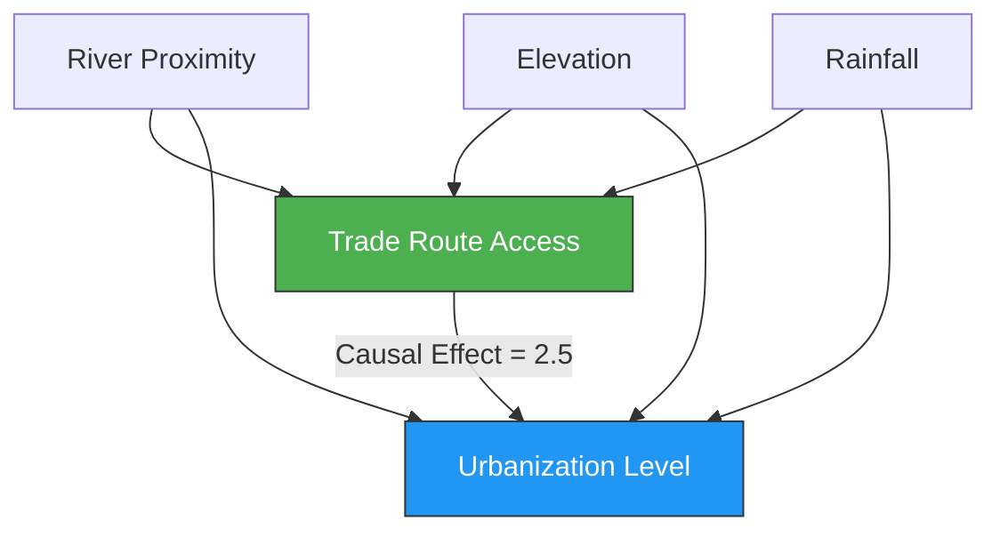
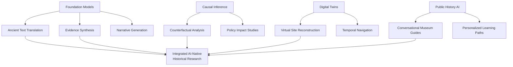

## Overview

We stand at the threshold of a new era in historical research -- one where AI is not just a processing tool but a **reasoning partner** capable of engaging with the past in fundamentally new ways. Foundation models can now read ancient scripts, reason across centuries of evidence, and generate plausible historical narratives. Causal inference frameworks allow us to ask "what if?" questions about history with mathematical rigor. And AI-powered museum experiences are transforming how the public encounters the past.

This lesson surveys the most exciting frontiers at the intersection of AI, history, and archaeology. We examine foundation models adapted for historical reasoning, causal inference methods applied to counterfactual history, the promises and perils of AI-generated historical narratives, and emerging applications in museums and public history. We conclude with a hands-on example using the DoWhy library for causal inference on historical data.

## Key Concepts

- **Foundation Models for Historical Reasoning**: Large language models fine-tuned on historical corpora can perform tasks like translating ancient languages, dating texts by stylistic analysis, and synthesizing evidence across multiple sources. Models like GPT-4 and specialized systems have demonstrated surprising competence on historical reasoning benchmarks.
- **Causal Inference for Counterfactual History**: Frameworks like DoWhy and EconML allow historians to move beyond correlation ("trade routes and urbanization co-occur") to causal claims ("access to trade routes caused urbanization"), using techniques such as instrumental variables, difference-in-differences, and propensity score matching.
- **AI-Generated Historical Narratives**: Language models can generate museum exhibit texts, educational materials, and even speculative historical fiction grounded in evidence. This raises questions about authorship, accuracy, and the line between synthesis and fabrication.
- **Digital Twins of Historical Sites**: AI-powered 3D reconstructions that evolve over time, allowing virtual visitors to walk through ancient cities at different periods, with reconstructions updated as new evidence emerges.
- **AI in Museums and Public History**: Conversational AI guides, personalized exhibit recommendations, accessibility tools for visually impaired visitors, and interactive simulations that let the public explore historical "what-if" scenarios.

## Code Examples

The following example demonstrates causal inference on historical data using the DoWhy library, investigating whether proximity to a trade route caused higher urbanization levels in ancient settlements.

```python
import numpy as np
import pandas as pd
import dowhy
from dowhy import CausalModel

# --- Step 1: Generate synthetic historical dataset ---
np.random.seed(42)
n_settlements = 500

# Confounders: geographic factors that affect both trade access and growth
river_proximity = np.random.uniform(0, 100, n_settlements)  # km to river
elevation = np.random.uniform(0, 2000, n_settlements)  # meters
rainfall = np.random.uniform(200, 1500, n_settlements)  # mm/year

# Treatment: proximity to major trade route (influenced by geography)
trade_route_score = (
    0.4 * (100 - river_proximity) / 100
    + 0.3 * (2000 - elevation) / 2000
    + 0.3 * rainfall / 1500
    + np.random.normal(0, 0.15, n_settlements)
)
has_trade_access = (trade_route_score > 0.5).astype(int)

# Outcome: urbanization level (population density proxy)
urbanization = (
    2.5 * has_trade_access           # true causal effect
    + 0.02 * (100 - river_proximity)  # confounder effect
    + 0.001 * rainfall                # confounder effect
    - 0.0005 * elevation              # confounder effect
    + np.random.normal(0, 1.0, n_settlements)
)

df = pd.DataFrame({
    "river_proximity": river_proximity,
    "elevation": elevation,
    "rainfall": rainfall,
    "trade_access": has_trade_access,
    "urbanization": urbanization,
})

print(f"Naive difference in means: "
      f"{df[df.trade_access==1].urbanization.mean() - df[df.trade_access==0].urbanization.mean():.3f}")
print("(True causal effect is 2.5)")

# --- Step 2: Define causal model with DoWhy ---
model = CausalModel(
    data=df,
    treatment="trade_access",
    outcome="urbanization",
    common_causes=["river_proximity", "elevation", "rainfall"],
    graph=None  # DoWhy will construct from common_causes
)

# --- Step 3: Identify causal effect ---
identified = model.identify_effect(proceed_when_unidentifiable=True)
print(f"\nIdentified estimand: {identified}")

# --- Step 4: Estimate using different methods ---
# Propensity Score Matching
psm_estimate = model.estimate_effect(
    identified,
    method_name="backdoor.propensity_score_matching",
    target_units="ate"
)
print(f"\nPropensity Score Matching estimate: {psm_estimate.value:.3f}")

# Linear Regression
lr_estimate = model.estimate_effect(
    identified,
    method_name="backdoor.linear_regression",
    target_units="ate"
)
print(f"Linear Regression estimate: {lr_estimate.value:.3f}")

# --- Step 5: Refutation tests ---
# Placebo treatment: replace real treatment with random variable
placebo = model.refute_estimate(
    identified,
    psm_estimate,
    method_name="placebo_treatment_refuter",
    placebo_type="permute"
)
print(f"\nPlacebo test (should be ~0): {placebo.new_effect:.3f}")

# Add random common cause: if estimate changes drastically, model is fragile
random_cause = model.refute_estimate(
    identified,
    psm_estimate,
    method_name="random_common_cause"
)
print(f"Random common cause test: {random_cause.new_effect:.3f}")
print("(Robust if close to original estimate)")
```

## Math / Formulas

The **Average Treatment Effect (ATE)** that DoWhy estimates is defined as:

$$\tau_{\text{ATE}} = \mathbb{E}[Y_i(1) - Y_i(0)]$$

where $Y_i(1)$ is the potential outcome under treatment (trade access) and $Y_i(0)$ under control. Since we never observe both for the same unit, identification relies on the **backdoor criterion**. Given confounders $\mathbf{Z}$:

$$\tau_{\text{ATE}} = \mathbb{E}_{\mathbf{Z}} \left[ \mathbb{E}[Y \mid T=1, \mathbf{Z}] - \mathbb{E}[Y \mid T=0, \mathbf{Z}] \right]$$

**Propensity score matching** estimates the probability of treatment given confounders:

$$e(\mathbf{z}) = P(T = 1 \mid \mathbf{Z} = \mathbf{z})$$

Units with similar propensity scores are matched, and the ATE is estimated from matched pairs. The **strong ignorability** assumption requires:

$$Y(0), Y(1) \perp\!\!\!\perp T \mid \mathbf{Z}$$

For counterfactual history, the key quantity is the **individual treatment effect**:

$$\tau_i = Y_i(1) - Y_i(0)$$

This is fundamentally unobservable for a single historical case, but bounds can be estimated using sensitivity analysis -- asking how strong an unmeasured confounder would need to be to overturn the conclusion.

## Diagrams

**Causal Graph for Trade and Urbanization**



**AI-Native History Research Ecosystem**



## Exercises

1. **Causal Analysis Extension**: Modify the DoWhy code to add an **instrumental variable** -- for example, a geological feature (presence of a mountain pass) that affects trade access but not urbanization directly. Use the IV estimator in DoWhy and compare the result to propensity score matching.

2. **Counterfactual Scenario**: Using the synthetic dataset, estimate the counterfactual: "What would the average urbanization level have been if no settlement had trade access?" Compare this to the factual mean and interpret the difference in historical terms.

3. **Sensitivity Analysis**: Use DoWhy's sensitivity analysis (e.g., the `add_unobserved_common_cause` refuter with varying effect strengths) to determine how strong an unmeasured confounder would need to be to nullify the estimated trade-urbanization effect. What real-world historical factor might serve as such a confounder?

4. **Foundation Model Evaluation**: Select a foundation model (e.g., via an API) and test its ability to answer historical reasoning questions. Create a benchmark of 20 questions spanning different cultures and periods. Measure accuracy and analyze where the model exhibits geographic or temporal bias.

5. **Museum AI Prototype**: Design a conversational AI agent for a museum exhibit about ancient trade. Define the knowledge base, conversation flows, and safeguards against generating fabricated historical claims. Implement a simple prototype using a retrieval-augmented generation (RAG) pattern.

## Further Reading

- Sharma, A., & Kiciman, E. (2020). "DoWhy: An End-to-End Library for Causal Inference." *arXiv preprint arXiv:2011.04216*.
- Pearl, J. (2009). *Causality: Models, Reasoning, and Inference* (2nd ed.). Cambridge University Press.
- Luo, J., et al. (2023). "ChatGPT as a Historical Reasoning Engine: Capabilities, Limitations, and Implications." *Digital Scholarship in the Humanities*.
- Bode, K. (2020). "Why You Can't Model Away Bias." *Modern Language Quarterly*, 81(1).
- Champion, E. (2021). *Critical Gaming: Interactive History and Virtual Heritage*. UCL Press.
- Guldi, J., & Armitage, D. (2014). *The History Manifesto*. Cambridge University Press.
