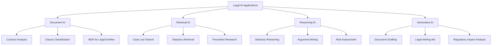

# Introduction to AI for Law

## Overview

Legal AI refers to the application of artificial intelligence techniques to legal tasks—ranging from document review and case retrieval to reasoning about statutes and predicting litigation outcomes. The field has roots in the 1980s with early expert systems like TAXMAN and HMEXPERT, but modern Legal AI is driven by large-scale language models, dense embeddings, and retrieval-augmented generation. Today, law firms, corporate legal departments, and courts increasingly rely on AI to handle the enormous volume of documents generated in litigation, transactions, and regulatory compliance.

The legal domain presents unique challenges for AI. Legal text is characterized by formal precision layered over centuries of precedent, Latin phrases, and domain-specific vocabulary that evolves through court decisions. A statute may contain vague terms ("reasonable care," "due diligence") whose meaning is filled in through case law. Reasoning about a legal problem often requires tracking multiple contradictory authorities, understanding hierarchical relationships between rules, and applying analogical reasoning from prior cases. These challenges distinguish Legal AI from general NLP.

Why does AI for law matter? Efficiency is one driver: legal work involves enormous amounts of reading, searching, and writing. Natural language search over contracts, predictive coding for e-discovery, and AI-assisted drafting can reduce billable hours dramatically. A deeper motivation is access to justice: most people cannot afford legal representation. AI tools that summarize legal documents, guide users through procedures, or identify relevant precedents can democratize access to legal information. Research from the World Commerce and Contracting Association found that Fortune 500 companies spend billions annually on contract review—AI can reduce that cost significantly.

The types of legal tasks AI assists with span a wide spectrum:

- **Document understanding**: summarizing opinions, extracting key facts, identifying obligations in contracts
- **Information retrieval**: semantic search over case law databases, finding relevant precedents
- **Classification and triage**: categorizing documents by issue, detecting privilege, assessing relevance
- **Reasoning and analysis**: statutory interpretation, argument construction, risk assessment
- **Generation**: first-draft contract clauses, deposition questions, regulatory comments

## Key Concepts

- **Legal AI**: Application of AI/ML to legal tasks including document review, case retrieval, contract analysis, and legal reasoning
- **Precedent**: Prior court decisions that establish rules for future cases; the doctrine of stare decisis binds courts to follow binding precedent
- **Statutory interpretation**: Determining the meaning of legislation, often involving canonical construction canons (ejusdem generis, noscitur a sociis)
- **Legal reasoning**: Deductive, inductive, and analogical reasoning processes used to reach legal conclusions; differs from everyday reasoning due to burden of proof and standards of evidence
- **Access to justice**: The problem that most individuals and small businesses cannot afford legal representation; AI can help close this gap
- **Due process**: Constitutional guarantee of fair legal process; creates explainability requirements for AI used in legal decisions

## Key Datasets

Three foundational datasets power Legal AI research and applications:

| Dataset | Description | Size |
|---------|-------------|------|
| **CaseLaw (formerly Cambridge Law Corpus)** | Court opinions from the UK Supreme Court and ECHR | ~9,000 cases |
| **CourtListener** | Free repository of US federal and state opinions via RECAP/Internet Archive | Millions of opinions |
| **LEDGAR** | Contracts with clause-level labels for classification | ~65,000 contracts |

Other important datasets include the **Harvard Law Corpus**, **Europarl** (for EU legislation), and **NCERT** for Indian law.

## Diagrams

**Types of Legal AI Applications**

## Exercises/Projects

1. **Explore CourtListener**: Search for cases mentioning a specific legal concept (e.g., "reasonable expectation of privacy"). Notice how results vary with different search queries.
2. **Analyze a contract clause**: Take a sample contract and manually identify: parties, obligations, effective date, termination clauses. Compare your analysis to what an NER model might extract.
3. **Compare legal search vs web search**: Search the same legal question on Google and a specialized legal database. Note differences in result types, precision, and relevance signals.

## Further Reading

- Ashley, K. D. (2017). *Artificial Intelligence and Legal Analytics: New Tools for Law Practice*. Cambridge University Press.
-立法人工智能研究组, "Legal AI: Foundations and Future Directions" — surveys deep learning approaches to legal reasoning.
-灌法: "Legal BERT: Pre-training a BERT model on legal text" — the foundational domain-adapted model for English legal NLP.