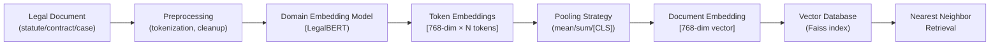

## Legal Text Representation and Embeddings

## Overview

Every Legal AI system begins with a fundamental question: how do we represent legal text so that a machine can reason about it? Legal documents span multiple modalities—statutes codified in hierarchical sections, case opinions with narrative reasoning and holdings, contracts with nested clause structures—each with distinct semantic properties that generic NLP models may fail to capture.

Generic word embeddings like Word2Vec or GloVe represent each word as a fixed dense vector. However, legal vocabulary often carries precise technical meanings that differ from everyday usage. The word "consideration" in contract law means something legally sufficient exchanged between parties, not merely "thoughtful regard." Generic embeddings trained on news or web text encode the common meaning, missing the legal sense. Domain-specific embeddings trained on legal corpora learn representations that better reflect how terms function in legal contexts.

**LegalBERT**, introduced by Chalkidis et al. (2019), is a BERT-based model pre-trained on a large corpus of English legal text from EU legislation, US court opinions, and contracts. LegalBERT captures legal terminology, citation patterns, and argument structures. When fine-tuned on downstream tasks like clause classification or statute retrieval, it consistently outperforms general BERT variants. The model's architecture follows the standard transformer encoder: a stack of self-attention layers that process input text bidirectionally, learning contextual representations:

$$h_i^{(L)} = \text{Attention}(h_i^{(L-1)}, H^{(L-1)}) \cdot W_O$$

where $h_i^{(0)} = E_i + P_i$ is the sum of token embeddings and positional encodings.

**CaseEncoder** refers to a family of models specifically designed to encode case facts, holdings, and rationales for case-based reasoning tasks. These models capture the causal structure of legal arguments—what facts led the court to reach a particular conclusion—and support similarity computations over case bases.

## Key Concepts

- **Domain-specific embeddings**: Dense vector representations trained on or fine-tuned for legal corpora; LegalBERT, LexBERT, and EU-BERT are prominent examples
- **LegalBERT**: BERT model pre-trained on 12GB of legal text (EU laws, US court opinions, contracts); outperforms general BERT on 5 of 6 downstream legal tasks
- **Sentence embeddings for law**: Models like **sfbert** or **NLI-based legal encoders** that produce single vectors for entire sentences or paragraphs
- **Vector databases**: FAISS, Pinecone, or Qdrant stores embeddings for fast nearest-neighbor retrieval; essential for legal semantic search at scale
- **Contrastive learning**: Training objective that pulls similar legal texts (same outcome, same legal domain) closer in embedding space while pushing dissimilar texts apart

## Code Examples

```python
from transformers import AutoTokenizer, AutoModel
import torch

# Load LegalBERT
model_name = "nlpaueb/legal-bert-base-uncased"
tokenizer = AutoTokenizer.from_pretrained(model_name)
model = AutoModel.from_pretrained(model_name)

def embed_legal_text(text: str) -> torch.Tensor:
    """Encode legal text into a dense embedding vector."""
    inputs = tokenizer(text, return_tensors="pt", truncation=True, max_length=512)
    with torch.no_grad():
        outputs = model(**inputs)
    # Mean pooling over token embeddings -> sentence-level embedding
    attention_mask = inputs["attention_mask"]
    token_embeddings = outputs.last_hidden_state
    mask_expanded = attention_mask.unsqueeze(-1).expand(token_embeddings.size()).float()
    sum_embeddings = torch.sum(token_embeddings * mask_expanded, dim=1)
    sum_mask = mask_expanded.sum(dim=1)
    embedding = sum_embeddings / sum_mask
    return embedding.squeeze()

# Example usage
clause = "The Lessee shall pay rent on the first day of each month, in advance, without demand."
vec = embed_legal_text(clause)
print(f"Embedding shape: {vec.shape}")  # torch.Size([768])
print(f"Embedding sample: {vec[:5]}")   # First 5 dims
```

## Diagrams

**Legal Document → Embedding Pipeline**



The pipeline processes raw legal text through tokenization, domain embedding generation via LegalBERT, followed by pooling to produce a single fixed-size vector per document. At query time, the same embedding model encodes the search query, and nearest-neighbor search in the vector database retrieves semantically similar legal documents.

## Exercises/Projects

1. **Compare embeddings**: Encode the same contract clause with generic `bert-base-uncased` and LegalBERT. Compute cosine similarity with a relevant statute passage. Note which model produces higher similarity for semantically related legal text.
2. **Build a legal similarity search**: Use a vector database to index 20 legal excerpts from different domains (contract, criminal, tax). Query with a test clause and retrieve top-k similar items. Evaluate qualitatively whether the results make sense.
3. **Analyze embedding space**: Use t-SNE or UMAP to visualize embeddings of legal documents from different domains. Do documents cluster by legal domain (contract vs. criminal vs. regulatory)?

## Further Reading

- Chalkidis, I., et al. (2019). "Legal BERT: Pre-training a BERT model on legal text." *EMNLP Workshop on Financial NLP*.
- Yu, P., et al. (2023). "A Contrastive Learning Framework for Legal Text Embedding." *ACL Findings*.
- Raffel, C., et al. (2020). "Exploring the Limits of Transfer Learning with a Unified Text-to-Text Transformer." *JMLR* — for transformer architecture background.