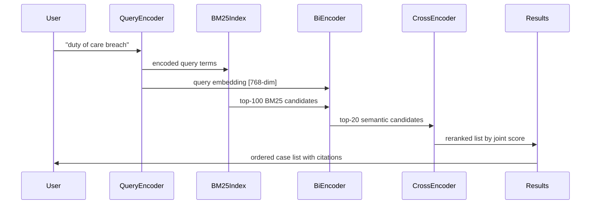

# Case Law Retrieval and Precedent Research

## Overview

Finding the right case is often the most time-consuming part of legal research. A lawyer might spend hours sifting through thousands of opinions to find one that supports a particular argument. Case law retrieval systems aim to automate and accelerate this process by matching researcher queries to relevant precedents, ordered by authority and relevance.

Traditional legal search relied on Boolean keyword matching—searching for exact phrases like `"duty of care" AND negligence`. This approach fails when cases discuss the same concept using different terminology. A case about a contractor's duty to prevent foreseeable harm might not use the phrase "duty of care" at all, yet remain highly relevant. Semantic search addresses this by encoding queries and documents into dense vectors where related concepts cluster near each other, regardless of surface vocabulary.

**Shepard's Analysis** is the traditional legal methodology for assessing case authority. When a case is cited by later cases, it gains positive treatment (it was followed, applied, or affirmed). When a case is cited in a way that limits or overrules it, it receives negative treatment. The goal is to identify the current vitality of a precedent: is it good law, or has it been eroded? Modern computational approaches to Shepard's analysis treat it as a citation classification problem—classifying each citation link as positive, negative, or neutral.

Query expansion is critical for legal search. A researcher's initial query might miss relevant cases that use synonyms or related concepts. Query expansion adds terms—for example, expanding "breach of contract" to include "failure to perform," "non-performance," and "material breach"—then re-weights document scores accordingly.

**Hybrid retrieval** combines multiple signals. A practical case retrieval pipeline might:

1. Use BM25 (a probabilistic keyword retrieval model) for exact-match recall
2. Use a bi-encoder to retrieve semantically similar candidates
3. Re-rank results using a cross-encoder that scores (query, document) pairs jointly

BM25 provides interpretable keyword matching:

$$\text{score}(D, Q) = \sum_{i=1}^{n} \text{IDF}(q_i) \cdot \frac{f(q_i, D) \cdot (k_1 + 1)}{f(q_i, D) + k_1 \cdot (1 - b + b \cdot |D|/L_{\text{avg}})}$$

where $f(q_i, D)$ is the term frequency, $k_1$ and $b$ are tunable parameters (typically $k_1 = 1.5$, $b = 0.75$), and $L_{\text{avg}}$ is the average document length.

**Reranking** takes an initial retrieved set (typically top-100 to top-1000) and applies a more expensive but more accurate cross-encoder to reorder results. Cross-encoders process the query and document jointly through attention, producing better relevance scores than the independent encoding of bi-encoders.

## Key Concepts

- **BM25**: Okapi BM25, a probabilistic bag-of-words retrieval function used as a strong baseline for legal text retrieval
- **Bi-encoder**: Encodes query and document independently into vectors; fast retrieval but may lose cross-document context
- **Cross-encoder**: Jointly encodes query and document; more accurate but computationally expensive, used for reranking
- **Shepard's citation analysis**: Method of tracing a case's treatment history through subsequent citations to determine its current validity
- **Query expansion**: Enriches a search query with synonyms, related terms, and domain knowledge to improve recall
- **Dense passage retrieval**: Using neural encoders to retrieve relevant legal documents based on semantic similarity rather than keyword overlap

## Code Examples

```python
from sklearn.feature_extraction.text import TfidfVectorizer
from sklearn.metrics.pairwise import cosine_similarity
import numpy as np

# Simple BM25-inspired retrieval using scikit-learn
corpus = [
    "The defendant owed a duty of care to the plaintiff.",
    "In negligence, breach of duty requires foreseeable harm.",
    "Contract formation requires offer, acceptance, and consideration.",
    "The court found material breach of the lease agreement.",
    "Foreseeability is an element of proximate cause in tort law.",
]

vectorizer = TfidfVectorizer(stop_words="english", ngram_range=(1, 2))
doc_vectors = vectorizer.fit_transform(corpus)

query = "duty of care negligence breach"
query_vector = vectorizer.transform([query])

# Retrieve top-k similar documents
scores = cosine_similarity(query_vector, doc_vectors).flatten()
top_k_idx = np.argsort(scores)[::-1]

print("BM25-style retrieval results:")
for idx in top_k_idx[:3]:
    print(f"  Score: {scores[idx]:.3f} | {corpus[idx][:60]}")
```

For a production system, consider integrating **sentence-transformers** for dense retrieval and **Cross-Encoder** for reranking:

```python
from sentence_transformers import SentenceTransformer, CrossEncoder

# Bi-encoder for initial retrieval
bi_encoder = SentenceTransformer("nlpaueb/legal-bert-base-uncased")
# Cross-encoder for reranking
cross_encoder = CrossEncoder("cross-encoder/ms-marco-MiniLM-L-6-v2")

# Encode corpus for ANN search
corpus_embeddings = bi_encoder.encode(corpus, show_progress_bar=False)

# Retrieve top-20 with bi-encoder, then rerank
query_embedding = bi_encoder.encode([query])
indices = np.argsort(cosine_similarity(query_embedding, corpus_embeddings)[0])[::-1][:20]

rerank_pairs = [(query, corpus[i]) for i in indices]
rerank_scores = cross_encoder.predict(rerank_pairs)
reranked_order = np.argsort(rerank_scores)[::-1]

print("Reranked results:", [corpus[indices[i]] for i in reranked_order[:5]])
```

## Diagrams

**Query → Retrieval → Reranking → Results**



## Exercises/Projects

1. **Build a simple case retrieval system**: Collect 50 case summaries from CourtListener or a similar source. Implement BM25 retrieval. Test with at least 5 different legal queries and evaluate recall by manually checking relevance.
2. **Implement query expansion**: Take a set of initial queries and expand them using a legal thesaurus or synonym list. Measure how expansion affects retrieval performance.
3. **Evaluate reranking impact**: Compare retrieval results before and after cross-encoder reranking. Use a human evaluation to rate whether reranked results are more relevant.

## Further Reading

- Grabmair, M. (2017). "Introducing Retrievals and Reasoning in Legal Case Law." *AI for Law* workshop materials.
- Conijn, M., et al. (2021). "Semantic search for Dutch case law." *Legal Knowledge and Information Systems* — discusses hybrid retrieval in European legal contexts.
- Serra et al. (2022). "BERTje: A Dutch BERT model for legal text" — domain adaptation for civil law jurisdictions.