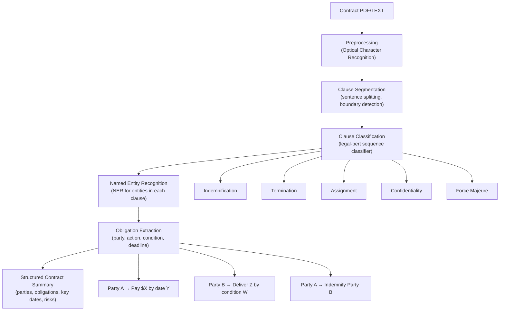

# Contract Analysis and Clause Classification

## Overview

Contracts are the backbone of commercial activity, yet reviewing them remains tedious and expensive. A typical M&A transaction involves hundreds of documents, each containing dozens of clause types that must be identified, classified, and compared against playbooks and norms. Contract analysis AI automates the extraction of key information from contracts, enabling lawyers to review deals faster and with greater consistency.

A contract has a hierarchical structure. At the top level, there are **Parts** (e.g., Part I: Definitions, Part II: Obligations). Within parts, **Sections** group related content. Within sections, individual **Clauses** make specific promises, representations, or undertakings. Understanding this hierarchy is essential because the same clause type (e.g., an indemnification clause) may appear in different locations across contracts from different publishers.

NLP tasks in contract analysis include:

1. **Clause identification**: Locating where each clause begins and ends (segmentation)
2. **Clause classification**: Assigning a label from a taxonomy (indemnification, termination, assignment, etc.)
3. **Entity extraction**: Identifying dates, monetary amounts, parties, definitions, and obligations
4. **Obligation detection**: Determining which party must do what, by when, and under what conditions

The **LEDGAR** dataset (Troelsen & Biller, 2020) provides 65,000 contracts with clause-level labels across 20 categories. It enabled training of the first large-scale clause classification models. The key challenge is that clause text varies enormously—even clauses of the same type can use very different language—while exhibiting consistent semantic intent. This makes clause classification a task well-suited to transformer-based models that learn contextual representations.

**Standard vs. non-standard clauses** is a critical distinction in contract review. Standard clauses (sometimes called "market" or "boilerplate") reflect commonly accepted terms that rarely require negotiation. Non-standard (or "non-market") clauses deviate from norms and may present risks. Identifying deviations from standard requires understanding what "normal" looks like—often derived from analytics across large contract repositories.

## Key Concepts

- **Contract hierarchy**: Parts → Sections → Clauses, each with distinct semantic roles
- **Clause taxonomy**: Standard classification schemas like UNIDROIT or custom taxonomies used in legal tech products (Westlaw Edge, Kira Systems)
- **Named Entity Recognition (NER)**: Extracting structured entities (dates, amounts, parties, geographic references) from unstructured contract text
- **Obligation extraction**: Identifying who must do what; often formalized as (Party, Obligation, Condition, Timeframe) tuples
- **Anomaly detection for contracts**: Identifying non-standard clauses by comparing against learned distributions of standard clause language

## Code Examples

```python
from transformers import pipeline

# Use a pre-trained legal NER model
ner_pipeline = pipeline("ner", model="saoodamin/contract-ner", aggregation_strategy="simple")

contract_text = """
ARTICLE 5: INDEMNIFICATION
Supplier shall indemnify Buyer against all claims arising from
breach of this Agreement, provided such breach is notified within
thirty (30) days of discovery. The aggregate liability shall not
exceed USD 2,000,000 (Two Million United States Dollars).
"""

entities = ner_pipeline(contract_text)
print("Extracted entities:")
for ent in entities:
    print(f"  {ent['entity_group']}: {ent['word']} (score: {ent['score']:.3f})")

# Clause classification with a fine-tuned model
from transformers import AutoTokenizer, AutoModelForSequenceClassification

model_name = "nlpaueb/legal-bert-base-uncased"
tokenizer = AutoTokenizer.from_pretrained(model_name)
clf = AutoModelForSequenceClassification.from_pretrained(model_name, num_labels=20)

clause_text = "This Agreement shall terminate automatically if either party fails to cure a material breach within thirty (30) days of written notice."
inputs = tokenizer(clause_text, return_tensors="pt", truncation=True, max_length=512)
logits = clf(**inputs).logits
predicted_class = logits.argmax(dim=-1).item()
print(f"Predicted clause type ID: {predicted_class}")
```

## Diagrams

**Contract → Clause Segmentation → Classification → Extraction**



## Exercises/Projects

1. **Build a clause classifier**: Use theLEDGAR dataset (if available) or a synthetic labeled set. Fine-tune a LegalBERT model for clause classification. Evaluate with F1 score per class.
2. **Extract obligations from a contract**: Take a sample commercial contract and manually annotate all obligations. Then use an NER model to extract entities. Compare results and identify where the model struggles.
3. **Compare standard vs. non-standard**: Gather 10 contracts from the same industry. Identify clauses that appear in most ("standard") vs. only one or two ("non-standard"). Build a simple anomaly detector based on clause embedding similarity.

## Further Reading

- Troelsen, J., & Biller, H. (2020). "LEDGAR: Legislation and contract dataset for machine learning." *ACL Resource Tracks*.
- Schwalger, M., & Palm, H. (2022). "Contract понимание: A survey of BERT-based approaches for legal contract understanding." *arXiv*.
- Markup AI and Kira Systems documentation on contract review automation.