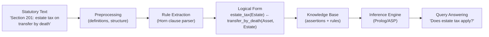

# Statutory Reasoning and Legal Rule Extraction

## Overview

Statutes are the formal expression of legislative will—rules enacted by elected representatives that govern conduct. Unlike case law, which emerges gradually through judicial decisions, statutes are deliberately constructed instruments meant to apply uniformly across their scope. Reading a statute is a form of comprehension task: the reader must understand the text, resolve ambiguities, and determine how it applies to a specific fact pattern.

Statutory reasoning involves several distinct challenges. First, statutes often contain defined terms whose meaning may not match everyday usage. Second, statutes are organized hierarchically (titles → chapters → sections → subsections), and the hierarchical structure carries semantic information about which rules govern which situations. Third, statutes frequently contain exception clauses ("except where..."), conditionals ("if... then..."), and references to other statutes, creating a web of interlinked rules.

**Rule extraction** is the task of converting natural-language statutory text into structured representations that support reasoning. Approaches include:

- **Logic-based representations**: Horn clauses, event calculus, or temporal logic that capture preconditions and consequences
- **Frame-based representations**: Slots and fillers for obligations, permissions, and prohibitions
- **Neural representations**: Fine-tuned language models that directly answer statutory comprehension questions

Consider a simple statutory rule: "A person who drives a motor vehicle on a public road while exceeding the speed limit by more than 20 km/h shall be liable to a fine." We can represent this in Horn clause form:

$$\text{speed\_violation}(P, V) \leftarrow \text{drives}(P, V) \land \text{public\_road}(V) \land \text{speed}(V, S) \land S > \text{limit}(V) + 20$$

where $P$ is a person, $V$ is a vehicle, and $S$ is the speed. This representation enables forward-chaining inference: given facts about a specific situation, we can derive whether the rule's conclusion holds.

**Statute classification by domain** is a multi-class classification task: given a statute or statutory excerpt, assign it to a legal domain such as criminal law, tax law, contract law, or environmental law. This enables downstream tasks like jurisdiction-specific reasoning. Models like LegalBERT fine-tuned on domain classification achieve >90% accuracy across major legal domains.

**Multi-task learning** for legal understanding trains a single model on multiple related tasks (e.g., statute classification + rule extraction + question answering) simultaneously. The intuition is that jointly learning these tasks creates shared representations that improve performance on each individual task—a form of inductive transfer within a single model.

## Key Concepts

- **Statutory reading comprehension**: Understanding statute text, resolving defined terms, and determining applicability to facts
- **Rule extraction**: Converting natural-language rules into structured logical forms (Horn clauses, event calculus)
- **Horn clauses**: A restricted form of first-order logic used in logic programming; each rule has at most one positive literal in the head
- **Temporal logic**: A formalism for reasoning about time-dependent propositions; useful for statutes with effective dates and sunset clauses
- **Statute classification**: Assigning statutes to legal domains; enables domain-specific processing pipelines
- **Multi-task learning**: Jointly training on related legal tasks to create shared representations

## Code Examples

```python
from transformers import AutoTokenizer, AutoModelForSequenceClassification
import torch

model_name = "nlpaueb/legal-bert-base-uncased"
tokenizer = AutoTokenizer.from_pretrained(model_name)
model = AutoModelForSequenceClassification.from_pretrained(
    model_name, num_labels=5
)

# Legal domain classes: criminal, contract, tax, property, administrative
domain_labels = ["criminal", "contract", "tax", "property", "administrative"]

statute_text = """
Section 201 of the Internal Revenue Code imposes a tax on
transfers of property by reason of death. The tax shall be
known as the estate tax, and shall be a liability of the estate.
"""

inputs = tokenizer(statute_text, return_tensors="pt", truncation=True, max_length=512)
with torch.no_grad():
    logits = model(**inputs).logits
probs = torch.softmax(logits, dim=-1)
predicted_idx = logits.argmax(dim=-1).item()

print(f"Predicted domain: {domain_labels[predicted_idx]}")
print(f"Confidence: {probs[0][predicted_idx]:.3f}")
print(f"All probabilities: {dict(zip(domain_labels, probs[0].tolist()))}")
```

For rule extraction, a simpler pattern-matching approach:

```python
import re

def extract_speed_rule(text: str) -> dict:
    """Simple rule extraction for traffic speed violation statutes."""
    pattern = r"drives?.{0,20}(motor vehicle|vehicle).{0,50}exceeding.{0,20}speed limit.?(\d+)\s*km/?h"
    match = re.search(pattern, text, re.IGNORECASE | re.DOTALL)
    if match:
        threshold = int(match.group(1))
        return {
            "head": "speed_violation(Person)",
            "body": f"drives(Person, Vehicle) ∧ speed(Vehicle) > {threshold} km/h"
        }
    return {}

statute = "A person who drives a motor vehicle exceeding the speed limit by more than 30 km/h shall be liable to a fine."
rule = extract_speed_rule(statute)
print(rule)
# {'head': 'speed_violation(Person)', 'body': 'drives(Person, Vehicle) ∧ speed(Vehicle) > 30 km/h'}
```

## Diagrams

**Statute → Rule Extraction → Logical Representation**



## Exercises/Projects

1. **Build a statute classifier**: Gather statutes from three jurisdictions. Fine-tune LegalBERT for domain classification. Evaluate per-class precision/recall and analyze misclassifications.
2. **Extract rules from a statute**: Pick a well-known statute (e.g., GDPR Article 17 on the right to erasure). Manually convert it to Horn clause form. Then build a pattern-based extractor that identifies conditions and conclusions.
3. **Multi-task vs. single-task**: Compare performance of LegalBERT on rule extraction with and without multi-task training on statute classification. Measure extraction accuracy.

## Further Reading

- Katz, D., et al. (2020). "A BERT-based approach for legal rule extraction." *International Conference on AI and Law*.
- Ashley, K. D. (2017). *Artificial Intelligence and Legal Analytics* — Chapter 5 covers statutory reasoning and rule extraction in depth.
- H. B. F. (2022). "Logic Programming for Legal Norms: A Prolog Primer" — for rule-based representation approaches.