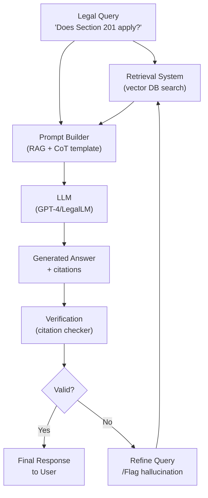

# Large Language Models for Legal Tasks (LegalLLMs)

## Overview

Large Language Models (LLMs) like GPT-4, Claude, and open-source alternatives (Llama, Mistral) have demonstrated remarkable capabilities across many domains. For legal tasks, they offer the promise of flexible reasoning over long legal documents, generation of drafts, and natural-language interfaces to legal databases. Yet deploying general LLMs directly on legal tasks carries significant risks.

**Why do general LLMs struggle with legal tasks?** Several reasons:

1. **Hallucination**: LLMs generate fluent text that sounds plausible but may invent citations, misstate holdings, or cite non-existent cases. In legal practice, a fabricated citation can be catastrophic.
2. **Out-of-date knowledge**: Legal rules change frequently—statutes are amended, precedents overruled. Most LLMs' knowledge cuts off at training time.
3. **Lack of jurisdiction awareness**: "Assault" has different elements and penalties under California law vs. English law vs. international criminal law.
4. **Surface-level reasoning**: LLMs often recognize legal jargon without performing deep causal or analogical reasoning.
5. **Length limits**: Long contracts, entire case histories, or large statutory codes exceed context windows.

**Domain adaptation** addresses these limitations. Legal-BERT (Chalkidis et al., 2019) was pre-trained on legal corpora and substantially outperforms general BERT on downstream legal tasks. More recently, models like **LexLM** (Lu et al., 2023) and **GPT-4 for Legal** (OpenAI fine-tuned variant) incorporate legal-specific pre-training and reinforcement learning from legal feedback (RLHF). These models demonstrate improved citation accuracy and legal reasoning.

**Chain-of-thought (CoT) prompting** for legal reasoning encourages the LLM to articulate intermediate steps:

```
Question: Was the defendant's conduct in Case X sufficient to establish negligence?
Think step by step:
1. Identify the elements of negligence: duty, breach, causation, damages.
2. Examine whether the defendant owed a duty of care...
3. Assess whether the breach was the proximate cause...
Answer: [final conclusion with supporting citations]
```

CoT prompting improves reasoning accuracy on multi-step legal problems, though it does not eliminate hallucination.

**Citation accuracy and source grounding** are critical for legal AI. Approaches include:

- **Retrieval-augmented generation (RAG)**: The LLM is given retrieved legal documents as context, reducing hallucination by anchoring generation to real text
- **Tool-augmented models**: Models that call external legal databases (Westlaw, LexisNexis) before answering
- **Verifiable generation**: Training models to generate text that cites specific paragraphs from specific documents, enabling fact-checking

## Key Concepts

- **Hallucination in legal contexts**: Confident generation of non-existent citations, inaccurate case summaries, or fabricated statutory provisions
- **Legal-domain LLMs**: Models pre-trained or fine-tuned on legal corpora (Legal-BERT, LexLM, Claude for Law, GPT-4 for Legal)
- **Chain-of-thought prompting**: Step-by-step reasoning that improves multi-step legal question answering
- **Retrieval-Augmented Generation (RAG)**: Combining an LLM with a retrieval system that provides grounding documents
- **Citation accuracy**: Ensuring that generated legal text cites real cases, statutes, and paragraphs accurately
- **RLHF for legal**: Fine-tuning LLMs using reinforcement learning from human legal feedback to improve reasoning quality

## Code Examples

```python
from openai import OpenAI
import os

client = OpenAI(api_key=os.getenv("OPENAI_API_KEY"))

def legal_qa_with_rag(question: str, retrieved_docs: list[str]) -> str:
    """Answer a legal question using RAG with grounding."""

    # Build context from retrieved documents
    context = "\n\n---\n\n".join([
        f"[Document {i+1}]: {doc['text'][:500]}\n(Citation: {doc.get('citation', 'N/A')})"
        for i, doc in enumerate(retrieved_docs)
    ])

    prompt = f"""You are a legal research assistant. Answer the question based ONLY on the provided documents.
If the answer cannot be determined from the documents, say so explicitly.
Cite specific documents when stating facts.

Documents:
{context}

Question: {question}

Think step by step, then provide your answer with citations."""

    response = client.chat.completions.create(
        model="gpt-4o",
        messages=[
            {"role": "system", "content": "You are a careful legal research assistant. Always cite your sources."},
            {"role": "user", "content": prompt}
        ],
        temperature=0.0  # Low temperature for factual legal output
    )
    return response.choices[0].message.content

# Example with few-shot prompting
few_shot_prompt = """
Example 1:
Question: Under California law, what constitutes prima facie evidence of negligence?
Answer: Under California Civil Code § 1714, negligence is established by showing:
(1) a duty of care owed by defendant to plaintiff,
(2) breach of that duty,
(3) causation, and
(4) damages. [California Civil Code § 1714]

Question: Does a landlord have a duty to disclose known mold conditions to tenants?
"""
```

## Diagrams

**Legal Query → Prompt Construction → LLM → Grounded Response**



## Exercises/Projects

1. **RAG-based legal Q&A**: Build a complete legal Q&A system using a vector database of statutes. Compare answer quality with and without RAG grounding.
2. **Hallucination audit**: Query an LLM about a real legal topic. Collect all citations. Verify each citation exists and supports the proposition. Compute citation accuracy rate.
3. **Chain-of-thought vs. direct answering**: Compare CoT prompting to direct answering on a set of 20 multi-step legal questions. Measure accuracy using a domain expert's evaluation.

## Further Reading

- OpenAI (2024). "GPT-4 for Legal: Fine-tuning and evaluation on legal tasks."
- Lu, D., et al. (2023). "LexLM: Pretraining and benchmarking a large language model for the legal domain." *ACL findings*.
- Paul, G., & Mclaird, M. (2022). "On Evaluating the Legal Reasoning Capability of LLMs." *NeurIPS Workshop on AI for Law*.
- Katz, D., et al. (2023). "From RAG to Riches: Retrieval Augmentation for Legal Question Answering." *arXiv*.