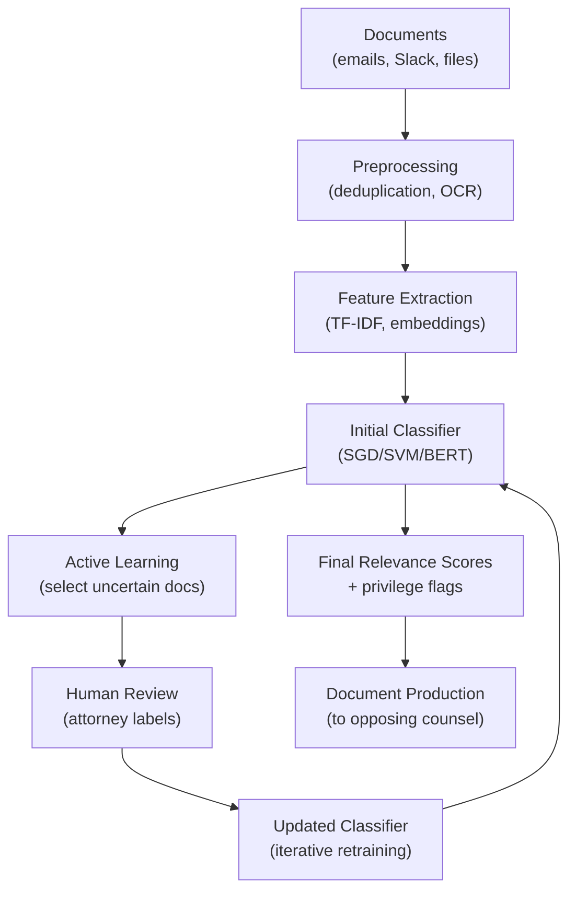

# AI for E-Discovery and Litigation Support

## Overview

Electronic discovery (e-discovery) is the process of identifying, collecting, and producing electronically stored information (ESI) in litigation. When parties dispute, they must search through vast volumes of emails, Slack messages, shared documents, and databases for materials relevant to the dispute. Manual review is prohibitively expensive—large commercial litigation can involve millions of documents. E-discovery costs have become a significant portion of litigation budgets, making AI-assisted review essential.

The e-discovery process follows the **EDRM** framework (Electronic Discovery Reference Model):

1. **Information Governance**: Determining what data exists and where
2. **Identification**: Finding potential sources of relevant ESI
3. **Preservation**: Ensuring relevant data is not destroyed
4. **Collection**: Gathering ESI from identified sources
5. **Processing**: Converting collected data to reviewable format
6. **Review**: Human or AI-assisted analysis of documents for relevance, privilege, and confidentiality
7. **Production**: Delivering relevant documents to opposing party
8. **Presentation**: Preparing materials for trial

**Relevance categorization** is the core classification task: given a document, is it likely relevant to the dispute? Early e-discovery used simple keyword searches, but these miss documents that are semantically relevant without using the search terms. AI classifiers learn from labeled examples to predict relevance, dramatically reducing the number of documents requiring human review.

**Predictive coding** (also called technology-assisted review or TAR) uses ML to identify relevant documents. First-generation TAR used naive Bayes or SVM classifiers trained on seed documents labeled by attorneys. Modern approaches use transformer-based models that better capture semantic relevance. The key insight is that lawyers label a small set of documents, the model learns from those labels, identifies similar documents, and human review continues iteratively. After several rounds, the model's precision and recall stabilize.

**Privilege detection** identifies documents that should not be produced because they are protected by attorney-client privilege or work-product doctrine. Privilege is signaled by specific patterns: communication between attorney and client, presence of legal advice language, and specific metadata (legal hold notices, engagement letters). ML models trained on labeled privilege examples can achieve high accuracy at scale, though edge cases require human judgment.

**Active learning** is particularly well-suited to e-discovery because labeling documents is expensive (requires attorney time) but unlabeled documents are plentiful. In active learning, the model identifies the most uncertain documents—that is, those closest to the decision boundary—and those are prioritized for human labeling. This maximizes the information gained from each labeling effort.

The cost estimation challenge: parties must estimate e-discovery costs in early case planning. ML models trained on historical e-discovery projects can predict the number of relevant documents, review hours, and total cost based on case characteristics (document volume, email ratio, jurisdiction, case type).

## Key Concepts

- **E-Discovery (EDRM)**: The standardized process for identifying, preserving, collecting, reviewing, and producing electronically stored information in litigation
- **Predictive coding (TAR)**: Machine learning classifier trained on seed labels to identify relevant documents; reduces manual review burden
- **Active learning**: Iterative ML approach where the model selects the most informative unlabeled documents for human labeling, minimizing labeling cost
- **Privilege detection**: Classifying documents as potentially privileged (attorney-client or work-product protected) to prevent inadvertent production
- **Recall vs. precision trade-off**: E-discovery prioritizes high recall (finding all relevant documents) over precision (only relevant documents); missing responsive documents carries sanctions risk

## Code Examples

```python
from sklearn.feature_extraction.text import TfidfVectorizer
from sklearn.linear_model import SGDClassifier
from sklearn.model_selection import train_test_split
import numpy as np

# Simulated e-discovery dataset
documents = [
    "Email discussing project timeline and deliverables",
    "Attorney-client communication re: litigation strategy",
    "Monthly financial report Q3 2024",
    "Memo from CEO to legal regarding regulatory investigation",
    "Meeting notes describing settlement discussions",
    "Technical specification document for software release",
]
labels = [0, 1, 0, 1, 1, 0]  # 0 = not relevant, 1 = relevant

vectorizer = TfidfVectorizer(max_features=1000, ngram_range=(1, 2))
X = vectorizer.fit_transform(documents)

# Train initial classifier
clf = SGDClassifier(loss="hinge", random_state=42)
clf.fit(X, labels)

def predict_relevance(doc: str) -> str:
    """Predict whether a document is relevant to the dispute."""
    x = vectorizer.transform([doc])
    prob = clf.predict_proba(x)[0][1]
    return "RELEVANT" if prob > 0.5 else "NOT_RELEVANT"

# Active learning loop (simplified)
for round_num in range(3):
    # Get most uncertain documents (closest to decision boundary)
    decision_values = clf.decision_function(X)
    uncertainties = np.abs(decision_values)
    most_uncertain_idx = np.argsort(uncertainties)[:2]  # Pick 2 most uncertain
    
    print(f"\nRound {round_num + 1}: Request labels for:")
    for idx in most_uncertain_idx:
        print(f"  - {documents[idx]}")
    
    # Simulate human labeling (in practice, attorney labels these)
    # Here: assume correct labels for demonstration
    # In real active learning: present to attorney, get true labels
    new_labels = [labels[idx] for idx in most_uncertain_idx]
    
    # Update model with new labels
    for idx, label in zip(most_uncertain_idx, new_labels):
        X_new = vectorizer.transform([documents[idx]])
        clf.partial_fit(X_new, [label])
    
    print(f"Model updated with {len(most_uncertain_idx)} new labels")

# Final prediction
test_doc = "Notes from settlement conference call with opposing counsel"
print(f"\nTest: {predict_relevance(test_doc)}")
```

## Diagrams

**Documents → Feature Extraction → Active Learning → Review**



## Exercises/Projects

1. **Build a TAR classifier**: Create a synthetic e-discovery dataset with 200 documents and labels. Train an SVM classifier, then apply active learning with 5 rounds of 10 queries each. Compare recall before and after active learning.
2. **Privilege detection**: Build a simple classifier to detect attorney-client privileged documents. Use a combination of keyword features (attorney, privileged, confidential, legal advice) and TF-IDF features. Evaluate precision and recall on a held-out test set.
3. **Cost estimation model**: Using historical e-discovery project data (or simulated data), train a regression model that predicts total review hours based on document volume, case type, and number of custodians.

## Further Reading

- Gross, G., et al. (2021). "Technology-Assisted Review in E-Discovery." *Sedona Conference Journal*.
- Roitblat, H. (2020). "The Uses and Limits of AI in E-Discovery." *Law Technology Today*.
- Rule 26(f) FRCP and the EDRM framework for e-discovery process reference.