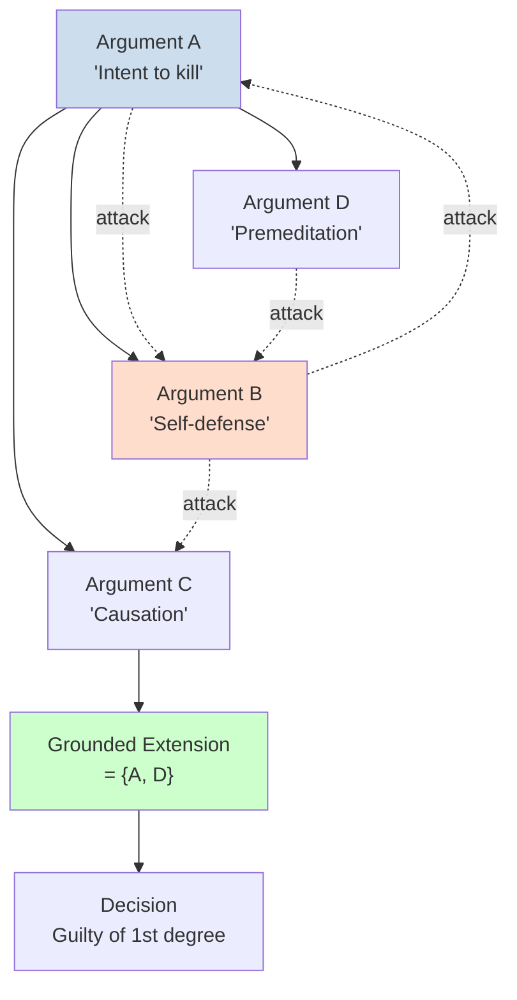

# Computational Legal Argumentation

## Overview

Legal argumentation is the structured process by which parties in a legal dispute present reasons for and against particular conclusions. Courts do not simply apply rules mechanically—they weigh competing arguments, consider exceptions, evaluate evidence, and construct reasoned conclusions that justify their decisions. Computational legal argumentation formalizes this process so it can be modeled, analyzed, and potentially automated.

The foundational formal model is the **Argumentation Framework** introduced by Dung (1995), which models arguments as nodes and attack relations between them. An argument is a unit of reasoning that, if accepted, supports a conclusion. Two arguments attack each other if they cannot both be accepted—for example, the prosecution argument ("the defendant stabbed the victim with intent") and the defense argument ("the defendant acted in self-defense"). The framework defines several semantics (complete, grounded, preferred, stable) that determine which sets of arguments can be accepted together.

**Case-Based Reasoning (CBR)** in law applies the principle that similar cases should be decided similarly. A CBR system retrieves prior cases most similar to the current case, identifies how those cases were decided, and adapts their reasoning to the current situation. The key challenge is determining case similarity: should we focus on facts, legal issues, or outcomes? Pratt's work on CBR for legal reasoning formalized cases as (problem, solution) pairs where the solution is the court's holding.

**Defeasible reasoning** captures the reality that legal rules often have exceptions. A rule like "contracts must be in writing to be enforceable" is defeatible because exceptions exist (e.g., promissory estoppel, partial performance, oral modifications in some jurisdictions). Defeasible logic extends classical logic with defeat relations: a conclusion supported by a rule can be defeated by a contrary argument. This matches how statutes contain exceptions ("unless..." clauses) and how case law evolves by recognizing new exceptions.

**Logic programming for legal norms** uses languages like Prolog and Answer Set Programming (ASP) to represent legal knowledge. A Prolog database of rules and facts can answer queries through resolution:

```
% Prolog-style legal knowledge base
enforceable(Contract) :- written(Contract).
enforceable(Contract) :- oral(Contract), promissory_estoppel(Contract), reliance(Contract).

% Query: ?- enforceable(X).
```

ASP extends this with non-monotonic reasoning—adding new facts can retract previous conclusions, matching how new precedents can undermine earlier holdings.

**Proof burden and standard of proof** modeling: In criminal law, the prosecution bears the burden of proving guilt beyond reasonable doubt. In civil law, the standard is preponderance of evidence. Computational models can represent these as threshold parameters on the cumulative weight of evidence, or as constraints on which conclusions can be drawn given partial information.

## Key Concepts

- **Dung's Argumentation Framework (AF)**: A formal system with arguments as nodes and attack relations; fundamental for computational models of legal reasoning
- **Argumentation semantics**: Grounded, complete, preferred, and stable semantics define which argument sets are mutually acceptable
- **Case-based reasoning (CBR)**: Retrieving and adapting prior case reasoning to the current case; implemented through similarity functions over case representations
- **Defeasible reasoning**: Reasoning with rules that can be defeated by contrary arguments; matches how legal rules have exceptions and conditions
- **Answer Set Programming (ASP)**: A logic programming paradigm supporting non-monotonic reasoning; used for representing legal knowledge bases
- **Standard of proof**: The threshold evidence required to reach a legal conclusion (beyond reasonable doubt, preponderance of evidence, clear and convincing)

## Code Examples

```python
# Simple Dung argumentation framework in Python

class ArgumentationFramework:
    def __init__(self, arguments: list, attacks: list[tuple]):
        self.arguments = set(arguments)
        self.attacks = set(attacks)  # (attacker, attacked)

    def attackers(self, arg) -> set:
        """Return arguments that attack the given argument."""
        return {a for a, b in self.attacks if b == arg}

    def grounded_extension(self) -> set:
        """
        Compute the grounded extension using the least fixed point of
        the characteristic function. The grounded extension is unique.
        """
        import copy
        S = set()  # Start with empty set
        while True:
            new_S = S.copy()
            for arg in self.arguments - S:
                # An argument is accepted if all its attackers are rejected
                if all(atkr in S for atkr in self.attackers(arg)):
                    new_S.add(arg)
            if new_S == S:
                break
            S = new_S
        return S

# Example: self-defense scenario
args = ["prosecution_intent", "defense_self_defense",
        "prosecution causation", "defense_necessity"]
attacks = [
    ("defense_self_defense", "prosecution_intent"),    # self-defense negates intent
    ("defense_necessity", "prosecution causation"),   # necessity negates causation
    ("prosecution_intent", "defense_self_defense"),    # intent attacks self-defense claim
]

af = ArgumentationFramework(args, attacks)
grounded = af.grounded_extension()
print(f"Grounded extension: {grounded}")
# Accepted: prosecution causation survives if not attacked by accepted self-defense claim
```

## Diagrams

**Argument → Attack Relation → Grounded Extension**



## Exercises/Projects

1. **Build an argumentation framework**: Model a contract dispute as a set of arguments and attacks. Compute the grounded extension and compare with your own legal judgment about which arguments should prevail.
2. **Implement CBR similarity**: Create a case base of 20 contract cases with fact descriptions and outcomes. Implement a similarity function over case facts. Query with a new case and retrieve the most similar past case.
3. **ASP for a simple legal domain**: Encode a simplified traffic law domain (speed limits, infractions, penalties) in ASP. Query the system to determine the penalty for a specific fact pattern.

## Further Reading

- Dung, P. M. (1995). "On the acceptability of arguments and its fundamental role in nonmonotonic reasoning, logic programming and n-person games." *Artificial Intelligence*.
- Prakken, H., & Sartor, G. (2015). "Law and Logic: A Review from an Argumentation Perspective." *Artificial Intelligence*.
- Ashley, K. D. (2017). *Artificial Intelligence and Legal Analytics* — Chapter 6 on case-based reasoning.
- Brewka, G., et al. (2016). "Representing Legal Knowledge in Dependant Logic Theories." *AI and Law*.