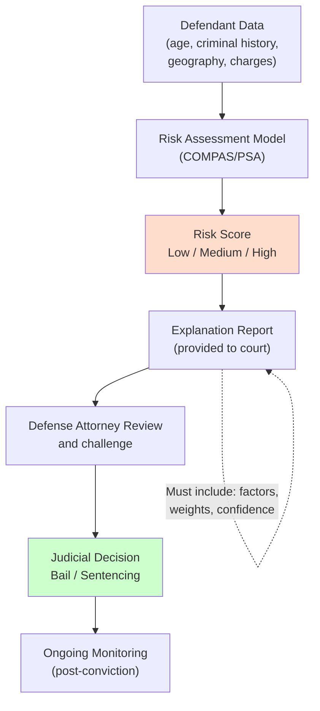

# AI for Law Enforcement and Criminal Justice

## Overview

The intersection of AI and criminal justice is among the most consequential—and controversial—in the field. AI tools are deployed at multiple stages of the justice pipeline: predictive policing to allocate patrol resources, risk assessment to inform bail and sentencing, facial recognition to identify suspects, and automated transcription to speed up case processing. Each application raises distinct concerns about fairness, accuracy, and due process.

**Risk assessment tools** like **COMPAS** (Correctional Offender Management Profiling for Alternative Sanctions) and the **PSA equivant** (Public Safety Assessment) attempt to量化 the likelihood that a defendant will reoffend if released pre-trial or post-sentencing. COMPAS uses 137 features including criminal history, age, and geography to generate a risk score from 1 to 10. The PSA provides three scores: new criminal activity, new violent criminal activity, and failure to appear.

The core critique of risk assessment tools centers on **bias**. ProPublica's seminal 2016 analysis of COMPAS found that Black defendants were nearly twice as likely as white defendants to be incorrectly flagged as high risk (false positives). This disparity arises because the model learns correlations between race-correlated features (like zip code or arrest history) and outcomes, embedding historical discrimination into predictions. The debate touches on fundamental questions: Is it legitimate to use features correlated with protected characteristics? How should we define and measure fairness?

Different definitions of fairness are mathematically incompatible—a result known as the **impossibility theorem** for group fairness. Three common definitions:

- **Equalized odds**: Equal false positive rates across groups: $P(\hat{Y}=1|A=0) = P(\hat{Y}=1|A=1)$ when $Y=0$
- **Predictive parity**: Equal positive predictive values across groups: $P(Y=1|\hat{Y}=1, A=0) = P(Y=1|\hat{Y}=1, A=1)$
- **Calibration**: Scores should mean the same thing across groups: $P(Y=1|\hat{S}=s, A=0) = P(Y=1|\hat{S}=s, A=1)$

No tool can satisfy all three simultaneously when base rates differ across groups, as they often do due to unequal policing patterns.

**Bail and sentencing recommendation systems** formalize thejudicial discretion that historically resided with judges. These tools provide recommendations that judges are free to ignore, but research shows anchoring effects: even advisory recommendations influence decisions. Due process requires that defendants have the opportunity to contest the inputs to these systems—a process called "meaningful audit."

**Facial recognition** in law enforcement raises distinct concerns. Studies show that commercial facial recognition systems have higher error rates on darker-skinned individuals, creating disparate impact in suspect identification. Several states and municipalities have banned or restricted law enforcement use of facial recognition.

The ethical framework for AI in criminal justice is grounded in **due process** (procedural fairness in legal proceedings) and **equal protection** (equal treatment under law regardless of protected characteristics). These constitutional principles create hard constraints on how AI can be deployed: predictions must be explainable to defendants, must not discriminate on the basis of race, and must be subject to meaningful human review.

## Key Concepts

- **COMPAS (Correctional Offender Management Profiling for Alternative Sanctions)**: A risk assessment tool used in US courts to predict recidivism; subject of major fairness critique
- **Risk assessment tools**: Algorithmic systems that predict likelihood of reoffending or failure to appear, used in bail and sentencing decisions
- **Algorithmic bias in criminal justice**: Systematic errors that disproportionately harm protected groups; arises from training data reflecting historical discrimination
- **Fairness definitions**: Equalized odds, predictive parity, calibration, and the impossibility theorem showing they cannot all be satisfied simultaneously
- **Due process**: Constitutional guarantee requiring fair legal procedures; for AI, requires explainability and the right to contest algorithmic decisions
- **Equal protection**: Constitutional principle requiring equal treatment; constrains AI use to avoid discriminatory outcomes
- **Anchoring effect**: Psychological tendency to过度 rely on the first piece of information (the AI recommendation) when making decisions

## Code Examples

```python
# Simple demonstration of fairness metrics

import numpy as np
from sklearn.metrics import confusion_matrix

def compute_fairness_metrics(y_true: np.ndarray, y_pred: np.ndarray, 
                             group: np.ndarray) -> dict:
    """Compute fairness metrics for a binary classifier across two groups."""
    results = {}
    for g in np.unique(group):
        mask = group == g
        tn, fp, fn, tp = confusion_matrix(y_true[mask], y_pred[mask]).ravel()
        fpr = fp / (fp + tn)  # False positive rate
        fnr = fn / (fn + tp)  # False negative rate
        ppv = tp / (tp + fp)  # Positive predictive value (precision)
        results[f"group_{g}"] = {
            "FPR": fpr, "FNR": fnr, "PPV": ppv,
            "base_rate": (tp + fn) / (tp + fn + fp + tn)
        }
    
    # Disparity: ratio of FPR between groups
    fpr_0 = results["group_0"]["FPR"]
    fpr_1 = results["group_1"]["FPR"]
    results["FPR_disparity"] = fpr_1 / fpr_0 if fpr_0 > 0 else float('inf')
    
    return results

# Simulated data: COMPAS-like risk assessment with racial bias
np.random.seed(42)
n = 1000
group = np.concatenate([np.zeros(500), np.ones(500)])  # Two groups
# True outcomes (higher for group_1)
y_true = (np.random.rand(n) < 0.4).astype(int)
group_1_mask = group == 1
y_true[group_1_mask] = (np.random.rand(500) < 0.5).astype(int)

# Simulated biased predictions (higher false positives for group_1)
y_pred = y_true.copy()
# Introduce bias: inflate positive predictions for group_1
biased_preds = (np.random.rand(n) < 0.35).astype(int)
y_pred[group_1_mask & (y_pred == 0)] = biased_preds[group_1_mask & (y_pred == 0)]

metrics = compute_fairness_metrics(y_true, y_pred, group)
print("Fairness Metrics:")
for metric, value in metrics.items():
    print(f"  {metric}: {value}")
```

## Diagrams

**Risk Score → Explanation → Review → Decision**



## Exercises/Projects

1. **Analyze COMPAS-like data**: Generate synthetic data with group disparities. Compute FPR disparity, PPV disparity, and calibration across groups. Discuss whether these disparities are ethically acceptable.
2. **Build a simplified risk assessment**: Train a logistic regression on features including age, prior convictions, and charge type. Evaluate accuracy and fairness metrics. Discuss trade-offs.
3. **Evaluate facial recognition fairness**: If using a publicly available model, test performance across demographic groups on a face verification task. Analyze differential performance.

## Further Reading

- ProPublica (2016). "Machine Bias: There's a computer algorithm thatpredicts future criminals." — seminal COMPAS analysis.
- Angwin, J., et al. (2016). "Machine Bias." *ProPublica*.
- Kleinberg, J., et al. (2016). "Inherent Trade-Offs in the Fair Determination of Risk Scores." *ITCS* — proof of impossibility theorem for fairness.
- Richardson, R., et al. (2019). "Confronting Black-Box Algorithms." *NYU Law Review*.
- Dressel, J., & Farid, H. (2018). "The accuracy, fairness, and limits of predicting recidivism." *Science Advances*.