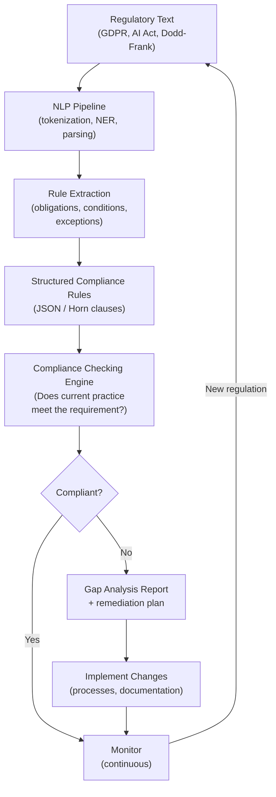

## AI for Governance, Regulation, and Compliance

## Overview

Regulatory compliance is a multi-billion dollar industry. Companies must navigate complex, overlapping, and frequently changing regulations across jurisdictions—from GDPR's data protection requirements in Europe to the Dodd-Frank Act's financial regulations in the US to the AI Act's requirements for high-risk AI systems. The manual process of tracking regulatory changes, assessing their impact on business operations, and implementing compliance controls is resource-intensive and error-prone. AI offers tools to automate and scale this work.

**Regulatory text understanding** involves the same challenges as statutory reasoning (discussed in Lesson 5), but with additional complexity: regulations from different jurisdictions may conflict, may use different defined terms for the same concept, and may have different enforcement mechanisms. A global company may need to simultaneously comply with GDPR (EU), CCPA (California), PIPL (China), and LGPD (Brazil)—each with distinct requirements and terminological conventions.

**Compliance monitoring and auditing** uses AI to continuously monitor business operations and detect potential violations before they result in regulatory action. Examples: AI that monitors trading activity for market manipulation patterns, NLP that scans marketing materials for unapproved health claims, computer vision that verifies environmental compliance (e.g., monitoring factory emissions via satellite imagery).

**Rule extraction from regulations** is a specialized form of statutory reasoning. GDPR Article 17, for instance, grants individuals the "right to be forgotten"—but this right is not absolute. The article lists conditions under which an organization may legitimately retain data even when a deletion request is received. Extracting these conditions as structured rules enables automated compliance checking: given a data retention scenario and a user's deletion request, does a legitimate retention exception apply?

**Automated regulatory impact assessment (RIA)** uses AI to predict the consequences of proposed regulations before they are enacted. RIA tools estimate costs and benefits across affected industries, model behavioral responses to regulatory incentives, and flag potential unintended consequences. The EU's Better Regulation guidelines require RIA for all significant legislation; AI tools can assist regulators in conducting RIA at scale.

The **EU AI Act** (Regulation (EU) 2024/1689) establishes a risk-based framework for AI regulation in Europe:

| Risk Level | Examples | Requirements |
|------------|----------|--------------|
| Unacceptable | Social scoring by governments | Prohibited |
| High | AI in hiring, credit, education, law enforcement | Conformity assessment, technical documentation, human oversight |
| Limited | Chatbots, AI-generated content | Transparency obligations |
| Minimal | Spam filters, AI in video games | No specific requirements |

This framework creates a new compliance category: organizations deploying high-risk AI systems must conduct conformity assessments, maintain technical documentation, implement human oversight measures, and register in an EU database.

**Multi-jurisdiction compliance** is particularly challenging for global organizations. When a regulation is enacted or amended, legal teams must quickly assess: (1) does this apply to us? (2) what must change in our processes? (3) what is the deadline? AI tools that ingest regulatory text, compare against a company's current compliance posture, and generate gap analyses can reduce response time from weeks to hours.

## Key Concepts

- **EU AI Act**: Regulation (EU) 2024/1689 establishing risk-based requirements for AI systems in the EU; affects any organization deploying AI in Europe
- **Regulatory impact assessment (RIA)**: Systematic analysis of the expected consequences of a proposed regulation; required for significant EU legislation
- **GDPR (General Data Protection Regulation)**: EU regulation governing data protection and privacy; compliance requires ongoing monitoring and documentation
- **Conformity assessment**: Process of demonstrating that an AI system meets the requirements of the EU AI Act for high-risk applications
- **Compliance monitoring**: Continuous AI-assisted surveillance of business operations for regulatory violations
- **Multi-jurisdiction compliance**: The challenge of simultaneously meeting regulatory requirements across multiple legal systems with different rules

## Code Examples

```python
import re

def extract_gdpr_obligations(article_text: str) -> list[dict]:
    """Extract obligations and conditions from GDPR article text."""

    # Pattern:识别obligation-triggering phrases
    obligation_patterns = [
        (r"shall\s+(.+?)(?:\.|$)", "obligation"),
        (r"must\s+(.+?)(?:\.|$)", "obligation"),
        (r"may\s+(.+?)(?:\.|\,)", "permission"),
        (r"shall\s+not\s+(.+?)(?:\.|$)", "prohibition"),
        (r"the\s+controller\s+(.+?)(?:\.|$)", "controller_duty"),
    ]

    results = []
    for pattern, label in obligation_patterns:
        matches = re.finditer(pattern, article_text, re.IGNORECASE | re.MULTILINE)
        for m in matches:
            results.append({
                "type": label,
                "text": m.group(0).strip(),
                "action": m.group(1).strip() if m.lastindex else m.group(0)
            })

    # Extract exceptions (条件 clauses)
    exception_pattern = r"where\s+(.+?)(?:shall|must|may)"
    exceptions = re.findall(exception_pattern, article_text, re.IGNORECASE)

    return {
        "obligations": results,
        "exceptions": [{"condition": e.strip()} for e in exceptions]
    }

gdpr_article17 = """
Article 17 Right to erasure ('right to be forgotten')
1. The data subject shall have the right to obtain from the controller the
   erasure of personal data concerning him or her without undue delay and
   the controller shall have the obligation to erase personal data.
2. Where the controller has made the personal data public, the controller
   shall take account of available technology and the cost of erasure...
3. The right to erasure shall not apply to the extent that processing is
   necessary for the establishment, exercise or defence of legal claims.
"""

result = extract_gdpr_obligations(gdpr_article17)
print("Extracted obligations:")
for obl in result["obligations"]:
    print(f"  [{obl['type']}] {obl['text']}")
print("\nExceptions:")
for exc in result["exceptions"]:
    print(f"  {exc}")
```

## Diagrams

**Regulation → Obligation Extraction → Compliance Check**



## Exercises/Projects

1. **Build a regulatory obligation extractor**: Select a well-known regulation (e.g., GDPR, CCPA, or a financial regulation). Implement a pattern-based extractor that identifies obligations, permissions, and prohibitions. Evaluate precision on a set of manually annotated articles.
2. **Multi-jurisdiction compliance checker**: Build a simple system that ingests regulations from two jurisdictions with overlapping scope (e.g., GDPR and CCPA, both dealing with data privacy). Identify conflicts and gaps between the two.
3. **AI Act compliance gap analysis**: Enumerate the requirements for a high-risk AI system under the EU AI Act. Build a checklist and assess whether a hypothetical AI hiring system meets each requirement.

## Further Reading

- EU AI Act (2024). Regulation (EU) 2024/1689, Official Journal of the European Union.
- Voen, M., & Bibal, A. (2024). "A systematic review of AI for regulatory compliance." *Artificial Intelligence and Law*.
- GDPR official text and ICO guidance on compliance.
- IBM PAIRS to monitor regulatory changes at scale — see related publications on AI for governance.