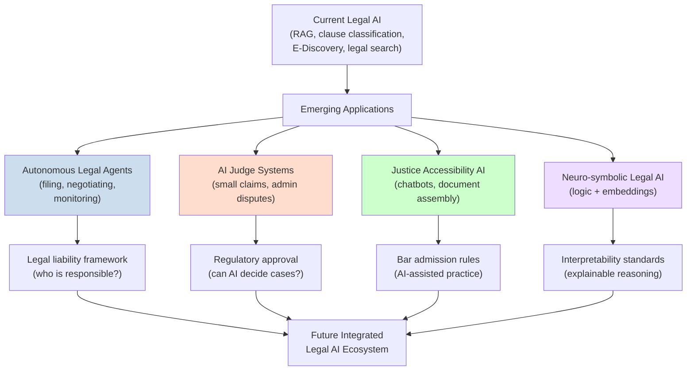

# Frontiers: AI and the Future of Legal Systems

## Overview

We stand at an inflection point in the relationship between artificial intelligence and law. After decades of specialized expert systems, the last five years have seen a rapid convergence of powerful language models, retrieval-augmented architectures, and legal-domain fine-tuning that enables AI to perform legal tasks with unprecedented accuracy. Yet the most transformative applications are still emerging, and the path forward involves not just better technology but careful governance of how that technology is integrated into legal systems.

**AI judges and robo-justice concerns** represent the most provocative frontier. Estonia has piloted an AI-based system for small claims disputes, and China's internet courts have used AI for document review and case management. Proponents argue that AI judges could reduce costs, eliminate geographical disparities, and ensure consistent application of rules. Critics worry about due process: can a defendant have a fair hearing when the decision-maker is a black-box algorithm? The US Constitution's Seventh Amendment guarantee of jury trials in civil cases creates additional legal barriers in American jurisdictions. Even if AI could match human judicial performance on average, the question of whether it is *legally permissible* to delegate judicial power to an AI remains deeply contested.

**Access to justice** is perhaps the most compelling moral argument for Legal AI. Studies estimate that 80-90% of legal needs among low-income Americans go unmet. Chatbots, document assembly tools, and AI-assisted research can provide basic legal guidance at near-zero marginal cost. Organizations like Door Courthouse and Upsolve use AI to help self-represented litigants navigate complex procedures. The goal is not to replace lawyers but to provide scalable first-line assistance that helps people resolve legal problems before they escalate.

**Autonomous legal agents** represent a leap beyond today's RAG-based systems. An autonomous agent would not just retrieve and summarize—it would take actions: filing documents with a court, sending formal letters, negotiating settlements within defined parameters, and monitoring regulatory databases for relevant changes. Multi-agent architectures with specialized roles (research agent, drafting agent, filing agent, compliance monitoring agent) are being explored in cutting-edge legal tech startups.

**Liability and accountability for AI legal advice** is an unsettled but critical question. When a lawyer relies on AI to draft a brief or research precedents and the brief contains a critical error, who is liable? The lawyer (under professional responsibility rules), the law firm (under respondeat superior), the AI vendor (under product liability theory), or some combination? Courts have not definitively answered this question. The American Bar Association and state bar associations have issued guidance suggesting that lawyers bear ultimate responsibility for AI-assisted work product, but the liability landscape remains fluid.

**International perspectives**: The EU AI Act creates the world's first comprehensive AI regulatory framework with specific provisions for AI used in legal contexts (high-risk). The US approach remains sectoral—FDA regulates AI in healthcare, FTC regulates AI in consumer finance, but there is no federal AI law analogous to the EU AI Act. China's Algorithmic Recommendation Regulations (2022) and Generative AI Regulations (2023) represent a distinct regulatory philosophy emphasizing content control and algorithmic transparency. These divergent approaches create a fragmented global landscape for AI legal compliance.

Emerging research directions include:

- **Formal verification of legal AI**: Using formal methods to prove properties of legal AI systems (e.g., fairness guarantees, safety bounds)
- **Legal reasoning as a benchmark**: Developing standardized benchmarks for legal reasoning capabilities (similar to MMLU for general knowledge)
- **Neuro-symbolic legal AI**: Combining neural language models with symbolic logic engines for interpretable legal reasoning
- **Federated learning for legal data**: Enabling AI training across law firm data silos without sharing privileged client information

## Key Concepts

- **AI judges**: Systems that make or significantly inform judicial decisions; raises due process and constitutional concerns
- **Access to justice**: The gap between legal needs and legal services; AI tools to bridge this gap for underserved populations
- **Autonomous legal agents**: AI systems that take actions (file documents, send notices) rather than just providing information
- **Liability for AI legal advice**: Questions of professional responsibility, product liability, and regulatory accountability
- **EU AI Act**: The EU's comprehensive AI regulation; creates compliance requirements for AI in legal applications
- **Neuro-symbolic AI**: Hybrid approach combining neural language models with symbolic logic for interpretable reasoning

## Diagrams

**Current Legal AI Landscape → Future Directions**

## Exercises/Projects

1. **Debate: AI judges**: Argue both sides of whether AI should be permitted to make binding judicial decisions in any context. Identify the strongest arguments for and against. What conditions would need to be met for you to change your position?
2. **Design an access-to-justice tool**: Propose an AI tool to help a specific underserved population (e.g., tenants facing eviction, immigrants navigating visa processes). Define the scope, limitations, and how it would be evaluated for effectiveness.
3. **Liability analysis**: Research the current state of liability law as it applies to AI-generated legal advice. Write a memo advising a law firm on best practices for AI tool adoption and documentation.

## Further Reading

- Katz, D., et al. (2023). "The Future of Legal AI." *University of Chicago Law Review Online*.
- OECD AI Policy Observatory — AI and law monitoring across jurisdictions.
- EU AI Act (2024). Full text and implementing guidance.
- Bessmeltsova, M., et al. (2024). "Autonomous Legal Agents: Opportunities and Risks." *AI and Law* journal.
- World Bank Justice for All report on access to justice gaps.