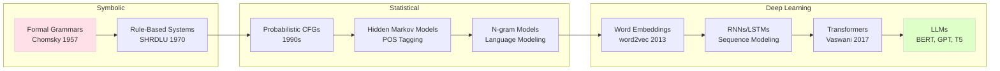

# Introduction to AI for Linguistics

## Overview

Language is humanity's most powerful cognitive tool — and arguably the most complex information processing system we know of. Understanding how language works has occupied philosophers and linguists for millennia, but only in the past seventy years has computation entered the picture. The field of **computational linguistics**, later renamed **natural language processing (NLP)**, emerged at the intersection of linguistics and computer science, and has undergone nothing short of a revolution since the deep learning era began in 2013.

This course — **AI for Linguistics** — inverts the usual framing. Rather than asking "how can AI process language?", we ask "what can AI teach us about how language itself works?" We use modern AI tools — large language models, word embeddings, sequence-to-sequence architectures — as instruments for linguistic inquiry: probing what knowledge these systems acquire, what biases they encode, and what their failures reveal about the nature of human language.

---

## Why Linguistics Matters for AI

Modern language models are trained on staggeringly large text corpora — hundreds of billions of tokens from books, websites, and documents. From this raw text, they appear to acquire rich knowledge about grammar, meaning, discourse, and even reasoning. But what exactly do they learn? And does the way they learn parallel or diverge from how humans acquire language?

These are not merely engineering questions. They touch on deep issues in linguistic theory: Is there a universal grammar hard-coded in the human brain, as Noam Chomsky argued? Do neural networks implicitly implement symbolic processing? Can statistical learning account for the productivity of language — our ability to produce and understand infinitely many novel sentences?

AI for Linguistics approaches these questions empirically, using the tools of machine learning to test linguistic hypotheses.

---

## A Brief History: From Formal Grammars to Large Language Models

The intellectual lineage of NLP runs through multiple traditions:

**Symbolic era (1950s–1990s)**: Chomsky's formal grammars (phrase structure grammars, transformational grammar) provided precise mathematical descriptions of syntactic competence. Early NLP systems like SHRDLU (Winograd, 1970) used hand-crafted rules to parse and reason about restricted domains. The Georgetown-IBM experiment (1954) promised fully automatic translation, a goal that proved far more elusive than expected.

**Statistical revolution (1990s–2012)**: After the failure of purely rule-based systems, probability entered NLP. Hidden Markov Models (HMMs) for part-of-speech tagging, probabilistic context-free grammars for parsing, and n-gram language models dominated. The Penn Treebank (Marcus et al., 1993) provided annotated corpora that enabled data-driven approaches. WordNet (Miller, 1995) created a lexical database encoding synsets and hypernymy relationships.

**Deep learning era (2013–present)**: The word2vec paper (Mikolov et al., 2013) showed that dense embeddings could capture semantic relationships. Recurrent neural networks (LSTMs, GRUs) enabled sequence modeling. The Transformer architecture (Vaswani et al., 2017) became the dominant paradigm, culminating in BERT (Devlin et al., 2019) and GPT-3 (Brown et al., 2020), which demonstrated that scale — billions of parameters trained on internet-scale text — yields emergent linguistic and reasoning capabilities.

---

## The Linguistics Prerequisites

To engage with AI for Linguistics, you need familiarity with core linguistic concepts:

- **Phonetics and phonology**: The sounds of language and the abstract inventory of phonemes
- **Morphology**: Word formation — inflection (walk → walks) and derivation (happy → happiness)
- **Syntax**: Sentence structure — how words combine into phrases and sentences
- **Semantics**: Meaning — lexical semantics (word meanings) and compositional semantics (how phrases compose meanings)
- **Pragmatics**: Context-dependent meaning, implicature, discourse coherence

We will revisit each of these levels throughout the course, examining both classical computational approaches and modern neural methods.

---

## Key Concepts

- **Computational linguistics / NLP**: The interdisciplinary field of computational models for language
- **Formal grammar**: Mathematical systems (CFG, TAG, CCG) that generate and parse sentences
- **Language model**: A probability distribution over sequences; GPT-style models are neural language models
- **Emergent capabilities**: Abilities that appear in large models but not small ones (scaling phenomena)
- **Probing / elicitation**: Using behavioral tests and probing classifiers to investigate what linguistic knowledge models encode

## Exercises

1. **Linguistic analysis**: Take the sentence "The linguist whom the philosopher admired quickly conceded the argument." Draw its constituency tree and identify all clauses, their heads, and grammatical relations.
2. **History survey**: Read the first page of Chomsky's 1957 *Syntactic Structures* and contrast its formal approach with the distributional hypothesis underlying word embeddings.
3. **Reflection**: What does it mean to "understand" a sentence? Can a language model understand anything? Write 200 words engaging with this philosophical question.

## Further Reading

- Chomsky, N. (1957). *Syntactic Structures*. Mouton.
- Manning, C.D. & Schütze, H. (1999). *Foundations of Statistical Natural Language Processing*. MIT Press.
- Devlin, J. et al. (2019). "BERT: Pre-training of Deep Bidirectional Transformers for Language Understanding." *NAACL*.
- Rogers, A. et al. (2021). "A Primer in BERTopics." *arXiv:2104.12250*.
