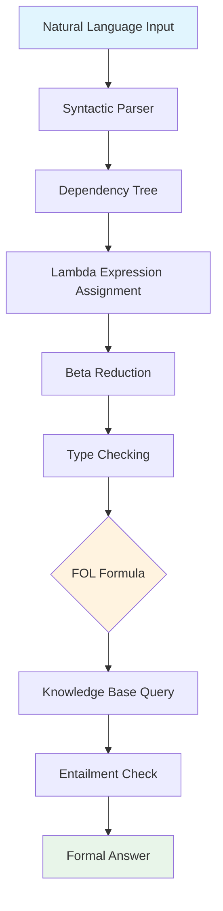

# Formal Semantics and Logical Reasoning with LLMs

## Overview

Formal semantics provides a mathematically rigorous framework for representing meaning in natural language. This lesson bridges classical computational semantics — lambda calculus, first-order logic, and compositional derivations — with modern LLMs' emergent reasoning capabilities. We examine how transformer-based models perform on formal reasoning tasks, where they fail, and why.

## Key Concepts

### Compositional Semantics and Lambda Calculus

Natural language meaning can be computed compositionally — the meaning of a phrase is a function of the meanings of its parts and how they combine. Richard Montague formalized this insight with typed lambda calculus:

$$[[\text{John walks}]] = \text{walk}(j)$$

$$[[\text{Every student studies}]] = \forall x: \text{student}(x) \rightarrow \text{studies}(x)$$

Lambda calculus provides the machinery: $\lambda x. \text{walk}(x)$ is a function that, when applied to $j$, yields $\text{walk}(j)$. This is the backbone of formal semantic parsers like Flex-parser and CoreNLP's semantic parser.

### Semantic Parsing Pipeline

A semantic parser converts natural language into formal logical forms:

1. **Syntactic analysis** — Parse tree using constituency or dependency grammar
2. **Semantic attachment** — Lambda expressions attached to each phrase
3. **Lambda reduction** — Apply arguments to functions via beta-reduction
4. **Type checking** — Ensure compositional rules are respected (type theory)

Modern neural semantic parsers (e.g., AllenNLP's SQL parser, Google SQL assistant) use sequence-to-sequence models that directly map utterances to logical forms without explicit lambda calculus intermediate steps.

### First-Order Logic and Knowledge Representation

First-order logic (FOL) provides the representational substrate for formal reasoning. Key connectives:

- $\forall$ (universal quantification): $\forall x \, \text{Mammal}(x) \rightarrow \text{Animal}(x)$
- $\exists$ (existential quantification): $\exists x \, \text{Dog}(x) \wedge \text{Brown}(x)$
- $\neg, \wedge, \vee, \rightarrow$ (standard Boolean operators)

Knowledge bases (Cyc, WordNet, PROVER) encode world knowledge as FOL axioms, enabling theorem-proving inference.

### LLM Performance on Formal Reasoning Tasks

LLMs demonstrate surprising competence on some formal reasoning benchmarks:

**What works:**
- Propositional logic puzzles ( Knights and Knaves problems )
- Simple syllogisms with clear premise-conclusion structure
- Math word problems translatable to symbolic form

**What fails:**
- Multi-step chained logical deductions (performance degrades sharply beyond 2-3 hops)
- Quantifier alternation (scope ambiguities like "Every student passed some exam")
- Binding and coreference resolution in formal contexts

A key finding: LLMs often produce "heuristic alignment" — matching surface patterns rather than computing genuine logical entailment. This is why benchmarks like RuleLogic and LogiQA expose systematic failures.

### Probing LLMs for Semantic Knowledge

Probing techniques ask: does the model's internal representation encode semantic knowledge? We can train classifiers on LLM hidden states to predict:

- Argument structure (subject vs. object)
- Quantifier scope (wide-scope vs. narrow-scope reading)
- Verb tense and aspect
- Entailed vs. entailed-not relations

BERT-based models show surprising accuracy on these tasks, suggesting that linguistic knowledge — including semantics — is partially encoded in attention patterns. However, probing accuracy doesn't guarantee productive reasoning ability.

### Theorem Proving and Formal Verification

Interactive theorem provers (Coq, Lean, Isabelle) encode mathematics as formal proofs. LLMs are now used in:

- **Autoformalization** — Translating natural language proofs into formal code
- **Proof search guidance** — Suggesting next proof step from current state
- **Lemma discovery** — Finding novel lemmas that bridge gaps in proofs

DeepMind's AlphaProof system combined LLM search with formal verification for mathematical reasoning. The key challenge: autoformalization requires both precise semantic parsing AND domain knowledge about what constitutes a valid mathematical argument.

## Code Examples

```python
# Simple lambda calculus evaluator
from typing import Callable, Any

class LambdaExpr:
    pass

class Var(LambdaExpr):
    def __init__(self, name): self.name = name
    def __repr__(self): return self.name

class Abs(LambdaExpr):
    def __init__(self, var: str, body: LambdaExpr):
        self.var = var
        self.body = body
    def __repr__(self): return f"(λ{self.var}. {self.body})"

class App(LambdaExpr):
    def __init__(self, func: LambdaExpr, arg: LambdaExpr):
        self.func = func
        self.arg = arg
    def __repr__(self): return f"({self.func} {self.arg})"

def beta_reduce(expr: LambdaExpr, env: dict = None) -> LambdaExpr:
    """Beta-reduction: (λx. M) N → M[x/N]"""
    if env is None: env = {}
    if isinstance(expr, Var):
        return env.get(expr.name, expr)
    elif isinstance(expr, Abs):
        return Abs(expr.var, beta_reduce(expr.body, env))
    elif isinstance(expr, App):
        func = beta_reduce(expr.func, env)
        arg = beta_reduce(expr.arg, env)
        if isinstance(func, Abs):
            new_env = {**env, func.var: arg}
            return beta_reduce(func.body, new_env)
        return App(func, arg)
    return expr

# Example: (λf. f x) (λy. y) → x
expr = App(Abs("f", App(Var("f"), Var("x"))), Abs("y", Var("y")))
print(f"Original: {expr}")
print(f"Reduced:  {beta_reduce(expr)}")
# Output: Reduced:  x
```

```python
# First-order logic inference with forward chaining
from collections import defaultdict

class KnowledgeBase:
    def __init__(self):
        self.facts = set()
        self.rules = []  # (antecedents, consequent)

    def add_fact(self, fact):
        self.facts.add(fact)

    def add_rule(self, antecedents, consequent):
        self.rules.append((antecedents, consequent))

    def forward_chain(self):
        """Infer new facts until fixpoint"""
        changed = True
        while changed:
            changed = False
            for ants, cons in self.rules:
                if all(a in self.facts for a in ants) and cons not in self.facts:
                    self.facts.add(cons)
                    changed = True
        return self.facts

# Example: Mammal → Animal, Dog → Mammal, Dog(spot)
# → Animal(spot)
kb = KnowledgeBase()
kb.add_rule(["Mammal(x)"], "Animal(x)")  # ∀x: Mammal(x) → Animal(x)
kb.add_rule(["Dog(x)"], "Mammal(x)")      # ∀x: Dog(x) → Mammal(x)
kb.add_fact("Dog(spot)")
inferred = kb.forward_chain()
print(inferred)  # {'Dog(spot)', 'Mammal(spot)', 'Animal(spot)'}
```

## Diagrams



## Exercises/Projects

1. **Lambda Calculus Interpreter**: Build a lambda calculus interpreter supporting free/bound variable tracking and normal order reduction. Test it on Church encodings (Church numerals, booleans, pairs).

2. **Logical Form Parser**: Train a sequence-to-sequence model (T5-small fine-tuned on PENMAN data) to parse simple English sentences into lambda-calculus logical forms. Evaluate on AMR benchmarks.

3. **LLM Logical Reasoning Benchmark**: Evaluate GPT-4o on a curated set of first-order logic problems at varying depths (1-hop through 5-hop deductions). Generate confusion matrix of failure modes.

4. **Syllogism Solver**: Implement a syllogistic reasoning system using classical Aristotelian logic rules. Compare its accuracy on standard syllogism test sets vs. LLM-based approaches.

## Further Reading

- [Montague Grammar (1970)](https://www.jstor.org/stable/2214509) — Original formal semantics paper
- [BERT: Pre-training of Deep Bidirectional Transformers for Language Understanding](https://arxiv.org/abs/1810.04805) — Probing for linguistic knowledge
- [AlphaProof: Reinforcement Learning for Mathematical Reasoning](https://arxiv.org/abs/2407.10671) — Autoformalization with LLMs
- [Logical Entailment in NLP: A Survey](https://arxiv.org/abs/2203.10506)