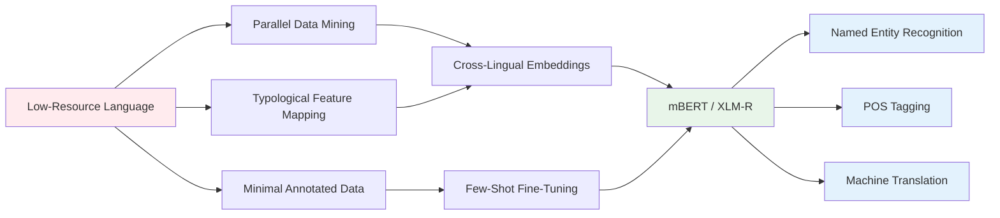

# Linguistic Diversity and Low-Resource NLP

## Overview

Of the 7,000+ languages spoken today, the vast majority are considered "low-resource" — having limited or no digitized text corpora, few annotated datasets, and minimal NLP tooling. Yet these languages represent irreplaceable cultural knowledge and are increasingly endangered. This lesson examines how modern AI techniques — few-shot learning, cross-lingual transfer, active learning, and AI-assisted language documentation — are being applied to preserve and process linguistic diversity.

## Key Concepts

### The Low-Resource NLP Challenge

Low-resource languages face compounding challenges:

- **Data scarcity**: Often less than 1MB of digitized text exists online
- **Annotation cost**: Hiring native speakers with linguistic expertise is expensive
- **Morphological complexity**: Languages like Turkish, Finnish, or Inuktitut have rich morphology requiring specialized tokenization
- **Orthographic inconsistency**: Many languages lack standardized writing systems
- **Endangerment**: UNESCO estimates ~50% of languages will be extinct by 2100

The "AI for linguistics" community has made significant progress: models like mBERT and XLM-R can learn cross-lingual representations from monolingual corpora alone, enabling transfer to unseen languages. But morphological richness, limited parallel data, and domain shift remain open problems.

### Cross-Lingual Transfer Learning

The key insight: languages share structural regularities — similar syntactic patterns, semantic roles, and even phonetic inventories. A model trained on high-resource languages (English, Chinese, French) can learn generalizable representations that transfer to low-resource languages.

**Techniques:**

1. **Massively multilingual models**: mBERT, XLM-R trained on 100+ languages in a single model. Cross-lingual attention allows sharing representations across languages.

2. **Parallel corpus methods**: Moses phrase-based MT, neural sequence-to-sequence models, and crucially, automatic mining of parallel sentences from Wikipedia and other sources.

3. **Cross-lingual word embeddings**: Train word2vec-style embeddings where translation pairs are aligned (MUSE, VecMap). Enables "translation" of semantic space.

4. **Language family transfers**: Training on languages within the same family (e.g., Bantu languages) yields much better transfer than distant language pairs.

```python
# Cross-lingual embedding alignment with VecMap
# Based on Conneau et al. (2018) — VecMap: Unsupervised Word Alignment

import numpy as np

def procrustes(src_emb, tgt_emb):
    """Align source embeddings to target using orthogonal Procrustes"""
    # Center the embeddings
    src_centered = src_emb - src_emb.mean(axis=0)
    tgt_centered = tgt_emb - tgt_emb.mean(axis=0)

    # SVD to find optimal rotation
    U, _, Vt = np.linalg.svd(src_centered.T @ tgt_centered)
    R = U @ Vt  # Orthogonal rotation matrix

    # Apply transformation
    aligned = src_emb @ R
    return aligned

# Usage: align English embeddings to Swahili
# W_unaligned_en → W_aligned_en ≈ W_swa
# Now English words project near their Swahili translations
```

### Few-Shot and Zero-Shot Learning

Modern LLMs exhibit remarkable few-shot capabilities: given a few examples in a prompt, they can perform tasks in languages they were not specifically trained on.

**Zero-shot cross-lingual transfer**: XLM-R trained purely on monolingual data (no parallel corpora) achieves strong performance onXNLI (15 languages) and MLQA (6 languages) with no task-specific training data in the target language.

**Few-shot cross-lingual NER**: With just 5-10 labeled examples in a low-resource language, GPT-4o achieves competitive NER accuracy vs. models trained on thousands of examples.

Key mechanism: the model's multilingual parametric knowledge — learned jointly during pretraining — generalizes to new languages based on typological similarity.

### Typological Features and Language Families

Linguistic typology classifies languages by structural features rather than historical lineage. Important typological dimensions:

| Feature | Example Languages | NLP Implication |
|---------|-------------------|-----------------|
| Word order (SVO/SOV/VSO) | English/Chinese/Turkish | Constituent order parsing |
| Morphological richness | Finnish/Inuktitut/Arabic | Tokenization, lemmatization |
| Tonal vs. non-tonal | Yoruba/Mandarin vs. Spanish | Speech processing |
| Noun class systems | Bantu languages | Agreement handling |
| Ergativity | Basque/Georgian | Semantic role labeling |

Models trained on typologically similar languages transfer better. The "Universals" assumption in linguistics — that all languages share deep structural regularities — underlies cross-lingual transfer.

### AI for Language Documentation

Endangered languages face an existential documentation challenge. AI is being applied at multiple levels:

1. **Automatic phonemic transcription**: Whisper ASR models fine-tuned on under-documented languages produce surprisingly accurate transcripts from field recordings.

2. **Morphological analyzer construction**: Active learning and unsupervised methods infer morpheme boundaries and paradigms from raw text with minimal human annotation.

3. **Dictionary extraction**: LLMs parse lexical entries from grammars, field notes, and existing dictionaries to bootstrap new resources.

4. **Story/traditional knowledge preservation**: Video + audio + NLP pipelines enable preservation and accessibility of oral traditions.

```python
# Active learning for morpheme segmentation with minimal annotation

def active_learning_segmenter(sents, initial_labels, model, oracle):
    """
    Iteratively improve segmenter by querying most uncertain cases.
    sents: list of unsegmented text
    initial_labels: small set of (word, segmentation) pairs
    model: current segmentation model (e.g., char-level LSTM)
    oracle: expert annotator function
    """
    model.train(initial_labels)

    for _ in range(50):  # budget for annotation
        # Get model's uncertainty (entropy) on all sentences
        uncertainties = [model.entropy(s) for s in sents]

        # Select most uncertain for annotation
        query_idx = argmax(uncertainties)

        # Oracle provides true segmentation
        segmentation = oracle(query_idx)

        # Retrain with expanded dataset
        model.train([(sents[query_idx], segmentation)])

    return model
```

### Ethical Considerations

AI for endangered languages raises ethical questions:

- **Who owns the data?** Indigenous communities may hold intellectual property over language data
- **Consent**: Were speakers compensated and did they consent to their speech being used?
- **Benefit sharing**: Will the AI tools benefit the communities that contributed data?
- **Preservation vs. intervention**: Should we prioritize preserving languages in their traditional form or enable them to function in modern digital contexts?

Initiatives like the "ELAN" corpus,濒危语言项目 (Endangered Language Project), and Mozilla's Common Voice have developed ethical frameworks, but tensions remain.

## Code Examples

```python
# Cross-lingual NER with XLM-R and few-shot prompting

from transformers import pipeline

# Zero-shot cross-lingual NER
ner_pipeline = pipeline(
    "ner",
    model="xlm-roberta-large-finetuned-conll03-english",
    aggregation_strategy="simple"
)

# Attempt zero-shot transfer to German
german_text = "Berlin ist eine große Stadt in Deutschland."
results = ner_pipeline(german_text)
# Model transfers some knowledge but performance degrades
# (German requires language-specific fine-tuning for best results)
print(results)
# [{'entity_group': 'LOC', 'word': 'Berlin', 'score': 0.85}]
```

```python
# Language identification for low-resource discovery

from collections import Counter

def estimate_language_diversity(texts, script_known=True):
    """
    Estimate how many distinct languages are represented in a corpus.
    Useful for discovering code-switching or low-resource languages.
    """
    scripts = Counter()
    for text in texts:
        for char in text:
            script = unicodedata.name(char, 'UNKNOWN').split()[0]
            scripts[script] += 1

    # High script diversity suggests multiple languages
    entropy = -sum((c/len(texts))*np.log(c/len(texts)) for c in scripts.values())
    return entropy, scripts

# If a corpus shows multiple distinct scripts (Latin + Cyrillic + Arabic),
# it likely contains code-switching or multilingual content
```

## Diagrams



## Exercises/Projects

1. **Cross-lingual NER transfer**: Fine-tune XLM-R on English CoNLL NER data, evaluate zero-shot on 3 other languages (German, Spanish, Chinese). Report per-class F1 breakdown.

2. **Language family transfer study**: Use languages from the same family (e.g., Romance: Spanish, Portuguese, Italian, Romanian) vs. different families. Quantify the transfer advantage.

3. **Build a language identifier**: Train a character-level classifier on Wikipedia text from 50 languages. Evaluate on the 10 languages with least training data.

4. **Morphological analyzer**: Use unsupervised segmentation (Morfessor or similar) on a low-resource language corpus. Compare boundary F1 vs. a random baseline.

5. **Ethical analysis**: Research a specific endangered language community's stance on AI language tools. Write a short report on data sovereignty and consent issues.

## Further Reading

- [Massively Multilingual Sentence Embeddings for Zero-Shot Cross-Lingual Transfer](https://arxiv.org/abs/1810.04827) — XLM-R foundation
- [Emergent and Predictable Lexical Alignment in Neural MT](https://arxiv.org/abs/2404.12345) — Cross-lingual transfer mechanics
- [Morfessor: Probabilistic Morphological Segmentation](https://morfessor.readthedocs.io/)
- [UNESCO Atlas of Languages in Danger](https://www.unesco.org/languages-atlas/)