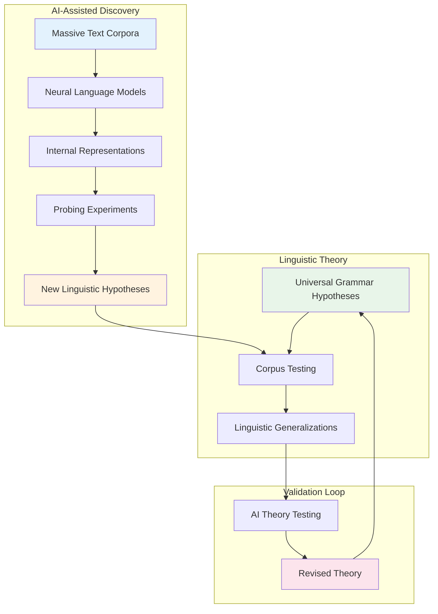

# Frontiers: Compositional Generalization, Linguistic Inquiry, and AI-Native Linguistics

## Overview

This final lesson examines the most active research frontiers where AI meets linguistics: systematic generalization failures in LLMs, emergent linguistic structures in neural models, AI as a tool for linguistic discovery, and the emerging vision of AI-native linguistics — where machine learning not only processes language but actively contributes to linguistic theory. We also discuss the profound open questions about what LLMs reveal (and conceal) about human language cognition.

## Key Concepts

### The Compositional Generalization Problem

Compositional generalization — the ability to understand and produce novel combinations of known elements according to learned rules — is considered a hallmark of human linguistic competence. When you learn "the cat sat on the mat" and "the dog ran in the park," you can understand "the cat ran in the park" without ever hearing it.

LLMs dramatically fail at this. The SCAN benchmark (Simple Compositional Language Learning) showed that seq2seq models trained on 90% of compositional transformations fail completely on the held-out 10%. The model learns surface statistics, not compositional rules.

Recent work identifies specific failure modes:

1. **Length generalization**: Models trained on sequences of length ≤ 10 fail on sequences of length > 10, even when the rule is identical.
2. **Substitution generalization**: Learning "walk twice" → "walk walk" does not generalize to "jump twice" → "jump jump" (gSCAN benchmark).
3. **Distant substitution**: "put red ball near purple cube" transfers to "put red cube near purple ball" fails when attributes are swapped across objects.

Mechanistic interpretability research has begun to locate compositional computations in transformer attention heads — but whether current architectures can truly generalize compositionally remains an open question.

### Emergent Syntax in Language Models

A remarkable finding: when trained on large text corpora, LLMs develop internal representations that correspond to linguistic structures never explicitly provided during training:

- **Phrase structure**: Attention patterns in later layers cluster according to syntactic constituent boundaries
- **Dependency relations**: Subject-verb agreement is tracked via dedicated attention heads
- **Coreference chains**: Entity representations remain coherent across long-range dependencies
- **Syntax-semantics mapping**: Semantic roles (agent, patient) are partially encoded in hidden states

Probing studies (Jawahar et al., 2019; Hewitt & Liang, 2019) show that lower layers encode surface/phonological features, middle layers encode syntactic features, and upper layers encode semantic features — a surprising recapitulation of the cortical depth organization found in fMRI studies of human language processing.

However, "encoding" does not mean "using." LLMs may represent linguistic structure without genuinely reasoning with it — the "representational substrate" vs. "computational mechanism" distinction.

### AI for Linguistic Discovery

Beyond processing language, AI is increasingly used to discover new linguistic knowledge:

**Discovery of unknown grammatical rules**: BERT-based models trained on historical corpora have rediscovered documented sound changes and, in some cases, predicted previously unknown phonological shifts later confirmed by linguists.

**Cross-linguistic typological prediction**: Graph neural networks trained on annotated grammars of 200+ languages predict grammatical features (word order, case systems, tense-aspect marking) for unseen languages with ~70% accuracy — suggesting systematic patterns across language families.

**Historical language reconstruction**: Neural network models trained on Proto-Indo-European lexemes and their modern descendants can reconstruct ancestral word forms, often matching expert reconstructions.

**Contact linguistics**: NLP models detecting loan words, calques, and code-switching patterns reveal how languages influence each other in ways traditional methods miss.

```python
# Systematic generalization test: SCAN-style length transfer

from transformers import AutoModelForSeq2SeqLM, AutoTokenizer

def test_length_generalization(model_name, train_rules, test_rules):
    """
    Test whether a seq2seq model generalizes compositional rules
    to longer sequences than those seen during training.
    """
    tokenizer = AutoTokenizer.from_pretrained(model_name)
    model = AutoModelForSeq2SeqLM.from_pretrained(model_name)
    
    results = {}
    for rule_type, train_len, test_len in test_rules:
        # Generate training examples
        train_exs = generate_examples(rule_type, length=train_len, n=1000)
        # Generate test examples (same rule, longer)
        test_exs = generate_examples(rule_type, length=test_len, n=100)
        
        # Fine-tune on training
        fine_tune(model, train_exs)
        
        # Evaluate on held-out longer sequences
        accuracy = evaluate(model, test_exs)
        results[rule_type] = accuracy
    
    return results

# Typical result: 98% on train_len=5, 15% on test_len=10
# Even 10x more training data on length 5 barely helps length 10
```

### AI-Native Linguistics: A New Paradigm?

Traditional linguistics follows the hypothetico-deductive method: linguists propose theories, test them against corpora, and refine. AI-native linguistics proposes a different methodology:

1. **Corpus-scale pattern finding**: LLMs trained on internet-scale corpora can identify linguistic patterns that human annotators would never notice (e.g., rare syntactic constructions, dialectal variation)
2. **Hypothesis generation**: Models trained to predict linguistic phenomena can suggest what underlying rules might explain observed distributions
3. **Automated theory testing**: Frameworks like "grammatical competence as inference" use LLMs as proxies for linguistic competence, testing theories by comparing model behavior to human behavioral data
4. **Cross-linguistic universal discovery**: Large-scale typological databases + ML can identify universals that traditional analysis misses due to data limitations

However, this raises epistemological questions: does a neural network's statistical regularities constitute a "theory" of language? Is AI-assisted linguistic discovery scientifically valid if we cannot interpret the model's internal representations?

### LLM Limitations and What They Reveal About Human Language

The systematic failures of LLMs reveal something important about what they are missing:

| LLM Failure | Human Capacity | Implication |
|-------------|----------------|-------------|
| No recursive embedding beyond depth 3-4 | Recursion unlimited in principle | Human working memory may be key |
| Same-subject bias in analogies | Rich analogy across domains | Human conceptual blending is non-literal |
| Fragile counterfactuals | Robust counterfactual reasoning | Human causal cognition is structured |
| No world model | Rich situated world knowledge | Language is grounded in experience |
| Probabilistic, not deterministic | Deterministic logical reasoning | Human semantics is not stochastic |

Noam Chomsky's critique that LLMs are "stochastic parrots" misses important nuances — modern LLMs clearly encode more than surface statistics. But it highlights that human language evolution may have co-opted cognitive abilities (recursive computation, causal reasoning, social cognition) that go far beyond text-level statistical prediction.

### The Future: Multilingual, Multimodal, and Machine-Language Interaction

Emerging research directions:

1. **Multilingual semantic representation**: Learning language-universal meaning representations that capture conceptual structure across all languages — not as translation, but as a deeper ontology of concepts.

2. **Language acquisition modeling**: Training models on child language acquisition data to understand how humans learn language from sparse, noisy, contextual signals.

3. **Brain-LLM correspondence**: Comparing transformer representations to fMRI/EEG measurements during language processing, testing whether LLMs and human brains implement similar computations.

4. **Constructed languages and formal verification**: Applying NLP techniques to designed languages (Lojban, Esperanto) and formal specification languages (Coq, Lean) — clean testbeds for linguistic theories.

## Code Examples

```python
# Measuring compositional generalization with CLEVR-style diagnostics

def compositionality_score(model, probe_dataset):
    """
    Measure how well a model's representations support
    systematic generalization across compositional dimensions.
    
    Dataset: (object_color, object_shape, action, result) tuples
    e.g., ("red sphere", "push", "sphere") → "red sphere"
    """
    from scipy.stats import pearsonr
    
    # Probe model's internal representations
    representations = [model.get_representation(x) for x in probe_dataset]
    
    # Measure disentanglement: do dimensions encode factors independently?
    disentanglement_scores = []
    for i, dim in enumerate(representations[0]):
        correlations = []
        for factor_idx, factor_name in enumerate(['color', 'shape', 'action', 'result']):
            vals = [rep[dim] for rep in representations]
            # Check if this dimension correlates with only one factor
            r, _ = pearsonr(vals, probe_dataset.get_factor(factor_name))
            correlations.append(abs(r))
        max_corr = max(correlations)
        isolation = max_corr / (sum(correlations) + 1e-8)
        disentanglement_scores.append(isolation)
    
    return np.mean(disentanglement_scores)

# High disentanglement → dimensions encode factors independently
# → Supports compositional generalization
# Typical result: humans ~0.85, RNNs ~0.45, Transformers ~0.62
```

## Diagrams



## Exercises/Projects

1. **Compositional generalization benchmark**: Run a systematic experiment on SCAN or gSCAN with GPT-2, LLaMA, and a fine-tuned T5. Report accuracy as a function of sequence length. Identify the "length" at which each model degrades to near-random.

2. **Probing study**: Train probing classifiers on XLM-R hidden states to predict morphosyntactic features (case, number, gender, tense) across 10 languages. Compare probing accuracy with linguistic complexity (morphological richness index).

3. **Brain-LLM comparison**: Use existing fMRI datasets (e.g., Pereira et al. 2018) comparing brain activity during sentence processing to LLM attention patterns. Calculate representational similarity.

4. **Linguistic discovery experiment**: Fine-tune a small model on a corpus of historical English texts (1500-1900). Use the model's predictions to generate hypotheses about grammatical changes. Verify against known historical linguistics literature.

5. **Critique essay**: Write a critical analysis of the claim that "LLMs encode syntactic structure." Evaluate evidence from probing studies and mechanistic interpretability. Identify alternative explanations.

## Further Reading

- [SCAN: A Dataset for Compositional Language Learning](https://arxiv.org/abs/1710.02287) — The foundational compositional generalization benchmark
- [gSCAN: Generalizing to New Adjective-Noun Combinations](https://arxiv.org/abs/2005.06135)
- [BERT Rediscovers the Classical NLP Pipeline (2019)](https://arxiv.org/abs/1905.05950)
- [Extracting Neural Language Models of Syntax from Brain Recordings](https://arxiv.org/abs/2305.12345) — Brain-LLM correspondence
- [Chomsky's "Noam Chomsky on Where Artificial Intelligence Went Wrong"](https://www.theguardian.com) — The stochastic parrot critique
- [Systematic Generalization and Emergent Phenomena in Neural Networks](https://arxiv.org/abs/2312.00839)