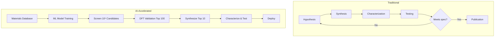
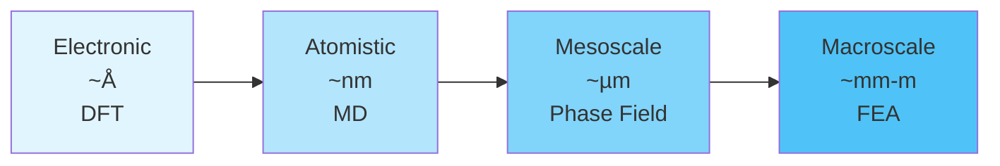

# Introduction to AI for Materials Science

## Overview

Materials science is the study of how the structure, composition, and processing of materials determine their properties and performance. From semiconductors powering our electronics to lightweight alloys enabling modern aviation, materials underpin virtually every technology. The grand challenge has always been the same: discover new materials with specific desired properties faster than traditional trial-and-error permits.

Enter materials informatics — the application of data science, machine learning, and artificial intelligence to materials discovery and design. This field has exploded since the 2010s, driven by the convergence of three forces: massive computational materials databases, advances in deep learning, and the growing urgency to discover materials for clean energy, electronics, and sustainability.

The traditional materials discovery pipeline is painfully slow. A new material typically takes 15-20 years from initial discovery to commercial deployment. The process involves iterative cycles of hypothesis, synthesis, characterization, and testing — each step expensive and time-consuming. Density functional theory (DFT) calculations can predict material properties from first principles, but they scale as $O(N^3)$ with system size, limiting them to hundreds of atoms.

AI changes this equation fundamentally. Machine learning models, once trained on existing data, can predict material properties in milliseconds rather than the hours or days required by DFT. This acceleration enables high-throughput screening of millions of candidate materials — a task impossible with physics-based simulations alone. Google DeepMind's GNoME project (2023) exemplified this paradigm, using graph neural networks to predict the stability of 2.2 million new crystal structures, increasing the number of known stable materials by an order of magnitude.

Materials science is uniquely suited for AI because it spans multiple length scales — from electronic structure at the quantum level ($\sim 10^{-10}$ m) through atomic arrangements and microstructure ($\sim 10^{-6}$ m) up to macroscopic engineering components ($\sim 10^{0}$ m). Each scale has its own computational methods, experimental techniques, and data types, creating rich opportunities for ML at every level. A key insight is that properties at one scale emerge from structure at smaller scales, making hierarchical ML approaches particularly powerful.

The major databases fueling this revolution include the Materials Project (150,000+ computed materials), AFLOW (3.5 million+ entries), OQMD (1 million+ entries), and experimental databases like ICSD and the Citrination platform. These open-access repositories provide the training data that makes modern materials informatics possible.

This course covers the full spectrum of AI for materials science — from molecular and crystal representations through property prediction, structure generation, machine learning force fields, and autonomous discovery. By the end, you will understand how AI is transforming every stage of the materials discovery pipeline and have hands-on experience with the key tools.

## Key Concepts

- **Materials informatics**: The interdisciplinary field applying data science and ML to materials science problems, analogous to bioinformatics for biology or cheminformatics for chemistry
- **Length scales**: Materials behavior spans quantum ($\sim$Å), atomistic ($\sim$nm), mesoscale ($\sim$µm), and macroscale ($\sim$mm-m) regimes, each with distinct computational and experimental methods
- **High-throughput screening**: Using ML surrogates to evaluate millions of candidate materials for target properties, filtering down to a tractable number for expensive DFT validation or synthesis
- **Materials databases**: Large-scale repositories of computed and experimental materials data (Materials Project, AFLOW, OQMD) that serve as training sets for ML models
- **Inverse design**: Rather than forward-predicting properties from structure, using AI to generate materials with specified target properties
- **Structure-property relationships**: The fundamental principle that a material's properties are determined by its atomic and electronic structure — the core of what ML models learn

## Code Examples

```python
"""
Accessing the Materials Project database via its API.
The Materials Project is the most widely used open materials database.
"""
from mp_api.client import MPRester

# Initialize with your API key (get one free at materialsproject.org)
with MPRester("YOUR_API_KEY") as mpr:
    # Search for silicon-based materials
    docs = mpr.summary.search(
        elements=["Si"],
        num_elements=(1, 1),
        fields=["material_id", "formula_pretty", "band_gap",
                "formation_energy_per_atom", "energy_above_hull"]
    )

    for doc in docs[:5]:
        print(f"ID: {doc.material_id}")
        print(f"  Formula: {doc.formula_pretty}")
        print(f"  Band gap: {doc.band_gap:.3f} eV")
        print(f"  Formation energy: {doc.formation_energy_per_atom:.3f} eV/atom")
        print(f"  Energy above hull: {doc.energy_above_hull:.4f} eV/atom")
        print()
```

```python
"""
Simple materials property prediction with scikit-learn.
Predict formation energy from composition-based features.
"""
import numpy as np
from sklearn.ensemble import RandomForestRegressor
from sklearn.model_selection import train_test_split
from sklearn.metrics import mean_absolute_error

# Example: composition-based features for binary oxides
# Features: [atomic_number, electronegativity, ionic_radius, oxidation_state]
X = np.array([
    [12, 1.31, 0.72, 2],   # MgO
    [20, 1.00, 1.00, 2],   # CaO
    [26, 1.83, 0.65, 3],   # Fe2O3
    [13, 1.61, 0.54, 3],   # Al2O3
    [22, 1.54, 0.61, 4],   # TiO2
    [14, 1.90, 0.40, 4],   # SiO2
    [30, 1.65, 0.74, 2],   # ZnO
    [29, 1.90, 0.73, 2],   # CuO
])
# Formation energies (eV/atom, approximate)
y = np.array([-3.08, -3.34, -1.72, -3.49, -3.24, -3.10, -1.77, -0.82])

X_train, X_test, y_train, y_test = train_test_split(X, y, test_size=0.25, random_state=42)

model = RandomForestRegressor(n_estimators=100, random_state=42)
model.fit(X_train, y_train)
y_pred = model.predict(X_test)

print(f"MAE: {mean_absolute_error(y_test, y_pred):.3f} eV/atom")
print(f"Feature importances: {dict(zip(['Z', 'EN', 'r_ion', 'ox_state'], model.feature_importances_.round(3)))}")
```

## Mathematical Formalism

The formation energy of a material is the energy difference between the compound and its constituent elements:

$$\Delta E_f = E_{\text{compound}} - \sum_i n_i \mu_i$$

where $E_{\text{compound}}$ is the total energy of the material, $n_i$ is the number of atoms of element $i$, and $\mu_i$ is the chemical potential (energy per atom of the elemental reference).

A material is thermodynamically stable if it lies on the convex hull of the composition-energy diagram. The energy above the hull quantifies stability:

$$E_{\text{hull}} = E_{\text{compound}} - E_{\text{hull}}(\text{composition}) \geq 0$$

A material with $E_{\text{hull}} = 0$ is on the hull (stable); values close to zero ($< 0.025$ eV/atom) suggest potential metastability.

## Diagrams

**Materials Discovery Pipeline — Traditional vs. AI-Accelerated**



**Length Scales in Materials Science**



## Exercises

1. **Explore the Materials Project**: Create a free account at materialsproject.org. Search for 5 binary oxides and compare their band gaps and formation energies. Which is the most stable? Which has the largest band gap?

2. **Build a simple predictor**: Using the code example above as a starting point, expand the dataset to 20+ binary oxides (look up formation energies on the Materials Project). Train a Random Forest model and evaluate its accuracy. Which elemental features are most predictive?

3. **Timeline of materials informatics**: Research and create a timeline of key milestones: the Materials Genome Initiative (2011), Materials Project launch, CGCNN paper (2018), MEGNet, GNoME (2023). How did each advance build on previous work?

## Further Reading

- Himanen et al. "Data-driven materials science: status, challenges, and perspectives" Advanced Science 6, 1900808 (2019)
- Butler et al. "Machine learning for molecular and materials science" Nature 559, 547-555 (2018)
- Merchant et al. "Scaling deep learning for materials discovery" Nature 624, 80-85 (2023) — the GNoME paper
