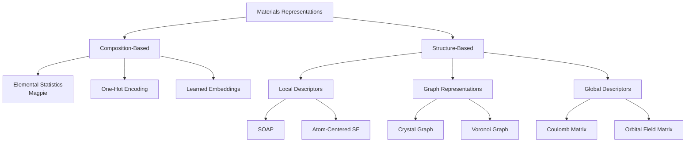

# Materials Representations and Descriptors

## Overview

Just as natural language processing requires converting text into numerical vectors, materials science requires encoding atomic structures into formats that machine learning models can process. The choice of representation profoundly affects model performance — a good representation captures the essential physics while remaining computationally tractable.

Materials representations fall into two broad categories: composition-based features (what elements are present and in what proportions) and structure-based features (how atoms are arranged in space). Composition-based features are simpler and can be computed without knowing the crystal structure, making them useful for early-stage screening. Structure-based features encode spatial information and generally yield more accurate predictions but require knowledge of atomic positions.

Composition-based features leverage the periodic table as a lookup table. For a given chemical formula, you compute statistics (mean, variance, min, max) over elemental properties like electronegativity, atomic radius, ionization energy, and electron affinity. The Magpie feature set, introduced by Ward et al. (2016), computes 145 such features and remains a strong baseline. More recent approaches like the Element Monad representation use learned element embeddings.

Structure-based representations encode the 3D arrangement of atoms. Crystal graph representations treat atoms as nodes and interatomic bonds as edges, naturally capturing local coordination environments. The Smooth Overlap of Atomic Positions (SOAP) descriptor computes a rotationally invariant power spectrum of the local atomic density around each site, capturing the geometric environment up to a cutoff radius. Voronoi tessellation partitions space into regions closest to each atom, encoding coordination numbers and face areas. The Coulomb matrix encodes pairwise nuclear charges and distances.

A critical requirement for any physical representation is that it must respect the symmetries of the system. Crystal structures are invariant to translations, rotations, and permutations of equivalent atoms, and periodic in three dimensions. Representations that bake in these symmetries — like SOAP or crystal graphs with periodic boundary handling — achieve better data efficiency because the model does not need to learn these invariances from data.

Fingerprinting methods borrow from cheminformatics. Structural fingerprints encode local motifs (e.g., tetrahedral coordination, octahedral coordination) as binary or count vectors. The Orbital Field Matrix (OFM) uses valence orbital information to generate structure fingerprints. These are particularly useful for similarity searches and clustering.

## Key Concepts

- **Composition-based features**: Numerical descriptors computed from the chemical formula alone (e.g., mean electronegativity, range of atomic radii), without requiring crystal structure knowledge
- **SOAP (Smooth Overlap of Atomic Positions)**: A local structural descriptor that expands the atomic neighbor density in spherical harmonics and radial basis functions, producing a rotationally invariant power spectrum
- **Crystal graph**: A graph representation where nodes are atoms and edges connect neighboring atoms within a cutoff distance, encoding both node features (element type) and edge features (distance, bond type)
- **Voronoi tessellation**: Partitioning of space around each atom into polyhedra, from which coordination numbers, face areas, and solid angles are computed as structural descriptors
- **Magpie features**: A set of 145 composition-based features computed from elemental property statistics (mean, std, min, max, range, mode) over properties like electronegativity, atomic number, etc.
- **Periodic invariance**: Crystal representations must handle periodic boundary conditions so that atoms interacting across unit cell boundaries are correctly captured

## Code Examples

```python
"""
Computing composition-based features with matminer.
matminer is the standard Python library for materials featurization.
"""
from matminer.featurizers.composition import ElementProperty
from pymatgen.core import Composition

# Magpie feature set: 145 composition-based features
magpie = ElementProperty.from_preset("magpie")

# Featurize some materials
compositions = [
    Composition("SiO2"),
    Composition("Fe2O3"),
    Composition("GaAs"),
    Composition("BaTiO3"),
]

for comp in compositions:
    features = magpie.featurize(comp)
    print(f"{comp.reduced_formula}: {len(features)} features")
    print(f"  First 5 features: {[f'{x:.3f}' for x in features[:5]]}")
    print()

# Get feature names
feature_names = magpie.feature_labels()
print(f"Total features: {len(feature_names)}")
print(f"Example names: {feature_names[:5]}")
```

```python
"""
Computing SOAP descriptors with DScribe.
SOAP captures the local 3D environment around each atomic site.
"""
from dscribe.descriptors import SOAP
from ase import Atoms
from ase.build import bulk

# Build a silicon crystal (diamond cubic)
si = bulk("Si", "diamond", a=5.43)

# Configure SOAP descriptor
soap = SOAP(
    species=["Si"],
    r_cut=5.0,           # Cutoff radius in Å
    n_max=8,             # Number of radial basis functions
    l_max=6,             # Maximum angular momentum
    periodic=True,       # Handle periodic boundaries
    average="outer",     # Average over all sites for global descriptor
)

# Compute SOAP descriptor for the structure
descriptor = soap.create(si)
print(f"SOAP descriptor shape: {descriptor.shape}")
print(f"Number of features: {descriptor.shape[-1]}")

# Compare two structures
ge = bulk("Ge", "diamond", a=5.66)
soap_multi = SOAP(
    species=["Si", "Ge"],
    r_cut=5.0, n_max=8, l_max=6, periodic=True, average="outer"
)
desc_si = soap_multi.create(si)
desc_ge = soap_multi.create(ge)

# Cosine similarity between structures
from numpy.linalg import norm
similarity = (desc_si @ desc_ge.T) / (norm(desc_si) * norm(desc_ge))
print(f"Si-Ge structural similarity: {similarity.item():.4f}")
```

```python
"""
Building a crystal graph representation with pymatgen.
"""
from pymatgen.core import Structure, Lattice
import numpy as np

# Create a simple NaCl structure
lattice = Lattice.cubic(5.64)
nacl = Structure(
    lattice,
    ["Na", "Cl"],
    [[0, 0, 0], [0.5, 0.5, 0.5]]
)

# Get neighbors within cutoff to build graph edges
cutoff = 5.0  # Angstroms
all_neighbors = nacl.get_all_neighbors(cutoff)

print(f"Structure: {nacl.formula}")
print(f"Number of sites (nodes): {len(nacl)}")
for i, neighbors in enumerate(all_neighbors):
    species = nacl[i].species_string
    print(f"Site {i} ({species}): {len(neighbors)} neighbors within {cutoff} Å")
    for n in sorted(neighbors, key=lambda x: x.nn_distance)[:3]:
        print(f"  → {n.species_string} at {n.nn_distance:.3f} Å")
```

## Mathematical Formalism

The SOAP descriptor computes the power spectrum of the local atomic density. The neighbor density around atom $i$ is expanded as:

$$\rho_i(\mathbf{r}) = \sum_{j \in \mathcal{N}(i)} g(\|\mathbf{r} - \mathbf{r}_j\|) = \sum_{nlm} c_{nlm}^{(i)} \, g_n(r) \, Y_l^m(\hat{r})$$

where $g_n(r)$ are radial basis functions and $Y_l^m$ are spherical harmonics. The rotationally invariant power spectrum is:

$$p_{nn'l}^{(i)} = \pi \sqrt{\frac{8}{2l+1}} \sum_{m=-l}^{l} (c_{nlm}^{(i)})^* \, c_{n'lm}^{(i)}$$

The Coulomb matrix for a structure with $N$ atoms has elements:

$$C_{ij} = \begin{cases} 0.5 Z_i^{2.4} & \text{if } i = j \\ \frac{Z_i Z_j}{|\mathbf{R}_i - \mathbf{R}_j|} & \text{if } i \neq j \end{cases}$$

where $Z_i$ is the atomic number and $\mathbf{R}_i$ is the position of atom $i$.

## Diagrams

**Taxonomy of Materials Representations**



## Exercises

1. **Magpie features**: Install matminer and compute Magpie features for 10 materials of your choice. Use PCA to reduce them to 2D and visualize. Do materials with similar properties cluster together?

2. **SOAP comparison**: Use DScribe to compute SOAP descriptors for FCC, BCC, and HCP crystal structures of the same element. How similar are the descriptors? Does SOAP distinguish the structures?

3. **Build a crystal graph**: Using the pymatgen code above, build crystal graphs for 5 different simple structures (NaCl, CsCl, diamond, wurtzite, perovskite). Compare their graph statistics (average degree, diameter).

## Further Reading

- Ward et al. "A general-purpose machine learning framework for predicting properties of inorganic materials" npj Computational Materials 2, 16028 (2016)
- Bartók et al. "On representing chemical environments" Physical Review B 87, 184115 (2013) — the SOAP paper
- Himanen et al. "DScribe: Library of descriptors for machine learning in materials science" Computer Physics Communications 247, 106949 (2020)
