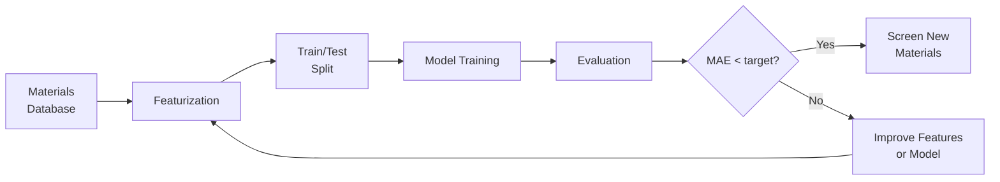
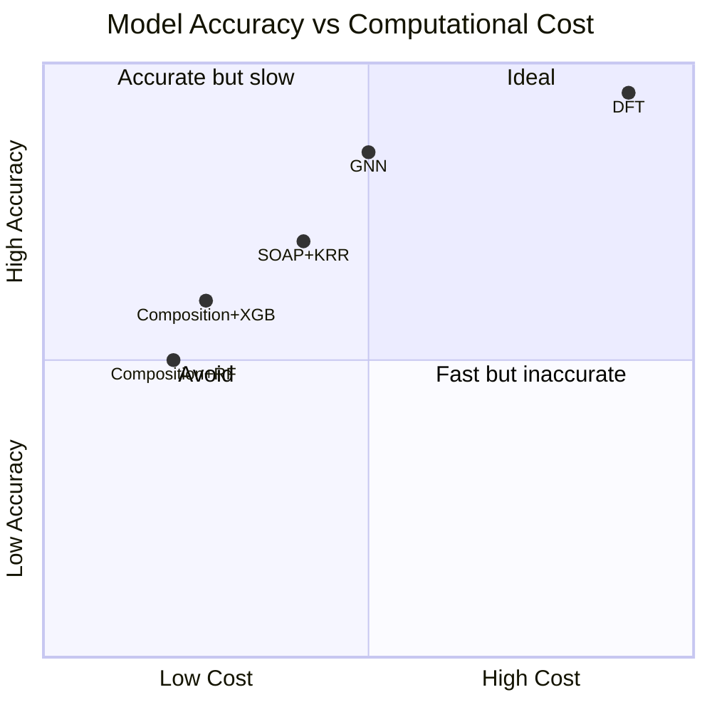

## Machine Learning for Materials Property Prediction

## Overview

Predicting material properties from composition or structure is the bread-and-butter application of AI in materials science. Rather than running expensive quantum mechanical calculations for every candidate material, ML models trained on existing data can provide near-instant predictions, enabling rapid screening of vast chemical spaces.

The supervised learning pipeline for materials follows the standard ML workflow: featurize materials, split data, train a model, and evaluate performance. However, materials data presents unique challenges. Datasets are typically small by ML standards — the Materials Project contains ~150,000 entries compared to millions of images in ImageNet. Properties span many orders of magnitude (e.g., band gaps from 0 to >10 eV). And the underlying physics imposes constraints that purely data-driven models may violate.

The three most commonly predicted properties are formation energy (thermodynamic stability), band gap (electronic properties), and elastic moduli (mechanical properties). Formation energy prediction has seen remarkable progress: state-of-the-art models achieve mean absolute errors below 30 meV/atom, approaching the inherent uncertainty of DFT calculations themselves. Band gap prediction is harder because DFT systematically underestimates band gaps, so models trained on DFT data inherit this bias.

Key materials databases serve as training sets. The Materials Project provides DFT-computed properties for 150,000+ inorganic crystalline materials. AFLOW (Automatic FLOW) offers 3.5 million+ computed entries with standardized workflows. OQMD (Open Quantum Materials Database) contains 1 million+ DFT calculations focused on stability. The experimental ICSD (Inorganic Crystal Structure Database) provides measured structures. Each database has different coverage, accuracy levels, and biases that affect model training.

Traditional ML models — Random Forests, gradient boosting (XGBoost), and kernel methods — remain competitive for many tasks, especially with composition-based features. They offer interpretability, uncertainty estimation via ensembles, and work well with small datasets. For structure-based predictions, graph neural networks (covered in the next lesson) have become the dominant approach.

A crucial consideration is model evaluation. Random train/test splits can leak information when structurally similar materials appear in both sets. More rigorous evaluation uses composition-based splits (all compounds containing a given element are in one split) or extrapolation tests (training on known chemistries, testing on novel ones). Cross-validation and learning curves help assess whether more data would improve performance.

## Key Concepts

- **Formation energy**: The energy gained or lost when a compound forms from its constituent elements; negative values indicate thermodynamic stability
- **Band gap**: The energy difference between valence and conduction bands in a solid, determining whether a material is a metal (0 eV), semiconductor (0.1-4 eV), or insulator (>4 eV)
- **Elastic moduli**: Measures of a material's resistance to deformation — bulk modulus (uniform compression), shear modulus (shape change), and Young's modulus (uniaxial stress)
- **Materials Project**: The largest open database of DFT-computed materials properties, maintained by Lawrence Berkeley National Laboratory
- **DFT accuracy ceiling**: ML models trained on DFT data cannot be more accurate than DFT itself; typical DFT errors are ~50 meV/atom for formation energies
- **Composition-based splitting**: Evaluation strategy where all materials containing certain elements are held out for testing, assessing generalization to new chemistries

## Code Examples

```python
"""
End-to-end materials property prediction with matminer + scikit-learn.
Predict formation energy of perovskites from composition features.
"""
import pandas as pd
import numpy as np
from matminer.featurizers.composition import ElementProperty
from matminer.datasets import load_dataset
from sklearn.ensemble import GradientBoostingRegressor
from sklearn.model_selection import cross_val_score
from sklearn.metrics import mean_absolute_error
from pymatgen.core import Composition

# Load a materials dataset (matminer has built-in datasets)
df = load_dataset("matbench_perovskites")
print(f"Dataset size: {len(df)}")
print(f"Target: formation energy (eV/atom)")
print(f"Range: [{df['e_form'].min():.3f}, {df['e_form'].max():.3f}]")

# Featurize compositions
featurizer = ElementProperty.from_preset("magpie")
compositions = [s.composition for s in df["structure"]]
X = np.array([featurizer.featurize(c) for c in compositions])
y = df["e_form"].values

print(f"\nFeature matrix shape: {X.shape}")

# Train gradient boosting model with cross-validation
model = GradientBoostingRegressor(
    n_estimators=300,
    max_depth=6,
    learning_rate=0.05,
    random_state=42
)

scores = cross_val_score(model, X, y, cv=5, scoring="neg_mean_absolute_error")
print(f"5-fold CV MAE: {-scores.mean():.4f} ± {scores.std():.4f} eV/atom")
```

```python
"""
Band gap prediction using XGBoost with feature importance analysis.
"""
import xgboost as xgb
from sklearn.model_selection import train_test_split
import matplotlib.pyplot as plt

# Assume X, y_bandgap, feature_names are prepared from matminer
# Here we show the training and analysis pipeline

X_train, X_test, y_train, y_test = train_test_split(
    X, y_bandgap, test_size=0.2, random_state=42
)

model = xgb.XGBRegressor(
    n_estimators=500,
    max_depth=8,
    learning_rate=0.05,
    subsample=0.8,
    colsample_bytree=0.8,
    reg_alpha=0.1,    # L1 regularization
    reg_lambda=1.0,   # L2 regularization
    random_state=42
)

model.fit(
    X_train, y_train,
    eval_set=[(X_test, y_test)],
    verbose=False
)

y_pred = model.predict(X_test)
mae = mean_absolute_error(y_test, y_pred)
print(f"Test MAE: {mae:.3f} eV")

# Feature importance analysis
importances = model.feature_importances_
top_k = 10
top_indices = np.argsort(importances)[-top_k:]
print(f"\nTop {top_k} features:")
for idx in reversed(top_indices):
    print(f"  {feature_names[idx]}: {importances[idx]:.4f}")
```

## Mathematical Formalism

For regression tasks, the standard loss function is mean squared error:

$$\mathcal{L}_{\text{MSE}} = \frac{1}{N}\sum_{i=1}^{N} (y_i - \hat{y}_i)^2$$

Evaluation typically uses mean absolute error (MAE), which is more interpretable for physical properties:

$$\text{MAE} = \frac{1}{N}\sum_{i=1}^{N} |y_i - \hat{y}_i|$$

Gradient boosting builds an additive ensemble of weak learners:

$$\hat{y}^{(t)} = \hat{y}^{(t-1)} + \eta \cdot h_t(\mathbf{x})$$

where $h_t$ is a decision tree fitted to the negative gradient of the loss at iteration $t$, and $\eta$ is the learning rate. For MSE loss, the pseudo-residuals are simply:

$$r_i^{(t)} = y_i - \hat{y}_i^{(t-1)}$$

The convex hull stability criterion states that a material is stable if no combination of other phases at the same composition has lower energy. The energy above the convex hull is:

$$\Delta E_{\text{hull}} = E_{\text{compound}} - \min_{\{\alpha_k\}} \sum_k \alpha_k E_k \quad \text{s.t. } \sum_k \alpha_k \mathbf{c}_k = \mathbf{c}_{\text{target}}, \; \alpha_k \geq 0$$

## Diagrams

**Materials Property Prediction Pipeline**



**Comparison of Property Prediction Accuracy Across Methods**



## Exercises

1. **Matbench benchmark**: Install matminer and load the `matbench_expt_gap` dataset (experimental band gaps). Train a GradientBoostingRegressor with Magpie features and report 5-fold CV MAE. How does it compare to DFT accuracy (~0.5 eV systematic error)?

2. **Feature engineering**: Compare three feature sets for formation energy prediction: (a) Magpie features only, (b) adding Meredig features, (c) adding Deml features. Which combination gives the lowest MAE?

3. **Extrapolation test**: Train a model on binary compounds only, then test on ternary compounds. How much does performance degrade? This reveals how well models generalize to new chemical spaces.

## Further Reading

- Dunn et al. "Benchmarking materials property prediction methods: the Matbench test suite" npj Computational Materials 6, 138 (2020)
- Ward et al. "Including crystal structure attributes in machine learning models" Physical Review B 96, 024104 (2017)
- Bartel et al. "A critical examination of compound stability predictions from ML" npj Computational Materials 6, 97 (2020)
