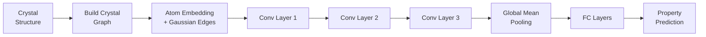
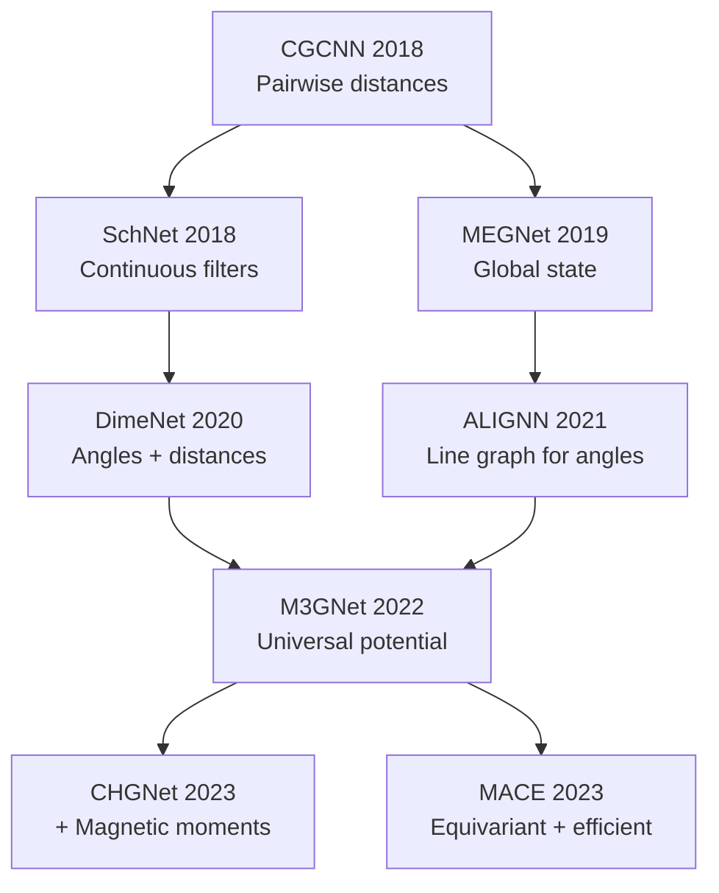

## Graph Neural Networks for Crystal Materials

## Overview

Crystal structures are inherently graph-like: atoms are nodes, and bonds or spatial proximity define edges. Graph neural networks (GNNs) exploit this structure to learn material properties directly from atomic arrangements, bypassing the need for hand-crafted descriptors. Since the introduction of the Crystal Graph Convolutional Neural Network (CGCNN) in 2018, GNNs have become the dominant approach for structure-based property prediction.

The key insight behind crystal GNNs is message passing. Each atom aggregates information from its neighbors, updates its representation, and repeats this process through multiple layers. After several rounds of message passing, each atom's representation encodes information about its extended local environment. A global pooling operation then combines all atomic representations into a single material-level prediction.

CGCNN, introduced by Xie and Grossman (2018), was the first purpose-built GNN for crystals. It handles periodic boundary conditions by constructing a graph from a unit cell with edges to neighbors in adjacent cells. Node features encode element type (via a learned embedding), and edge features encode interatomic distance using a Gaussian expansion. CGCNN achieved state-of-the-art results on formation energy (MAE ~0.039 eV/atom), band gap, and other properties from the Materials Project.

Since CGCNN, several improved architectures have emerged. MEGNet (Chen et al., 2019) adds global state attributes and learns element embeddings that capture periodic trends. SchNet (Schütt et al., 2018) uses continuous-filter convolutions with radial basis functions. ALIGNN (Choudhary & DeCost, 2021) incorporates bond angle information by constructing a line graph of the crystal graph, where edges become nodes and triplet angles become the new edges. DimeNet++ uses directional message passing with angles between triplets of atoms.

The latest generation of models — M3GNet, CHGNet, and MACE — are universal models trained on massive datasets to serve as general-purpose property predictors and force fields. M3GNet, trained on the entire Materials Project, can predict energies, forces, and stresses for any material, effectively serving as a universal ML interatomic potential. These universal models represent a paradigm shift from training task-specific models to fine-tuning pretrained foundation models.

A practical consideration is the graph construction. The cutoff radius determines which atoms are considered neighbors. Too small a cutoff misses important interactions; too large creates dense graphs that are expensive to process. Typical cutoffs range from 4-8 Å. Some architectures also include multi-body interactions (angles, dihedrals) for improved accuracy.

## Key Concepts

- **CGCNN (Crystal Graph Convolutional Neural Network)**: The foundational GNN architecture for crystal property prediction, using atom nodes, distance-encoded edges, and periodic boundary handling
- **Message passing**: The core GNN operation where each node aggregates features from its neighbors, enabling information to propagate through the graph
- **Periodic boundary conditions**: Crystal graphs must connect atoms across unit cell boundaries, so an atom at one edge is bonded to atoms in adjacent periodic images
- **ALIGNN**: A GNN that captures bond angles by constructing a line graph, where the original edges become nodes and angles between bonds become the new edges
- **Universal ML potentials**: Models like M3GNet and CHGNet trained on broad datasets to predict energies, forces, and stresses for arbitrary materials without task-specific training
- **Gaussian distance expansion**: Converting a scalar distance $d$ into a vector of Gaussian basis functions $\exp(-(d - \mu_k)^2 / \sigma^2)$ to provide a richer edge representation

## Code Examples

```python
"""
Crystal Graph Convolutional Neural Network (CGCNN) — simplified implementation.
Shows the core message-passing architecture for crystal property prediction.
"""
import torch
import torch.nn as nn
import torch.nn.functional as F

class GaussianExpansion(nn.Module):
    """Expand distances into Gaussian basis functions."""
    def __init__(self, d_min=0.0, d_max=8.0, num_gaussians=40):
        super().__init__()
        centers = torch.linspace(d_min, d_max, num_gaussians)
        self.register_buffer("centers", centers)
        self.width = (d_max - d_min) / num_gaussians

    def forward(self, distances):
        # distances: (num_edges,)
        return torch.exp(-((distances.unsqueeze(-1) - self.centers) ** 2)
                         / self.width ** 2)

class CGCNNConv(nn.Module):
    """Single CGCNN convolution layer with gated update."""
    def __init__(self, atom_dim, edge_dim):
        super().__init__()
        self.fc_full = nn.Linear(2 * atom_dim + edge_dim, 2 * atom_dim)
        self.bn1 = nn.BatchNorm1d(2 * atom_dim)
        self.bn2 = nn.BatchNorm1d(atom_dim)

    def forward(self, atom_features, edge_features, edge_index):
        src, dst = edge_index  # source and destination node indices
        # Concatenate source, destination, and edge features
        z = torch.cat([atom_features[src], atom_features[dst], edge_features], dim=-1)
        z = self.bn1(self.fc_full(z))
        # Gated update: sigmoid gate × softplus value
        gate, value = z.chunk(2, dim=-1)
        z = torch.sigmoid(gate) * F.softplus(value)
        # Aggregate messages for each destination node
        aggr = torch.zeros_like(atom_features)
        aggr.index_add_(0, dst, z)
        return self.bn2(atom_features + aggr)

class CGCNN(nn.Module):
    """Full CGCNN model for crystal property prediction."""
    def __init__(self, num_elements=100, atom_dim=64, edge_dim=40,
                 num_conv=3, fc_dim=128):
        super().__init__()
        self.embedding = nn.Embedding(num_elements, atom_dim)
        self.gaussian = GaussianExpansion(num_gaussians=edge_dim)
        self.convolutions = nn.ModuleList([
            CGCNNConv(atom_dim, edge_dim) for _ in range(num_conv)
        ])
        self.fc = nn.Sequential(
            nn.Linear(atom_dim, fc_dim),
            nn.ReLU(),
            nn.Linear(fc_dim, 1)
        )

    def forward(self, atomic_numbers, distances, edge_index, batch):
        atom_feat = self.embedding(atomic_numbers)
        edge_feat = self.gaussian(distances)
        for conv in self.convolutions:
            atom_feat = conv(atom_feat, edge_feat, edge_index)
        # Global mean pooling over atoms in each crystal
        from torch_scatter import scatter_mean
        crystal_feat = scatter_mean(atom_feat, batch, dim=0)
        return self.fc(crystal_feat).squeeze(-1)

# Example usage
model = CGCNN(num_elements=100, atom_dim=64, num_conv=3)
print(f"Model parameters: {sum(p.numel() for p in model.parameters()):,}")
```

```python
"""
Using pretrained M3GNet for universal property prediction via matgl.
"""
import matgl
from matgl.ext.ase import M3GNetCalculator
from pymatgen.core import Structure, Lattice

# Load pretrained M3GNet universal potential
pot = matgl.load_model("M3GNet-MP-2021.2.8-PES")
calc = M3GNetCalculator(potential=pot)

# Create a perovskite structure (BaTiO3)
lattice = Lattice.cubic(4.01)
structure = Structure(
    lattice,
    ["Ba", "Ti", "O", "O", "O"],
    [[0, 0, 0], [0.5, 0.5, 0.5],
     [0.5, 0.5, 0], [0.5, 0, 0.5], [0, 0.5, 0.5]]
)

# Predict energy using M3GNet
from matgl.ext.pymatgen import Structure2Graph
graph_converter = Structure2Graph(element_types=pot.model.element_types, cutoff=5.0)
graph, lattice_data, state = graph_converter.get_graph(structure)
energy = pot.model.predict_structure(structure)
print(f"Predicted energy for BaTiO3: {energy:.4f} eV/atom")
```

## Mathematical Formalism

The CGCNN message passing operation for atom $i$ at layer $t$ is:

$$\mathbf{h}_i^{(t+1)} = \mathbf{h}_i^{(t)} + \sum_{j \in \mathcal{N}(i)} \sigma\left(\mathbf{W}_g [\mathbf{h}_i^{(t)} \| \mathbf{h}_j^{(t)} \| \mathbf{e}_{ij}] + \mathbf{b}_g\right) \odot g\left(\mathbf{W}_s [\mathbf{h}_i^{(t)} \| \mathbf{h}_j^{(t)} \| \mathbf{e}_{ij}] + \mathbf{b}_s\right)$$

where $\mathbf{h}_i^{(t)}$ is the feature vector of atom $i$ at layer $t$, $\mathcal{N}(i)$ is the set of neighbors, $\mathbf{e}_{ij}$ is the edge feature (Gaussian-expanded distance), $\sigma$ is the sigmoid function, $g$ is softplus, $\|$ denotes concatenation, and $\odot$ is element-wise multiplication.

The Gaussian distance expansion converts scalar distance $d_{ij}$ to a vector:

$$e_k(d_{ij}) = \exp\left(-\frac{(d_{ij} - \mu_k)^2}{\sigma^2}\right), \quad k = 1, \ldots, K$$

The final prediction uses global mean pooling over all atoms and a fully connected network:

$$\hat{y} = \text{FC}\left(\frac{1}{|\mathcal{V}|}\sum_{i \in \mathcal{V}} \mathbf{h}_i^{(T)}\right)$$

## Diagrams

**CGCNN Architecture**



**Evolution of Crystal GNN Architectures**



## Exercises

1. **Implement CGCNN**: Using the code above, construct a crystal graph for Si (diamond cubic) with a 5 Å cutoff. How many edges does each atom have? Verify that periodic boundaries are handled correctly.

2. **Compare architectures**: Using the matgl library, compare M3GNet predictions for formation energy against Materials Project DFT values for 50 random materials. What is the MAE?

3. **Cutoff sensitivity**: For a GNN on Si, vary the cutoff radius from 3 Å to 8 Å and observe how the number of edges and model accuracy change. What is the optimal cutoff?

## Further Reading

- Xie & Grossman. "Crystal Graph Convolutional Neural Networks" Physical Review Letters 120, 145301 (2018)
- Chen, Ong et al. "Graph Networks as a Universal Machine Learning Framework" Chemistry of Materials 31, 3564-3572 (2019) — MEGNet
- Choudhary & DeCost. "Atomistic Line Graph Neural Network" npj Computational Materials 7, 185 (2021) — ALIGNN
