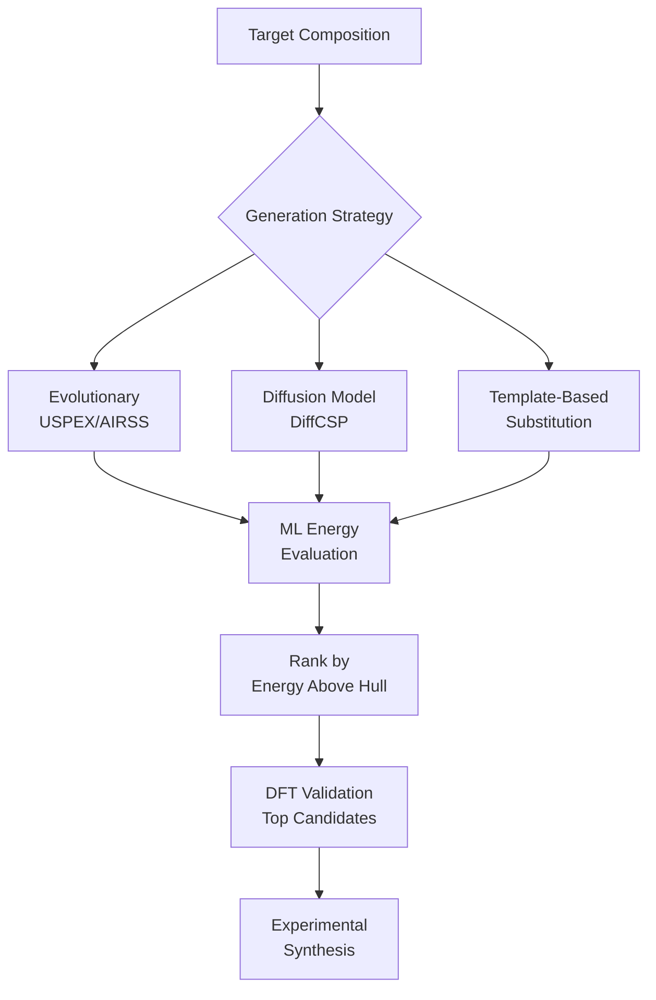
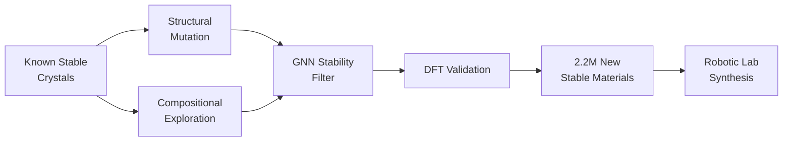

## Crystal Structure Prediction with ML

## Overview

Crystal structure prediction (CSP) is one of the most challenging problems in materials science. Given a chemical composition, what crystal structure will it adopt? This inverse problem requires navigating an astronomically large space of possible atomic arrangements to find the thermodynamically stable configuration — the global minimum on the potential energy surface.

The energy landscape of a crystal with $N$ atoms in a periodic unit cell has $3N + 6$ degrees of freedom (3 coordinates per atom plus 6 lattice parameters). For even a modest system of 20 atoms, this means searching a 66-dimensional space riddled with local minima. Traditional methods like evolutionary algorithms (USPEX), random search (AIRSS), and basin hopping explore this landscape using DFT to evaluate each candidate, making them extremely computationally expensive.

ML accelerates CSP in two fundamental ways. First, ML surrogate models replace DFT for energy evaluation, enabling orders-of-magnitude faster landscape exploration. Second, generative models learn to directly propose plausible crystal structures, biasing the search toward promising regions of configuration space.

Google DeepMind's GNoME (Graph Networks for Materials Exploration, 2023) represents a landmark achievement. GNoME used a two-pronged strategy: structural generation by modifying known stable crystals, and compositional generation by exploring new chemical formulas. A CGCNN-based model evaluated stability, discovering 2.2 million new stable structures — more than all previously known stable materials combined. Critically, 736 of these predictions were independently validated experimentally by an autonomous robotic lab.

Diffusion models have emerged as powerful crystal structure generators. DiffCSP (Jiao et al., 2023) generates crystal structures by iteratively denoising both atomic coordinates and lattice parameters from random noise. The model is conditioned on composition and trained on known stable structures, learning the distribution of valid crystal arrangements. CDvAE (Crystal Diffusion Variational Autoencoder) similarly generates periodic structures by denoising in a learned latent space.

Other approaches include COMof for metal-organic framework prediction, CALYPSO combined with ML potentials, and template-based methods that use known structure prototypes as starting points. Flow-based models and autoregressive generation of Wyckoff positions represent the newest directions.

## Key Concepts

- **Energy landscape**: The potential energy as a function of all atomic coordinates and lattice parameters; the stable structure corresponds to the global minimum
- **GNoME (Graph Networks for Materials Exploration)**: DeepMind's system that discovered 2.2 million new stable crystal structures using GNNs for stability prediction and systematic structure generation
- **DiffCSP**: A diffusion model for crystal structure prediction that generates both atom positions and lattice parameters by iterative denoising
- **Convex hull construction**: A material is thermodynamically stable if its energy lies on the convex hull of the composition-energy diagram; ML models predict the distance to the hull
- **USPEX / AIRSS**: Traditional computational methods for crystal structure prediction based on evolutionary algorithms and random structure searching, respectively
- **Wyckoff positions**: Special positions in a crystal's space group that reduce the degrees of freedom; some generators directly predict Wyckoff site occupancies

## Code Examples

```python
"""
Crystal structure generation using a simplified diffusion approach.
Demonstrates the core concept of iterative denoising for CSP.
"""
import torch
import torch.nn as nn
import numpy as np

class SimpleCrystalDiffusion(nn.Module):
    """
    Simplified diffusion model for crystal coordinate generation.
    In practice, DiffCSP uses equivariant GNNs and handles lattice parameters.
    """
    def __init__(self, num_atoms, hidden_dim=128, num_steps=100):
        super().__init__()
        self.num_atoms = num_atoms
        self.num_steps = num_steps
        # Noise schedule (linear beta schedule)
        betas = torch.linspace(1e-4, 0.02, num_steps)
        alphas = 1 - betas
        self.register_buffer("alpha_bar", torch.cumprod(alphas, dim=0))

        # Denoising network: predicts noise given noisy coords + timestep
        self.net = nn.Sequential(
            nn.Linear(num_atoms * 3 + 1, hidden_dim),
            nn.SiLU(),
            nn.Linear(hidden_dim, hidden_dim),
            nn.SiLU(),
            nn.Linear(hidden_dim, num_atoms * 3)
        )

    def forward_diffusion(self, x0, t):
        """Add noise to clean coordinates."""
        alpha_bar_t = self.alpha_bar[t].view(-1, 1)
        noise = torch.randn_like(x0)
        xt = torch.sqrt(alpha_bar_t) * x0 + torch.sqrt(1 - alpha_bar_t) * noise
        # Wrap fractional coordinates to [0, 1)
        xt = xt % 1.0
        return xt, noise

    def predict_noise(self, xt, t):
        """Predict the noise added at timestep t."""
        t_embed = t.float().unsqueeze(-1) / self.num_steps
        inp = torch.cat([xt.view(xt.shape[0], -1), t_embed], dim=-1)
        return self.net(inp).view(xt.shape)

    @torch.no_grad()
    def sample(self, batch_size=1):
        """Generate crystal coordinates by iterative denoising."""
        x = torch.rand(batch_size, self.num_atoms, 3)  # Start from noise
        for t in reversed(range(self.num_steps)):
            t_batch = torch.full((batch_size,), t, dtype=torch.long)
            predicted_noise = self.predict_noise(x, t_batch)
            # Simplified DDPM update step
            alpha_t = 1 - (t + 1) * 0.02 / self.num_steps
            x = (x - (1 - alpha_t) * predicted_noise) / alpha_t**0.5
            if t > 0:
                x += 0.01 * torch.randn_like(x)
            x = x % 1.0  # Keep in fractional coordinates
        return x

# Example: generate 4-atom crystal coordinates
model = SimpleCrystalDiffusion(num_atoms=4, num_steps=50)
generated_coords = model.sample(batch_size=3)
print(f"Generated fractional coordinates shape: {generated_coords.shape}")
print(f"Sample structure:\n{generated_coords[0].numpy().round(3)}")
```

```python
"""
Evaluating crystal stability using the convex hull.
A crystal is stable if it lies on the convex hull of the
composition-energy diagram.
"""
import numpy as np
from scipy.spatial import ConvexHull
import matplotlib.pyplot as plt

# Binary system: A-B compositions with formation energies
# x = fraction of element B
compositions = np.array([0.0, 0.25, 0.33, 0.5, 0.5, 0.67, 0.75, 1.0])
energies = np.array([0.0, -0.15, -0.28, -0.35, -0.20, -0.25, -0.12, 0.0])
labels = ["A", "A3B", "A2B", "AB(stable)", "AB(meta)", "AB2", "A1B3", "B"]

# Compute convex hull (only for compositions with negative formation energy)
points = np.column_stack([compositions, energies])
hull = ConvexHull(points)

# Identify stable phases (on the lower hull)
hull_vertices = set()
for simplex in hull.simplices:
    if all(energies[simplex] <= 0.001):  # Lower hull
        hull_vertices.update(simplex)

print("Stable phases (on convex hull):")
for i in hull_vertices:
    print(f"  {labels[i]}: x={compositions[i]:.2f}, E={energies[i]:.3f} eV/atom")

print("\nMetastable phases (above hull):")
for i in range(len(compositions)):
    if i not in hull_vertices and energies[i] < 0:
        # Calculate distance to hull
        print(f"  {labels[i]}: x={compositions[i]:.2f}, E={energies[i]:.3f} eV/atom")
```

## Mathematical Formalism

The crystal structure prediction problem seeks the global minimum of the potential energy surface:

$$\mathbf{S}^* = \arg\min_{\mathbf{S}} E(\mathbf{S}) = \arg\min_{\{\mathbf{r}_i, \mathbf{L}\}} E(\{\mathbf{r}_i\}, \mathbf{L})$$

where $\mathbf{S}$ represents a crystal structure with atomic positions $\{\mathbf{r}_i\}$ and lattice matrix $\mathbf{L}$.

In DiffCSP, the forward diffusion process adds noise to fractional coordinates:

$$q(\mathbf{F}_t | \mathbf{F}_0) = \mathcal{N}(\mathbf{F}_t; \sqrt{\bar{\alpha}_t}\, \mathbf{F}_0, (1 - \bar{\alpha}_t)\mathbf{I}) \mod 1$$

where $\mathbf{F}_t$ are the fractional coordinates at timestep $t$ and the modulo operation enforces periodicity. The reverse process learns to denoise:

$$p_\theta(\mathbf{F}_{t-1} | \mathbf{F}_t) = \mathcal{N}(\mathbf{F}_{t-1}; \boldsymbol{\mu}_\theta(\mathbf{F}_t, t), \sigma_t^2 \mathbf{I}) \mod 1$$

The stability criterion based on the energy above the convex hull:

$$\Delta E_{\text{hull}}(\mathbf{S}) = E(\mathbf{S}) - E_{\text{hull}}(\text{comp}(\mathbf{S})) \geq 0$$

A material with $\Delta E_{\text{hull}} < 25$ meV/atom is considered potentially synthesizable.

## Diagrams

**Crystal Structure Prediction Pipeline**



**GNoME Discovery Pipeline**



## Exercises

1. **Convex hull analysis**: Using the Materials Project API, download formation energies for the Ti-O binary system. Construct the convex hull and identify the stable phases. Does your result match the known stable titanium oxides (TiO, Ti₂O₃, TiO₂)?

2. **Diffusion sampling**: Extend the simplified diffusion model to also generate lattice parameters (a, b, c, α, β, γ). Start from reasonable distributions for each parameter and denoise jointly with atomic coordinates.

3. **Structure similarity**: Generate 100 random 4-atom structures in a cubic unit cell. Compute SOAP descriptors for each and cluster them. Do any clusters correspond to known structure types (rocksalt, zinc blende, etc.)?

## Further Reading

- Merchant et al. "Scaling deep learning for materials discovery" Nature 624, 80-85 (2023) — GNoME
- Jiao et al. "Crystal Structure Prediction by Joint Equivariant Diffusion" NeurIPS 2023 — DiffCSP
- Oganov et al. "Crystal structure prediction using ab initio evolutionary techniques" Journal of Chemical Physics 124, 244704 (2006) — USPEX
