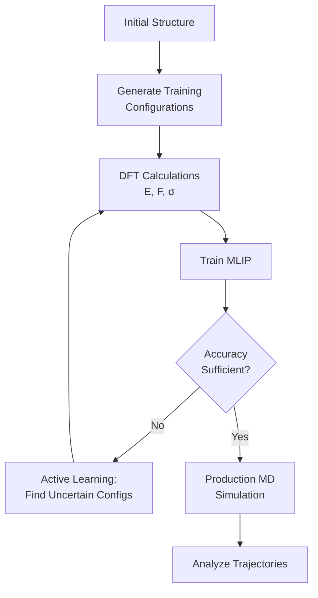
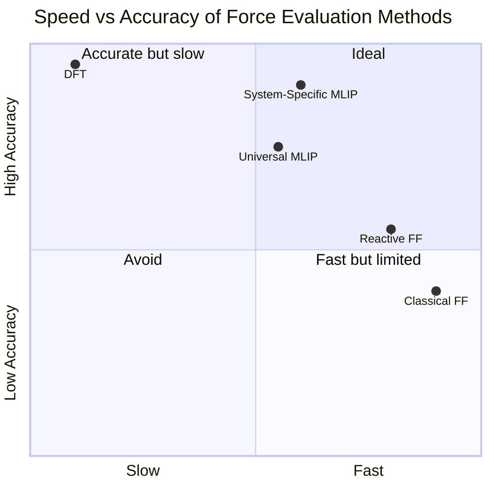

# Machine Learning Force Fields for Molecular Dynamics

## Overview

Molecular dynamics (MD) simulates the motion of atoms over time by computing forces on each atom and integrating Newton's equations of motion. The bottleneck is computing forces: ab initio methods (DFT) are accurate but scale as $O(N^3)$, limiting simulations to hundreds of atoms and picoseconds. Classical empirical potentials are fast but inflexible, requiring manual parameterization for each material system. Machine learning interatomic potentials (MLIPs) bridge this gap, providing near-DFT accuracy at a fraction of the computational cost.

The fundamental idea is simple: train a neural network to map atomic configurations to energies and forces. Forces are obtained as the negative gradient of the predicted energy with respect to atomic positions, guaranteeing energy conservation:

$$\mathbf{F}_i = -\frac{\partial E}{\partial \mathbf{r}_i}$$

This approach was pioneered by Behler and Parrinello in 2007 with their high-dimensional neural network potential (HDNNP), which decomposed the total energy into atomic contributions predicted from local descriptors (atom-centered symmetry functions).

Modern MLIPs have evolved dramatically. NequIP (Batzner et al., 2022) uses E(3)-equivariant graph neural networks, where intermediate features transform correctly under rotations. This equivariance is built into the architecture rather than learned from data, dramatically improving data efficiency — NequIP achieves excellent accuracy with just 1,000 training structures. MACE (Batatia et al., 2022) extends this with higher-order equivariant messages, incorporating many-body interactions efficiently through the ACE (Atomic Cluster Expansion) framework. MACE achieves state-of-the-art accuracy across diverse benchmarks.

Universal MLIPs like M3GNet-UP and MACE-MP-0 are trained on the entire Materials Project database, providing out-of-the-box force fields for any material. While less accurate than system-specific models, they enable rapid prototyping and serve as starting points for fine-tuning.

The fitting protocol for MLIPs involves generating training data (typically 1,000-10,000 DFT calculations of perturbed structures), training the model on energies, forces, and optionally stresses, and validating on held-out configurations. Active learning strategies iteratively identify configurations where the model is uncertain, run DFT on those, and retrain, efficiently expanding the training set to cover the relevant configuration space.

## Key Concepts

- **Machine learning interatomic potential (MLIP)**: A neural network that predicts the potential energy surface of a material from atomic positions, enabling fast and accurate molecular dynamics simulations
- **Equivariance**: A symmetry property where model outputs transform correctly under rotations and reflections — equivariant models are more data-efficient because they don't need to learn rotational invariance from data
- **NequIP**: An E(3)-equivariant GNN for interatomic potentials that achieves high accuracy with minimal training data by building symmetries into the architecture
- **MACE**: Multi-ACE — a highly efficient equivariant MLIP combining GNN message passing with the Atomic Cluster Expansion for systematic many-body interactions
- **Active learning**: An iterative protocol where the model identifies high-uncertainty configurations, DFT calculations are run on those, and the model is retrained, efficiently covering configuration space
- **Energy conservation**: MLIPs derive forces as gradients of energy, guaranteeing conservation of total energy in microcanonical (NVE) simulations

## Code Examples

```python
"""
Running molecular dynamics with a pretrained MACE universal potential.
MACE-MP-0 is trained on the Materials Project and works for any material.
"""
from ase.build import bulk
from ase.md.velocitydistribution import MaxwellBoltzmannDistribution
from ase.md.langevin import Langevin
from ase import units
from mace.calculators import mace_mp

# Build a copper supercell
atoms = bulk("Cu", "fcc", a=3.615) * (3, 3, 3)  # 108 atoms
print(f"System: {len(atoms)} Cu atoms")

# Attach MACE-MP-0 universal potential
calc = mace_mp(model="medium", device="cpu")
atoms.calc = calc

# Compute initial energy and forces
energy = atoms.get_potential_energy()
forces = atoms.get_forces()
print(f"Energy: {energy:.4f} eV ({energy/len(atoms):.4f} eV/atom)")
print(f"Max force: {abs(forces).max():.4f} eV/Å")

# Set up Langevin thermostat at 300 K
MaxwellBoltzmannDistribution(atoms, temperature_K=300)
dyn = Langevin(atoms, timestep=1.0 * units.fs,
               temperature_K=300, friction=0.01)

# Run MD for 100 steps
energies = []
temperatures = []
for step in range(100):
    dyn.run(1)
    e = atoms.get_potential_energy() / len(atoms)
    t = atoms.get_temperature()
    energies.append(e)
    temperatures.append(t)
    if step % 20 == 0:
        print(f"Step {step:4d}: E={e:.4f} eV/atom, T={t:.1f} K")
```

```python
"""
Training a simple MLIP with energy and force labels.
Demonstrates the loss function combining energy and force errors.
"""
import torch
import torch.nn as nn

class SimpleMLIP(nn.Module):
    """Minimal MLIP: per-atom energy model with force via autograd."""
    def __init__(self, descriptor_dim, hidden_dim=64):
        super().__init__()
        self.net = nn.Sequential(
            nn.Linear(descriptor_dim, hidden_dim),
            nn.SiLU(),
            nn.Linear(hidden_dim, hidden_dim),
            nn.SiLU(),
            nn.Linear(hidden_dim, 1)  # Atomic energy
        )

    def forward(self, descriptors, positions):
        """
        descriptors: (N_atoms, descriptor_dim) - local environment descriptors
        positions: (N_atoms, 3) - requires grad for force computation
        """
        atomic_energies = self.net(descriptors).squeeze(-1)  # (N_atoms,)
        total_energy = atomic_energies.sum()

        # Forces = -dE/dr (computed via autograd)
        forces = -torch.autograd.grad(
            total_energy, positions,
            create_graph=self.training  # Need graph for backprop during training
        )[0]

        return total_energy, forces

def train_step(model, optimizer, descriptors, positions,
               target_energy, target_forces,
               force_weight=100.0):
    """Single training step with combined energy + force loss."""
    optimizer.zero_grad()
    positions.requires_grad_(True)
    pred_energy, pred_forces = model(descriptors, positions)

    # Combined loss: energy MSE + force_weight * force MSE
    energy_loss = (pred_energy - target_energy) ** 2
    force_loss = ((pred_forces - target_forces) ** 2).mean()
    loss = energy_loss + force_weight * force_loss

    loss.backward()
    optimizer.step()
    return loss.item(), energy_loss.item(), force_loss.item()

# Example
model = SimpleMLIP(descriptor_dim=50, hidden_dim=64)
optimizer = torch.optim.Adam(model.parameters(), lr=1e-3)
print(f"Parameters: {sum(p.numel() for p in model.parameters()):,}")
```

## Mathematical Formalism

The total energy is decomposed into atomic contributions:

$$E_{\text{total}} = \sum_{i=1}^{N} \varepsilon_i(\{\mathbf{r}_j : j \in \mathcal{N}(i)\})$$

where $\varepsilon_i$ is the local atomic energy depending on the neighborhood $\mathcal{N}(i)$. Forces and stresses follow from differentiation:

$$\mathbf{F}_i = -\frac{\partial E_{\text{total}}}{\partial \mathbf{r}_i}, \qquad \sigma_{\alpha\beta} = -\frac{1}{V}\frac{\partial E_{\text{total}}}{\partial \epsilon_{\alpha\beta}}$$

The training loss combines energy and force errors:

$$\mathcal{L} = w_E \frac{1}{M}\sum_{s=1}^{M}\left(\frac{E_s - \hat{E}_s}{N_s}\right)^2 + w_F \frac{1}{\sum_s N_s}\sum_{s=1}^{M}\sum_{i=1}^{N_s} \|\mathbf{F}_{si} - \hat{\mathbf{F}}_{si}\|^2$$

where $M$ is the number of training structures, $N_s$ is the number of atoms in structure $s$, and $w_E, w_F$ are weighting coefficients (typically $w_F \gg w_E$ since force labels are more abundant).

For equivariant models, features at each layer transform under irreducible representations of O(3):

$$\mathbf{h}_i^{(l)} \in \bigoplus_{\ell=0}^{L} V_\ell^{\oplus n_\ell}$$

where $V_\ell$ is the $(2\ell+1)$-dimensional representation of rotation order $\ell$, and $L$ is the maximum rotation order.

## Diagrams

**MLIP Training and Deployment Pipeline**



**Accuracy vs Speed for Different Force Calculation Methods**



## Exercises

1. **MACE-MP-0 exploration**: Install mace-torch and run a 1 ps MD simulation of bulk water (32 molecules) at 300 K using the MACE-MP-0 universal potential. Compute the radial distribution function $g(r)$ and compare to experimental data.

2. **Force matching**: Generate a toy dataset of 100 configurations of a Lennard-Jones system. Train the SimpleMLIP model and evaluate: (a) energy MAE, (b) force MAE, (c) force component correlation. How does the force_weight hyperparameter affect results?

3. **Active learning simulation**: Starting with 50 random training structures, implement a simple active learning loop: train a model, predict forces for 1000 new configurations, select the 10 with highest force uncertainty (ensemble disagreement), add DFT labels, retrain. How quickly does accuracy improve compared to random selection?

## Further Reading

- Batzner et al. "E(3)-equivariant graph neural networks for data-efficient and accurate interatomic potentials" Nature Communications 13, 2453 (2022) — NequIP
- Batatia et al. "MACE: Higher order equivariant message passing neural networks" NeurIPS 2022
- Behler & Parrinello. "Generalized Neural-Network Representation of High-Dimensional Potential-Energy Surfaces" Physical Review Letters 98, 146401 (2007)
