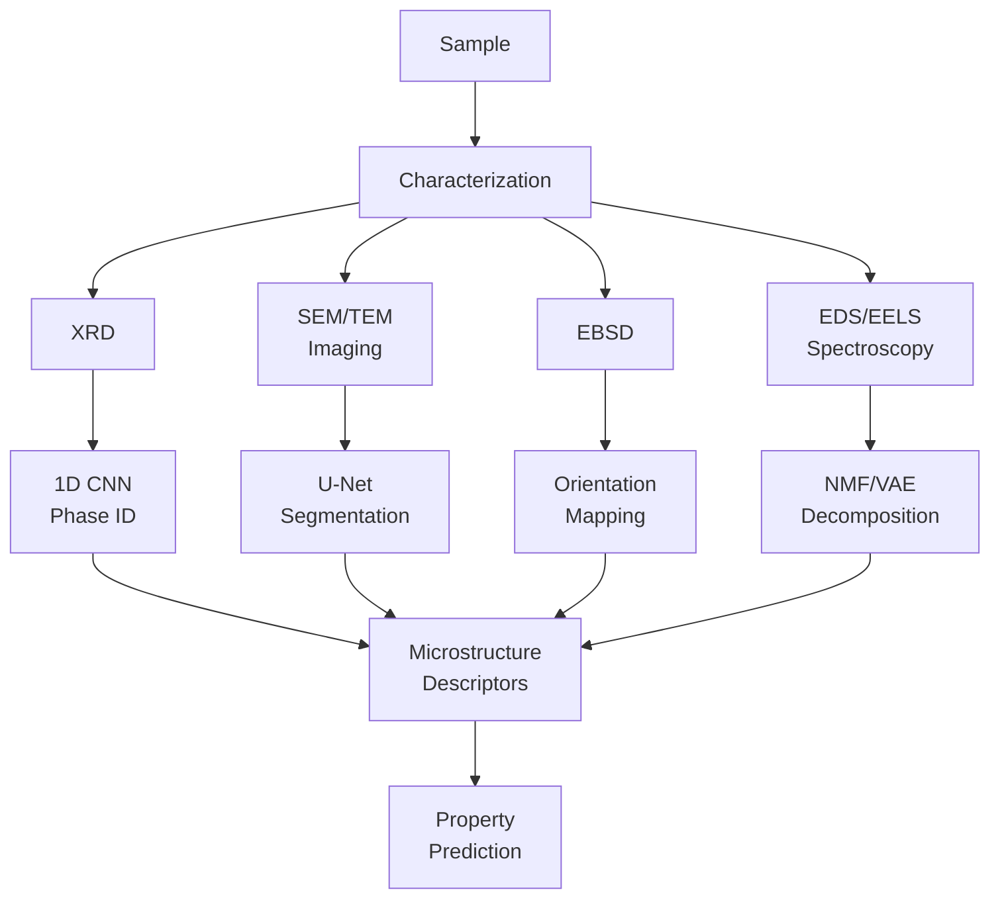

# Microstructure Analysis and Phase Mapping

## Overview

While atomic-scale properties determine what a material *could* do, it is the microstructure — the arrangement of grains, phases, defects, and interfaces at the micrometer scale — that determines what it *actually* does. A steel's strength depends not just on its composition but on grain size, phase distribution, and dislocation density. AI is revolutionizing how we characterize and understand microstructure.

X-ray diffraction (XRD) is the workhorse technique for phase identification. An XRD pattern — intensity as a function of diffraction angle $2\theta$ — is a fingerprint of the crystal phases present in a sample. Traditional analysis involves manual comparison against reference databases (ICDD PDF), which is slow and requires expertise. ML approaches treat XRD patterns as 1D signals and apply convolutional neural networks or transformers to automatically identify phases. Recent work by Lee et al. (2020) achieved >90% accuracy in multi-phase identification, even for mixed and overlapping patterns.

Electron microscopy produces rich microstructure images. Scanning electron microscopy (SEM) reveals grain morphology and fracture surfaces, while transmission electron microscopy (TEM) shows crystal defects and interfaces at atomic resolution. Deep learning — particularly U-Net architectures for semantic segmentation — excels at automatically segmenting microstructure images into distinct phases, grains, and features. This replaces tedious manual annotation and enables quantitative analysis of thousands of images.

Electron backscatter diffraction (EBSD) maps crystal orientation across a sample surface, revealing grain boundaries, texture, and misorientation relationships. ML methods can denoise EBSD data, classify grain boundary types, and predict mechanical properties from orientation maps. The combination of EBSD with computer vision enables automated characterization of complex polycrystalline microstructures.

Spectroscopic mapping techniques — energy-dispersive X-ray spectroscopy (EDS), electron energy loss spectroscopy (EELS), and Raman mapping — produce hyperspectral datasets where each pixel contains a full spectrum. Non-negative matrix factorization (NMF), principal component analysis (PCA), and variational autoencoders can decompose these datasets into component spectra and spatial distributions, revealing chemical heterogeneity invisible to conventional analysis.

Beyond identification, ML enables microstructure-property linkage: predicting macroscopic properties (yield strength, fatigue life, corrosion resistance) directly from microstructure images or statistical descriptors. This closes the loop from processing to structure to properties.

## Key Concepts

- **X-ray diffraction (XRD)**: A characterization technique where X-rays scattered by crystal planes produce a diffraction pattern encoding the crystal structure; peak positions identify phases via Bragg's law
- **Semantic segmentation**: Pixel-wise classification of microstructure images into regions (grains, phases, pores, cracks) using encoder-decoder neural networks like U-Net
- **EBSD (Electron Backscatter Diffraction)**: A technique mapping crystal orientation across a sample, enabling grain size measurement, texture analysis, and grain boundary characterization
- **Phase identification**: Determining which crystal phases are present in a material from experimental data (XRD patterns, diffraction images, spectroscopic data)
- **Hyperspectral decomposition**: Decomposing a dataset where each spatial pixel contains a spectrum into component spectra (endmembers) and abundance maps using NMF, PCA, or autoencoders
- **Microstructure-property linkage**: Using ML to predict macroscopic material properties directly from microstructure images or statistical descriptors (grain size distribution, phase fraction, texture)

## Code Examples

```python
"""
XRD phase identification using a 1D CNN.
Treats XRD patterns as 1D signals for classification.
"""
import torch
import torch.nn as nn
import numpy as np

class XRDClassifier(nn.Module):
    """1D CNN for classifying XRD patterns into crystal phases."""
    def __init__(self, num_points=4000, num_phases=10):
        super().__init__()
        self.features = nn.Sequential(
            nn.Conv1d(1, 32, kernel_size=11, stride=2, padding=5),
            nn.ReLU(),
            nn.MaxPool1d(2),
            nn.Conv1d(32, 64, kernel_size=7, stride=1, padding=3),
            nn.ReLU(),
            nn.MaxPool1d(2),
            nn.Conv1d(64, 128, kernel_size=5, stride=1, padding=2),
            nn.ReLU(),
            nn.AdaptiveAvgPool1d(16),
        )
        self.classifier = nn.Sequential(
            nn.Linear(128 * 16, 256),
            nn.ReLU(),
            nn.Dropout(0.3),
            nn.Linear(256, num_phases)
        )

    def forward(self, x):
        # x: (batch, num_points) -> (batch, 1, num_points)
        x = x.unsqueeze(1)
        x = self.features(x)
        x = x.view(x.size(0), -1)
        return self.classifier(x)

# Generate synthetic XRD-like pattern (Gaussian peaks)
def synthetic_xrd(peak_positions, peak_intensities, two_theta, sigma=0.1):
    """Generate a synthetic XRD pattern as sum of Gaussians."""
    pattern = np.zeros_like(two_theta)
    for pos, intensity in zip(peak_positions, peak_intensities):
        pattern += intensity * np.exp(-0.5 * ((two_theta - pos) / sigma) ** 2)
    pattern += 0.01 * np.random.randn(len(two_theta))  # Add noise
    return pattern / pattern.max()  # Normalize

two_theta = np.linspace(10, 90, 4000)
# Silicon peaks at known positions
si_pattern = synthetic_xrd(
    [28.4, 47.3, 56.1, 69.1, 76.4],
    [1.0, 0.55, 0.30, 0.06, 0.08],
    two_theta
)
print(f"XRD pattern shape: {si_pattern.shape}")

model = XRDClassifier(num_points=4000, num_phases=10)
x = torch.tensor(si_pattern, dtype=torch.float32).unsqueeze(0)
logits = model(x)
print(f"Phase logits: {logits.shape}")
```

```python
"""
Microstructure segmentation using a simplified U-Net.
Segments SEM/optical micrographs into distinct phases.
"""
import torch
import torch.nn as nn

class MiniUNet(nn.Module):
    """Minimal U-Net for microstructure semantic segmentation."""
    def __init__(self, in_channels=1, num_classes=4):
        super().__init__()
        # Encoder
        self.enc1 = self._block(in_channels, 32)
        self.enc2 = self._block(32, 64)
        self.pool = nn.MaxPool2d(2)

        # Bottleneck
        self.bottleneck = self._block(64, 128)

        # Decoder
        self.up2 = nn.ConvTranspose2d(128, 64, kernel_size=2, stride=2)
        self.dec2 = self._block(128, 64)
        self.up1 = nn.ConvTranspose2d(64, 32, kernel_size=2, stride=2)
        self.dec1 = self._block(64, 32)

        self.final = nn.Conv2d(32, num_classes, kernel_size=1)

    def _block(self, in_ch, out_ch):
        return nn.Sequential(
            nn.Conv2d(in_ch, out_ch, 3, padding=1),
            nn.BatchNorm2d(out_ch),
            nn.ReLU(),
            nn.Conv2d(out_ch, out_ch, 3, padding=1),
            nn.BatchNorm2d(out_ch),
            nn.ReLU()
        )

    def forward(self, x):
        e1 = self.enc1(x)
        e2 = self.enc2(self.pool(e1))
        b = self.bottleneck(self.pool(e2))
        d2 = self.dec2(torch.cat([self.up2(b), e2], dim=1))
        d1 = self.dec1(torch.cat([self.up1(d2), e1], dim=1))
        return self.final(d1)

# Example: segment a 256x256 micrograph into 4 phases
model = MiniUNet(in_channels=1, num_classes=4)
img = torch.randn(1, 1, 256, 256)  # Grayscale micrograph
segmentation = model(img)
print(f"Input: {img.shape}")
print(f"Output segmentation map: {segmentation.shape}")
print(f"Predicted classes per pixel: {segmentation.argmax(1).shape}")
```

## Mathematical Formalism

Bragg's law governs X-ray diffraction peak positions:

$$n\lambda = 2d_{hkl}\sin\theta$$

where $\lambda$ is the X-ray wavelength, $d_{hkl}$ is the interplanar spacing for Miller indices $(hkl)$, and $\theta$ is the Bragg angle.

The interplanar spacing for a cubic crystal with lattice parameter $a$ is:

$$\frac{1}{d_{hkl}^2} = \frac{h^2 + k^2 + l^2}{a^2}$$

For microstructure segmentation, the U-Net pixel-wise cross-entropy loss is:

$$\mathcal{L} = -\frac{1}{HW}\sum_{i=1}^{H}\sum_{j=1}^{W}\sum_{c=1}^{C} y_{ijc} \log(\hat{p}_{ijc})$$

where $y_{ijc}$ is the one-hot ground truth label for pixel $(i,j)$, class $c$, and $\hat{p}_{ijc}$ is the predicted probability.

Non-negative matrix factorization for hyperspectral data decomposes the data matrix $\mathbf{V} \in \mathbb{R}^{m \times n}_+$ into:

$$\mathbf{V} \approx \mathbf{W}\mathbf{H}, \quad \mathbf{W} \geq 0, \; \mathbf{H} \geq 0$$

where $\mathbf{W} \in \mathbb{R}^{m \times k}_+$ contains $k$ component spectra and $\mathbf{H} \in \mathbb{R}^{k \times n}_+$ contains spatial abundance maps.

## Diagrams

**AI-Powered Microstructure Analysis Pipeline**



## Exercises

1. **Synthetic XRD classification**: Generate synthetic XRD patterns for 5 common crystal structures (FCC, BCC, HCP, diamond cubic, NaCl-type) with random noise and peak broadening. Train the XRD classifier and evaluate accuracy. How does noise level affect performance?

2. **Microstructure segmentation**: Download a publicly available micrograph dataset (e.g., UHCS — Ultra High Carbon Steel micrographs). Train a U-Net to segment into ferrite, cementite, and pearlite phases. Report IoU per class.

3. **Grain size analysis**: Write a script that takes a segmented microstructure image, identifies individual grains using connected components, and computes grain size statistics (mean, distribution). Verify against the Hall-Petch relationship.

## Further Reading

- Lee et al. "A deep-learning technique for phase identification in multiphase inorganic compounds" Nature Communications 11, 86 (2020)
- DeCost & Holm. "A computer vision approach for automated analysis of microstructures" Computational Materials Science 110, 126-133 (2015)
- Azimi et al. "Advanced steel microstructural classification by deep learning methods" Scientific Reports 8, 2128 (2018)
