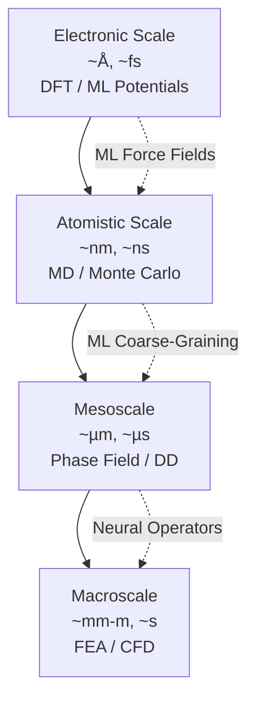
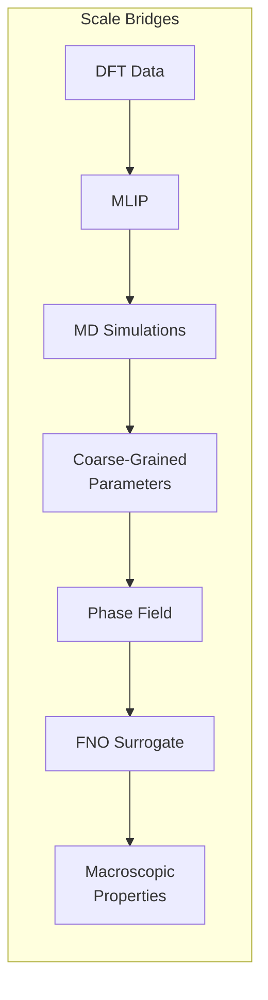

# Multi-Scale Modeling in Materials Science

## Overview

Materials behavior emerges from phenomena spanning many orders of magnitude in length and time. Electronic structure determines bonding at the angstrom scale. Atomic arrangements form crystal structures at the nanometer scale. Dislocations and grain boundaries operate at the micrometer scale. And macroscopic properties — strength, conductivity, toughness — manifest at the millimeter-to-meter scale. The grand challenge of multi-scale modeling is connecting these levels into a unified predictive framework.

Traditional multi-scale approaches use hierarchical handoffs: DFT computes interatomic potentials, which feed into molecular dynamics, whose results parameterize dislocation dynamics or phase field models, which ultimately inform finite element analysis. Each handoff involves approximations and information loss. AI is transforming this pipeline by enabling direct bridging between scales, learning scale-specific surrogate models, and integrating heterogeneous data from multiple scales simultaneously.

At the electronic-to-atomistic bridge, ML interatomic potentials (covered in Lesson 06) replace DFT while retaining quantum-level accuracy. At the atomistic-to-mesoscale bridge, ML models can extract coarse-grained parameters — dislocation mobility laws, grain boundary energies, phase boundary kinetics — from MD simulations, replacing the manual fitting that traditionally bottlenecked this transition.

Phase field modeling simulates microstructure evolution (solidification, grain growth, phase transformations) by solving coupled partial differential equations on a continuum mesh. These simulations are computationally expensive because they must resolve thin interfaces. ML surrogates — particularly physics-informed neural networks (PINNs) and neural operators like Fourier Neural Operators (FNOs) — can dramatically accelerate phase field simulations. An FNO trained on phase field data can predict microstructure evolution 1,000× faster than conventional solvers.

Hierarchical ML approaches integrate data from multiple scales simultaneously. For example, a multi-fidelity model might combine cheap composition-based predictions with expensive DFT data using Gaussian processes or transfer learning. Graph neural networks that operate on multi-resolution meshes can capture both fine-grained atomic detail and coarse-grained continuum behavior in a single model.

The emerging frontier is end-to-end differentiable multi-scale simulation, where gradients flow from macroscopic properties back through mesoscale and atomistic models to the electronic level. This enables inverse design: specifying desired macroscopic properties and optimizing composition and processing conditions to achieve them.

## Key Concepts

- **Hierarchical multi-scale modeling**: A framework where each scale (electronic → atomistic → mesoscale → macroscale) uses its own simulation method, with parameters passed upward between scales
- **Phase field modeling**: A continuum approach for simulating microstructure evolution that represents interfaces as diffuse fields rather than sharp boundaries, governed by Cahn-Hilliard or Allen-Cahn type equations
- **Fourier Neural Operator (FNO)**: A neural network architecture that learns mappings between function spaces by performing convolutions in Fourier space, useful for solving PDEs governing material behavior
- **Physics-Informed Neural Network (PINN)**: A neural network trained to satisfy physical laws (conservation equations, constitutive relations) as soft constraints, combining data-driven learning with physics
- **Multi-fidelity learning**: Combining data of different accuracy and cost levels (e.g., experiments, DFT, empirical models) using techniques like co-kriging or transfer learning
- **Coarse-graining**: Systematically reducing the degrees of freedom in a model by averaging over fine-scale details, creating computationally tractable models that retain essential physics

## Code Examples

```python
"""
Fourier Neural Operator (FNO) for accelerating phase field simulations.
Learns to predict microstructure evolution from initial conditions.
"""
import torch
import torch.nn as nn
import torch.nn.functional as F

class SpectralConv2d(nn.Module):
    """Spectral convolution layer — the core of FNO."""
    def __init__(self, in_channels, out_channels, modes1, modes2):
        super().__init__()
        self.modes1 = modes1
        self.modes2 = modes2
        scale = 1 / (in_channels * out_channels)
        self.weights1 = nn.Parameter(
            scale * torch.randn(in_channels, out_channels, modes1, modes2, 2)
        )
        self.weights2 = nn.Parameter(
            scale * torch.randn(in_channels, out_channels, modes1, modes2, 2)
        )

    def compl_mul2d(self, inp, weights):
        """Complex multiplication in Fourier space."""
        return torch.einsum("bixy,ioxy->boxy",
                           torch.view_as_complex(inp.contiguous()),
                           torch.view_as_complex(weights.contiguous()))

    def forward(self, x):
        B = x.shape[0]
        # FFT
        x_ft = torch.fft.rfft2(x)
        # Multiply relevant Fourier modes
        out_ft = torch.zeros(B, self.weights1.shape[1],
                            x.size(-2), x.size(-1)//2+1,
                            dtype=torch.cfloat, device=x.device)
        out_ft[:, :, :self.modes1, :self.modes2] = \
            torch.einsum("bixy,ioxy->boxy",
                        x_ft[:, :, :self.modes1, :self.modes2],
                        torch.view_as_complex(self.weights1))
        out_ft[:, :, -self.modes1:, :self.modes2] = \
            torch.einsum("bixy,ioxy->boxy",
                        x_ft[:, :, -self.modes1:, :self.modes2],
                        torch.view_as_complex(self.weights2))
        # Inverse FFT
        return torch.fft.irfft2(out_ft, s=(x.size(-2), x.size(-1)))

class FNO2d(nn.Module):
    """2D Fourier Neural Operator for phase field acceleration."""
    def __init__(self, modes=12, width=32, in_ch=1, out_ch=1):
        super().__init__()
        self.lift = nn.Linear(in_ch, width)
        self.spectral_layers = nn.ModuleList([
            SpectralConv2d(width, width, modes, modes) for _ in range(4)
        ])
        self.linear_layers = nn.ModuleList([
            nn.Conv2d(width, width, 1) for _ in range(4)
        ])
        self.project = nn.Sequential(
            nn.Linear(width, 128),
            nn.GELU(),
            nn.Linear(128, out_ch)
        )

    def forward(self, x):
        # x: (batch, H, W, in_ch) -> initial phase field
        x = self.lift(x)           # (batch, H, W, width)
        x = x.permute(0, 3, 1, 2) # (batch, width, H, W)
        for spec, lin in zip(self.spectral_layers, self.linear_layers):
            x = F.gelu(spec(x) + lin(x))
        x = x.permute(0, 2, 3, 1) # (batch, H, W, width)
        return self.project(x)     # (batch, H, W, out_ch)

# Example: predict phase field after 100 timesteps from initial condition
model = FNO2d(modes=12, width=32)
initial_state = torch.randn(4, 64, 64, 1)  # Batch of 4, 64x64 grid
predicted_state = model(initial_state)
print(f"Input shape:  {initial_state.shape}")
print(f"Output shape: {predicted_state.shape}")
print(f"Parameters:   {sum(p.numel() for p in model.parameters()):,}")
```

```python
"""
Multi-fidelity learning: combining cheap low-fidelity predictions
with expensive high-fidelity DFT data using transfer learning.
"""
import torch
import torch.nn as nn
import numpy as np

class MultiFidelityModel(nn.Module):
    """
    Two-stage model:
    1. Low-fidelity base (pretrained on abundant cheap data)
    2. High-fidelity correction (fine-tuned on scarce expensive data)
    """
    def __init__(self, input_dim, hidden_dim=64):
        super().__init__()
        # Low-fidelity model (pretrained on ~10,000 empirical data points)
        self.low_fidelity = nn.Sequential(
            nn.Linear(input_dim, hidden_dim),
            nn.ReLU(),
            nn.Linear(hidden_dim, hidden_dim),
            nn.ReLU(),
            nn.Linear(hidden_dim, 1)
        )
        # Correction model (trained on ~500 DFT data points)
        self.correction = nn.Sequential(
            nn.Linear(input_dim + 1, hidden_dim // 2),  # +1 for LF prediction
            nn.ReLU(),
            nn.Linear(hidden_dim // 2, 1)
        )

    def forward(self, x, mode="high"):
        lf_pred = self.low_fidelity(x)
        if mode == "low":
            return lf_pred
        # High-fidelity = low-fidelity + learned correction
        correction_input = torch.cat([x, lf_pred], dim=-1)
        hf_correction = self.correction(correction_input)
        return lf_pred + hf_correction

# Training procedure
model = MultiFidelityModel(input_dim=20)

# Phase 1: Train low-fidelity model on abundant data
print("Phase 1: Training low-fidelity model on 10,000 empirical data points")
lf_optimizer = torch.optim.Adam(model.low_fidelity.parameters(), lr=1e-3)

# Phase 2: Freeze LF, train correction on scarce DFT data
print("Phase 2: Training correction model on 500 DFT data points")
for param in model.low_fidelity.parameters():
    param.requires_grad = False
hf_optimizer = torch.optim.Adam(model.correction.parameters(), lr=1e-4)

# At inference, use full model for best accuracy
x_test = torch.randn(1, 20)
lf_prediction = model(x_test, mode="low")
hf_prediction = model(x_test, mode="high")
print(f"Low-fidelity prediction: {lf_prediction.item():.4f}")
print(f"High-fidelity prediction: {hf_prediction.item():.4f}")
```

## Mathematical Formalism

The Cahn-Hilliard equation governs spinodal decomposition and phase separation:

$$\frac{\partial c}{\partial t} = \nabla \cdot \left[ M \nabla \left( \frac{\partial f}{\partial c} - \kappa \nabla^2 c \right) \right]$$

where $c(\mathbf{r}, t)$ is the composition field, $M$ is the mobility, $f(c)$ is the bulk free energy density (typically a double-well potential), and $\kappa$ is the gradient energy coefficient.

The Allen-Cahn equation governs order-disorder transitions:

$$\frac{\partial \phi}{\partial t} = -L\left(\frac{\partial f}{\partial \phi} - \kappa \nabla^2 \phi\right)$$

The FNO learns an operator $\mathcal{G}_\theta: \mathcal{A} \to \mathcal{U}$ mapping initial conditions to solutions. Each Fourier layer applies:

$$v^{(l+1)}(x) = \sigma\left(W^{(l)} v^{(l)}(x) + \mathcal{F}^{-1}\left(R^{(l)} \cdot \mathcal{F}(v^{(l)})\right)(x)\right)$$

where $\mathcal{F}$ and $\mathcal{F}^{-1}$ are the Fourier and inverse Fourier transforms, $R^{(l)}$ are learnable weights in Fourier space, and $W^{(l)}$ is a pointwise linear transform.

## Diagrams

**Multi-Scale Modeling Hierarchy**



**ML Surrogates at Each Scale**



## Exercises

1. **1D Cahn-Hilliard simulation**: Implement the 1D Cahn-Hilliard equation using finite differences. Simulate spinodal decomposition starting from a slightly perturbed uniform composition. Then train an FNO to predict the state after 1000 timesteps from the initial condition. How much faster is the FNO than the direct simulation?

2. **Multi-fidelity model**: Create a toy problem where the low-fidelity function is $f_{\text{LF}}(x) = \sin(x)$ and the high-fidelity function is $f_{\text{HF}}(x) = \sin(x) + 0.1\sin(5x)$. Train with 1000 LF and 50 HF samples. Compare against using 50 HF samples alone.

3. **Scale bridging**: Use a pretrained MACE potential to compute the $\gamma$-surface (generalized stacking fault energy) for FCC aluminum. This atomistic quantity directly parameterizes dislocation models at the mesoscale.

## Further Reading

- Li et al. "Fourier Neural Operator for Parametric Partial Differential Equations" ICLR 2021
- Raissi et al. "Physics-informed neural networks" Journal of Computational Physics 378, 686-707 (2019)
- Fish et al. "Mesoscopic and multiscale modeling in materials" Nature Materials 20, 774-786 (2021)
