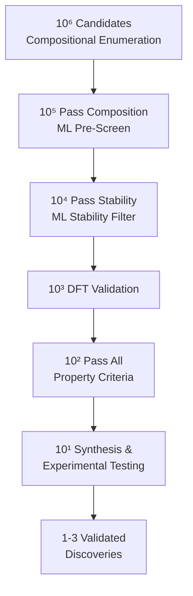

# High-Throughput Computational Screening

## Overview

The traditional approach to materials discovery — synthesize a material, test its properties, iterate — is too slow for the modern world's demands. We need new battery cathodes, thermoelectric materials, photovoltaic absorbers, and catalysts at an unprecedented pace. High-throughput computational screening (HTCS) inverts the paradigm: compute properties for millions of candidates virtually, rank them, and only synthesize the most promising few.

The HTCS pipeline has three stages: generation (define the search space), evaluation (compute or predict target properties), and filtering (apply selection criteria). The search space can be defined by enumerating known structure prototypes with element substitutions, by exploring compositional spaces systematically, or by using generative models to propose entirely novel structures. Evaluation combines DFT calculations for high-confidence predictions with ML surrogate models for rapid pre-screening. Filtering applies domain-specific criteria — for photovoltaics, a band gap of 1.0-1.8 eV and good absorption; for battery cathodes, high voltage, structural stability, and ion mobility.

The Materials Genome Initiative (MGI), launched in 2011, catalyzed this field by funding open materials databases and computational infrastructure. Since then, HTCS has produced numerous validated discoveries. Hautier et al. identified new phosphor materials for solid-state lighting. Jain et al. screened thousands of cathode materials for Li-ion batteries. Greeley et al. discovered Pt-based alloy catalysts through computational screening that outperformed pure Pt.

Descriptors for screening are physically motivated quantities that correlate with the target application. For catalysts, the d-band center (average energy of the d-electron states) predicts adsorption energies via Sabatier's principle. For thermoelectrics, the band effective mass and valley degeneracy predict the power factor. For photovoltaics, the spectroscopic limited maximum efficiency (SLME) combines band gap, absorption coefficient, and non-radiative losses into a single figure of merit.

Inverse design frameworks go beyond forward screening by directly optimizing materials for target properties. Bayesian optimization navigates the composition space efficiently, requiring far fewer evaluations than exhaustive screening. Conditional generative models (cVAEs, diffusion models) can generate structures optimized for specified property targets. Reinforcement learning agents explore the materials space by iteratively proposing and evaluating candidates.

The integration of ML with HTCS creates a powerful synergy. ML pre-screens millions of candidates in seconds, DFT validates the top thousands, and experiments confirm the top tens. This funnel reduces the cost of discovery by orders of magnitude.

## Key Concepts

- **High-throughput screening**: Systematically evaluating large libraries of candidate materials for target properties using computation and/or ML, filtering down to a tractable set for synthesis
- **Materials Genome Initiative (MGI)**: A U.S. federal initiative launched in 2011 to accelerate materials discovery through computation, open data, and collaboration
- **Screening descriptors**: Physically motivated quantities that predict application-level performance from computable properties (e.g., d-band center for catalysis, SLME for photovoltaics)
- **Inverse design**: Specifying desired properties and using optimization or generative models to find materials that satisfy those specifications
- **Bayesian optimization**: A sequential optimization strategy that builds a surrogate model (typically Gaussian process) of the objective function and balances exploration and exploitation
- **Pareto optimality**: When optimizing multiple competing objectives, Pareto-optimal materials are those where no objective can be improved without worsening another

## Code Examples

```python
"""
High-throughput screening pipeline for photovoltaic absorbers.
Screen materials by band gap and stability for solar cell applications.
"""
import numpy as np
from mp_api.client import MPRester

def screen_photovoltaics(api_key, max_results=1000):
    """Screen Materials Project for candidate PV absorbers."""
    with MPRester(api_key) as mpr:
        # Query: semiconductors with suitable band gaps
        docs = mpr.summary.search(
            band_gap=(1.0, 1.8),              # Optimal PV range (eV)
            energy_above_hull=(0, 0.025),      # Thermodynamically stable
            is_gap_direct=True,                # Direct band gap preferred
            fields=[
                "material_id", "formula_pretty", "band_gap",
                "energy_above_hull", "formation_energy_per_atom",
                "density", "symmetry"
            ],
            num_chunks=5
        )

    print(f"Found {len(docs)} candidate PV absorbers")

    # Rank by band gap proximity to Shockley-Queisser optimum (1.34 eV)
    candidates = []
    for doc in docs:
        sq_distance = abs(doc.band_gap - 1.34)
        candidates.append({
            "id": doc.material_id,
            "formula": doc.formula_pretty,
            "band_gap": doc.band_gap,
            "e_hull": doc.energy_above_hull,
            "sq_distance": sq_distance
        })

    # Sort by SQ distance (closer to optimal = better)
    candidates.sort(key=lambda x: x["sq_distance"])

    print("\nTop 10 candidates:")
    for i, c in enumerate(candidates[:10]):
        print(f"  {i+1}. {c['formula']:12s} Eg={c['band_gap']:.3f} eV "
              f"E_hull={c['e_hull']:.4f} eV/atom")

    return candidates

# Usage:
# candidates = screen_photovoltaics("YOUR_API_KEY")
```

```python
"""
Bayesian optimization for materials composition optimization.
Efficiently search composition space for optimal properties.
"""
import numpy as np
from scipy.stats import norm

class BayesianOptimizer:
    """Simple Bayesian optimizer using Gaussian Process surrogate."""
    def __init__(self, bounds, kernel_length=0.3, noise=0.01):
        self.bounds = bounds  # [(low, high), ...] for each dimension
        self.X_observed = []
        self.y_observed = []
        self.kernel_length = kernel_length
        self.noise = noise

    def kernel(self, X1, X2):
        """RBF kernel."""
        sq_dist = np.sum((X1[:, None, :] - X2[None, :, :]) ** 2, axis=-1)
        return np.exp(-sq_dist / (2 * self.kernel_length ** 2))

    def predict(self, X_new):
        """GP posterior mean and variance."""
        if len(self.X_observed) == 0:
            return np.zeros(len(X_new)), np.ones(len(X_new))

        X_obs = np.array(self.X_observed)
        y_obs = np.array(self.y_observed)

        K = self.kernel(X_obs, X_obs) + self.noise * np.eye(len(X_obs))
        K_star = self.kernel(X_new, X_obs)
        K_inv = np.linalg.inv(K)

        mu = K_star @ K_inv @ y_obs
        var = 1.0 - np.diag(K_star @ K_inv @ K_star.T)
        var = np.maximum(var, 1e-6)
        return mu, var

    def expected_improvement(self, X_new):
        """Acquisition function: Expected Improvement."""
        mu, var = self.predict(X_new)
        sigma = np.sqrt(var)

        if len(self.y_observed) == 0:
            return sigma  # Pure exploration

        best_y = max(self.y_observed)
        z = (mu - best_y) / sigma
        ei = sigma * (z * norm.cdf(z) + norm.pdf(z))
        return ei

    def suggest(self, n_candidates=1000):
        """Suggest next point to evaluate."""
        # Random candidate points
        candidates = np.random.uniform(
            [b[0] for b in self.bounds],
            [b[1] for b in self.bounds],
            size=(n_candidates, len(self.bounds))
        )
        ei = self.expected_improvement(candidates)
        best_idx = np.argmax(ei)
        return candidates[best_idx]

    def observe(self, x, y):
        """Record an observation."""
        self.X_observed.append(x)
        self.y_observed.append(y)

# Example: optimize a 2D composition for thermoelectric figure of merit
optimizer = BayesianOptimizer(bounds=[(0, 1), (0, 1)])

def mock_zt(x):
    """Mock thermoelectric ZT (figure of merit) as function of composition."""
    return np.exp(-3 * ((x[0] - 0.3)**2 + (x[1] - 0.7)**2)) + 0.05 * np.random.randn()

print("Bayesian Optimization for thermoelectric ZT:")
for i in range(20):
    x_next = optimizer.suggest()
    y_next = mock_zt(x_next)
    optimizer.observe(x_next, y_next)
    if (i + 1) % 5 == 0:
        best_idx = np.argmax(optimizer.y_observed)
        best_x = optimizer.X_observed[best_idx]
        best_y = optimizer.y_observed[best_idx]
        print(f"  Step {i+1}: best ZT = {best_y:.4f} at x = [{best_x[0]:.3f}, {best_x[1]:.3f}]")
```

## Mathematical Formalism

The Shockley-Queisser limit gives the theoretical maximum efficiency of a single-junction solar cell:

$$\eta_{\text{SQ}} = \frac{J_{\text{sc}} \cdot V_{\text{oc}} \cdot FF}{P_{\text{sun}}}$$

where $J_{\text{sc}}$ is the short-circuit current density, $V_{\text{oc}}$ is the open-circuit voltage, and $FF$ is the fill factor. The optimal band gap is $E_g \approx 1.34$ eV.

Expected Improvement, the standard Bayesian optimization acquisition function:

$$\text{EI}(\mathbf{x}) = \mathbb{E}\left[\max(f(\mathbf{x}) - f^+, 0)\right] = \sigma(\mathbf{x})\left[z\Phi(z) + \phi(z)\right]$$

where $z = \frac{\mu(\mathbf{x}) - f^+}{\sigma(\mathbf{x})}$, $f^+ = \max_i y_i$ is the best observation, $\mu$ and $\sigma$ are the GP posterior mean and standard deviation, and $\Phi$, $\phi$ are the standard normal CDF and PDF.

The d-band model for catalytic activity relates adsorption energy to the electronic structure:

$$\Delta E_{\text{ads}} \approx \alpha(\epsilon_d - \epsilon_d^{\text{ref}}) + \beta V_{sd}^2 + \gamma$$

where $\epsilon_d$ is the d-band center relative to the Fermi level.

## Diagrams

**High-Throughput Screening Funnel**



**Bayesian Optimization Loop**


## Exercises

1. **PV screening**: Using the Materials Project API, screen for direct band gap semiconductors with $1.0 < E_g < 1.8$ eV and $E_{\text{hull}} < 25$ meV/atom. How many candidates pass? Rank by proximity to the SQ optimum.

2. **Bayesian optimization benchmark**: Compare Bayesian optimization vs. random search for optimizing the mock ZT function above. Run 50 trials of each with 30 evaluations per trial. How many evaluations does BO need to find a solution within 90% of the optimum?

3. **Multi-objective screening**: Implement a Pareto front analysis for thermoelectric materials, optimizing both ZT (high) and cost (low) simultaneously. Generate a Pareto front plot and identify non-dominated materials.

## Further Reading

- Curtarolo et al. "The high-throughput highway to computational materials design" Nature Materials 12, 191-201 (2013)
- Jain et al. "Commentary: The Materials Project" APL Materials 1, 011002 (2013)
- Lookman et al. "Active learning in materials science with emphasis on adaptive sampling" npj Computational Materials 5, 21 (2019)
