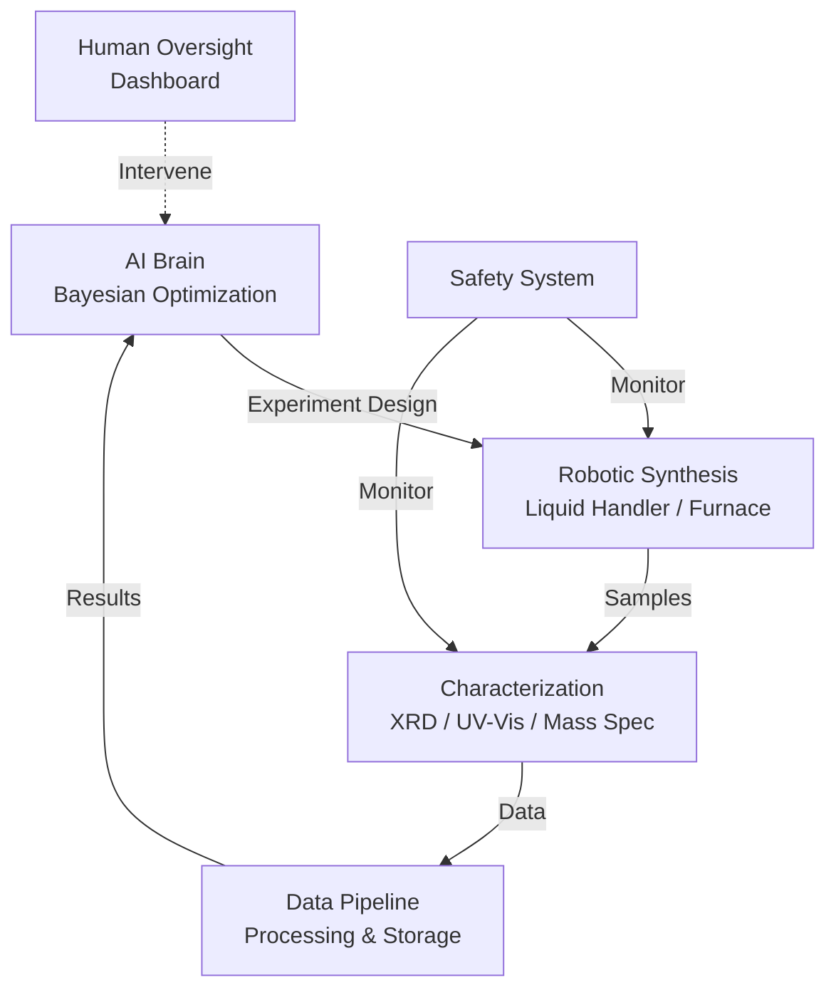
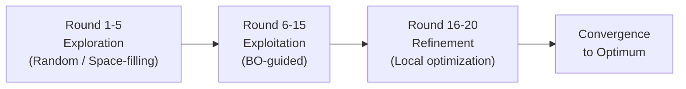

## Self-Driving Laboratories for Materials Discovery

## Overview

Self-driving laboratories (SDLs) represent the convergence of AI, robotics, and materials science into fully autonomous experimental platforms. In an SDL, an AI agent designs experiments, robotic systems execute them, instruments characterize the results, and the AI updates its understanding and plans the next round — all without human intervention. This closed-loop approach can accelerate materials discovery by orders of magnitude compared to human-guided experimentation.

The concept builds on decades of laboratory automation, but the AI component transforms it from automated execution of pre-planned experiments to genuine autonomous decision-making. The key distinction is that SDLs decide *what* to do next, not just *how* to do it. Bayesian optimization (BO) is the most widely used decision-making framework: a Gaussian process surrogate models the relationship between experimental parameters and outcomes, and an acquisition function balances exploring unknown regions with exploiting promising ones.

Several landmark SDL demonstrations have proven the concept. Burger et al. (2020) built a mobile robotic chemist that autonomously optimized photocatalyst formulations, running 688 experiments over 8 days without human intervention, discovering a catalyst 6× more active than the initial formulation. The A-Lab at Lawrence Berkeley National Lab (2023) autonomously synthesized 41 out of 58 targeted novel inorganic materials predicted by GNoME, using robotic powder mixing, heating, and XRD characterization in a fully closed loop.

The architecture of an SDL typically includes: (1) an AI brain — the optimization algorithm that selects experiments, (2) a robotic body — liquid handlers, powder dispensers, or other automated synthesis equipment, (3) characterization instruments — XRD, UV-Vis, mass spectrometry, etc., (4) a data infrastructure — databases, data pipelines, and experiment management software, and (5) safety systems — monitoring for hazards, equipment failures, and out-of-bound conditions.

Bayesian optimization for SDLs must handle unique challenges: experiments are noisy, some may fail entirely, the search space is often mixed (continuous compositions + categorical choices like precursor or method), and constraints (safety limits, equipment capabilities) must be respected. Multi-objective BO handles the common case of optimizing multiple properties simultaneously (e.g., efficiency and stability of a solar cell). Batch BO proposes multiple experiments per round to maximize throughput on parallel equipment.

The integration with computational screening creates a powerful pipeline: HTCS generates candidates, SDLs validate and optimize them experimentally. Transfer learning from simulation to experiment bridges the sim-to-real gap, allowing models trained on DFT data to guide experimental campaigns.

## Key Concepts

- **Self-driving laboratory (SDL)**: A fully autonomous experimental platform where AI plans experiments, robots execute them, instruments characterize results, and the AI iterates — operating in a closed loop
- **Closed-loop optimization**: An iterative cycle where experimental results feed directly back into the model, which designs the next experiment, eliminating human bottlenecks
- **Bayesian optimization (BO)**: A sample-efficient optimization strategy using a probabilistic surrogate model (typically GP) and an acquisition function (EI, UCB, etc.) to select experiments
- **A-Lab**: An autonomous laboratory at LBNL that used robotic synthesis and XRD to synthesize novel materials predicted by computational screening, validating 41 of 58 targets
- **Batch Bayesian optimization**: Proposing multiple experiments simultaneously to exploit parallel equipment, using strategies like q-EI or Thompson sampling to maintain diversity
- **Sim-to-real transfer**: Using computational predictions (DFT, ML) to warm-start experimental optimization, reducing the number of physical experiments needed

## Code Examples

```python
"""
Bayesian Optimization for autonomous materials synthesis optimization.
Uses BoTorch for production-quality Bayesian optimization.
"""
import torch
from botorch.models import SingleTaskGP
from botorch.fit import fit_gpytorch_mll
from botorch.acquisition import ExpectedImprovement
from botorch.optim import optimize_acqf
from gpytorch.mlls import ExactMarginalLogLikelihood

class MaterialsOptimizer:
    """BO-driven optimizer for materials synthesis parameters."""
    def __init__(self, param_bounds, device="cpu"):
        """
        param_bounds: tensor of shape (2, d) with [lower, upper] bounds
        Example: temperature (100-800°C), time (1-24h), concentration (0.1-5M)
        """
        self.bounds = param_bounds.to(device)
        self.device = device
        self.train_X = torch.empty(0, param_bounds.shape[1], device=device)
        self.train_Y = torch.empty(0, 1, device=device)

    def suggest_next(self, batch_size=1):
        """Suggest the next experiment(s) to run."""
        if len(self.train_X) < 3:
            # Not enough data for GP — use random exploration
            return torch.rand(batch_size, self.bounds.shape[1],
                            device=self.device) * \
                   (self.bounds[1] - self.bounds[0]) + self.bounds[0]

        # Fit Gaussian Process
        gp = SingleTaskGP(self.train_X, self.train_Y)
        mll = ExactMarginalLogLikelihood(gp.likelihood, gp)
        fit_gpytorch_mll(mll)

        # Optimize Expected Improvement
        best_f = self.train_Y.max()
        acq = ExpectedImprovement(model=gp, best_f=best_f)
        candidates, acq_values = optimize_acqf(
            acq_function=acq,
            bounds=self.bounds,
            q=batch_size,
            num_restarts=10,
            raw_samples=256,
        )
        return candidates

    def observe(self, X, Y):
        """Record experimental results."""
        self.train_X = torch.cat([self.train_X, X])
        self.train_Y = torch.cat([self.train_Y, Y.unsqueeze(-1)
                                   if Y.dim() == 1 else Y])

    def best_so_far(self):
        """Return the best observation."""
        best_idx = self.train_Y.argmax()
        return self.train_X[best_idx], self.train_Y[best_idx]

# Example: optimize thin film deposition parameters
bounds = torch.tensor([
    [100.0, 1.0, 0.1],   # Lower: temp (°C), time (h), pressure (Torr)
    [800.0, 24.0, 10.0],  # Upper
])
optimizer = MaterialsOptimizer(bounds)

# Simulate an SDL campaign
def mock_film_quality(params):
    """Mock thin film quality as function of synthesis parameters."""
    temp, time, pressure = params[0]
    quality = torch.exp(-((temp - 450)**2/20000 +
                          (time - 8)**2/20 +
                          (pressure - 3)**2/5))
    return quality + 0.02 * torch.randn(1)

print("Self-Driving Lab Campaign:")
for round_num in range(15):
    x_next = optimizer.suggest_next()
    y_next = mock_film_quality(x_next)
    optimizer.observe(x_next, y_next)
    if (round_num + 1) % 5 == 0:
        best_x, best_y = optimizer.best_so_far()
        print(f"  Round {round_num+1}: best quality = {best_y.item():.4f}")
        print(f"    params: T={best_x[0]:.0f}°C, t={best_x[1]:.1f}h, P={best_x[2]:.1f} Torr")
```

```python
"""
Experiment orchestration for a self-driving lab.
Shows the closed-loop architecture connecting AI, robot, and instruments.
"""
from dataclasses import dataclass
from typing import Optional
import json

@dataclass
class Experiment:
    """Represents a single synthesis experiment."""
    experiment_id: int
    parameters: dict        # Synthesis conditions
    status: str = "planned" # planned -> running -> characterizing -> complete
    result: Optional[dict] = None

class SDLOrchestrator:
    """Orchestrates the self-driving lab loop."""
    def __init__(self, optimizer, synthesizer, characterizer, safety_checker):
        self.optimizer = optimizer
        self.synthesizer = synthesizer
        self.characterizer = characterizer
        self.safety = safety_checker
        self.experiments = []
        self.round_num = 0

    def run_campaign(self, n_rounds, batch_size=1):
        """Execute an autonomous experimental campaign."""
        for rnd in range(n_rounds):
            self.round_num += 1
            print(f"\n=== Round {self.round_num} ===")

            # 1. AI suggests experiments
            suggestions = self.optimizer.suggest_next(batch_size)
            print(f"  AI suggests: {suggestions}")

            # 2. Safety check
            for params in suggestions:
                if not self.safety.check(params):
                    print(f"  SAFETY: Rejected {params}")
                    continue

                # 3. Synthesize
                exp = Experiment(
                    experiment_id=len(self.experiments),
                    parameters=params
                )
                exp.status = "running"
                self.synthesizer.execute(exp)

                # 4. Characterize
                exp.status = "characterizing"
                exp.result = self.characterizer.measure(exp)
                exp.status = "complete"

                # 5. Feed back to optimizer
                self.optimizer.observe(params, exp.result["target_value"])
                self.experiments.append(exp)

            # 6. Report progress
            best_x, best_y = self.optimizer.best_so_far()
            print(f"  Best so far: {best_y:.4f}")

        return self.experiments

# The orchestrator connects all SDL components in a closed loop
print("SDL Architecture: Optimizer <-> Robot <-> Instruments <-> Database")
```

## Mathematical Formalism

The Gaussian Process posterior after observing data $\mathcal{D} = \{(\mathbf{x}_i, y_i)\}_{i=1}^n$ is:

$$\mu(\mathbf{x}) = \mathbf{k}(\mathbf{x})^\top (\mathbf{K} + \sigma_n^2\mathbf{I})^{-1}\mathbf{y}$$

$$\sigma^2(\mathbf{x}) = k(\mathbf{x}, \mathbf{x}) - \mathbf{k}(\mathbf{x})^\top (\mathbf{K} + \sigma_n^2\mathbf{I})^{-1}\mathbf{k}(\mathbf{x})$$

where $\mathbf{K}$ is the kernel matrix, $\mathbf{k}(\mathbf{x})$ is the kernel vector between the test point and training points, and $\sigma_n^2$ is the observation noise.

The Upper Confidence Bound (UCB) acquisition function provides an alternative to EI:

$$\text{UCB}(\mathbf{x}) = \mu(\mathbf{x}) + \beta_t \sigma(\mathbf{x})$$

where $\beta_t$ controls the exploration-exploitation trade-off, typically set as $\beta_t = 2\log(t^{d/2 + 2}\pi^2/3\delta)$ for regret guarantees.

For multi-objective optimization with $K$ objectives, the Expected Hypervolume Improvement:

$$\text{EHVI}(\mathbf{x}) = \mathbb{E}\left[\text{HV}(\mathcal{P} \cup \{f(\mathbf{x})\}) - \text{HV}(\mathcal{P})\right]$$

where $\text{HV}(\mathcal{P})$ is the hypervolume dominated by the Pareto set $\mathcal{P}$.

## Diagrams

**Self-Driving Laboratory Architecture**



**Optimization Convergence in SDL Campaigns**



## Exercises

1. **BO benchmark**: Implement the Materials Optimizer above and compare three acquisition functions (EI, UCB, Thompson Sampling) on the mock_film_quality objective. Run 30 trials of each and plot the best-seen value vs. evaluation number. Which converges fastest?

2. **Batch BO**: Modify the optimizer to suggest batches of 4 experiments per round (simulating parallel equipment). How does this compare to sequential BO in terms of total evaluations to find the optimum?

3. **Design an SDL**: Choose a specific materials application (e.g., optimizing perovskite solar cell efficiency). Design the full SDL architecture: what synthesis robot is needed, what characterization instruments, what optimization algorithm, what safety constraints? Document the closed-loop workflow.

## Further Reading

- Burger et al. "A mobile robotic chemist" Nature 583, 237-241 (2020)
- Szymanski et al. "An autonomous laboratory for the accelerated synthesis of novel materials" Nature 624, 86-91 (2023) — A-Lab
- Lookman et al. "Active learning in materials science" npj Computational Materials 5, 21 (2019)
