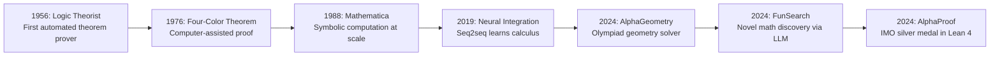

# What is AI for Mathematics?

## Overview

Mathematics is the language of science — the scaffolding on which physics, engineering, economics, and computer science are built. For millennia, mathematical progress depended on human intuition: a brilliant leap of insight, a clever construction, a painstaking proof verified line by line. But mathematics is now entering a new era. **AI systems can conjecture new theorems, discover novel algorithms, verify formal proofs, and solve competition-level problems** that challenge the best human minds.

This lesson introduces the emerging field of AI for mathematics: what it is, where it came from, why it matters, and the landmark breakthroughs that are reshaping how mathematics is done.

---

## What Does "AI for Mathematics" Mean?

AI for mathematics encompasses several distinct capabilities:

- **Automated theorem proving**: Using search, reinforcement learning, or language models to construct formal proofs in systems like Lean, Coq, or Isabelle.
- **Conjecture generation**: AI discovers patterns in mathematical data and proposes new conjectures for humans to verify.
- **Symbolic computation**: Classical computer algebra (simplification, integration, equation solving) augmented with learned heuristics.
- **Mathematical reasoning**: Large language models solving word problems, competition math, and graduate-level exercises.
- **Algorithm discovery**: AI finds new algorithms or mathematical constructions that improve on known results.

---

## A Brief History

### Early Symbolic AI (1950s–1990s)

The dream of mechanized mathematics is as old as AI itself. In 1956, Newell and Simon's **Logic Theorist** proved 38 of the 52 theorems in Chapter 2 of Russell and Whitehead's *Principia Mathematica*. In 1976, the **four-color theorem** became the first major theorem proved with substantial computer assistance. Through the 1980s and 1990s, computer algebra systems like Mathematica and Maple made symbolic computation routine — but they relied on hand-coded rules, not learning.

### The Machine Learning Turn (2000s–2010s)

As deep learning matured, researchers began asking: can neural networks learn to do math? Early results were modest — sequence-to-sequence models could learn to integrate simple expressions (Lample & Charton, 2019) but struggled with anything beyond textbook calculus. Meanwhile, the formal verification community built large libraries of machine-checked proofs (Lean's mathlib, Coq's Mathematical Components), creating training data for the first time.

### The Breakthrough Era (2023–Present)

The field exploded with three landmark results in 2024, all from Google DeepMind:

- **AlphaGeometry** (January 2024): A neuro-symbolic system that solved 25 out of 30 olympiad geometry problems from the past decade — approaching IMO gold-medal performance. It combined a neural language model for generating auxiliary constructions with a symbolic deduction engine.
- **FunSearch** (January 2024): An LLM-driven evolutionary search that discovered new solutions to the **cap set problem** in extremal combinatorics, producing constructions larger than any previously known. This was the first time an LLM contributed a genuinely novel mathematical result.
- **AlphaProof** (July 2024): A reinforcement learning system built on **Lean 4** that solved 4 out of 6 problems at the 2024 International Mathematical Olympiad, earning the equivalent of a **silver medal**. It used AlphaZero-style self-play to search for proofs in Lean's formal language.



---

## Why Does It Matter?

### Scaling Mathematical Discovery

There are far more mathematical problems than mathematicians. The backlog of open conjectures grows every year. AI can explore vast search spaces — millions of candidate proofs, constructions, or counterexamples — that no human could traverse manually. FunSearch evaluated millions of candidate programs to find cap set constructions; AlphaProof explored enormous proof trees via Monte Carlo tree search.

### Formal Verification at Scale

Modern mathematics increasingly relies on complex proofs that are difficult to verify by peer review. The proof of the Kepler conjecture (Hales, 2005) required years of computer-assisted verification. AI-powered proof assistants can check — and eventually generate — proofs with machine-verified certainty, raising the confidence bar for all of mathematics.

### Bridging Intuition and Rigor

Mathematicians often have strong intuitions about what should be true but struggle to formalize them. AI systems like AlphaProof can take an informal problem statement and search for a formal proof, acting as a bridge between human intuition and machine-checkable rigor.

---

## A Simple Example: Symbolic Computation with SymPy

Before neural approaches, symbolic computation was — and remains — the workhorse of computer-aided mathematics. Here is a taste of what tools like SymPy can do:

```python
import sympy as sp

# Define symbolic variables
x, y = sp.symbols('x y')

# Symbolic differentiation
f = sp.sin(x**2) * sp.exp(-x)
df = sp.diff(f, x)
print("f'(x) =", df)
# Output: f'(x) = 2*x*exp(-x)*cos(x**2) - exp(-x)*sin(x**2)

# Symbolic integration
integral = sp.integrate(sp.exp(-x**2), (x, -sp.oo, sp.oo))
print("Gaussian integral =", integral)
# Output: Gaussian integral = sqrt(pi)

# Solve a system of equations
solutions = sp.solve([x + y - 5, x - y - 1], [x, y])
print("Solutions:", solutions)
# Output: Solutions: {x: 3, y: 2}

# Prove a simple identity
identity = sp.simplify(sp.cos(x)**2 + sp.sin(x)**2 - 1)
print("cos^2 + sin^2 - 1 =", identity)
# Output: cos^2 + sin^2 - 1 = 0
```

This is classical symbolic AI — rule-based, exact, and powerful for well-structured problems. The new frontier is combining these symbolic engines with neural networks that can handle ambiguity, generate creative constructions, and navigate enormous search spaces.

---

## Key Takeaways

- AI for mathematics spans theorem proving, conjecture generation, symbolic computation, mathematical reasoning, and algorithm discovery.
- The field has roots in the 1950s but has accelerated dramatically since 2024 with AlphaGeometry, FunSearch, and AlphaProof.
- AlphaProof's IMO silver medal (2024) demonstrated that AI can perform at the level of elite human mathematicians on competition problems.
- Formal proof languages (Lean 4, Coq, Isabelle) provide both training data and verification infrastructure for AI systems.
- The combination of neural intuition and symbolic rigor is the key architectural pattern driving current breakthroughs.

---

## Further Reading

- Trinh et al., "Solving olympiad geometry without human demonstrations" (AlphaGeometry, Nature 2024)
- Romera-Paredes et al., "Mathematical discoveries from program search with large language models" (FunSearch, Nature 2024)
- DeepMind, "AI achieves silver-medal standard solving International Mathematical Olympiad problems" (AlphaProof, 2024)
- Lample & Charton, "Deep Learning for Symbolic Mathematics" (2019)
