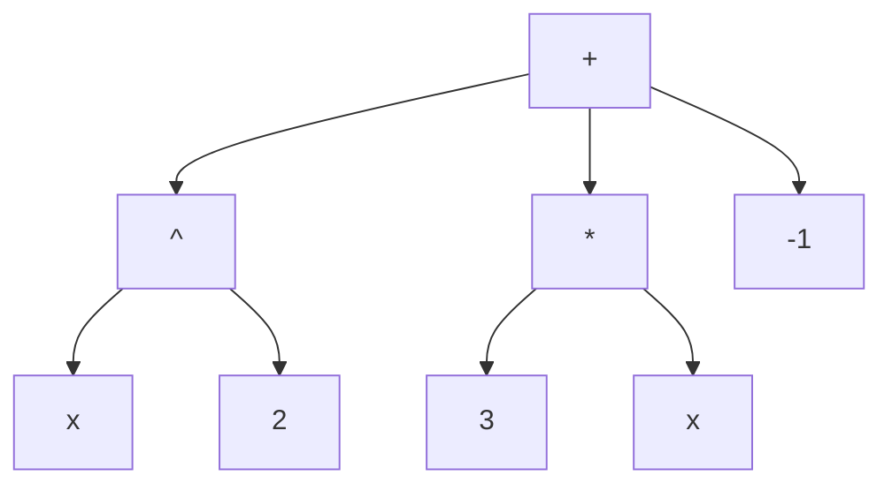
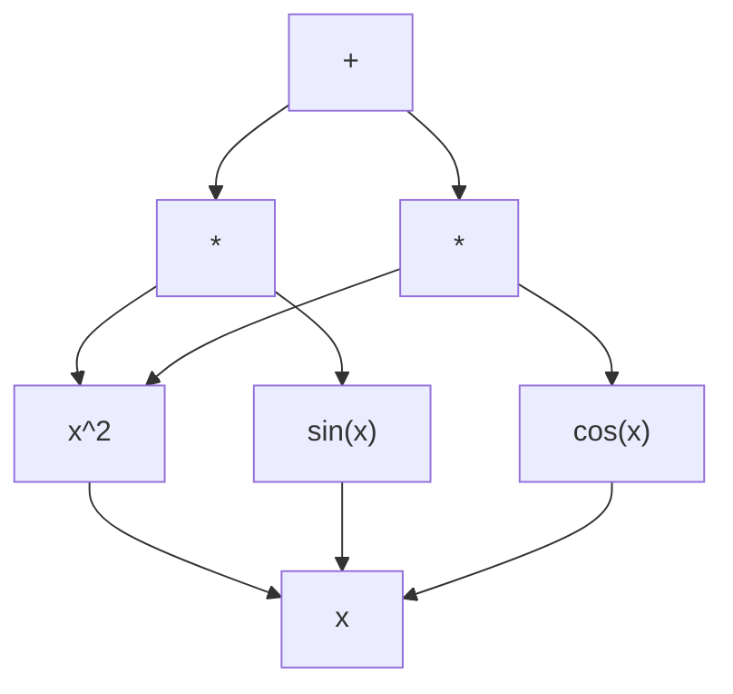

# Mathematical Representations for AI

## Overview

Before a neural network can reason about mathematics, it needs mathematical objects encoded in a form it can process — vectors, sequences, or graphs. This lesson explores the major representation strategies for feeding mathematics into AI systems: tokenized sequences, expression trees, graph representations, and raw LaTeX. The choice of representation profoundly affects what a model can learn and how well it generalizes.

---

## The Representation Problem

Consider a simple equation:

$$\frac{d}{dx}\left[ x^2 \sin(x) \right] = 2x\sin(x) + x^2\cos(x)$$

A human sees structure — a product rule, familiar functions, nested composition. A neural network sees... nothing, until we encode this into numbers. The central question is: **what encoding preserves the mathematical structure that matters?**

---

## Strategy 1: Tokenization of Math Expressions

The simplest approach treats math as text. Just as NLP models tokenize English sentences into subwords, we can tokenize mathematical expressions into meaningful tokens.

### Prefix Notation (Polish Notation)

Lample and Charton (2019) showed that writing expressions in **prefix notation** — where the operator comes before its arguments — produces unambiguous sequences with no need for parentheses:

| Infix (human-readable)         | Prefix (model-friendly)                    |
|---------------------------------|--------------------------------------------|
| $2 + 3$                        | `+ 2 3`                                    |
| $x^2 + 3x - 1$                 | `- + ^ x 2 * 3 x 1`                        |
| $\sin(x^2)$                    | `sin ^ x 2`                                |

This tokenization is lossless and unambiguous — every expression maps to exactly one prefix token sequence.

```python
"""
Tokenizing mathematical expressions into prefix notation.
"""

class MathTokenizer:
    """Convert infix math strings to prefix token sequences via a parse tree."""

    OPERATORS = {'+', '-', '*', '/', '^'}
    FUNCTIONS = {'sin', 'cos', 'tan', 'exp', 'log', 'sqrt'}

    @staticmethod
    def infix_to_tree(tokens):
        """
        Simplified recursive-descent parser for math expressions.
        For production use, consider sympy.parsing or a proper grammar.
        """
        import sympy as sp
        expr = sp.sympify(tokens)
        return expr

    @staticmethod
    def tree_to_prefix(expr):
        """Convert a SymPy expression tree to prefix token list."""
        import sympy as sp

        if isinstance(expr, sp.Symbol):
            return [str(expr)]
        elif isinstance(expr, sp.Number):
            return [str(expr)]
        elif isinstance(expr, sp.Add):
            result = ['+']
            for arg in expr.args:
                result.extend(MathTokenizer.tree_to_prefix(arg))
            return result
        elif isinstance(expr, sp.Mul):
            result = ['*']
            for arg in expr.args:
                result.extend(MathTokenizer.tree_to_prefix(arg))
            return result
        elif isinstance(expr, sp.Pow):
            return ['^'] + MathTokenizer.tree_to_prefix(expr.args[0]) + \
                   MathTokenizer.tree_to_prefix(expr.args[1])
        elif isinstance(expr, sp.Function):
            func_name = type(expr).__name__
            return [func_name] + MathTokenizer.tree_to_prefix(expr.args[0])
        else:
            return [str(expr)]

    @staticmethod
    def tokenize(expression_str):
        """Full pipeline: string -> SymPy -> prefix tokens."""
        import sympy as sp
        expr = sp.sympify(expression_str)
        return MathTokenizer.tree_to_prefix(expr)

# Example usage
tokens = MathTokenizer.tokenize("x**2 + 3*x - 1")
print("Prefix tokens:", tokens)
# Output: Prefix tokens: ['+', '-1', '*', '3', 'x', '^', 'x', '2']
```

---

## Strategy 2: Expression Trees

Every mathematical expression has a natural **tree structure**. The expression $x^2 + 3x - 1$ becomes:



Trees preserve the hierarchical structure of math. Each internal node is an operator or function; each leaf is a number or variable. This matters because mathematically equivalent transformations (like commutativity $a + b = b + a$) correspond to simple tree operations (swapping children of a `+` node).

### Building Expression Trees with SymPy

SymPy already represents expressions as trees internally. We can walk the tree to extract structural features:

```python
import sympy as sp

x = sp.Symbol('x')
expr = x**2 + 3*x - 1

def print_tree(expr, indent=0):
    """Recursively print the SymPy expression tree."""
    prefix = "  " * indent
    if expr.args:
        print(f"{prefix}{type(expr).__name__}")
        for arg in expr.args:
            print_tree(arg, indent + 1)
    else:
        print(f"{prefix}{expr} ({type(expr).__name__})")

print_tree(expr)
# Output:
# Add
#   Integer: -1 (NegativeOne)
#   Mul
#     Integer: 3 (Integer)
#     x (Symbol)
#   Pow
#     x (Symbol)
#     Integer: 2 (Integer)

# Count tree depth and node count — useful features for ML
def tree_stats(expr):
    if not expr.args:
        return {"depth": 0, "nodes": 1}
    child_stats = [tree_stats(arg) for arg in expr.args]
    return {
        "depth": 1 + max(s["depth"] for s in child_stats),
        "nodes": 1 + sum(s["nodes"] for s in child_stats),
    }

stats = tree_stats(expr)
print(f"Tree depth: {stats['depth']}, Total nodes: {stats['nodes']}")
# Output: Tree depth: 2, Total nodes: 7
```

---

## Strategy 3: Graph Representations

Some mathematical objects are more naturally represented as **graphs** rather than trees. Equations with shared subexpressions benefit from directed acyclic graphs (DAGs), where common terms are represented once and pointed to by multiple parents. This is called a **computation graph**.

For example, in $f(x) = x^2 \sin(x) + x^2 \cos(x)$, the subexpression $x^2$ appears twice. A tree would duplicate it; a DAG shares it:



Graph neural networks (GNNs) can operate directly on these computation graphs, learning representations that respect the structural sharing. This is especially useful for:

- **Equation verification**: Checking whether two expressions are equivalent by comparing their graph representations
- **Proof graphs**: Representing logical dependencies between proof steps
- **Mathematical knowledge graphs**: Connecting theorems, definitions, and lemmas

---

## Strategy 4: LaTeX as a Sequence

Large language models like GPT-4 and Claude process math primarily as **LaTeX strings** — the same notation mathematicians use in papers:

$$\int_0^{\infty} e^{-x^2}\, dx = \frac{\sqrt{\pi}}{2}$$

becomes the token sequence:

```latex
\int_0^{\infty} e^{-x^2} \, dx = \frac{\sqrt{\pi}}{2}
```

This approach is simple and leverages the vast corpus of mathematical text on the internet. But it has drawbacks:

- **Ambiguity**: The same math can be written in many LaTeX forms (`\frac{1}{2}` vs `1/2` vs `0.5`)
- **No structural awareness**: The model must learn tree structure implicitly from flat token sequences
- **Fragile**: A single missing brace breaks the meaning entirely

Despite these issues, the scale of LaTeX training data makes this the dominant representation for modern LLMs doing math.

---

## Comparison of Representations

| Representation    | Strengths                                       | Weaknesses                                    | Used By                          |
|-------------------|-------------------------------------------------|-----------------------------------------------|----------------------------------|
| Prefix tokens     | Unambiguous, compact, no parentheses            | Loses visual structure                        | Neural symbolic integration      |
| Expression trees  | Preserves hierarchy, natural for math           | No sharing of subexpressions                  | Symbolic regression, tree-NNs    |
| DAG / Graph       | Shares subexpressions, rich structure           | More complex to process                       | GNN-based provers                |
| LaTeX sequence    | Huge training data, human-readable              | Ambiguous, no explicit structure              | GPT-4, Claude, Gemini            |
| Formal language   | Machine-verifiable, precise semantics           | Verbose, steep learning curve                 | AlphaProof (Lean 4), Coq         |

---

## Key Takeaways

- Mathematical expressions must be encoded into numerical representations before neural networks can process them.
- **Prefix notation** produces unambiguous token sequences ideal for sequence-to-sequence models.
- **Expression trees** preserve the hierarchical structure of math and enable tree-based neural architectures.
- **Graph representations** (DAGs) share common subexpressions and are processed by graph neural networks.
- **LaTeX sequences** are the dominant representation for large language models, benefiting from massive training corpora despite structural ambiguity.
- The choice of representation shapes what mathematical properties a model can learn — there is no single best encoding for all tasks.

---

## Further Reading

- Lample & Charton, "Deep Learning for Symbolic Mathematics" (2019) — prefix notation for integration
- Polu & Sutskever, "Generative Language Modeling for Automated Theorem Proving" (2020) — LLM + formal math
- Li et al., "IsarStep: a Benchmark for High-level Mathematical Reasoning" (2021) — structured proof representations
