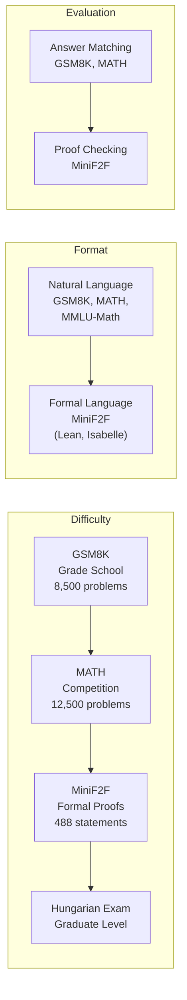

# Mathematical Benchmarks and Datasets

## Overview

Progress in AI for mathematics depends on rigorous evaluation. How do we know if a model can "do math"? The answer lies in **benchmarks** — curated collections of problems with known answers, spanning grade school arithmetic to olympiad-level proofs. This lesson surveys the major mathematical benchmarks, explains what each measures, and shows how to load and work with them in Python.

---

## Why Benchmarks Matter

Without standardized benchmarks, claims about AI math ability are meaningless. A model that solves $2 + 2$ and a model that proves Fermat's Last Theorem are both "doing math," but at vastly different levels. Benchmarks provide:

- **Calibrated difficulty**: Problems graded by level, from elementary to research-frontier
- **Reproducibility**: Anyone can evaluate their model on the same problems
- **Progress tracking**: We can measure improvement over time (GPT-4 scores 42.5% on MATH; frontier models now exceed 90%)

---

## The Major Benchmarks

### GSM8K — Grade School Math

**GSM8K** (Grade School Math 8K) contains **8,500 grade school math word problems** requiring 2–8 steps of arithmetic reasoning. Problems involve basic operations, fractions, percentages, and simple algebra.

Example problem:

> Janet's ducks lay 16 eggs per day. She eats three for breakfast every morning and bakes muffins for her friends every day with four. She sells the remainder at the farmers' market daily for \$2 per fresh duck egg. How much in dollars does she make every day at the farmers' market?

The answer requires: $16 - 3 - 4 = 9$ eggs remaining, then $9 \times 2 = 18$ dollars.

GSM8K tests **chain-of-thought arithmetic reasoning**. Models that can produce step-by-step solutions perform dramatically better than those that try to jump directly to the answer.

### MATH — Competition Mathematics

The **MATH** dataset (Hendrycks et al., 2021) contains **12,500 competition math problems** drawn from AMC 10/12, AIME, and other competitions. Problems span seven subjects:

- Prealgebra
- Algebra
- Number Theory
- Counting & Probability
- Geometry
- Intermediate Algebra
- Precalculus

Each problem is rated on a difficulty scale of 1–5. A Level 1 problem might ask:

$$\text{Compute } \binom{8}{3}$$

while a Level 5 problem might require:

$$\text{Find all } x \in \mathbb{R} \text{ such that } \lfloor x \rfloor \cdot \{x\} = 2024x$$

where $\lfloor x \rfloor$ is the floor function and $\{x\} = x - \lfloor x \rfloor$ is the fractional part.

MATH was considered extremely challenging when released — GPT-4 (2023) scored 42.5%. By 2025, frontier models exceed 90%, demonstrating rapid progress.

### MiniF2F — Formal Mathematics

**MiniF2F** (Zheng et al., 2022) is a benchmark of **488 mathematical statements** formalized in multiple proof assistants (Lean, Isabelle, Metamath). Problems are drawn from AMC, AIME, and IMO competitions, but the key difference is that solutions must be **machine-verifiable formal proofs**, not natural language.

Example (in Lean 4):

```lean
-- Prove that for all natural numbers n, 0 + n = n
theorem zero_add (n : Nat) : 0 + n = n := by
  induction n with
  | zero => rfl
  | succ n ih => simp [Nat.add_succ, ih]
```

MiniF2F is the gold standard for evaluating **automated theorem provers** like AlphaProof. A correct solution is a complete formal proof that type-checks — no partial credit.

### MMLU-Math — Broad Mathematical Knowledge

**MMLU** (Massive Multitask Language Understanding) includes several mathematics subtasks covering:

- Abstract Algebra
- College Mathematics
- Elementary Mathematics
- High School Mathematics
- High School Statistics

These are multiple-choice questions testing **breadth of mathematical knowledge** rather than deep problem-solving. MMLU-Math is useful for evaluating whether a model has broad coverage across mathematical topics.

### Hungarian National Math Exam

The **Hungarian National Math Exam** benchmark tests AI on a graduate-level entrance exam. It includes problems requiring multi-step reasoning, proof construction, and creative problem-solving — a level between competition math and research mathematics.

---

## Benchmark Comparison



| Benchmark       | Size     | Difficulty         | Format           | Evaluation Method         |
|-----------------|----------|--------------------|------------------|---------------------------|
| GSM8K           | 8,500    | Grade school       | Word problems    | Exact answer match        |
| MATH            | 12,500   | AMC/AIME level     | Competition math | Exact answer match        |
| MMLU-Math       | ~1,000   | Mixed              | Multiple choice  | Option selection          |
| MiniF2F         | 488      | AMC/AIME/IMO       | Formal proofs    | Type-checker verification |
| Hungarian Exam  | ~50/year | Graduate level     | Free response    | Expert grading            |

---

## Loading and Inspecting Benchmarks in Python

Most major benchmarks are available on Hugging Face. Here is how to load and explore them:

```python
from datasets import load_dataset

# ── GSM8K ──────────────────────────────────────────────
gsm8k = load_dataset("openai/gsm8k", "main", split="test")
print(f"GSM8K test set: {len(gsm8k)} problems\n")

# Inspect a sample problem
sample = gsm8k[0]
print("Question:", sample["question"])
print("Answer:", sample["answer"])
print()

# ── MATH ───────────────────────────────────────────────
math_dataset = load_dataset("hendrycks/competition_math", split="test")
print(f"MATH test set: {len(math_dataset)} problems\n")

# Inspect a sample and its metadata
sample = math_dataset[0]
print("Problem:", sample["problem"])
print("Level:", sample["level"])
print("Type:", sample["type"])
print("Solution:", sample["solution"][:200], "...")
print()

# ── Distribution analysis ──────────────────────────────
from collections import Counter

# Count problems by difficulty level
level_counts = Counter(p["level"] for p in math_dataset)
print("MATH difficulty distribution:")
for level in sorted(level_counts.keys()):
    count = level_counts[level]
    bar = "#" * (count // 20)
    print(f"  {level}: {count:4d} {bar}")

# Count problems by subject
type_counts = Counter(p["type"] for p in math_dataset)
print("\nMATH subject distribution:")
for subject, count in type_counts.most_common():
    print(f"  {subject}: {count}")
```

Expected output (approximate):

```
GSM8K test set: 1319 problems

MATH test set: 5000 problems

MATH difficulty distribution:
  Level 1:  437 #####################
  Level 2:  894 ############################################
  Level 3: 1093 ######################################################
  Level 4: 1177 ##########################################################
  Level 5: 1399 #####################################################################

MATH subject distribution:
  Algebra: 1187
  Counting & Probability: 474
  Geometry: 479
  Intermediate Algebra: 903
  Number Theory: 540
  Prealgebra: 871
  Precalculus: 546
```

---

## Evaluating a Model on GSM8K

Here is a minimal evaluation loop that tests a language model on GSM8K:

```python
import re
from datasets import load_dataset

def extract_numeric_answer(text):
    """Extract the final numeric answer from a GSM8K solution string."""
    # GSM8K answers end with #### followed by the numeric answer
    match = re.search(r"####\s*([\d,]+)", text)
    if match:
        return match.group(1).replace(",", "")
    return None

# Load the test split
gsm8k = load_dataset("openai/gsm8k", "main", split="test")

# Check answer format
for i in range(3):
    answer = extract_numeric_answer(gsm8k[i]["answer"])
    print(f"Problem {i}: answer = {answer}")

# In practice, you would:
# 1. Send each question to your model with a chain-of-thought prompt
# 2. Extract the numeric answer from the model's response
# 3. Compare to the ground truth
# 4. Report accuracy as: correct / total
```

---

## Key Takeaways

- **GSM8K** (8,500 grade school problems) tests basic arithmetic reasoning and chain-of-thought capability.
- **MATH** (12,500 competition problems) spans seven mathematical subjects at AMC/AIME difficulty, with models improving from ~42% to >90% accuracy in two years.
- **MiniF2F** (488 formal statements) requires machine-verifiable proofs in Lean or Isabelle — the gold standard for theorem proving evaluation.
- **MMLU-Math** tests breadth of mathematical knowledge across multiple-choice questions.
- The **Hungarian National Math Exam** provides graduate-level evaluation beyond standard competition math.
- Most benchmarks are freely available on Hugging Face and can be loaded with a single line of Python.
- The rapid improvement on these benchmarks — especially MATH — is one of the strongest signals that AI mathematical reasoning is advancing quickly.

---

## Further Reading

- Hendrycks et al., "Measuring Mathematical Problem Solving with the MATH Dataset" (2021)
- Cobbe et al., "Training Verifiers to Solve Math Word Problems" (GSM8K, 2021)
- Zheng et al., "MiniF2F: A Cross-System Benchmark for Formal Olympiad-Level Mathematics" (2022)
- Hendrycks et al., "Measuring Massive Multitask Language Understanding" (MMLU, 2021)
