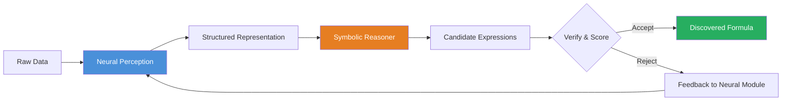

# Neural Symbolic AI for Mathematics

## Overview

Pure neural networks excel at pattern recognition but struggle with exact reasoning, compositionality, and extrapolation — all essential for mathematics. Pure symbolic systems (computer algebra, rule engines) handle exact reasoning perfectly but cannot learn from data or handle noisy inputs. **Neuro-symbolic AI** combines the best of both worlds: neural perception and pattern matching with symbolic logic and guarantees.

The motivation is clear. Consider the task of discovering a physical law from experimental data. A neural network can fit the data perfectly, but its output is an opaque weight matrix — not a human-readable formula. A symbolic regression system can search for formulas, but the combinatorial explosion of possible expressions makes brute-force search infeasible. A neuro-symbolic approach uses a neural network to **guide** the symbolic search, dramatically pruning the space of candidate expressions.

There are several integration strategies for combining neural and symbolic components:

- **Neural $\rightarrow$ Symbolic**: A neural network processes raw data (images, text, sensor readings) and extracts structured representations, which are then fed to a symbolic reasoner. For example, a vision model reads a geometry diagram and extracts points, lines, and angles, then a symbolic solver proves the theorem.
- **Symbolic $\rightarrow$ Neural**: Symbolic knowledge (equations, constraints, domain rules) is injected into the neural network as inductive bias, loss terms, or architectural constraints. Physics-informed neural networks (PINNs) are a prime example, where the PDE residual $\mathcal{L}[u](x) = 0$ is enforced in the loss function.
- **Interleaved**: Neural and symbolic modules alternate control. The neural module proposes candidate steps, and the symbolic module verifies or prunes them. This is the strategy behind neural theorem provers like AlphaProof.

**Symbolic regression** is the flagship application of neuro-symbolic methods in mathematics. Given a dataset $\{(x_i, y_i)\}_{i=1}^{N}$, the goal is to find a closed-form expression $f(x)$ such that $y_i \approx f(x_i)$. Unlike standard regression (which assumes a fixed functional form), symbolic regression searches over the space of all mathematical expressions built from operators $\{+, -, \times, \div, \sin, \cos, \exp, \log, \ldots\}$ and constants.

The search space is enormous. The number of possible expressions of depth $d$ with $k$ binary operators grows as $O(k^{2^d})$. Genetic programming was the original approach: maintain a population of expression trees, apply crossover and mutation, and select by fitness. Modern methods like **PySR** use multi-population evolutionary search with regularization to prefer simpler expressions, achieving a Pareto front trading off accuracy and complexity.

**Neural-guided symbolic search** is another powerful paradigm. A neural network (often a transformer or GNN) is trained on a large corpus of symbolic expressions and their evaluations. At inference time, it predicts likely subexpressions or rewrites, guiding a beam search or MCTS through the space of formulas. Facebook AI's **Deep Symbolic Regression** trains a transformer to directly output symbolic expressions token by token, treating formula discovery as a sequence-to-sequence problem.

The loss function for symbolic regression typically combines a data-fitting term and a complexity penalty:

$$\mathcal{L}(f) = \frac{1}{N}\sum_{i=1}^{N}(y_i - f(x_i))^2 + \lambda \cdot C(f)$$

where $C(f)$ measures expression complexity (e.g., number of nodes in the expression tree) and $\lambda$ controls the accuracy-complexity tradeoff.

## Key Concepts

- **Neuro-symbolic integration**: Combining neural pattern recognition with symbolic exact reasoning
- **Symbolic regression**: Discovering closed-form mathematical expressions from data
- **Pareto front**: The set of expressions that are not dominated in both accuracy and complexity
- **Genetic programming**: Evolutionary search over expression trees using crossover and mutation
- **Neural-guided search**: Using trained neural networks to prune or prioritize symbolic search
- **Expression tree**: A tree representation of a mathematical formula where internal nodes are operators and leaves are variables or constants

## Neuro-Symbolic Pipeline



## Code Examples

```python
"""
Symbolic regression with PySR: discovering formulas from data.
PySR uses multi-population evolutionary search to find
Pareto-optimal expressions trading off accuracy and complexity.
"""
import numpy as np

# Generate synthetic data from a known formula:
# y = 2.5 * cos(x1) + x2^2
np.random.seed(42)
N = 200
X = np.random.randn(N, 2) * 2
y = 2.5 * np.cos(X[:, 0]) + X[:, 1] ** 2 + np.random.randn(N) * 0.05

# --- PySR symbolic regression ---
from pysr import PySRRegressor

model = PySRRegressor(
    niterations=50,            # Number of evolutionary cycles
    binary_operators=["+", "-", "*", "/"],
    unary_operators=["cos", "sin", "exp", "log", "square"],
    populations=20,            # Parallel populations for diversity
    population_size=50,
    maxsize=25,                # Max expression tree size
    complexity_of_operators={  # Assign costs to operators
        "+": 1, "-": 1, "*": 1, "/": 2,
        "cos": 3, "sin": 3, "exp": 3, "log": 3, "square": 2,
    },
    parsimony=0.0032,          # Complexity penalty (lambda)
    loss="loss(prediction, target) = (prediction - target)^2",
    turbo=True,
    verbosity=1,
)

# Fit the model — PySR explores the expression space
model.fit(X, y, variable_names=["x1", "x2"])

# View the Pareto front of discovered expressions
print("Pareto front (accuracy vs complexity):")
print(model)

# Best expression (lowest loss on Pareto front)
print(f"\nBest expression: {model.sympy()}")
print(f"Score (loss): {model.get_best()['loss']:.6f}")
print(f"Complexity: {model.get_best()['complexity']}")

# The model should recover: 2.5 * cos(x1) + x2^2
# Predictions use the symbolic formula, not a black box
y_pred = model.predict(X)
mse = np.mean((y - y_pred) ** 2)
print(f"MSE on training data: {mse:.6f}")
```

```python
"""
Manual symbolic regression via expression tree enumeration.
Demonstrates the core idea without external dependencies.
"""
import numpy as np
from itertools import product

# Target: y = x^2 + 1
x = np.linspace(-3, 3, 50)
y_true = x**2 + 1

# Define a small library of candidate expressions
candidates = {
    "x":       lambda x: x,
    "x^2":     lambda x: x**2,
    "x^3":     lambda x: x**3,
    "sin(x)":  lambda x: np.sin(x),
    "cos(x)":  lambda x: np.cos(x),
    "1":       lambda x: np.ones_like(x),
}

# Search over pairs (a*f1 + b*f2) with integer coefficients
best_expr, best_mse = None, float("inf")
coeff_range = np.arange(-3, 4)  # [-3, -2, ..., 3]

for name1, f1 in candidates.items():
    for name2, f2 in candidates.items():
        for a in coeff_range:
            for b in coeff_range:
                y_pred = a * f1(x) + b * f2(x)
                mse = np.mean((y_true - y_pred) ** 2)
                if mse < best_mse:
                    best_mse = mse
                    best_expr = f"{int(a)}*{name1} + {int(b)}*{name2}"

print(f"Discovered: {best_expr}")   # Expected: 1*x^2 + 1*1
print(f"MSE: {best_mse:.8f}")       # Expected: ~0.0
```

## Further Reading

- Cranmer, M. (2023). "Interpretable Machine Learning for Science with PySR and SymbolicRegression.jl"
- Lample, G. & Charton, F. (2020). "Deep Learning for Symbolic Mathematics" — transformer-based symbolic integration and ODE solving
- Garcez, A. et al. (2022). "Neural-Symbolic AI: The 3rd Wave" — comprehensive survey of neuro-symbolic approaches
- Udrescu, S. & Tegmark, M. (2020). "AI Feynman: A Physics-Inspired Method for Symbolic Regression"
