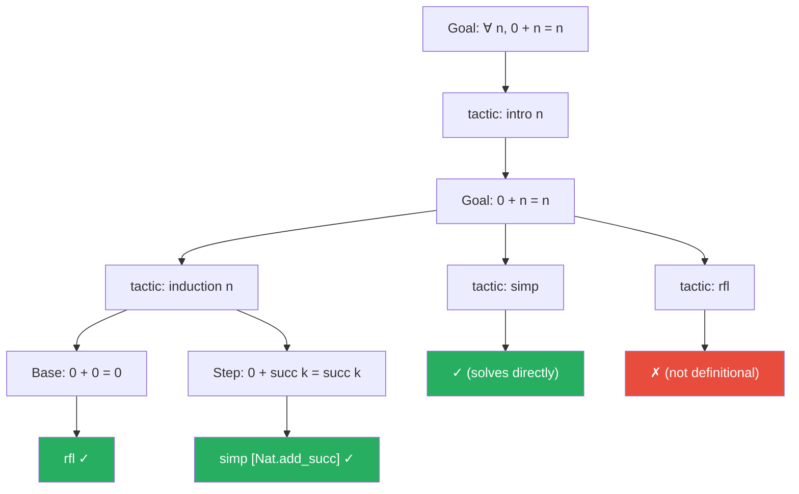

# Introduction to Automated Theorem Proving

## Overview

Automated theorem proving (ATP) is one of the oldest and most ambitious goals in AI: building systems that can construct rigorous mathematical proofs. From Newell and Simon's Logic Theorist (1956) — which proved theorems from Principia Mathematica — to DeepMind's AlphaProof (2024) — which solved International Mathematical Olympiad problems — the field has evolved from rule-based search to neural-guided reasoning.

A **formal proof** is a sequence of logical steps, each justified by an axiom, a previously proven theorem, or a rule of inference. The key property is **mechanical verifiability**: a computer can check every step without understanding the meaning. This stands in contrast to informal proofs written by mathematicians, which rely on intuition, implicit steps, and shared understanding.

### Historical Approaches

**Resolution** (Robinson, 1965) is the workhorse of classical ATP. It works by converting the negation of the goal into conjunctive normal form (CNF) — a conjunction of clauses, where each clause is a disjunction of literals. Two clauses containing complementary literals $P$ and $\neg P$ can be **resolved** to produce a new clause:

$$\frac{C_1 \lor P \qquad C_2 \lor \neg P}{C_1 \lor C_2}$$

If resolution derives the empty clause $\square$, the original goal is proven (by contradiction). Modern resolution provers like E and Vampire solve thousands of problems per second.

**Tableaux methods** work by systematically decomposing formulas into simpler components, building a tree where each branch represents a possible scenario. A branch **closes** when it contains a contradiction ($P$ and $\neg P$). If all branches close, the formula is unsatisfiable, proving the goal.

**Sequent calculus** provides a framework where proofs manipulate sequents $\Gamma \vdash \Delta$, meaning "if all formulas in $\Gamma$ hold, then at least one formula in $\Delta$ holds." Proof rules decompose complex formulas on either side of the turnstile.

### Proof Assistants

Modern mathematics increasingly uses **interactive theorem provers** (ITPs), also called proof assistants:

- **Lean 4**: Developed by Microsoft Research. Uses dependent type theory. Powers the Mathlib library with 100,000+ formalized theorems. Fast, with strong metaprogramming support.
- **Coq**: Based on the Calculus of Inductive Constructions. Used to verify the Four Color Theorem and the CompCert C compiler.
- **Isabelle/HOL**: Based on higher-order logic. Excels at automation via Sledgehammer, which calls external ATP systems.

In these systems, a proof is a program, and a theorem is a type (the **Curry-Howard correspondence**). Proving $A \implies B$ corresponds to writing a function of type $A \rightarrow B$.

### The Role of Search

Theorem proving is fundamentally a **search problem**. At each step, there may be dozens of applicable tactics or lemmas. The proof search tree branches explosively:

- **Breadth-first search** guarantees finding the shortest proof but is memory-intensive.
- **Depth-first search** is memory-efficient but can get lost in infinite branches.
- **Iterative deepening** combines the benefits of both.
- **Monte Carlo Tree Search (MCTS)** balances exploration and exploitation using the UCB1 formula:

$$\text{UCB1}(s, a) = Q(s, a) + c \sqrt{\frac{\ln N(s)}{N(s, a)}}$$

where $Q(s, a)$ is the estimated value of action $a$ in state $s$, $N(s)$ is the visit count for state $s$, and $c$ controls exploration. AlphaProof uses a variant of MCTS guided by a learned value network to search for Lean proofs.

**Hard vs. easy** problems differ dramatically. Many textbook lemmas can be proved by decision procedures (e.g., linear arithmetic via Omega test, ring equalities via normalization). Open research problems may require novel constructions that no search algorithm can find without creative insight — this is where neural guidance becomes essential.

## Key Concepts

- **Resolution**: Refutation-based proving by deriving contradictions from CNF clauses
- **Proof assistant**: Interactive system where humans guide and machines verify proofs
- **Curry-Howard correspondence**: Proofs are programs, propositions are types
- **Tactic**: A proof step command in an ITP (e.g., `intro`, `apply`, `rw`, `simp`)
- **MCTS**: Tree search balancing exploration and exploitation, used by neural theorem provers
- **Mathlib**: Lean's mathematical library with 100,000+ formalized results

## Proof Search Tree



## Code Examples

```lean
/-
  Basic theorem proving in Lean 4.
  Lean proofs proceed by applying "tactics" that transform goals.
-/

-- Theorem: addition by zero on the left
theorem zero_add (n : Nat) : 0 + n = n := by
  induction n with
  | zero => rfl                          -- Base case: 0 + 0 = 0 by definition
  | succ k ih =>                         -- Inductive step: assume 0 + k = k
    simp [Nat.add_succ]                  -- Simplify using the definition of add

-- Theorem: addition is commutative
theorem add_comm (m n : Nat) : m + n = n + m := by
  induction m with
  | zero => simp                         -- 0 + n = n + 0
  | succ k ih =>
    simp [Nat.succ_add, Nat.add_succ]    -- Use definitions of succ_add and add_succ
    exact ih                              -- Apply inductive hypothesis

-- Theorem: a simple logical proof
-- If P implies Q and P holds, then Q holds (modus ponens)
theorem modus_ponens (P Q : Prop) (hpq : P → Q) (hp : P) : Q := by
  exact hpq hp                           -- Apply the implication to the proof of P

-- Theorem: conjunction is commutative
theorem and_comm_example (P Q : Prop) (h : P ∧ Q) : Q ∧ P := by
  obtain ⟨hp, hq⟩ := h                  -- Destructure the conjunction
  exact ⟨hq, hp⟩                        -- Reconstruct in swapped order

-- A more complex example: every natural number is either even or odd
-- (using simple definitions)
def Even (n : Nat) : Prop := ∃ k, n = 2 * k
def Odd (n : Nat) : Prop := ∃ k, n = 2 * k + 1

-- We can state and explore such goals interactively in Lean's editor
-- The proof assistant checks every step and reports remaining goals
```

```python
"""
Simulating proof search with MCTS in Python.
This toy example searches for proofs in a simple propositional logic.
"""
import math
import random

class ProofState:
    """A simplified proof state: list of remaining goals."""
    def __init__(self, goals):
        self.goals = list(goals)

    def is_solved(self):
        return len(self.goals) == 0

    def apply_tactic(self, tactic):
        """Apply a tactic to the first goal. Returns new state or None."""
        if not self.goals:
            return None
        goal = self.goals[0]
        remaining = self.goals[1:]

        if tactic == "simp" and goal in ["0 + n = n", "True", "n = n"]:
            return ProofState(remaining)  # Goal solved
        elif tactic == "intro" and goal.startswith("forall"):
            # Strip the quantifier
            inner = goal.split(",", 1)[1].strip()
            return ProofState([inner] + remaining)
        elif tactic == "split" and "and" in goal:
            parts = goal.split(" and ")
            return ProofState(parts + remaining)
        return None  # Tactic failed

    def __repr__(self):
        return f"Goals: {self.goals}"

class MCTSNode:
    def __init__(self, state, parent=None, tactic=None):
        self.state = state
        self.parent = parent
        self.tactic = tactic
        self.children = []
        self.visits = 0
        self.value = 0.0

    def ucb1(self, c=1.41):
        if self.visits == 0:
            return float("inf")
        return (self.value / self.visits) + c * math.sqrt(
            math.log(self.parent.visits) / self.visits
        )

TACTICS = ["simp", "intro", "split"]

def mcts_search(initial_state, iterations=500):
    root = MCTSNode(initial_state)

    for _ in range(iterations):
        # Selection: pick best child by UCB1
        node = root
        while node.children and not node.state.is_solved():
            node = max(node.children, key=lambda c: c.ucb1())

        # Expansion: try all tactics
        if not node.state.is_solved() and not node.children:
            for tactic in TACTICS:
                new_state = node.state.apply_tactic(tactic)
                if new_state is not None:
                    child = MCTSNode(new_state, parent=node, tactic=tactic)
                    node.children.append(child)

        # Simulation: random rollout
        sim_node = random.choice(node.children) if node.children else node
        reward = 1.0 if sim_node.state.is_solved() else 0.0

        # Backpropagation
        n = sim_node
        while n is not None:
            n.visits += 1
            n.value += reward
            n = n.parent

    # Extract proof (path of tactics to solved state)
    node = root
    proof = []
    while node.children:
        node = max(node.children, key=lambda c: c.visits)
        if node.tactic:
            proof.append(node.tactic)
        if node.state.is_solved():
            break
    return proof

# Example: prove "forall n, 0 + n = n"
state = ProofState(["forall n, 0 + n = n"])
proof = mcts_search(state)
print(f"Found proof: {proof}")
# Expected output: ['intro', 'simp']
```

## Further Reading

- de Moura, L. & Ullrich, S. (2021). "The Lean 4 Theorem Prover and Programming Language"
- Trinh, T. et al. (2024). "Solving Olympiad Geometry without Human Demonstrations" (AlphaGeometry)
- Polu, S. & Sutskever, I. (2020). "Generative Language Modeling for Automated Theorem Proving" (GPT-f)
- Lample, G. et al. (2022). "HyperTree Proof Search for Neural Theorem Proving"
- The Mathlib Community (2024). "Mathlib4: The Lean 4 Mathematical Library"
