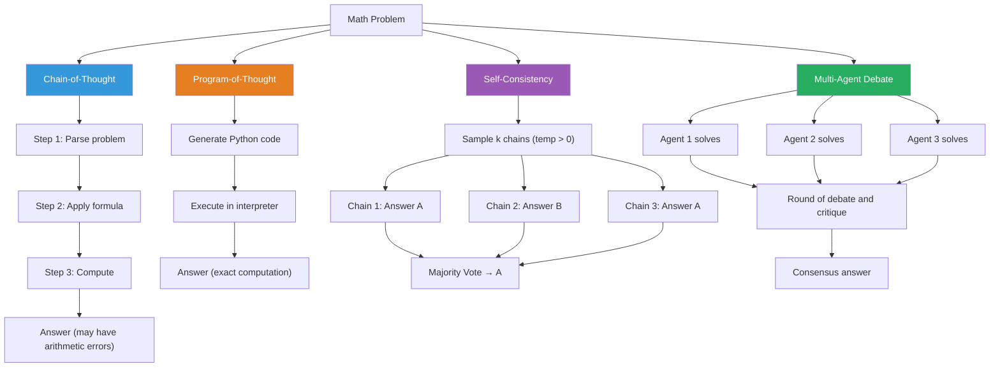

# Large Language Models for Mathematical Reasoning

## Overview

Large language models have achieved remarkable capabilities in mathematical reasoning, from solving competition problems to generating step-by-step proofs. Yet math remains one of the hardest domains for LLMs: it demands exact computation, multi-step logical reasoning, and the ability to verify each step — skills that conflict with the fundamentally probabilistic nature of next-token prediction.

### The Landscape of Math-Capable LLMs

**Minerva** (Google, 2022) fine-tuned PaLM 540B on 118GB of scientific papers and web pages containing mathematical content. It achieved 50% on MATH (a benchmark of competition-level problems) and 78.5% on GSM8K (grade-school math), establishing that domain-specific training data dramatically improves math performance.

**GPT-4** (OpenAI, 2023) demonstrated strong zero-shot mathematical reasoning, scoring in the top percentiles on AP Calculus and GRE Quantitative. Its errors tend to be arithmetic mistakes rather than conceptual failures — suggesting that LLMs can learn mathematical reasoning patterns but struggle with reliable computation.

**DeepSeek-Math** (2024) showed that reinforcement learning (GRPO) applied after supervised fine-tuning on math data pushes performance further, achieving 88.2% on MATH and establishing RL as a key ingredient for mathematical reasoning.

### Chain-of-Thought (CoT) Prompting

The key insight behind CoT is simple: instead of asking an LLM to jump directly to an answer, prompt it to show its work. This mirrors how humans solve math problems — we decompose them into steps.

Without CoT, an LLM sees: "What is $\frac{d}{dx}[x^3 \sin(x)]$?" and must produce the answer in one shot. With CoT, the model reasons step by step:

1. Apply the product rule: $\frac{d}{dx}[f \cdot g] = f'g + fg'$
2. Let $f = x^3$, $g = \sin(x)$
3. $f' = 3x^2$, $g' = \cos(x)$
4. Result: $3x^2 \sin(x) + x^3 \cos(x)$

CoT improves performance dramatically on multi-step problems. On the GSM8K benchmark, CoT prompting improved PaLM 540B accuracy from 17.9% to 58.1%.

### Program-of-Thought (PoT) Prompting

CoT has a critical weakness: LLMs make arithmetic errors. **Program-of-Thought** prompting solves this by having the LLM generate executable code instead of natural language reasoning. The code is then run by a Python interpreter, guaranteeing correct computation.

For example, given "A store has 45 apples. Each day it sells 7 and receives 3. How many after 5 days?", a PoT response generates:

$$\text{apples}(t) = 45 + t \cdot (3 - 7) = 45 - 4t$$

as executable code, and the interpreter computes the exact answer.

### Self-Consistency

A single chain of thought can go wrong. **Self-consistency** (Wang et al., 2023) samples $k$ independent reasoning chains at high temperature and takes a majority vote on the final answer:

$$\hat{a} = \arg\max_{a} \sum_{i=1}^{k} \mathbb{1}[a_i = a]$$

This exploits the insight that correct reasoning paths are more likely to converge on the same answer, while errors are more likely to be diverse. On GSM8K, self-consistency with 40 samples improved CoT accuracy from 58.1% to 74.4% for PaLM 540B.

### MathAgents: Multi-Agent Debate

Recent work explores **multi-agent debate** for mathematical reasoning. Multiple LLM instances act as independent "mathematicians," each proposing solutions. They then critique each other's work across rounds of debate, catching errors that a single model would miss.

The process resembles mathematical peer review:
1. Each agent independently solves the problem
2. Agents share solutions and critique others' reasoning
3. Agents revise their solutions based on feedback
4. After several rounds, agents converge on a consensus answer

Du et al. (2023) showed that multi-agent debate improves accuracy on GSM8K and MATH benchmarks beyond what self-consistency alone achieves, because agents can identify specific logical errors rather than just voting.

## Key Concepts

- **Chain-of-Thought (CoT)**: Prompting LLMs to show step-by-step reasoning before the final answer
- **Program-of-Thought (PoT)**: Generating executable code for reliable computation instead of natural language arithmetic
- **Self-consistency**: Sampling multiple reasoning chains and taking majority vote on the answer
- **Multi-agent debate**: Multiple LLM instances critique each other's mathematical reasoning
- **Verifier models**: Separate models trained to score the correctness of each reasoning step
- **MATH benchmark**: 12,500 competition-level problems across 7 subjects (algebra, geometry, number theory, etc.)

## Reasoning Strategy Comparison



## Code Examples

```python
"""
Chain-of-Thought (CoT) and Program-of-Thought (PoT) prompting
for mathematical reasoning using an LLM API.
"""
from openai import OpenAI

client = OpenAI()  # Uses OPENAI_API_KEY env variable

def solve_with_cot(problem: str) -> str:
    """Chain-of-Thought: ask the LLM to reason step-by-step."""
    response = client.chat.completions.create(
        model="gpt-4o",
        messages=[
            {"role": "system", "content": (
                "You are a math tutor. Solve problems step-by-step. "
                "Show all work clearly, then state the final answer on "
                "a new line as 'ANSWER: <value>'."
            )},
            {"role": "user", "content": problem}
        ],
        temperature=0.0,
    )
    return response.choices[0].message.content

def solve_with_pot(problem: str) -> str:
    """Program-of-Thought: generate code, then execute it."""
    # Step 1: Ask the LLM to generate Python code
    response = client.chat.completions.create(
        model="gpt-4o",
        messages=[
            {"role": "system", "content": (
                "You are a math problem solver. Given a math problem, "
                "write Python code that computes the answer. "
                "Store the final answer in a variable called 'answer'. "
                "Only output the code, no explanation."
            )},
            {"role": "user", "content": problem}
        ],
        temperature=0.0,
    )
    code = response.choices[0].message.content
    # Strip markdown code fences if present
    code = code.replace("```python", "").replace("```", "").strip()

    # Step 2: Execute the generated code
    local_vars = {}
    exec(code, {"__builtins__": __builtins__}, local_vars)
    return code, local_vars.get("answer", "No answer variable found")

def solve_with_self_consistency(problem: str, k: int = 5) -> str:
    """Self-consistency: sample k chains, majority vote."""
    from collections import Counter
    import re

    answers = []
    for _ in range(k):
        response = client.chat.completions.create(
            model="gpt-4o",
            messages=[
                {"role": "system", "content": (
                    "Solve this math problem step-by-step. "
                    "End with 'ANSWER: <number>'."
                )},
                {"role": "user", "content": problem}
            ],
            temperature=0.7,  # Higher temperature for diversity
        )
        text = response.choices[0].message.content
        # Extract the final answer
        match = re.search(r"ANSWER:\s*(.+?)(?:\s|$)", text)
        if match:
            answers.append(match.group(1).strip())

    # Majority vote
    vote = Counter(answers)
    best_answer, count = vote.most_common(1)[0]
    print(f"Votes: {dict(vote)}")
    print(f"Consensus ({count}/{k}): {best_answer}")
    return best_answer


# --- Example usage ---
problem = (
    "A ball is thrown upward with initial velocity 20 m/s from a height "
    "of 5 meters. Using g = 10 m/s^2, at what time does it hit the ground? "
    "Use the equation h(t) = h0 + v0*t - 0.5*g*t^2."
)

# Chain-of-Thought
print("=== Chain-of-Thought ===")
cot_result = solve_with_cot(problem)
print(cot_result)

# Program-of-Thought
print("\n=== Program-of-Thought ===")
code, pot_answer = solve_with_pot(problem)
print(f"Generated code:\n{code}")
print(f"Computed answer: {pot_answer}")

# Self-consistency
print("\n=== Self-Consistency ===")
sc_answer = solve_with_self_consistency(problem, k=5)
print(f"Final answer: {sc_answer}")
```

```python
"""
Multi-agent debate for mathematical reasoning.
Multiple LLM agents independently solve, then critique each other.
"""
from openai import OpenAI

client = OpenAI()

def agent_solve(problem: str, agent_id: int) -> str:
    """Each agent independently solves the problem."""
    response = client.chat.completions.create(
        model="gpt-4o",
        messages=[
            {"role": "system", "content": (
                f"You are Mathematician {agent_id}. Solve the problem "
                "step-by-step. Be rigorous and check your arithmetic."
            )},
            {"role": "user", "content": problem}
        ],
        temperature=0.7,
    )
    return response.choices[0].message.content

def agent_critique(problem: str, own_solution: str,
                   other_solutions: list[str], agent_id: int) -> str:
    """Agent reviews others' solutions and revises its own."""
    others_text = "\n---\n".join(
        f"Solution {i+1}:\n{s}" for i, s in enumerate(other_solutions)
    )
    response = client.chat.completions.create(
        model="gpt-4o",
        messages=[
            {"role": "system", "content": (
                f"You are Mathematician {agent_id}. Review the other "
                "solutions and your own. Identify any errors. "
                "Provide your revised final solution with 'ANSWER: <value>'."
            )},
            {"role": "user", "content": (
                f"Problem: {problem}\n\n"
                f"Your original solution:\n{own_solution}\n\n"
                f"Other mathematicians' solutions:\n{others_text}"
            )}
        ],
        temperature=0.3,
    )
    return response.choices[0].message.content

def multi_agent_debate(problem: str, n_agents: int = 3,
                       n_rounds: int = 2) -> str:
    """Run multi-agent debate and return consensus."""
    # Round 0: Independent solutions
    solutions = [agent_solve(problem, i) for i in range(n_agents)]
    print("Round 0: Independent solutions generated")

    # Debate rounds
    for round_num in range(1, n_rounds + 1):
        new_solutions = []
        for i in range(n_agents):
            others = [s for j, s in enumerate(solutions) if j != i]
            revised = agent_critique(problem, solutions[i], others, i)
            new_solutions.append(revised)
            print(f"Round {round_num}: Agent {i} revised")
        solutions = new_solutions

    return solutions  # Return all final solutions for inspection

# Example
problem = "Find all real solutions to x^3 - 6x^2 + 11x - 6 = 0."
final_solutions = multi_agent_debate(problem, n_agents=3, n_rounds=2)
for i, sol in enumerate(final_solutions):
    print(f"\n=== Agent {i} final answer ===")
    print(sol[-300:])  # Print last 300 chars with the answer
```

## Further Reading

- Wei, J. et al. (2022). "Chain-of-Thought Prompting Elicits Reasoning in Large Language Models"
- Chen, W. et al. (2023). "Program of Thoughts Prompting: Disentangling Computation from Reasoning for Numerical Reasoning"
- Wang, X. et al. (2023). "Self-Consistency Improves Chain of Thought Reasoning in Language Models"
- Lewkowycz, A. et al. (2022). "Solving Quantitative Reasoning Problems with Language Models" (Minerva)
- Du, Y. et al. (2023). "Improving Factuality and Reasoning in Language Models through Multiagent Debate"
- Shao, Z. et al. (2024). "DeepSeekMath: Pushing the Limits of Mathematical Reasoning in Open Language Models"
