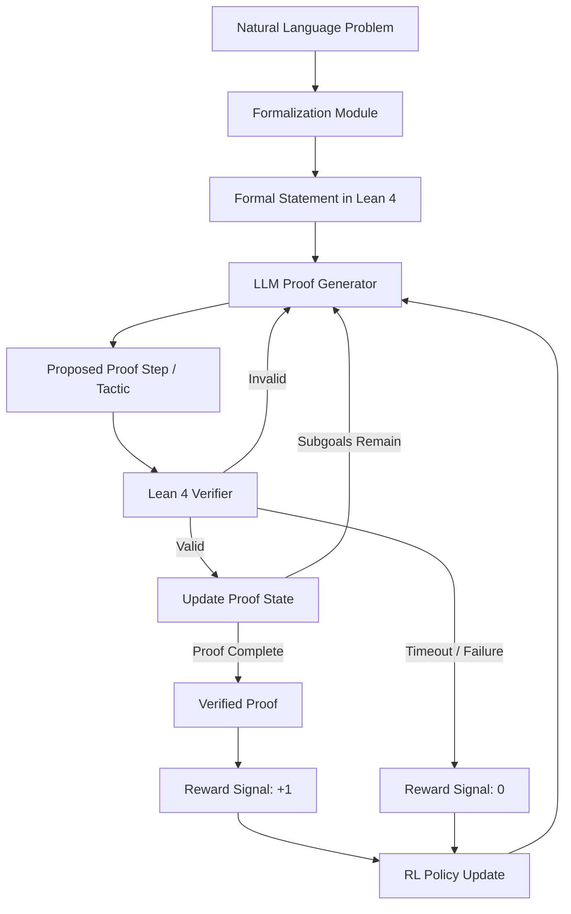

# AlphaProof and Formal Theorem Proving

## Overview

In July 2024, Google DeepMind announced AlphaProof, a system that achieved silver medal performance at the International Mathematical Olympiad (IMO). Published in Nature, AlphaProof represents a landmark in AI-driven mathematics: a system that can discover and verify rigorous proofs for competition-level problems. The key insight is combining the creative generation capabilities of large language models with the absolute rigor of formal proof assistants.

Traditional theorem provers rely on exhaustive search through proof spaces, which grows combinatorially and becomes intractable for complex problems. Human mathematicians, by contrast, use intuition and pattern recognition to guide proof construction. AlphaProof bridges these two worlds by using an LLM (based on Gemini) to generate promising proof steps and a formal verifier (Lean 4) to ensure each step is logically sound.

## Architecture and Training

AlphaProof's architecture has two core components. The LLM acts as a "proof policy" — given a formal mathematical statement and the current proof state, it proposes the next tactic or proof step. The Lean 4 proof assistant acts as a verifier, checking whether each proposed step is valid and tracking what remains to be proved.

The training pipeline proceeds in several stages:

1. **Pre-training on formal mathematics**: The LLM is first trained on the Formal Mathematics 2 (FM2) dataset, a large corpus of formalized mathematical statements and proofs from the Lean mathematical library (Mathlib). This teaches the model the syntax and semantics of formal proof writing.

2. **Reinforcement learning loop**: The model then improves through self-play. It attempts to prove a library of formal statements, receives binary reward signals (proof accepted or rejected by Lean), and updates its policy accordingly. This is analogous to how AlphaGo improved through self-play in Go.

3. **Statement formalization**: A separate component translates natural-language math problems into formal Lean statements, bridging the gap between how humans express problems and what the verifier requires.



The reinforcement learning objective can be expressed as maximizing the expected reward over the distribution of problems:

$$J(\theta) = \mathbb{E}_{s \sim \mathcal{S}} \left[ \mathbb{E}_{\tau \sim \pi_\theta(\cdot | s)} \left[ R(\tau, s) \right] \right]$$

where $\pi_\theta$ is the LLM policy parameterized by $\theta$, $s$ is a formal statement, $\tau$ is the sequence of tactics generated, and $R(\tau, s) \in \{0, 1\}$ indicates whether the tactic sequence constitutes a valid proof.

## Key Results

At the 2024 IMO, AlphaProof solved 4 of 6 problems, earning 28 out of 42 possible points — equivalent to a silver medal. Notably, it solved Problem 6, a notoriously difficult number theory problem that only a handful of human contestants solved. The system was given up to three days of compute per problem, exploring thousands of proof attempts before finding valid solutions.

## Formal Proofs in Lean 4

Lean 4 is a dependently-typed programming language and proof assistant. In Lean, mathematical theorems are types and proofs are programs that inhabit those types (the Curry-Howard correspondence). Here is an example demonstrating formal proof construction:

```lean
-- Prove that for all natural numbers n, n + 0 = n
theorem add_zero (n : Nat) : n + 0 = n := by
  induction n with
  | zero => rfl
  | succ k ih =>
    simp [Nat.add_succ]

-- Prove that addition of natural numbers is commutative
theorem add_comm (m n : Nat) : m + n = n + m := by
  induction m with
  | zero =>
    simp [Nat.zero_add, Nat.add_zero]
  | succ k ih =>
    rw [Nat.succ_add, Nat.add_succ, ih]

-- A more complex example: the sum of the first n naturals
-- We prove: 2 * (0 + 1 + ... + n) = n * (n + 1)
theorem sum_formula (n : Nat) :
    2 * (Finset.range (n + 1)).sum id = n * (n + 1) := by
  induction n with
  | zero => simp
  | succ k ih =>
    rw [Finset.range_succ, Finset.sum_insert (Finset.not_mem_range_self)]
    simp [Nat.mul_add, ih, Nat.succ_eq_add_one]
    ring
```

Each tactic (`induction`, `rfl`, `simp`, `rw`, `ring`) corresponds to a logical inference step. The Lean kernel verifies every step, making it impossible to introduce logical errors. AlphaProof's LLM learns to select and sequence these tactics to close proof goals.

## Why Formal Verification Matters

The combination of LLMs with formal verification addresses a fundamental limitation of neural networks: they can be confidently wrong. A pure LLM might generate plausible-looking but incorrect proofs. By routing every step through Lean's type checker, AlphaProof guarantees that accepted proofs are logically valid. This creates a powerful synergy:

- The LLM provides **creativity and intuition** — proposing non-obvious proof strategies
- The formal verifier provides **certainty** — every accepted proof is correct by construction

The reward signal from the verifier is also perfectly shaped for RL. Unlike domains where reward design is subjective, mathematical correctness is binary and unambiguous: either the proof type-checks or it does not.

## Broader Impact

AlphaProof demonstrates that AI can contribute to mathematical research, not just computation. The formal proofs it produces are fully machine-checkable and can be added to mathematical libraries. As these systems improve, they could assist human mathematicians in verifying complex proofs, exploring conjectures, and formalizing existing mathematical knowledge. The Lean mathematical library (Mathlib) already contains over 150,000 formalized theorems, and AI-assisted formalization could accelerate this effort dramatically.

## Key Takeaways

- AlphaProof combines an LLM (Gemini-based) with the Lean 4 proof assistant for rigorous theorem proving
- Reinforcement learning with formal verification as the reward signal enables self-improvement without human proof data
- The system achieved IMO silver medal performance in 2024, solving problems that challenge top human contestants
- Formal verification eliminates the risk of incorrect proofs, complementing the LLM's creative capabilities
- The Curry-Howard correspondence (proofs as programs) makes dependent type theory a natural framework for AI-driven mathematics
