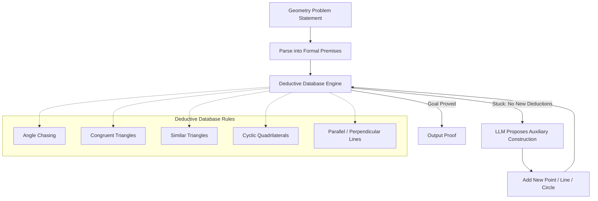

# AlphaGeometry: AI for Geometry Problems

## Overview

In January 2024, Google DeepMind published AlphaGeometry in Nature, a system that solves olympiad-level geometry problems at the level of an IMO silver medalist. The system solved 25 out of 30 olympiad geometry problems from a benchmark spanning 2000-2022 — a dramatic leap from the previous best AI result of 10 problems. What makes AlphaGeometry remarkable is its hybrid architecture: a symbolic Deductive Database (DD) engine for rigorous logical reasoning, paired with an LLM for creative auxiliary construction.

Geometry has long been considered one of the hardest domains for AI. Unlike algebra or number theory, geometry proofs often require introducing auxiliary elements — extra points, lines, or circles not mentioned in the problem statement — that reveal hidden structure. This demands a form of mathematical intuition that purely symbolic systems lack.

## Architecture: DD + LLM

AlphaGeometry uses a neuro-symbolic architecture with two complementary components:

1. **Deductive Database (DD)**: A symbolic engine that applies known geometry rules (angle chasing, similar triangles, cyclic quadrilateral properties, etc.) to derive new facts from given premises. It exhaustively deduces all consequences of the current set of known facts.

2. **Language Model**: When the DD engine reaches a dead end — it cannot derive the goal from known facts — the LLM proposes an auxiliary construction. This might be constructing the midpoint of a segment, drawing a perpendicular, or introducing a new circle. The new construction adds premises to the DD, which then continues deducing.



This alternation between exhaustive symbolic deduction and neural-guided construction is the key innovation. The DD provides rigor and completeness within its deductive scope, while the LLM provides the creative leaps that unlock new deductive pathways.

## Synthetic Data Generation

A critical challenge in training AI for geometry is data scarcity. There are only a few hundred olympiad geometry problems with solutions, far too few for training a neural network. AlphaGeometry overcomes this through a synthetic data generation pipeline that produced over 100 million geometry proofs without any human-written examples.

The process works as follows:

1. **Random premise sampling**: Generate random geometric configurations by sampling points, lines, circles, and their relationships
2. **Exhaustive deduction**: Run the DD engine to derive all provable statements from the random premises
3. **Traceback**: For each derived statement, trace back through the deduction graph to find the minimal proof
4. **Auxiliary identification**: Identify which premises were "auxiliary" (not in the minimal necessary set) to create training pairs of (stuck state, helpful construction)

This gives the LLM millions of examples of the form: "Given these facts, and stuck trying to prove this goal, construct this auxiliary element." The synthetic data captures the statistical patterns of useful constructions without requiring any human proofs.

## Mathematical Foundations

Geometry problems in AlphaGeometry are expressed using predicates over points. For example, the statement that points $A$, $B$, $C$, $D$ form a cyclic quadrilateral (all lie on a circle) is represented as:

$$\text{cyclic}(A, B, C, D) \iff \angle ACB = \angle ADB$$

The angle at the circumference theorem states that for a circle with center $O$ and points $A$, $B$ on the circle:

$$\angle AOB = 2 \cdot \angle ACB$$

where $C$ is any point on the major arc. The DD engine encodes dozens of such rules and applies them via forward chaining.

A classic example is proving that the angle bisectors of a triangle are concurrent (they meet at the incenter $I$). The proof uses the fact that the angle bisector from vertex $A$ is the locus of points equidistant from sides $AB$ and $AC$:

$$d(I, AB) = d(I, AC) = d(I, BC) = r$$

where $r$ is the inradius of triangle $ABC$.

## Code Example: Computational Geometry

While AlphaGeometry operates symbolically, we can illustrate geometry computations that mirror the types of reasoning involved:

```python
"""
Computational geometry utilities for triangle analysis.
These calculations mirror the deductive steps in AlphaGeometry's DD engine.
"""
import numpy as np
from typing import Tuple

def circumcenter(A: np.ndarray, B: np.ndarray, C: np.ndarray) -> np.ndarray:
    """
    Compute the circumcenter of triangle ABC.
    The circumcenter is equidistant from all three vertices.
    """
    ax, ay = A
    bx, by = B
    cx, cy = C
    D = 2 * (ax * (by - cy) + bx * (cy - ay) + cx * (ay - by))
    ux = ((ax**2 + ay**2) * (by - cy) + (bx**2 + by**2) * (cy - ay) +
          (cx**2 + cy**2) * (ay - by)) / D
    uy = ((ax**2 + ay**2) * (cx - bx) + (bx**2 + by**2) * (ax - cx) +
          (cx**2 + cy**2) * (bx - ax)) / D
    return np.array([ux, uy])

def incenter(A: np.ndarray, B: np.ndarray, C: np.ndarray) -> np.ndarray:
    """
    Compute the incenter of triangle ABC.
    The incenter is the intersection of angle bisectors.
    """
    a = np.linalg.norm(B - C)  # side opposite to A
    b = np.linalg.norm(A - C)  # side opposite to B
    c = np.linalg.norm(A - B)  # side opposite to C
    return (a * A + b * B + c * C) / (a + b + c)

def is_cyclic(A: np.ndarray, B: np.ndarray, C: np.ndarray,
              D: np.ndarray, tol: float = 1e-9) -> bool:
    """
    Check if four points are concyclic (lie on a common circle).
    Uses the fact that opposite angles of a cyclic quadrilateral sum to pi.
    """
    # Compute circumradius of ABC and check if D lies on the same circle
    O = circumcenter(A, B, C)
    r = np.linalg.norm(A - O)
    return abs(np.linalg.norm(D - O) - r) < tol

def verify_euler_line(A: np.ndarray, B: np.ndarray, C: np.ndarray) -> bool:
    """
    Verify that the circumcenter, centroid, and orthocenter are collinear
    (Euler's line theorem), and that the centroid divides the segment
    from circumcenter to orthocenter in ratio 1:2.
    """
    O = circumcenter(A, B, C)
    G = (A + B + C) / 3  # centroid
    H = A + B + C - 2 * O  # orthocenter (reflection identity)

    # Check collinearity using cross product
    v1 = G - O
    v2 = H - O
    cross = v1[0] * v2[1] - v1[1] * v2[0]

    # Check ratio OG:GH = 1:2
    og = np.linalg.norm(G - O)
    gh = np.linalg.norm(H - G)

    collinear = abs(cross) < 1e-9
    correct_ratio = abs(gh - 2 * og) < 1e-9
    return collinear and correct_ratio

# Demonstration
A = np.array([0.0, 0.0])
B = np.array([4.0, 0.0])
C = np.array([1.0, 3.0])

O = circumcenter(A, B, C)
I = incenter(A, B, C)
G = (A + B + C) / 3

print(f"Triangle vertices: A={A}, B={B}, C={C}")
print(f"Circumcenter: ({O[0]:.4f}, {O[1]:.4f})")
print(f"Incenter:     ({I[0]:.4f}, {I[1]:.4f})")
print(f"Centroid:     ({G[0]:.4f}, {G[1]:.4f})")
print(f"Euler line verified: {verify_euler_line(A, B, C)}")
```

## AlphaGeometry 2

Following the initial success, DeepMind developed AlphaGeometry 2, which uses a more powerful Gemini-based LLM and an expanded search strategy. It solved 28 out of 30 benchmark problems — approaching gold medal performance. The improvements came from better language model pre-training and a more sophisticated beam search over possible auxiliary constructions.

## Key Takeaways

- AlphaGeometry pairs a Deductive Database (symbolic reasoning) with an LLM (creative auxiliary construction)
- Synthetic data generation produced 100M training proofs, overcoming the scarcity of human-written geometry proofs
- The system solved 25/30 olympiad geometry problems, reaching IMO silver medalist level
- The DD engine applies deterministic geometry rules exhaustively; the LLM proposes new constructions when deduction stalls
- This neuro-symbolic approach demonstrates that combining neural creativity with symbolic rigor can solve problems neither approach handles alone
